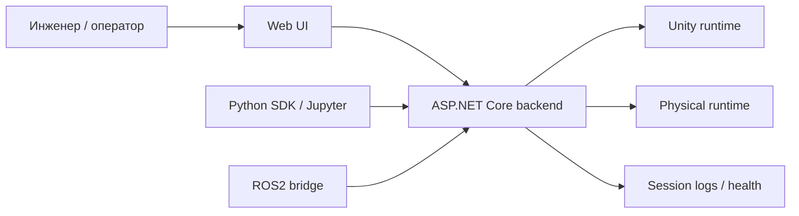

# О продукте

**Что это**  
`uav-simulator` — sim-to-real платформа для запуска, управления и проверки роботизированной платформы в Unity и на реальном стенде.

**Для кого**  
Для оператора, разработчика и исследователя, которым нужен единый контур управления симуляцией и физическим стендом.

**Статус**  
Текущий продуктовый срез проекта.

**Проверено по**  
`README.md`, `src/ks0223-web-mac/backend/`, `src/ks0223-web-mac/frontend/`, `python/sim_client/cli.py`

## Что входит в продукт сейчас
- Unity runtime с HTTP JSON API.
- Физический стенд Keyestudio KS0223 как reference physical runtime.
- Единый ASP.NET Core backend для `unity-sim` и `real-robot`.
- Единый Web UI для подключения, камеры, телеметрии, логов и ручного управления.
- Product CLI `rusim`.
- Плагинный каталог машинок и треков.

## Что не является ядром продукта
- ROS2 bridge.
- Python SDK и Jupyter notebooks.
- Автопилотные модули.
- Учебные отчёты и материалы магистерской.

## Главный принцип
Frontend работает с единым backend API и не знает, к какому runtime подключён оператор.

Различия между:
- `unity-sim`
- `real-robot`

живут внутри backend-адаптеров и runtime provider-ов.

## Текущие режимы работы
- `unity-sim` для симуляции, демонстрации, multi-agent сценариев и отладки.
- `real-robot` для проверки того же операторского контура на физической платформе.

## Основные entrypoint-ы
- `rusim` — канонический CLI для runtime lifecycle и сценариев.
- Web UI — канонический операторский интерфейс.
- HTTP API Unity runtime — базовый программный интерфейс для CLI, backend и Python tooling.
- `Makefile` — developer automation и ROS2/demo orchestration, а не пользовательский интерфейс.

## Что умеет продуктовый слой сейчас
- запуск Unity runtime в `windowed`, `background` и `headless` режимах;
- запуск сценария через YAML-конфиг;
- выбор трека и машинки;
- multi-agent запуск на одном треке;
- адресное управление агентом и выбор камеры агента;
- получение `health`, `contract`, `reset`, `step`, camera frame и телеметрии.

## Основные сценарии использования
### 1. Operator control
Инженер подключается к Unity или к реальной платформе через один и тот же Web UI и выполняет ручное управление.

### 2. Sim-to-real validation
Сценарий сначала отлаживается в Unity, затем тот же контур управления используется для проверки поведения на реальном стенде.

### 3. Training and research
Внешние Python/ROS2-инструменты используют стабильные product-core интерфейсы без прямой зависимости от внутренних деталей сцены.

## Контекст взаимодействия

## Канонические документы
- [Product Definition](product-definition.md)
- [Unified Runtime Contract](unified-runtime-contract.md)
- [Definition of Done MVP](definition-of-done-mvp.md)
