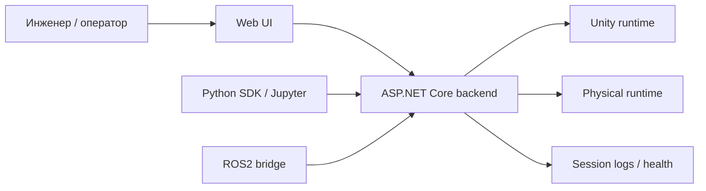

# О симуляторе

## Что это за продукт
Проект представляет собой **sim-to-real платформу** для разработки, проверки и последующего переноса алгоритмов управления беспилотной роботизированной платформой между двумя средами:

- Unity-симулятором;
- реальным стендом.

Ключевая идея не в том, чтобы сделать еще один отдельный симулятор или отдельный web-пульт для машинки, а в том, чтобы собрать **единый операторский и инженерный контур**.

## Что входит в ядро продукта
В ядро продукта входят:

- Unity runtime как виртуальная среда;
- physical runtime как реальный стенд;
- единый ASP.NET Core backend;
- единый Web UI;
- единые контракты управления, телеметрии, камеры, логов и health.

## Что не является ядром продукта
В проекте также есть исследовательский слой, но он не должен ломать или усложнять операторский контур:

- ROS2 bridge;
- Python SDK;
- Jupyter notebooks;
- обучение и inference-модули;
- интеграция автопилота.

## На что нацелен продукт
Целевое состояние платформы:

1. Простая установка и запуск.
2. Понятный CLI и server/headless режим.
3. Сценарная конфигурация симуляции через единый entrypoint.
4. Плагинная архитектура для новых трасс и новых платформ.
5. Один и тот же UX для режима `unity-sim` и `real-robot`.
6. Возможность обучения в симуляции и проверки на реальном стенде.

## Главный принцип архитектуры
Frontend не должен знать, с каким runtime он работает.

Для UI система всегда выглядит одинаково:

- подключение;
- состояние;
- команды;
- камера;
- телеметрия;
- health;
- логи.

Различия между Unity и реальным стендом должны жить только в backend-адаптерах.

## Что считается каноническим operator flow
Для эксплуатации и демонстрации нужно держать одно правило:

- `rusim` это продуктовый CLI;
- `Makefile` это developer/ROS2 automation;
- Web UI это единый операторский слой для `unity-sim` и `real-robot`.

Для Unity runtime в текущем срезе оператору доступны:

- выбор трека;
- выбор основной машинки;
- добавление нескольких машинок на трассу;
- выбор `camera mode`;
- выбор `control agent`;
- выбор `camera agent` для текущей вкладки.

Это нужно не как отдельная фича ради фичи, а как базовый шаг к управлению multi-agent сценарием из того же UI, когда разные вкладки браузера могут быть привязаны к разным агентам.

## Роль реального стенда
Текущий physical runtime на базе Keyestudio KS0223 используется как:

- reference physical runtime;
- демонстрационный стенд;
- проверка sim-to-real маршрута.

KS0223 важен для валидации, но не задает границы всей платформы.

## Основные use-cases
### 1. Operator control
Инженер подключается к Unity или к реальной платформе через один и тот же Web UI и выполняет ручное управление.

### 2. Sim-to-real validation
Сценарий сначала отлаживается в Unity, затем тот же контур управления используется для проверки поведения на реальном стенде.

### 3. Training and research
Внешние Python/ROS2-инструменты используют стабильные product-core интерфейсы без прямой зависимости от внутренних деталей сцены.

## Контекст взаимодействия

## Канонические документы
- [Product Definition v1](product-definition-v1.md)
- [Unified Runtime Contract v1](unified-runtime-contract-v1.md)
- [Definition of Done MVP](definition-of-done-mvp.md)
