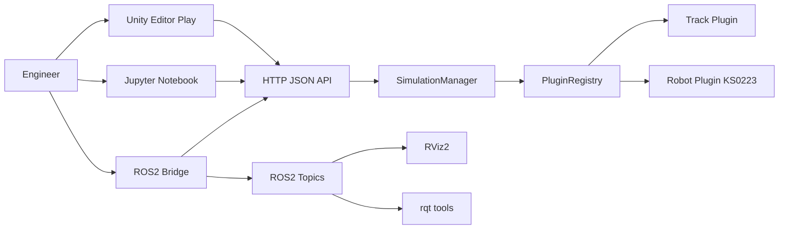
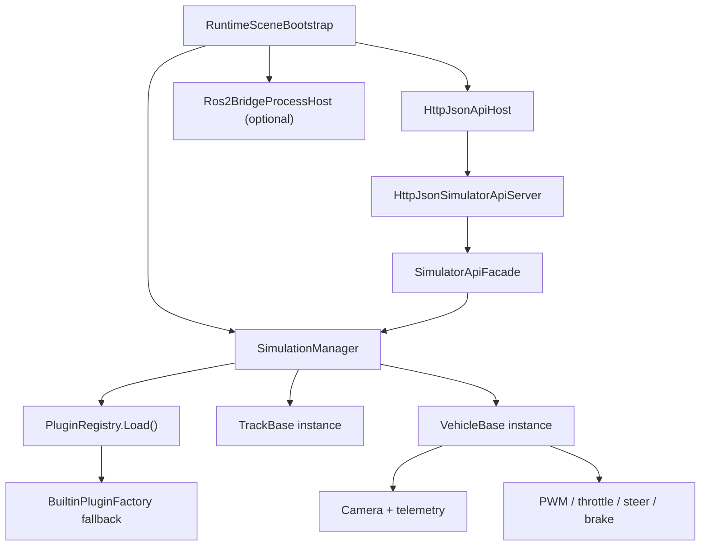
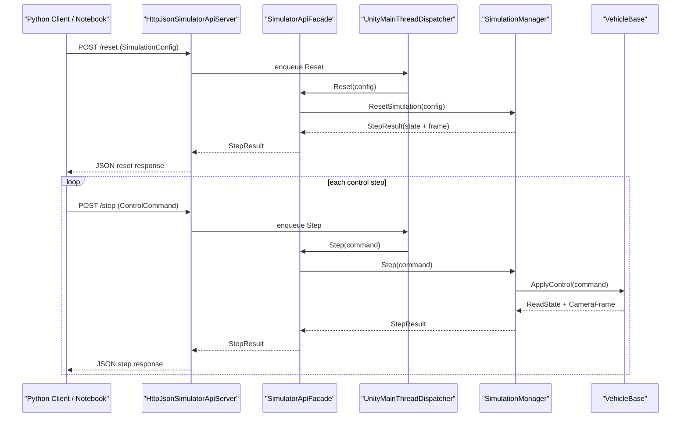
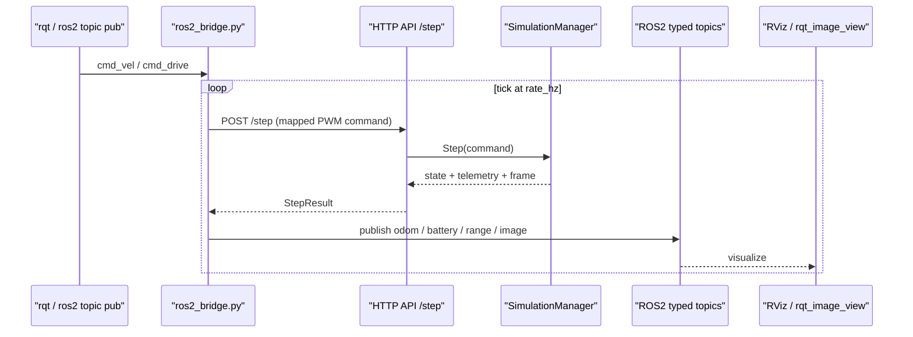
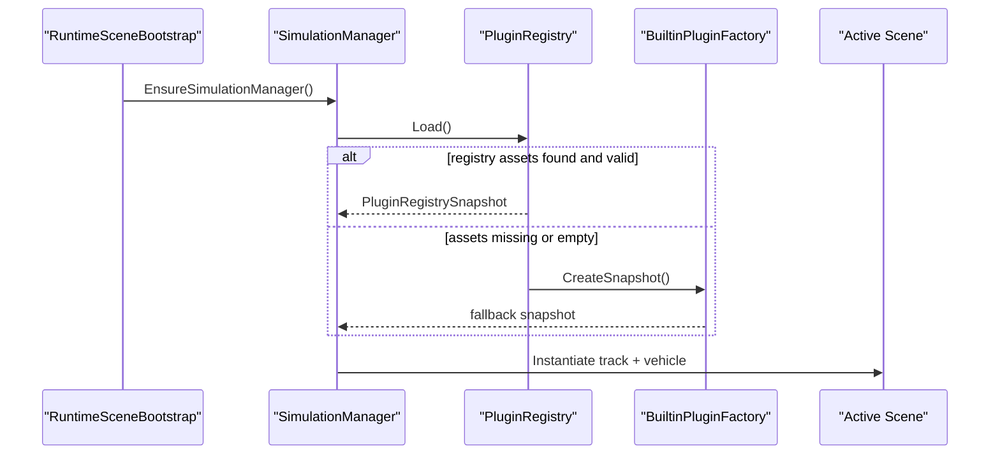

## Purpose
Подробно зафиксировать текущую архитектуру, роли инструментов и рабочие потоки (включая sequence-диаграммы).

## Assumptions
- Базовый transport-контур симулятора: HTTP JSON API.
- ROS2 используется как внешний interoperability-слой.
- Проект должен оставаться расширяемым для новых роботов/треков через плагины.

## Decisions
- Core Unity runtime не зависит от ROS2 пакетов.
- Bridge и UI-инструменты ROS2 запускаются отдельно от Unity.
- Контракт сенсоров/актуаторов ориентирован на терминологию CARLA/ROS2.

## 1) Контекст системы

## 2) Компоненты Unity runtime

## 3) Sequence: HTTP training/control loop

## 4) Sequence: ROS2 bridge loop

## 5) Sequence: plugin bootstrap

## 6) Инструменты и зачем они нужны
| Инструмент | Зачем нужен | Как используется |
|---|---|---|
| Unity Editor (`6000.1.8f1`) | Физика, сцена, визуализация, runtime API | `make sim` или `make sim-public`, затем `Play` |
| `SimulationManager` | Центр reset/step/контракта | Создает активные track/vehicle и собирает state/frame |
| Plugin Registry | Расширяемость под разные роботы/треки | Подгружает `Resources`, fallback через `BuiltinPluginFactory` |
| HTTP JSON API | Универсальный канал управления для Python/bridge | `/health`, `/contract`, `/reset`, `/step` |
| Python SDK (`sim_client`) | Скрипты обучения/сбора данных | Клиент к HTTP API, парсинг telemetry |
| Jupyter Notebook | Презентация и ручные эксперименты | Кадры, графики сенсоров, интерактивные команды |
| ROS2 bridge (`ros2_bridge.py`) | Совместимость с ROS2 экосистемой | Преобразует `step` в typed topics и обратно через cmd topics |
| RViz2 | 3D/2D визуализация ROS данных | Odom + camera topic visualization |
| rqt (`image_view`, `publisher`, `robot_steering`) | Оперативный UI для камеры/команд | Тест ручного управления и потоков сенсоров |
| Docker ROS2 Desktop | Изоляция ROS2 среды на macOS | `make ros-up` + `make ros-ui-container` |
| Makefile | Developer automation и ROS2/demo orchestration | Локальный инженерный workflow, smoke и bridge-контур |
| `rusim` CLI | Канонический product lifecycle и runtime tooling | `server up/down/status`, `scenario`, `runtime`, `step` |

## 7) Границы ответственности
- Unity Core: симуляция, физика, plugin runtime, HTTP API.
- Python Tools: эксперименты, датасеты, презентации.
- ROS2 Layer: внешний interoperability и UI-инструменты robotics-экосистемы.

## Next steps
- Добавить watchdog / emergency stop канал для bridge.
- Вынести часть telemetry в custom ROS2 msg package.
- Добавить автоматический e2e smoke (Unity Play + step loop + ROS topic check).
