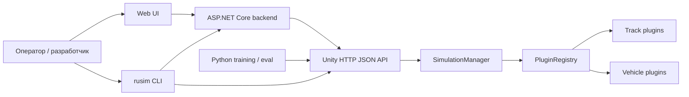
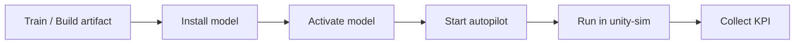

# Архитектура

`uav-simulator` состоит из четырех рабочих частей:
- Unity runtime;
- operator stack (`backend` + `web-ui`);
- CLI `rusim`;
- Python training/eval tooling.

## Общая схема

## Unity runtime

Основные компоненты:
- `RuntimeSceneBootstrap`
- `SimulationManager`
- `PluginRegistry`
- `HttpJsonApiHost`
- `HttpJsonSimulatorApiServer`
- `SimulatorApiFacade`

Unity runtime отвечает за:
- запуск сцены;
- загрузку каталога треков и машинок;
- `reset` и `step` цикл;
- выдачу состояния, телеметрии и camera frame;
- выполнение сценариев поверх активного runtime.

## Operator stack

Operator stack состоит из:
- `backend` на ASP.NET Core;
- `web-ui` на React;
- runtime provider-ов для `unity-sim` и `real-robot`.

Ключевая граница:
- `web-ui` не знает транспортных деталей конкретного runtime;
- runtime-specific логика живет в backend provider-ах и сервисах.

Отдельные backend-сервисы:
- `ModelRegistryService` — загрузка, список и активация моделей;
- `AutopilotService` — inference loop и управление автопилотом;
- connection/session слой — подключение к `unity-sim` и `real-robot`.

## CLI `rusim`

`rusim` — продуктовая точка входа для:
- установки окружения;
- сборки и запуска runtime;
- применения сценариев;
- диагностики runtime;
- установки моделей;
- установки пользовательских плагинов.

CLI работает как с Unity runtime напрямую, так и с backend API для model lifecycle.

## Python training/eval

Python-контур отвечает за:
- обучение модели в симуляторе;
- сборку ONNX-артефакта;
- запуск KPI-оценки;
- подготовку evidence для experimental stage.

Типовой сценарий:
1. Python получает наблюдения через runtime API.
2. Собирает или обучает модель.
3. Экспортирует ONNX + `metadata.json` + `metrics.json`.
4. Модель ставится через `rusim` или backend API.
5. Автопилот запускается в `unity-sim`.

## Plugin architecture

Каталог плагинов строится из:
- `PluginRegistry.asset`;
- descriptor assets в `Assets/Resources/UavSimulator/Plugins`;
- fallback из `BuiltinPluginFactory`, если assets не найдены.

Это дает:
- расширяемый каталог машинок и треков;
- стабильные product IDs;
- единый источник данных для runtime, CLI и contract discovery.

## Базовый продуктовый контур

Сейчас этот контур собран для `unity-sim`. Перенос на `real-robot` относится к следующему этапу практики.

## Связанные страницы
- [О продукте](about-simulator.md)
- [API](api.md)
- [CLI `rusim`](cli.md)
- [Плагины](plugins.md)
- [Unified Runtime Contract](unified-runtime-contract.md)
