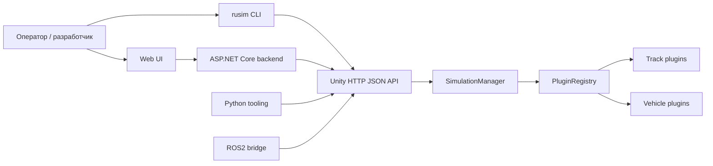
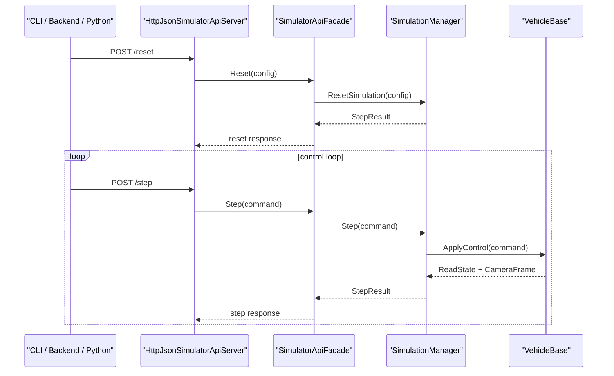

# Архитектура

**Что это**  
Обзор текущей архитектуры продуктового слоя: Unity runtime, operator backend, Web UI и plugin catalog.

**Для кого**  
Для разработчика и интегратора, которым нужна общая схема системы перед работой с кодом или контрактами.

**Статус**  
Актуальное описание текущей архитектуры без research-планов и wishlist.

**Проверено по**  
`src/UnityProject/uav-simulator/Assets/Scripts/`, `src/ks0223-web-mac/backend/`, `src/ks0223-web-mac/frontend/`, `python/sim_client/`

## Контекст системы

## Unity runtime
Ключевые компоненты:
- `RuntimeSceneBootstrap`
- `SimulationManager`
- `PluginRegistry`
- `BuiltinPluginFactory`
- `HttpJsonApiHost`
- `HttpJsonSimulatorApiServer`
- `SimulatorApiFacade`

Runtime:
- поднимает каталог треков и машинок;
- применяет сценарий или ручной reset;
- выполняет step loop;
- возвращает состояние, телеметрию и camera frame.

## Operator stack
Вне Unity runtime продуктовый слой состоит из:
- ASP.NET Core backend;
- Web UI;
- runtime provider-ов для `unity-sim` и `real-robot`.

Главная архитектурная граница:
- frontend не знает transport-детали конкретного runtime;
- runtime-specific логика находится в backend provider-ах.

## Plugin architecture
Реестр строится из:
- `PluginRegistry.asset`
- descriptor assets в `Resources/UavSimulator/Plugins`
- fallback из `BuiltinPluginFactory`, если assets недоступны

Это позволяет:
- добавлять новые машинки и треки без изменений внешнего API;
- держать product IDs и device contracts вне сцены;
- использовать один и тот же каталог в runtime, CLI и документации.

## Runtime flow

## Multi-agent path
Текущий Unity runtime и backend поддерживают:
- список `agents[]` в сценарии;
- адресное управление по `agentId`;
- выбор `control agent` и `camera agent`;
- разные вкладки UI для разных агентов одного runtime.

## Границы ответственности
- Unity runtime: физика, сцена, plugin runtime, HTTP API.
- Backend: unified operator API, runtime adapters, session/logging layer.
- Web UI: подключение, состояние, управление, камера, телеметрия.
- Python/ROS2: внешние integration-layer контуры.

## Связанные страницы
- [О продукте](about-simulator.md)
- [API](api.md)
- [Плагины](plugins.md)
- [Unified Runtime Contract](unified-runtime-contract.md)
