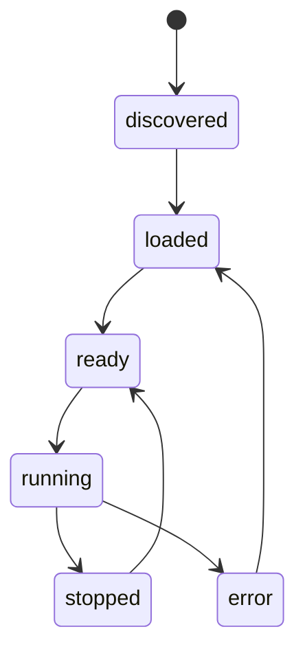

# Autopilot Integration Contract v1

## Назначение
Этот документ фиксирует, как внешний модуль автопилота должен подключаться к платформе.

Цель контракта:

- не встраивать логику модели прямо в Unity scene или прямо во frontend;
- не смешивать operator-core и research-layer;
- дать единый жизненный цикл автопилота для `unity-sim` и `real-robot`.

## Статус
Контракт считается **целевым для v1**, но не полностью реализованным в коде.

## Главный принцип
Автопилот рассматривается как **внешний управляющий агент**, а не как часть UI.

Операторский UI должен уметь:

- выбрать источник автопилота;
- запустить его;
- остановить его;
- видеть его статус;
- в любой момент перехватить управление обратно.

## Границы ответственности
### Что делает operator platform
Платформа обязана:

- предоставить нормализованные наблюдения;
- принять управляющее решение автопилота;
- применить safety-правила;
- зафиксировать логи и статус исполнения.

### Что делает модуль автопилота
Автопилот обязан:

- принять observation;
- вернуть action;
- соблюдать лимиты частоты/таймаута;
- корректно обрабатывать завершение сессии.

## Жизненный цикл автопилота
Состояния:

1. `discovered`
2. `loaded`
3. `ready`
4. `running`
5. `stopped`
6. `error`

Переходы:

## Режимы подключения
### 1. Unity simulator
Автопилот получает наблюдения из unified runtime layer и возвращает action-команды в backend.

### 2. Real robot
Автопилот также работает через backend, но все команды проходят через safety-gate:

- emergency stop;
- timeout watchdog;
- ограничение частоты и диапазонов команд.

## Канонический observation contract
Автопилот должен получать нормализованный объект наблюдений следующего класса:

- runtime mode;
- vehicle state;
- telemetry key-space;
- camera frame ref или snapshot;
- health/status flags;
- scenario context.

Минимально обязательные данные `v1`:

- скорость;
- ultrasonic distance;
- line tracker;
- положение камеры;
- положение ultrasonic servo;
- timestamp.

## Канонический action contract
Автопилот возвращает high-level action, совместимый с unified operator model:

- `throttle`
- `steer`
- `brake`
- optional `extensions[]`

Также допускаются operator-intents:

- `DirForward`
- `DirBack`
- `DirLeft`
- `DirRight`
- `DirStop`

Но каноническим для автопилота считается именно численный action-контур.

## Safety rules для physical runtime
Для `real-robot` обязательно:

1. watchdog по таймауту inference;
2. best-effort STOP при disconnect;
3. ручной override оператором;
4. ограничение диапазона действий;
5. логирование всех решений автопилота.

## Способы интеграции
В `v1` допускаются следующие источники автопилота:

1. локальный Python process;
2. внешний HTTP/gRPC service;
3. ROS2 node-adapter.

При этом frontend не должен знать transport-детали.

## Целевой API-контур
Минимальные операции для backend autopilot layer:

- `attach autopilot`
- `detach autopilot`
- `start autopilot`
- `stop autopilot`
- `get autopilot status`
- `publish observation`
- `receive action`

## Что не входит в v1
- автоматический hot-reload сложных ML pipeline;
- встроенный training orchestrator внутри operator UI;
- обязательная зависимость автопилота от ROS2.

## Связанные документы
- [Unified Runtime Contract v1](unified-runtime-contract-v1.md)
- [Simulator Scenario Config Contract v1](simulator-scenario-config-contract-v1.md)
