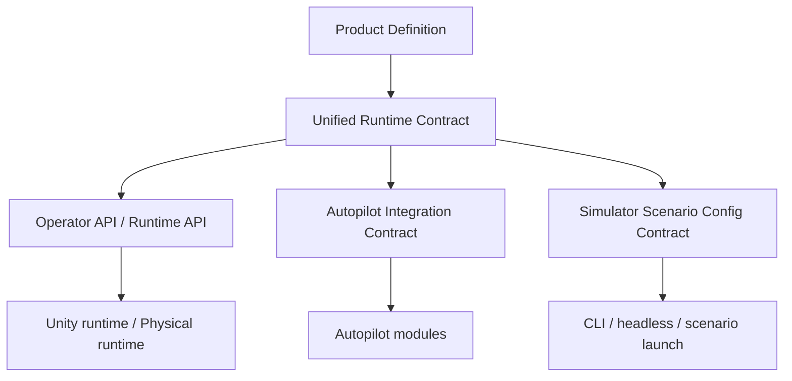

# Контракты

## Набор ключевых контрактов
### 1. Product Definition
Определяет, что именно считается продуктом и где проходят его границы.

- [Product Definition](product-definition.md)

### 2. Unified Runtime Contract
Главный операторский контракт платформы.

- [Unified Runtime Contract](unified-runtime-contract.md)

### 3. Autopilot Integration Contract
Контракт подключения модели автопилота к симуляции и к реальному стенду.

- [Autopilot Integration Contract](autopilot-integration-contract.md)

### 4. Simulator Scenario Config Contract
Контракт сценарной конфигурации симуляции и server/headless запуска.

- [Simulator Scenario Config Contract](simulator-scenario-config-contract.md)

### 5. API
Рабочий API-контур и низкоуровневые детали transport-слоя.

- [API](api.md)

## Карта контрактов

## Правило использования
Если поведение системы не согласуется с зафиксированным контрактом, правится либо код, либо контракт, но не остается «как-нибудь само».
