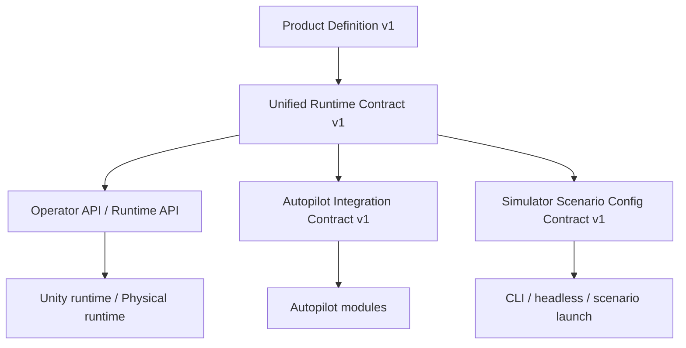

# Контракты

## Зачем нужен отдельный раздел
Контракты фиксируют не реализацию, а **границы системы**:

- кто с кем взаимодействует;
- какой формат данных является каноническим;
- какие возможности входят в `v1`;
- где заканчивается product-core и начинается research-layer.

Без этого проект начинает жить как набор удачных фич без единого ядра.

## Набор канонических контрактов
### 1. Product Definition v1
Определяет, что именно считается продуктом, а что не входит в `v1`.

- [Product Definition v1](product-definition-v1.md)

### 2. Unified Runtime Contract v1
Главный операторский контракт платформы.

- [Unified Runtime Contract v1](unified-runtime-contract-v1.md)

### 3. Autopilot Integration Contract v1
Контракт подключения модели автопилота к симуляции и к реальному стенду.

- [Autopilot Integration Contract v1](autopilot-integration-contract-v1.md)

### 4. Simulator Scenario Config Contract v1
Контракт сценарной конфигурации симуляции и server/headless запуска.

- [Simulator Scenario Config Contract v1](simulator-scenario-config-contract-v1.md)

### 5. API
Рабочий API-контур и низкоуровневые детали transport-слоя.

- [API](api.md)

## Карта контрактов

## Правило использования
Если поведение системы не согласуется с каноническим контрактом, правится либо код, либо контракт, но не остается «как-нибудь само».
