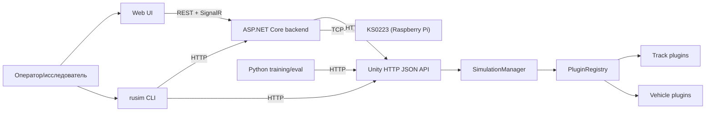

# 2 Архитектура платформы

## 2.1 Принципы и границы

Платформа `uav-simulator` проектировалась как воспроизводимая инженерно-исследовательская среда для задач обучения управлению наземными роботами класса KS0223 и схожих по уровню сложности устройств. Предпосылки задачи описаны в разделе 1 настоящей работы; данная глава посвящена архитектурному устройству платформы — тому, как разнесены ответственности между модулями, какие транспортные контракты их связывают и какие компромиссы зафиксированы при выборе технологий. Архитектура опирается на код реальных модулей: Unity-runtime (`src/UnityProject/uav-simulator/Assets/Scripts/`), серверной части на `.NET 8` (`src/ks0223-web-mac/backend/`), web-интерфейса на React + TypeScript (`src/ks0223-web-mac/frontend/`), CLI `rusim` (`python/sim_client/cli.py`) и тренировочной обвязки (`python/training/`). Ссылки на конкретные классы и файлы приводятся inline и образуют верифицируемый каркас изложения.

В основу платформы положены три архитектурных принципа. Первый — расширяемость без модификации ядра: добавление нового робота, трассы или экспериментальной сцены не должно требовать пересборки runtime и переустановки на стороне конечного пользователя. Этот принцип реализован через плагинную модель, описанную подробно в разделе 5 настоящей работы; на уровне архитектуры он проявляется в виде отдельного каталога сущностей (`PluginRegistry`) и descriptor-based-формата плагина. Второй — изоляция research-кода от production-контура: экспериментальные тренировочные скрипты, временные среды и анализ логов живут в `python/training/` и не вмешиваются в сборку поставляемого продукта. Третий — контракты как единственный источник истины: транспортные структуры данных (`ControlCommand`, `VehicleState`, `CameraFrame` в `src/UnityProject/uav-simulator/Assets/Scripts/Contracts/SimulatorContracts.cs`) и описания устройств (`DeviceContractDescriptor`) формализуют границы между модулями и допускают независимую эволюцию реализаций по обе стороны контракта.

Границы платформы установлены явно. Внутри платформы находятся: Unity-runtime с физическим контуром и рендером, операторская поверхность (backend + Web UI), CLI `rusim` для инженерных и операционных задач и Python-обвязка обучения. Вне платформы остаются физический робот KS0223 как отдельное аппаратное изделие, обучаемые модели как переносимые ONNX-артефакты, инструменты непрерывной интеграции и хостинг документации. Граница между симулятором и реальным роботом проходит по транспортному уровню: и `unity-sim`, и `real-robot` подключаются к одной операторской поверхности через единый интерфейс `IKs0223RuntimeProvider` (см. `src/ks0223-web-mac/backend/Services/IKs0223RuntimeProvider.cs`).

Декомпозиция на четыре функциональных контура выбрана сознательно. Она отражает естественное разделение ответственности «среда — оператор — оркестрация — обучение» и допускает параллельную независимую разработку каждого контура: компиляция Unity-проекта не зависит от backend, фронтенд собирается отдельным `npm`-конвейером, тренировочная обвязка запускается на отдельной машине, а CLI распространяется как самостоятельный пакет `rusim`. Такое разделение, помимо инженерной выгоды, упрощает рассуждения об ответственности модулей и фиксирует поверхность каждого из них в виде HTTP-маршрутов и DTO, которые поддаются автоматической верификации.

## 2.2 Высокоуровневая декомпозиция

### 2.2.1 Четыре функциональных контура

Платформа разделена на четыре функциональных контура, каждый из которых имеет собственную технологическую базу, собственную сборку и собственную поверхность взаимодействия с соседями. Unity-runtime отвечает за физическую и визуальную модель: загрузку сцены, инстанциацию трассы и роботов через `PluginRegistry`, выполнение `reset` и `step` цикла, формирование наблюдений в виде состояния транспортного средства и кадра камеры. Работа выполнена на C# и Unity 2022.3 LTS; точки входа — `RuntimeSceneBootstrap`, `SimulationManager`, `HttpJsonApiHost`. Operator stack включает серверную часть на ASP.NET Core (`.NET 8`) и web-интерфейс на React + TypeScript + Vite + MUI. Backend организует сессии оператора с двумя подложками (симулятор и физический робот), управляет реестром моделей, инкапсулирует автопилот и журналирование, доставляет телеметрию через SignalR. Web-интерфейс предоставляет операторскую поверхность с вкладками управления, сценариев, сенсоров, индикации, моделей, повтора демо и логов (см. `src/ks0223-web-mac/frontend/src/App.tsx`).

CLI `rusim` представляет собой инженерную точку входа на Python (`python/sim_client/cli.py`) и решает задачи установки runtime, запуска и остановки сервера, валидации и применения сценариев, диагностики, управления плагинами и моделями. CLI работает и непосредственно с Unity HTTP API, и с backend, что отличает его от Web UI: последний обращается только к backend. Python-контур обучения и оценки (`python/training/`) использует Unity-runtime как источник наблюдений, реализует обёртки сред в семантике Stable-Baselines3 и формирует ONNX-артефакты модели. Соответствие контуров и зон ответственности приведено в таблице 2.1.

Таблица 2.1 — Функциональные контуры платформы

| Контур | Отвечает за | Не отвечает за | Технологический стек |
|---|---|---|---|
| Unity-runtime | Физика, рендер, сцена, lifecycle симуляции, плагины, формирование наблюдений, локальный HTTP API | Управление пользовательскими сессиями, журналирование, реестр моделей, обучение | C#, Unity 2022.3 LTS, `HttpListener` |
| Operator stack (backend + Web UI) | Сессии оператора, маршрутизация в две подложки, model registry, autopilot, журналы, доставка телеметрии в браузер | Физическая модель, обучение моделей, низкоуровневые `step`/`reset` | ASP.NET Core (.NET 8), SignalR, React, TypeScript, Vite, MUI |
| CLI `rusim` | Установка, валидация и применение сценариев, диагностика, управление плагинами и моделями | Хранение сессионных данных, оркестрация обучения | Python 3.11, `argparse`, `requests` |
| Python training / eval | Обучение, обёртки сред, формирование ONNX-артефактов, KPI-оценка | Транспорт между runtime и оператором, модель сцены | Python 3.11, PyTorch, Stable-Baselines3, ONNX Runtime |

### 2.2.2 Поток данных и управления

Транспортная схема, связывающая четыре контура, представлена на рисунке 2.1. Оператор и инженер-исследователь являются двумя различными ролями, обращающимися к платформе через разные точки входа: первый — через web-интерфейс, второй — через CLI или напрямую через Python-обвязку обучения. Backend выступает единственной точкой контакта между web-интерфейсом и обоими runtime-режимами; CLI и Python имеют право обращаться непосредственно к Unity-runtime, что отражает их инженерное назначение и снимает ограничения, актуальные для интерактивной операторской работы.

Рисунок 2.1 — Поток данных и управления между контурами платформы.

На схеме различимы три типичных сценария взаимодействия. Первый — операторское управление: оператор открывает Web UI, выбирает режим работы (`unity-sim` или `real-robot`), формирует команды управления через пульт или загружает сценарий; запросы поступают в backend, который маршрутизирует их в выбранный runtime через соответствующий провайдер (`UnityKs0223RuntimeProvider` или `RealKs0223RuntimeProvider`), а возвращаемая телеметрия и кадры камеры доставляются обратно в браузер через SignalR-хаб `TelemetryHub` без необходимости polling-а. Второй сценарий — запуск тренировки: тренировочный скрипт `python/training/train_cardboard_corridor_v9.py` через `SimClient` (`python/sim_client/http_client.py`) обращается напрямую к Unity на порту `8000`, выполняя `reset` со сценарием и серию `step`-вызовов в семантике Gymnasium API. Backend в этом сценарии не участвует: тренировочная обвязка не нуждается в операторских сессиях и журналировании, а необходимый низкоуровневый доступ обеспечивает Unity HTTP API. Третий сценарий — запись и воспроизведение демо: оператор начинает запись через Web UI, backend пишет журнал в `runtime-data/sessions/`, а позднее `DemoReplayService` повторно проигрывает зафиксированную последовательность команд, отправляя их в активный runtime через тот же провайдер, что использовался при записи. Это обеспечивает повторное использование одного транспортного контура в трёх различных режимах работы платформы.

### 2.2.3 Деление на production и research контуры

Поверх функциональной декомпозиции в платформе зафиксирована вторая, ортогональная граница — между production- и research-контуром. Production-контур включает Unity-runtime с поставляемым набором встроенных плагинов, backend, Web UI, CLI и Plugin SDK с базовыми классами `VehicleBase`, `TrackBase` и `PluginDescriptorBase`. Это та часть платформы, которая собирается в стабильные сборки, документируется для внешних пользователей и поставляется через GitHub Releases. Research-контур включает тренировочные скрипты `python/training/`, scenario-driven evaluation-обвязку (`python/sim_client/scenario.py`), evidence-папки спринтов с метриками и видео, экспериментальные обёртки сред (`MultiAgentVisionVecEnv`, `MetaMultiAgentVecEnv`, `corridor_genesis_env.py`).

Граница между двумя контурами проведена по нескольким признакам. Production-код вмонтирован в основные сборочные конвейеры: компиляция Unity-проекта, `dotnet publish` для backend, `npm run build` для фронтенда. Research-код запускается из командной строки на стороне исследователя и не входит ни в одну production-сборку. Production-контур имеет стабильный поверхностный контракт: HTTP-маршруты, DTO, CLI-команды документированы и подчиняются правилам семантического версионирования; research-контур допускает экспериментальные изменения сигнатур функций и форматов файлов между ревизиями обучения. Production-контур ограничен фиксированной кодовой базой и тестируется как единое целое; research-контур допускает наличие нескольких параллельных экспериментальных линий, существующих одновременно (например, одиночный, multi-agent и Genesis-варианты тренировочной среды живут в репо вместе и выбираются флагами CLI).

Жёсткое разделение мотивировано позиционированием самой работы: тема диссертации сформулирована как разработка расширяемой Unity-платформы для KS0223, а не как конкретный sim-to-real эксперимент. Эксперименты по обучению, выполненные в ходе преддипломной практики, рассматриваются в разделе 7 настоящей работы как вариант использования платформы; отдельные обёртки сред и тренировочные скрипты в свою очередь являются артефактами этих экспериментов и не входят в поставляемое ядро платформы. Такое разделение делает поведение production-сборки воспроизводимым и проверяемым независимо от экспериментальной активности в research-контуре, и одновременно сохраняет за исследователем свободу быстрого внесения изменений в тренировочную обвязку.

## 2.3 Unity runtime

### 2.3.1 Точка входа: RuntimeSceneBootstrap

### 2.3.2 SimulationManager как ядро жизненного цикла

### 2.3.3 PluginRegistry и каталог сущностей

### 2.3.4 HTTP JSON API host

### 2.3.5 SimulatorApiFacade и поверхность контракта

## 2.4 Operator stack

### 2.4.1 Backend на ASP.NET Core

### 2.4.2 Слой runtime-провайдеров: unity-sim и real-robot

### 2.4.3 Web UI на React и SignalR

### 2.4.4 Сервисы model lifecycle и autopilot

## 2.5 CLI rusim

### 2.5.1 Структура командного дерева

### 2.5.2 Ответственность CLI и backend

### 2.5.3 Сценарии и плагины как точки расширения CLI

## 2.6 Python training и eval

### 2.6.1 Источник наблюдений через HTTP-клиент

### 2.6.2 Обёртки сред: одиночные, multi-agent и Genesis

### 2.6.3 Жизненный цикл артефакта модели

## 2.7 Контракты между модулями

### 2.7.1 ControlCommand, VehicleState, CameraFrame — транспортные DTO

### 2.7.2 Плагинные контракты

### 2.7.3 ContractVersion и совместимость

## 2.8 Архитектурные решения и компромиссы

### 2.8.1 HTTP JSON вместо gRPC

### 2.8.2 Descriptor-based плагины вместо DLL hot-reload

### 2.8.3 Единый Unity-процесс vs Meta vs Genesis

### 2.8.4 Backend как proxy: зачем не звать Unity напрямую из Web UI
