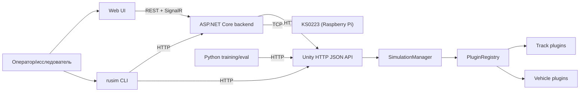

# 2 Архитектура платформы

## 2.1 Принципы и границы

Платформа `uav-simulator` проектировалась как воспроизводимая инженерно-исследовательская среда для задач обучения управлению наземными роботами класса KS0223 и схожих по уровню сложности устройств. Предпосылки задачи описаны в разделе 1 настоящей работы; данная глава посвящена архитектурному устройству платформы — тому, как разнесены ответственности между модулями, какие транспортные контракты их связывают и какие компромиссы зафиксированы при выборе технологий. Архитектура опирается на код реальных модулей: Unity-runtime (`src/UnityProject/uav-simulator/Assets/Scripts/`), серверной части на `.NET 8` (`src/ks0223-web-mac/backend/`), web-интерфейса на React + TypeScript (`src/ks0223-web-mac/frontend/`), CLI `rusim` (`python/sim_client/cli.py`) и тренировочной обвязки (`python/training/`). Ссылки на конкретные классы и файлы приводятся inline и образуют верифицируемый каркас изложения.

В основу платформы положены три архитектурных принципа. Первый — расширяемость без модификации ядра: добавление нового робота, трассы или экспериментальной сцены не должно требовать пересборки runtime и переустановки на стороне конечного пользователя. Этот принцип реализован через плагинную модель, описанную подробно в разделе 5 настоящей работы; на уровне архитектуры он проявляется в виде отдельного каталога сущностей (`PluginRegistry`) и descriptor-based-формата плагина. Второй — изоляция research-кода от production-контура: экспериментальные тренировочные скрипты, временные среды и анализ логов живут в `python/training/` и не вмешиваются в сборку поставляемого продукта. Третий — контракты как единственный источник истины: транспортные структуры данных (`ControlCommand`, `VehicleState`, `CameraFrame` в `src/UnityProject/uav-simulator/Assets/Scripts/Contracts/SimulatorContracts.cs`) и описания устройств (`DeviceContractDescriptor`) формализуют границы между модулями и допускают независимую эволюцию реализаций по обе стороны контракта.

Границы платформы установлены явно. Внутри платформы находятся: Unity-runtime с физическим контуром и рендером, операторская поверхность (backend + Web UI), CLI `rusim` для инженерных и операционных задач и Python-обвязка обучения. Вне платформы остаются физический робот KS0223 как отдельное аппаратное изделие, обучаемые модели как переносимые ONNX-артефакты, инструменты непрерывной интеграции и хостинг документации. Граница между симулятором и реальным роботом проходит по транспортному уровню: и `unity-sim`, и `real-robot` подключаются к одной операторской поверхности через единый интерфейс `IKs0223RuntimeProvider` (см. `src/ks0223-web-mac/backend/Services/IKs0223RuntimeProvider.cs`).

Декомпозиция на четыре функциональных контура выбрана сознательно. Она отражает естественное разделение ответственности «среда — оператор — оркестрация — обучение» и допускает параллельную независимую разработку каждого контура: компиляция Unity-проекта не зависит от backend, фронтенд собирается отдельным `npm`-конвейером, тренировочная обвязка запускается на отдельной машине, а CLI распространяется как самостоятельный пакет `rusim`. Такое разделение, помимо инженерной выгоды, упрощает рассуждения об ответственности модулей и фиксирует поверхность каждого из них в виде HTTP-маршрутов и DTO, которые поддаются автоматической верификации.


## 2.2 Высокоуровневая декомпозиция

### 2.2.1 Четыре функциональных контура

Платформа разделена на четыре функциональных контура, каждый из которых имеет собственную технологическую базу, собственную сборку и собственную поверхность взаимодействия с соседями. Unity-runtime отвечает за физическую и визуальную модель: загрузку сцены, инстанциацию трассы и роботов через `PluginRegistry`, выполнение `reset` и `step` цикла, формирование наблюдений в виде состояния транспортного средства и кадра камеры. Работа выполнена на C# и Unity 2022.3 LTS; точки входа — `RuntimeSceneBootstrap`, `SimulationManager`, `HttpJsonApiHost`. Operator stack включает серверную часть на ASP.NET Core (`.NET 8`) и web-интерфейс на React + TypeScript + Vite + MUI. Backend организует сессии оператора с двумя подложками (симулятор и физический робот), управляет реестром моделей, инкапсулирует автопилот и журналирование, доставляет телеметрию через SignalR. Web-интерфейс предоставляет операторскую поверхность с вкладками управления, сценариев, сенсоров, индикации, моделей, повтора демо и логов (см. `src/ks0223-web-mac/frontend/src/App.tsx`).

CLI `rusim` представляет собой инженерную точку входа на Python (`python/sim_client/cli.py`) и решает задачи установки runtime, запуска и остановки сервера, валидации и применения сценариев, диагностики, управления плагинами и моделями. CLI работает и непосредственно с Unity HTTP API, и с backend, что отличает его от Web UI: последний обращается только к backend. Python-контур обучения и оценки (`python/training/`) использует Unity-runtime как источник наблюдений, реализует обёртки сред в семантике Stable-Baselines3 и формирует ONNX-артефакты модели. Соответствие контуров и зон ответственности приведено в таблице 2.1.

Таблица 2.1 — Функциональные контуры платформы

| Контур | Отвечает за | Не отвечает за | Технологический стек |
|---|---|---|---|
| Unity-runtime | Физика, рендер, сцена, lifecycle симуляции, плагины, формирование наблюдений, локальный HTTP API | Управление пользовательскими сессиями, журналирование, реестр моделей, обучение | C#, Unity 2022.3 LTS, `HttpListener` |
| Operator stack (backend + Web UI) | Сессии оператора, маршрутизация в две подложки, model registry, autopilot, журналы, доставка телеметрии в браузер | Физическая модель, обучение моделей, низкоуровневые `step`/`reset` | ASP.NET Core (.NET 8), SignalR, React, TypeScript, Vite, MUI |
| CLI `rusim` | Установка, валидация и применение сценариев, диагностика, управление плагинами и моделями | Хранение сессионных данных, оркестрация обучения | Python 3.11, `argparse`, `requests` |
| Python training / eval | Обучение, обёртки сред, формирование ONNX-артефактов, KPI-оценка | Транспорт между runtime и оператором, модель сцены | Python 3.11, PyTorch, Stable-Baselines3, ONNX Runtime |

### 2.2.2 Поток данных и управления

Транспортная схема, связывающая четыре контура, представлена на рисунке 2.1. Оператор и инженер-исследователь являются двумя различными ролями, обращающимися к платформе через разные точки входа: первый — через web-интерфейс, второй — через CLI или напрямую через Python-обвязку обучения. Backend выступает единственной точкой контакта между web-интерфейсом и обоими runtime-режимами; CLI и Python имеют право обращаться непосредственно к Unity-runtime, что отражает их инженерное назначение и снимает ограничения, актуальные для интерактивной операторской работы.



Рисунок 2.1 — Поток данных и управления между контурами платформы.

На схеме различимы три типичных сценария взаимодействия. Первый — операторское управление: оператор открывает Web UI, выбирает режим работы (`unity-sim` или `real-robot`), формирует команды управления через пульт или загружает сценарий; запросы поступают в backend, который маршрутизирует их в выбранный runtime через соответствующий провайдер (`UnityKs0223RuntimeProvider` или `RealKs0223RuntimeProvider`), а возвращаемая телеметрия и кадры камеры доставляются обратно в браузер через SignalR-хаб `TelemetryHub` без необходимости polling-а. Второй сценарий — запуск тренировки: тренировочный скрипт `python/training/train_cardboard_corridor_v9.py` через `SimClient` (`python/sim_client/http_client.py`) обращается напрямую к Unity на порту `8000`, выполняя `reset` со сценарием и серию `step`-вызовов в семантике Gymnasium API. Backend в этом сценарии не участвует: тренировочная обвязка не нуждается в операторских сессиях и журналировании, а необходимый низкоуровневый доступ обеспечивает Unity HTTP API. Третий сценарий — запись и воспроизведение демо: оператор начинает запись через Web UI, backend пишет журнал в `runtime-data/sessions/`, а позднее `DemoReplayService` повторно проигрывает зафиксированную последовательность команд, отправляя их в активный runtime через тот же провайдер, что использовался при записи. Это обеспечивает повторное использование одного транспортного контура в трёх различных режимах работы платформы.

### 2.2.3 Деление на production и research контуры

Поверх функциональной декомпозиции в платформе зафиксирована вторая, ортогональная граница — между production- и research-контуром. Production-контур включает Unity-runtime с поставляемым набором встроенных плагинов, backend, Web UI, CLI и Plugin SDK с базовыми классами `VehicleBase`, `TrackBase` и `PluginDescriptorBase`. Это та часть платформы, которая собирается в стабильные сборки, документируется для внешних пользователей и поставляется через GitHub Releases. Research-контур включает тренировочные скрипты `python/training/`, scenario-driven evaluation-обвязку (`python/sim_client/scenario.py`), evidence-папки спринтов с метриками и видео, экспериментальные обёртки сред (`MultiAgentVisionVecEnv`, `MetaMultiAgentVecEnv`, `corridor_genesis_env.py`).

Граница между двумя контурами проведена по нескольким признакам. Production-код вмонтирован в основные сборочные конвейеры: компиляция Unity-проекта, `dotnet publish` для backend, `npm run build` для фронтенда. Research-код запускается из командной строки на стороне исследователя и не входит ни в одну production-сборку. Production-контур имеет стабильный поверхностный контракт: HTTP-маршруты, DTO, CLI-команды документированы и подчиняются правилам семантического версионирования; research-контур допускает экспериментальные изменения сигнатур функций и форматов файлов между ревизиями обучения. Production-контур ограничен фиксированной кодовой базой и тестируется как единое целое; research-контур допускает наличие нескольких параллельных экспериментальных линий, существующих одновременно (например, одиночный, multi-agent и Genesis-варианты тренировочной среды живут в репо вместе и выбираются флагами CLI).

Жёсткое разделение мотивировано позиционированием самой работы: тема диссертации сформулирована как разработка расширяемой Unity-платформы для KS0223, а не как конкретный sim-to-real эксперимент. Эксперименты по обучению, выполненные в ходе преддипломной практики, рассматриваются в разделе 7 настоящей работы как вариант использования платформы; отдельные обёртки сред и тренировочные скрипты в свою очередь являются артефактами этих экспериментов и не входят в поставляемое ядро платформы. Такое разделение делает поведение production-сборки воспроизводимым и проверяемым независимо от экспериментальной активности в research-контуре, и одновременно сохраняет за исследователем свободу быстрого внесения изменений в тренировочную обвязку.


## 2.3 Unity runtime

Unity-runtime реализован в проекте `src/UnityProject/uav-simulator/` и поставляется в виде standalone-сборки или запускается из Unity Editor. Внутри проекта C#-код организован по поддиректориям `Assets/Scripts/` с разделением на Core (ядро жизненного цикла), Plugins (реестр и дескрипторы плагинов), Api (HTTP-сервер и facade), Vehicles (базовые классы транспортных средств), Tracks (базовые классы трасс) и Contracts (общие сериализуемые типы данных). Архитектурно ядро runtime построено вокруг трёх MonoBehaviour-объектов, инстанцируемых при загрузке любой сцены, и одного facade-объекта в качестве единой поверхности контракта.

### 2.3.1 Точка входа: RuntimeSceneBootstrap

Точкой входа Unity-runtime служит статический класс `RuntimeSceneBootstrap` (см. [src/UnityProject/uav-simulator/Assets/Scripts/Core/RuntimeSceneBootstrap.cs](../../src/UnityProject/uav-simulator/Assets/Scripts/Core/RuntimeSceneBootstrap.cs)). Метод `EnsureRuntimeObjects`, помеченный атрибутом `[RuntimeInitializeOnLoadMethod(RuntimeInitializeLoadType.BeforeSceneLoad)]`, выполняется автоматически при старте любой сцены — как в Editor-режиме, так и в standalone-сборке — до того, как сама сцена будет загружена. Это снимает с Unity-сцен обязанность вручную инстанцировать ядерные объекты и обеспечивает идентичное поведение runtime в разных сценах: учебных, тренировочных и демонстрационных.

```csharp
public static class RuntimeSceneBootstrap
{
    [RuntimeInitializeOnLoadMethod(RuntimeInitializeLoadType.BeforeSceneLoad)]
    private static void EnsureRuntimeObjects()
    {
        ConfigureRuntimeExecution();
        var manager = EnsureSimulationManager();
        InstallSceneHooks();
        OnSceneLoaded(SceneManager.GetActiveScene(), LoadSceneMode.Single);
        EnsureApiHost();
        EnsureRos2BridgeHostIfEnabled();
    }
}
```

Bootstrap решает четыре связанные задачи. Во-первых, он настраивает базовые параметры исполнения: устанавливает `Application.runInBackground = true`, чтобы симуляция и API оставались отзывчивыми, когда окно Unity не находится в фокусе (это критично для тренировочных запусков, где обучение идёт фоном). Во-вторых, он гарантирует, что в сцене присутствует ровно один экземпляр `SimulationManager`: при отсутствии — создаётся новый объект, помечаемый как `DontDestroyOnLoad`. В-третьих, через `InstallSceneHooks` подписывается обработчик `SceneManager.sceneLoaded`, который при каждой смене сцены повторно привязывает корни трассы и транспортного средства, а также применяет шаги совместимости рендеринга. Наконец, через `EnsureApiHost` инстанцируется `HttpJsonApiHost` — сетевая оболочка runtime. Опциональная активация ROS 2 bridge-а контролируется переменной окружения `UAVSIM_ENABLE_ROS2_BRIDGE` и используется в исследовательских сценариях; в основной поставке остаётся выключенной.

### 2.3.2 SimulationManager как ядро жизненного цикла

Ядром жизненного цикла является класс `SimulationManager` (см. [src/UnityProject/uav-simulator/Assets/Scripts/Core/SimulationManager.cs](../../src/UnityProject/uav-simulator/Assets/Scripts/Core/SimulationManager.cs)) — `MonoBehaviour`, объединяющий ссылки на активный реестр плагинов, активную трассу, активный набор транспортных средств и связанные с ними параметры маршрута. Файл содержит около 1240 строк и инкапсулирует семантику двух главных операций — `ResetSimulation` и `Step`. Состав `SimulationManager` выражается через несколько внутренних структур: `PluginRegistrySnapshot registry` хранит каталог доступных роботов и трасс; `TrackBase activeTrack` — текущую активную трассу; список `activeAgents` — все активные транспортные средства, каждое из которых описано записью `ActiveAgentRuntime` с полями `AgentId`, `VehicleId`, `IsPrimary`, `Vehicle`, `TrackParams` и `VehicleParams`; набор полей `activeRouteWaypoints`, `activeRouteWaypointIndex`, `activeRouteReachDistance` и `activeRouteLoop` управляет маршрутным прогрессом основного агента.

Поверхность класса включает несколько публичных методов:

```csharp
public sealed class SimulationManager : MonoBehaviour
{
    public void ConfigureRoots(Transform sceneTrackRoot, Transform sceneVehicleRoot);
    public void RemoveSceneVehiclePlaceholders();
    public SimulatorContractDescriptor GetContract();
    public void ResetSimulation(SimulationConfig config);
    public SimulationRuntimeDiagnostics GetDiagnostics();
    public StepResult Step(ControlCommand command);
    public StepResult ReadSnapshot(string targetAgentId = null,
        string targetVehicleId = null, bool includeFrame = true);
    public VehicleState ReadState();
    public bool TryReadCameraFrame(out CameraFrame frame);
}
```

Метод `ResetSimulation` принимает структуру `SimulationConfig` с описанием сцены: seed, масштаб времени, идентификаторы выбранных трассы и транспортного средства, параметры трассы и робота, флаги поведения и список агентов. Реализация сначала прогоняет конфигурацию через статический валидатор `SimulationConfigValidator.Validate(config, registry)`, который сверяет идентификаторы со снимком реестра плагинов и подбирает дескрипторы. Далее `DestroyActiveInstances` уничтожает предыдущую сцену, инстанцируется новая трасса и применяются её параметры через `ApplyTrackParams` и `ResetTrack(seed)`. Затем для каждой записи в `resolvedAgents` создаётся новый экземпляр транспортного средства, ему передаются параметры (`ApplyVehicleConfig`), вызывается `ResetVehicle(seed + index)`, после чего применяется логика спавна с учётом смещений и поворота относительно стартовой точки трассы.

Метод `Step` принимает `ControlCommand` и применяет её к одному из активных агентов, выбираемому по полю `targetAgentId` или `targetVehicleId`. На целевом транспортном средстве последовательно вызываются `ApplyControl(command)`, `TryReadCameraFrame(out var frame)` и `ReadState()`, а для основного агента дополнительно обновляется маршрутный прогресс. Возвращаемый `StepResult` содержит состояние, кадр камеры (если получен), флаг завершения, сводный массив результатов всех агентов и карту вспомогательной информации. Это делает `Step` атомарной операцией, предсказуемой как для тренировочного цикла, так и для операторского запроса.

Многоагентная модель встроена в ядро без выделения в отдельный объект: все активные транспортные средства живут в одном `SimulationManager`, разделяют физический мир и могут быть либо полностью изолированы друг от друга (флаг `agents.isolated`), либо взаимодействовать через общий слой коллизий и видимости. Метод `ApplyAgentInteractions` (`SimulationManager.cs:982-1010`) читает три флага конфигурации — `agents.isolated`, `agents.see_each_other`, `agents.collisions_enabled` — и переключает слои коллизий и видимость каждого агента через `SetLayerRecursively` и `VehicleBase.SetPeerVisibility`. Это позволяет одной и той же сцене обслуживать как сценарии, где агенты не видят друг друга (используется в тренировке для увеличения параллелизма), так и сценарии с физическим взаимодействием.

### 2.3.3 PluginRegistry и каталог сущностей

Каталог сущностей, доступных runtime, ведётся статическим классом `PluginRegistry` и его иммутабельным снимком `PluginRegistrySnapshot` (см. [src/UnityProject/uav-simulator/Assets/Scripts/Plugins/PluginRegistry.cs](../../src/UnityProject/uav-simulator/Assets/Scripts/Plugins/PluginRegistry.cs)). Метод `Load` собирает снимок из трёх источников и сводит их по правилам приоритета. Первый источник — `PluginRegistryAsset`, представляющий собой `ScriptableObject` с массивами явно указанных дескрипторов (применяется, когда поставляемая сборка содержит curated-набор плагинов). Второй источник — папка `Resources/UavSimulator/Plugins`, в которой ищутся произвольные `VehiclePluginDescriptor` и `TrackPluginDescriptor` (используется при разработке плагинов и для пользовательских установок). Третий источник — `BuiltinPluginFactory.CreateSnapshot`, формирующий встроенный набор плагинов программно (см. [src/UnityProject/uav-simulator/Assets/Scripts/Plugins/BuiltinPluginFactory.cs](../../src/UnityProject/uav-simulator/Assets/Scripts/Plugins/BuiltinPluginFactory.cs)).

Слияние выполняется через `PluginRegistrySnapshot.MergePreferPrimary`, реализующий поведение «primary перекрывает secondary» по полю `id`. На практике это означает, что при наличии конфликта приоритет получает сначала явно указанный `PluginRegistryAsset`, затем дескрипторы из папки `Resources`, и только затем — встроенный fallback от фабрики. Такой порядок гарантирует, что пользовательский плагин с тем же `id`, что и встроенный, корректно его подменяет, а отсутствие пользовательских плагинов оставляет работоспособной поставляемую сборку. Снимок реестра, получаемый методом `Load`, является иммутабельным: после загрузки `SimulationManager` хранит ссылку на него и читает поля `Vehicles`, `Tracks` и `Source` без возможности модификации в runtime. Это делает каталог детерминированным на протяжении всей сессии симуляции.

Описанная двухконтурная модель реестра (build-time `PluginRegistryAsset` плюс runtime `~/.rusim/plugin-registry.json` через `Resources`-папку) подробно разбирается в разделе 5 настоящей работы; здесь она упомянута как архитектурный элемент, обеспечивающий единую точку discovery для всей платформы. На реестр опираются три различных потребителя: `SimulationManager` использует его при `ResetSimulation` для подбора дескрипторов и проверки совместимости; CLI `rusim plugin list` обращается к нему через HTTP-маршрут `/contract` для отображения каталога пользователю; backend `/api/health` использует поле `pluginRegistrySource` диагностики runtime для информирования оператора об источнике каталога. Выделение реестра в самостоятельный модуль с минимальным интерфейсом (один статический метод `Load` и иммутабельный снимок) упрощает рассуждения о состоянии и позволяет писать тесты на детерминированность результата для одного и того же набора входных asset-ов.

### 2.3.4 HTTP JSON API host

Сетевая оболочка Unity-runtime реализована парой классов `HttpJsonApiHost` и `HttpJsonSimulatorApiServer` (см. [src/UnityProject/uav-simulator/Assets/Scripts/Api/HttpJsonApiHost.cs](../../src/UnityProject/uav-simulator/Assets/Scripts/Api/HttpJsonApiHost.cs) и [HttpJsonSimulatorApiServer.cs](../../src/UnityProject/uav-simulator/Assets/Scripts/Api/HttpJsonSimulatorApiServer.cs)). `HttpJsonApiHost` — `MonoBehaviour`, выступающий обёрткой жизненного цикла: в `Awake` он находит `SimulationManager` в сцене, читает переменные окружения `UAVSIM_API_HOST` и `UAVSIM_API_PORT` (для гибкого выбора адреса в multi-instance тренировочных запусках), создаёт `SimulatorApiFacade` поверх найденного менеджера и передаёт его в `HttpJsonSimulatorApiServer`. Стандартное прослушивание — `127.0.0.1:8000`; при равенстве host-а `127.0.0.1` или `localhost` сервер регистрирует три префикса (`127.0.0.1:port`, `localhost:port` и `*:port`), что гарантирует доступность из любого локального клиента и не требует прав администратора для биндинга `*:port` в обычной пользовательской сессии Windows и macOS.

Сам сервер построен на `System.Net.HttpListener` без сторонних зависимостей: для встроенного транспорта Unity такой выбор обеспечивает минимальный footprint и не вносит в проект внешний пакет. Цикл `AcceptLoopAsync` блокирующе ожидает входящих контекстов и для каждого из них запускает обработку в `HandleContextAsync`. Маршрутизация выполняется в методе `DispatchAsync` и поддерживает в текущей версии четыре маршрута: `GET /health` (диагностика), `GET /contract` (описание поверхности), `POST /reset` (новая симуляция со структурой `SimulationConfig` в теле запроса) и `POST /step` (один шаг с `ControlCommand` в теле). Любой неизвестный путь возвращает `404` со структурированным JSON-ответом `{"error":"not_found"}`. Обработка `ArgumentException` мапируется на код `400 Bad Request`, `InvalidOperationException` — на `500 Internal Server Error`, что упрощает диагностику со стороны Python-клиента и CLI: ошибочный сценарий конфигурации возвращает осмысленный текст в поле `error` и даёт исследователю прямую обратную связь без чтения логов Unity.

Сериализация выполняется через `UnityEngine.JsonUtility.ToJson` и `JsonUtility.FromJson` — встроенный сериализатор Unity, рассчитанный на поля `[Serializable]`-классов из `UavSimulator.Contracts`. Это решение продиктовано совместимостью: классы DTO одновременно используются как поля в инспекторе Unity и как сетевой контракт, и `JsonUtility` обеспечивает единое представление без дополнительной разметки атрибутами. Все вызовы `facade.Reset`, `facade.Step`, `facade.GetHealth` и `facade.GetContract` принудительно ставятся в очередь главного Unity-потока через `UnityMainThreadDispatcher.Instance.Enqueue` — это критично, поскольку взаимодействие с физикой и иерархией сцен в Unity допустимо только из главного потока.

### 2.3.5 SimulatorApiFacade и поверхность контракта

`SimulatorApiFacade` (см. [src/UnityProject/uav-simulator/Assets/Scripts/Api/SimulatorApiFacade.cs](../../src/UnityProject/uav-simulator/Assets/Scripts/Api/SimulatorApiFacade.cs)) — единственная точка контакта между HTTP-уровнем и парой `SimulationManager` + `PluginRegistry`. Класс невелик — около 70 строк — и реализует четыре операции, образующие поверхность runtime-контракта:

```csharp
public sealed class SimulatorApiFacade
{
    public SimulatorContractDescriptor GetContract();
    public SimulatorHealthStatus GetHealth();
    public StepResult Reset(SimulationConfig config);
    public StepResult Step(ControlCommand command);
}
```

Метод `GetContract` возвращает структурное описание runtime: идентификатор симулятора, версию контракта и каталоги доступных трасс и роботов в виде `TrackContractDescriptor` и `DeviceContractDescriptor` соответственно. `GetHealth` агрегирует диагностические показатели — источник каталога плагинов, количество активных и доступных сущностей, идентификаторы текущего активного агента и трассы — и используется как backend-ом, так и CLI для проверки готовности runtime до отправки реальных команд. `Reset` делегирует работу `SimulationManager.ResetSimulation` и сразу же возвращает первое наблюдение через `ReadSnapshot(includeFrame: true)`; такая семантика устраняет race condition между завершением `reset` и первым `step` в тренировочном цикле. `Step` напрямую делегируется одноимённому методу менеджера и возвращает `StepResult` со состоянием, кадром, наградой, флагом завершения и массивом результатов всех агентов.

Архитектурный смысл facade состоит в том, что он фиксирует поверхность контракта в виде четырёх типизированных операций и инкапсулирует все детали внутреннего устройства — структуру `SimulationManager`, наличие или отсутствие multi-agent режима, способ хранения каталога. Все внешние интеграции — CLI `rusim`, backend `UnityKs0223RuntimeProvider`, Python `SimClient` — обращаются исключительно через эти четыре операции. Это даёт два важных следствия. Во-первых, изменения внутренней логики runtime (например, переход от реестра в `Resources` на полностью in-memory каталог, или замена встроенного physics-цикла на детерминированный шаговый) не приводят к изменениям в клиентских интеграциях, пока facade сохраняет signatures. Во-вторых, добавление альтернативного транспорта (например, gRPC- или WebSocket-сервер) сводится к написанию нового сервера поверх того же facade, без модификации Unity-логики; такой механизм уже частично присутствует в виде `Ros2BridgeProcessHost`, активируемого по переменной окружения. Единая поверхность контракта таким образом служит линией изоляции, отделяющей внутреннюю эволюцию runtime от внешних обязательств перед клиентами.


## 2.4 Operator stack

### 2.4.1 Backend на ASP.NET Core

Серверная часть операторской поверхности реализована в проекте `src/ks0223-web-mac/backend/` на платформе `.NET 8` с использованием ASP.NET Core minimal APIs. Решение унаследовано от первой версии web-системы управления, разработанной автором в рамках производственной практики, и сохранено в магистерской платформе как рабочая основа: применение стека ASP.NET Core позволило организовать web-сервис с HTTP API, обработкой фоновых задач, средствами журналирования и интеграцией с SignalR для доставки данных в режиме, близком к реальному времени. Точка входа — `Program.cs` (см. [src/ks0223-web-mac/backend/Program.cs](../../src/ks0223-web-mac/backend/Program.cs)) — содержит около 1060 строк и совмещает три обязанности: настройку DI-контейнера, конфигурацию CORS-политики и регистрацию маршрутов minimal API.

```csharp
builder.Services.AddSignalR();
builder.Services.AddHttpClient();
builder.Services.AddSingleton<SessionLogger>();
builder.Services.AddSingleton<TelemetryParser>();
builder.Services.AddSingleton<RuntimeSessionManager>();
builder.Services.AddSingleton<ModelRegistryService>();
builder.Services.AddSingleton<AutopilotSafetyFilter>(/* ... */);
builder.Services.AddSingleton<SessionVideoRecorder>();
builder.Services.AddSingleton<AutopilotService>();
builder.Services.AddSingleton<DemoReplayService>();
builder.Services.AddHostedService(sp =>
    sp.GetRequiredService<RuntimeSessionManager>());
```

DI-контейнер регистрирует единичные экземпляры (singleton-ы) ключевых сервисов: `SessionLogger` (журналирование команд и событий сессии), `TelemetryParser` (разбор пакетов телеметрии от реального робота), `RuntimeSessionManager` (управление сессиями для двух подложек, описан в подразделе 2.4.2), `ModelRegistryService` (реестр ONNX-моделей), `AutopilotSafetyFilter` и `AutopilotService` (контур автопилота, подраздел 2.4.4), `SessionVideoRecorder` (запись видео сессии) и `DemoReplayService` (повторное проигрывание журнала). `RuntimeSessionManager` дополнительно регистрируется как `IHostedService`, что обеспечивает корректное завершение всех подключённых сессий при остановке приложения. CORS-политика «frontend» допускает запросы только с `localhost` и `127.0.0.1` независимо от порта; это даёт возможность запускать фронтенд на dev-сервере Vite одновременно с production-сборкой backend без правок политики.

Всего в `Program.cs` зарегистрировано около пятидесяти HTTP-маршрутов; в таблице 2.2 приведены ключевые из них, отражающие общую структуру операторской поверхности.

Таблица 2.2 — Ключевые маршруты backend API

| Метод | Путь | Назначение |
|---|---|---|
| GET | `/api/status` | Статус сессии для (clientId, runtimeMode) |
| GET | `/api/health` | Сводное состояние подключения, камеры и сенсоров |
| POST | `/api/connection/connect` | Подключение к выбранной подложке |
| POST | `/api/connection/disconnect` | Отключение текущей сессии |
| POST | `/api/command` | Передача управляющей команды |
| GET | `/api/camera/snapshot` | Получение последнего кадра камеры |
| GET | `/api/camera/mjpeg` | MJPEG-поток камеры (для Web UI) |
| POST | `/api/models/upload` | Загрузка ONNX-артефакта в реестр |
| GET | `/api/models` | Список зарегистрированных моделей |
| POST | `/api/models/activate` | Активация модели |
| POST | `/api/model-bindings` | Привязка модели к (runtimeMode, agentId) |
| POST | `/api/autopilot/start` | Запуск контура автопилота |
| POST | `/api/autopilot/stop` | Остановка автопилота |
| GET | `/api/scenarios` | Список доступных сценариев |
| POST | `/api/scenarios/load` | Загрузка сценария в Unity-runtime |
| POST | `/api/demo/start` | Начало записи демо-сессии |
| POST | `/api/demo/replay/start` | Воспроизведение журнала демо |

DTO для всех маршрутов сосредоточены в файле `src/ks0223-web-mac/backend/Models/Contracts.cs` (см. [Contracts.cs](../../src/ks0223-web-mac/backend/Models/Contracts.cs)) и описаны через `record`-типы C#: `CommandRequest`, `StatusDto`, `HealthDto`, `ModelInfoDto`, `AutopilotStatusDto`, `DemoReplayProgress` и другие. Использование record-типов фиксирует иммутабельность DTO и упрощает их сравнение и сериализацию через `System.Text.Json`.

### 2.4.2 Слой runtime-провайдеров: unity-sim и real-robot

Ключевой элемент backend — слой runtime-провайдеров, инкапсулированный в классе `RuntimeSessionManager` (см. [src/ks0223-web-mac/backend/Services/RuntimeSessionManager.cs](../../src/ks0223-web-mac/backend/Services/RuntimeSessionManager.cs)). Он реализует интерфейс `IHostedService` и хранит две независимые таблицы сессий: `realSessions` для подключений к физическому KS0223 и `unityWorlds` для подключений к экземплярам Unity-runtime. Каждое подключение характеризуется парой `(clientId, runtimeMode)`, что позволяет одному оператору иметь раздельные сессии для симулятора и реального робота, а нескольким операторам — работать параллельно без взаимного влияния.

Подложка `real-robot` реализована классом `RealKs0223RuntimeProvider`. Транспорт — TCP-соединение к `192.168.1.121:8765` с поддержкой keep-alive, парсингом потока пакетов телеметрии и автоматическим переподключением. Особенности этой подложки наследованы от штатного программного обеспечения KS0223: команды управления передаются как строки по TCP, видеопоток поступает по отдельному UDP-каналу, расширенные сенсоры читаются через дополнительный HTTP-bridge на той же Raspberry Pi. `RealKs0223RuntimeProvider` инкапсулирует все три канала и предоставляет вышестоящему слою единое API, скрывая разнородность транспортов.

Подложка `unity-sim` реализована классом `UnityKs0223RuntimeProvider`. Транспорт — HTTP-запросы к локальному Unity-runtime на адрес из конфигурации (стандартно `127.0.0.1:8000`). Внутри провайдер использует `IHttpClientFactory` для управления пулом соединений и обращается к четырём маршрутам facade-а: `/health`, `/contract`, `/reset`, `/step`. Команды управления, поступающие в backend в формате `CommandRequest`, провайдер преобразует в `ControlCommand` и отправляет в Unity; полученный `StepResult` разбирается обратно в формат, ожидаемый Web UI. Кадры камеры из `StepResult.frame` декодируются и помещаются в буфер фреймов, доступный через `/api/camera/snapshot` и `/api/camera/mjpeg`. Эта симметрия с реальным роботом позволяет Web UI получать видеопоток одинаковым образом независимо от выбранной подложки.

Унификация контрактов на уровне `RuntimeSessionManager` означает, что одна управляющая команда вида `forward` или `left` в обоих режимах обрабатывается единым кодом, и Web UI не получает информации о том, какой runtime активен на самом деле — за исключением метаданных в `StatusDto` (поля `RuntimeMode`, `RuntimeLabel`). Подложки при этом сохраняют возможность специфической адаптации: например, при работе с `unity-sim` команда нормализуется в float-значения throttle/steer, а при работе с `real-robot` — в строки фиксированного словаря; в обоих случаях операция инкапсулирована методом `SendCommandAsync` провайдера.

### 2.4.3 Web UI на React и SignalR

Web-интерфейс реализован в проекте `src/ks0223-web-mac/frontend/` на стеке Vite + React 18 + TypeScript + MUI. Применение этих инструментов обеспечило достаточно быстрый цикл разработки и позволило реализовать единый экран управления, не разделяя frontend на отдельные приложения для разных режимов работы. Корневой компонент `App.tsx` (см. [src/ks0223-web-mac/frontend/src/App.tsx](../../src/ks0223-web-mac/frontend/src/App.tsx)) реализует layout с верхней панелью и набором вкладок, переключаемых компонентом `Tabs` MUI:

```tsx
<Tabs value={tab} onChange={(_, value: TabKey) => setTab(value)}>
  <Tab value="dashboard"   label="Пульт и телеметрия" />
  <Tab value="scenarios"   label="Сценарии" />
  <Tab value="sensors"     label="Сенсоры KS0223" />
  <Tab value="led"         label="LED панель" />
  <Tab value="models"      label="Model Control" />
  <Tab value="demoReplay"  label="Demo Replay" />
  <Tab value="logs"        label="Логи" />
</Tabs>
```

Каждая вкладка отображает свою функциональную область. «Пульт и телеметрия» содержит панель управления, видеопоток и индикаторы состояния; «Сценарии» позволяет выбрать и применить YAML-сценарий к Unity-runtime; «Сенсоры KS0223» — отображает показания ультразвукового датчика, линейных сенсоров и положения сервопривода; «LED панель» управляет индикацией; «Model Control» работает с реестром моделей и привязками автопилота; «Demo Replay» проигрывает ранее записанные сессии; «Логи» показывает последние записи.

Доставка телеметрии и кадров камеры построена на двух механизмах. Первый — типизированный HTTP-клиент в `src/ks0223-web-mac/frontend/src/api.ts` (см. [api.ts](../../src/ks0223-web-mac/frontend/src/api.ts)), оборачивающий `fetch`-вызовы и явно типизирующий все DTO через импорт из `./types` (соответствие записям из `Contracts.cs`). Второй — SignalR-хаб `TelemetryHub`, через который backend выталкивает события телеметрии без необходимости polling-а. Это снимает с фронтенда обязанность периодически опрашивать `/api/status` и `/api/sensors/latest` и обеспечивает доставку обновлений с задержкой, ограниченной латентностью сети. Архитектурный принцип, фиксируемый этим разделением, состоит в том, что фронтенд не делает прямых обращений к Unity HTTP API: все взаимодействия идут через backend, что сохраняет единую точку аудита, журналирования и контроля доступа независимо от подложки.

### 2.4.4 Сервисы model lifecycle и autopilot

Управление жизненным циклом моделей и автопилотом сосредоточено в трёх сервисах backend. `ModelRegistryService` (см. [src/ks0223-web-mac/backend/Services/ModelRegistryService.cs](../../src/ks0223-web-mac/backend/Services/ModelRegistryService.cs)) ведёт каталог зарегистрированных ONNX-артефактов в файле `runtime-data/models/registry.json`. Поверхность сервиса включает методы `UploadAsync` (приём файла и метаданных через `multipart/form-data`), `ListModels`, `ListCatalog` (группировка моделей по имени с упорядочением версий по дате создания), `GetActiveModel`, `Activate`, `GetBinding` и `SetBinding`. Поле `IsActive` в `ModelInfoDto` помечает выбранную модель глобально, а структура `ModelBindingDto` фиксирует, какая модель подключена к конкретной паре `(runtimeMode, agentId)`. Это разделение существенно: одна и та же модель может быть активной глобально, но при этом конкретный агент в `unity-sim` использует другую версию через явную привязку. Поле `CompatibilityHintsDto` хранит подсказки о совместимости — поддерживаемые `runtimeModes`, `vehicleIds` и `robotKinds`, — что используется фронтендом для предупреждения оператора при попытке привязать модель к несовместимой подложке.

`AutopilotService` (см. [src/ks0223-web-mac/backend/Services/AutopilotService.cs](../../src/ks0223-web-mac/backend/Services/AutopilotService.cs)) реализует inference loop: периодически берёт кадр камеры из активной сессии, через `Microsoft.ML.OnnxRuntime` запускает выбранную модель, преобразует выходные логиты в управляющую команду и отправляет её через `RuntimeSessionManager.SendCommandAsync`. Шаги цикла регулируются параметрами `LoopIntervalMs` и `MaxDurationSeconds`, заданными в `StartAutopilotRequest`. Состояние автопилота агрегируется в `AutopilotStatusDto` со счётчиками шагов и команд, последней командой и текстовой причиной остановки.

`AutopilotSafetyFilter` — обязательное звено в цепи `real-robot`. Фильтр читает поток телеметрии (особенно показания фронтального ультразвукового датчика) и блокирует команды, ведущие к столкновению. В коде зафиксированы три порога безопасности: окно автоматической остановки `EStopWindowSeconds = 10` и порог `EStopWindowThreshold = 10` сработавших срабатываний за это окно; верхняя граница повторных одинаковых команд `RepeatedCommandThreshold = 30`, ограничивающая длительность непрерывного выполнения одного действия; таймаут устаревания телеметрии `StaleTelemetryAfterMs = 3000` мс. Каждое из этих значений зафиксировано в коде с комментарием о причине выбора (например, рассчитанным для конкретной геометрии корпуса KS0223 и реальной скорости разворота на месте). Применительно к `unity-sim` эти ограничения ослабляются — в симуляции столкновение не приводит к физическому ущербу, и приоритет отдан непрерывности обучения и эксплуатационных сценариев.


## 2.5 CLI rusim

### 2.5.1 Структура командного дерева

CLI `rusim` представляет инженерную точку входа в платформу и реализован как Python-пакет, основная логика которого сосредоточена в файле `python/sim_client/cli.py` (см. [python/sim_client/cli.py](../../python/sim_client/cli.py)). Парсер аргументов построен поверх `argparse` со вложенными `subparsers`, что фиксирует двухуровневую иерархию команд. Команды первого уровня перечислены в таблице 2.3.

Таблица 2.3 — Команды первого уровня CLI rusim

| Команда | Назначение |
|---|---|
| `doctor` | Проверка состояния runtime и контракта |
| `version` | Сведения о версии CLI и runtime |
| `contract` | Вывод полного описания поверхности runtime |
| `install` | Установка обёртки `rusim` в пользовательский PATH |
| `upgrade` | Загрузка и установка runtime по GitHub Release-манифесту |
| `list` | Перечисление доступных трасс или роботов |
| `inspect` | Детальное описание конкретной трассы или робота |
| `reset` | Прямое выполнение reset с указанными `trackId` и `vehicleId` |
| `step` | Отправка одного управляющего шага |
| `runtime` | Управление standalone-сборкой runtime |
| `server` | Управление процессом Unity (запуск/остановка/статус) |
| `scenario` | Операции со сценарными YAML-файлами |
| `plugin` | Управление каталогом плагинов |
| `model` | Загрузка и управление моделями в backend-реестре |

Большинство команд имеют второй уровень. Подкоманда `scenario` содержит `validate` (проверка YAML без отправки в runtime), `reset` (применение сценария к runtime) и `print-reset` (печать payload-а, который был бы отправлен на `/reset`, без фактической отправки — для отладки и документирования). Подкоманда `plugin` содержит `install` (установка `.rusim-plugin.zip` в `~/.rusim/`), `list` (просмотр установленных плагинов), `remove` (удаление пользовательского плагина) и `new` (генерация шаблонного проекта плагина в Unity). Подкоманда `model` объединяет `install` (загрузка ONNX-артефакта в backend через `multipart/form-data`), `list`, `catalog`, `activate`, `active`, `binding` и `bind` — команды, отображающиеся на маршруты `/api/models/*` и `/api/model-bindings/*` backend-а. Подкоманда `server` управляет процессом Unity с помощью локального запуска бинарника или Editor-а: `up` стартует runtime, `down` останавливает, `status` показывает PID и порт.

### 2.5.2 Ответственность CLI и backend

В архитектурном смысле CLI решает иную задачу, чем web-интерфейс, и поэтому имеет другую поверхность взаимодействия с runtime. CLI обращается одновременно к двум источникам: к Unity HTTP API напрямую — для низкоуровневых операций (`/contract`, `/reset`, `/step`, `/health`) — и к backend — для операций, требующих сессионного состояния, журналирования и реестра моделей (`/api/models/*`, `/api/scenarios/*`, при необходимости `/api/autopilot/*`). При этом обратное направление не предусмотрено: backend никогда не вызывает CLI. CLI — это исключительно пользовательский фасад, и поверхность зависимостей направлена строго от него вовне.

Такое разделение обусловлено различием задач. Тренировочные и диагностические сценарии CLI требуют атомарного, низкоуровневого доступа: исследователю нужно вызвать `reset` с произвольной конфигурацией и получить ответ без накладных расходов на сессии и журналирование. Web UI же обслуживает оператора в обстановке многопользовательской работы и нуждается в централизованном управлении подключениями, журналах и интеграции с реестром моделей — что и обеспечивает backend. Команды `step` и `print-reset` иллюстрируют это разделение: они полезны исследователю и инженеру, тестирующему собственный плагин, но в Web UI отсутствуют, поскольку оператору они не требуются. С другой стороны, `model install` и `scenario reset` присутствуют в обоих контурах — там, где функциональность пересекается с операторскими задачами.

Сетевые вызовы CLI к Unity и backend выполняются через тонкую обёртку над `requests.Session` (`SimClient` в `python/sim_client/http_client.py`). `SimClient` поддерживает keep-alive через `HTTPAdapter` с `pool_maxsize=16`, что критично на Windows: без этого высокая частота кратковременных подключений быстро исчерпывает пул эфемерных TCP-портов в состоянии TIME_WAIT и приводит к ошибкам `WinError 10055` в тренировочных subprocess-воркерах. Это решение отражено в комментарии в исходном коде и стало результатом отладки реальных тренировочных запусков.

### 2.5.3 Сценарии и плагины как точки расширения CLI

Главным механизмом расширения CLI и одновременно главным workflow воспроизводимого запуска симуляции являются сценарные YAML-файлы. Команда `rusim scenario reset <yaml>` принимает путь к сценарию, парсит его в payload через `scenario_to_reset_config` (см. [python/sim_client/scenario.py](../../python/sim_client/scenario.py)) и отправляет на маршрут `/reset` Unity-runtime. Один YAML-файл фиксирует целый пакет параметров: идентификаторы трассы и транспортного средства, расширенные параметры обоих, флаги поведения, описание агентов в multi-agent режиме, маршрутные точки. Это снимает с пользователя необходимость каждый раз набирать длинный набор параметров командной строки и обеспечивает воспроизводимость: один и тот же YAML-файл, помещённый в репозиторий, гарантирует одинаковый запуск симуляции на разных машинах. Команда `scenario validate` выполняет статическую проверку YAML без отправки в runtime, а `scenario print-reset` показывает результирующий JSON payload для отладки и встраивания в сторонние клиенты.

Команды семейства `plugin` управляют каталогом пользовательских плагинов в директории `~/.rusim/`. `plugin install <archive.rusim-plugin.zip>` распаковывает архив, проверяет подпись `manifest.json`, копирует ассеты в стандартное расположение и обновляет файл `plugin-registry.json`. После следующего запуска runtime соответствующие дескрипторы будут подхвачены через папку `Resources` в `PluginRegistry.Load()`. `plugin list` объединяет в выводе встроенные плагины (через `BuiltinPluginFactory`) и пользовательские, помечая источник каждого. `plugin remove` удаляет пользовательский плагин, не затрагивая встроенные. `plugin new` создаёт шаблонный Unity-проект плагина с заполненным `VehiclePluginDescriptor` или `TrackPluginDescriptor` и пример Editor-скрипта для сборки `.rusim-plugin.zip`-архива. Архитектурно эти команды реализуют пользовательскую поверхность того же самого реестра, что описан в подразделе 2.3.3, и не требуют изменений на стороне Unity для добавления нового плагина — что и составляет суть descriptor-based-подхода.


## 2.6 Python training и eval

Python-контур обучения и оценки представлен пакетами `python/sim_client/` и `python/training/`. На уровне архитектуры он рассматривается здесь без углубления в алгоритмы обучения и подбор гиперпараметров: эти вопросы относятся к разделу 6 настоящей работы. Цель настоящего подраздела — показать, как контур обучения опирается на транспортные контракты Unity-runtime и каким образом артефакт обученной модели возвращается в production-контур платформы.

### 2.6.1 Источник наблюдений через HTTP-клиент

Единственным источником наблюдений для тренировочных скриптов является класс `SimClient` (см. [python/sim_client/http_client.py](../../python/sim_client/http_client.py)) — лёгкая обёртка над `requests.Session`, реализующая четыре основных HTTP-метода Unity-runtime: `health`, `get_contract`, `reset(config)` и `step(command)`. Поверхность класса умышленно минимальна и совпадает с поверхностью `SimulatorApiFacade`: каждое имя метода соответствует одному маршруту Unity HTTP API. Дополнительно `SimClient` реализует методы для работы с моделями (`list_models`, `get_active_model`, `activate_model`, `set_model_binding`, `upload_model`), обращающиеся уже к backend, что упрощает написание сквозных evaluation-скриптов, выполняющих и инференс, и обновление реестра моделей в одном контексте.

Важной инженерной деталью реализации является поддержка keep-alive через `HTTPAdapter(pool_connections=4, pool_maxsize=16)`. Без неё каждое обращение `step` приводит к открытию и закрытию TCP-соединения, и при многоагентной тренировке с частотой 10–20 шагов в секунду на Windows быстро возникает истощение пула эфемерных портов, которое проявляется как ошибки сериализации в subprocess-воркерах. Этот эффект был воспроизведён в нескольких ревизиях обучения, и фиксированный пул соединений принят как обязательный элемент клиента. Семантика `reset` и `step` спроектирована совместимой с интерфейсом Gymnasium: `reset` возвращает первое наблюдение, `step` — кортеж из наблюдения, награды, флага завершения и словаря дополнительной информации. Обёртки сред преобразуют эти ответы в формат, ожидаемый Stable-Baselines3.

### 2.6.2 Обёртки сред: одиночные, multi-agent и Genesis

В тренировочной обвязке поддерживаются три варианта реализации векторизованной среды, каждый из которых соответствует своему режиму использования платформы.

Первый вариант — `MultiAgentVisionVecEnv` (см. [python/training/multi_agent_vision_env.py](../../python/training/multi_agent_vision_env.py)). Класс наследуется от `stable_baselines3.common.vec_env.VecEnv` и обслуживает N агентов в одной Unity-инстанции. Сценарий запуска требует, чтобы Unity была сконфигурирована на multi-agent режим (через сценарий с массивом `agents` в `SimulationConfig`); каждый шаг VecEnv проходится по N агентам и для каждого формирует отдельный `ControlCommand` с заполненным полем `targetAgentId`. На каждом шаге собираются отдельные кадры камеры и показания ультразвукового датчика. Эпизоды агентов завершаются независимо, а Stable-Baselines3 автоматически выполняет per-agent reset через стандартный VecEnv-протокол. Такая модель устраняет дублирование процессов Unity и позволяет провести тренировку с N агентами при одном экземпляре физического движка и одном HTTP-сервере.

Второй вариант — `MetaMultiAgentVecEnv` (см. [python/training/meta_multi_agent_vec_env.py](../../python/training/meta_multi_agent_vec_env.py)). Этот класс надстраивается над несколькими `MultiAgentVisionVecEnv` и фанаут-ит их по N процессам Unity, каждый на своём порту (`8000..8000+N-1`). Внутренние step-вызовы выполняются через `ThreadPoolExecutor`, что позволяет HTTP-латентности к разным процессам Unity накладываться. Конструкция была введена для обхода специфической проблемы Python 3.13 на Windows, при которой `SubprocVecEnv` детерминированно ломался по broken-pipe около 116 тыс. шагов. Meta-VecEnv одновременно решает и задачу масштабирования: общее число агентов равно `n_unity * agents_per_unity`, что позволяет использовать ресурсы машин с большим числом ядер CPU и достаточным объёмом GPU-памяти.

Третий вариант — `corridor_genesis_env.py` (см. `python/training/corridor_genesis_env.py`). Эта обёртка использует GPU-параллельный физический движок Genesis вместо Unity и обходит узкое место Unity по производительности на arcade-class задачах. Среда воспроизводит конфигурацию arena-track в Genesis с тем же поведением маршрута и сенсоров, что и Unity-среда; обученные модели при этом сохраняют возможность eval-а в Unity-runtime, что обеспечивает совместимость артефактов. Genesis-вариант предназначен для исследовательского контура и не входит в production-сборку.

Все три обёртки реализуют единый интерфейс `VecEnv` от Stable-Baselines3, поэтому тренировочный скрипт `train_cardboard_corridor_v9.py` (см. [python/training/train_cardboard_corridor_v9.py](../../python/training/train_cardboard_corridor_v9.py)) подменяет одну реализацию на другую через флаги `--multi-agent`, `--meta-multi-agent` и `--genesis`. Архитектурное следствие — дополнительные варианты сред могут быть добавлены без изменения тренировочного скрипта: общим контрактом служит наследование от `VecEnv` и согласованные `observation_space` и `action_space`.

### 2.6.3 Жизненный цикл артефакта модели

Артефакт обученной модели представляет собой тройку файлов: ONNX-граф (`*.onnx`), JSON-метаданные (`metadata.json`) с описанием архитектуры, формы наблюдения и набора действий, и JSON-метрики (`metrics.json`) с результатами оценки. Жизненный цикл артефакта состоит из последовательности шагов, замыкающей research- и production-контуры. Этап обучения завершается сохранением весов модели; модуль `python/training/build_ab_policy_artifact.py` или один из специализированных экспортёров (`export_v9_rev*_onnx.py`) вызывает `torch.onnx.export` с подобранными параметрами opset и динамических осей, формируя ONNX-граф. К нему приписываются metadata.json и metrics.json в формате, который ожидает backend.

Дальнейшие шаги артефакта проходят через CLI и backend. Команда `rusim model install <artifact-dir>` загружает связку файлов в backend через маршрут `/api/models/upload` (multipart/form-data); `ModelRegistryService.UploadAsync` принимает поток, кладёт файлы в `runtime-data/models/<modelId>/`, обновляет registry.json и возвращает заполненный `ModelInfoDto`. После установки модель доступна через `rusim model list`. Команда `rusim model activate <modelId>` выставляет глобальный флаг `IsActive`, а `rusim model bind --runtime-mode unity-sim --agent-id ks0223` создаёт привязку конкретной модели к выбранной паре `(runtimeMode, agentId)` через `/api/model-bindings`. После этого `AutopilotService` при старте автопилота через `/api/autopilot/start` получает требуемую модель из `ModelRegistryService.GetBinding(...)`, инициализирует `OnnxRuntime`-сессию и начинает inference loop. Этот завершающий шаг возвращает обученный артефакт обратно в operator-контур, замыкая полный цикл «эксперимент → артефакт → эксплуатация» в рамках единой платформы.


## 2.7 Контракты между модулями

### 2.7.1 ControlCommand, VehicleState, CameraFrame — транспортные DTO

Транспортные DTO, разделяемые всеми модулями платформы, сосредоточены в файле `src/UnityProject/uav-simulator/Assets/Scripts/Contracts/SimulatorContracts.cs` (см. [SimulatorContracts.cs](../../src/UnityProject/uav-simulator/Assets/Scripts/Contracts/SimulatorContracts.cs)). Три центральных типа — `ControlCommand`, `VehicleState` и `CameraFrame` — образуют поверхность взаимодействия между Unity, backend, CLI и Python-контуром.

```csharp
[Serializable]
public sealed class ControlCommand
{
    public float throttle;
    public float steer;
    public float brake;
    public string targetAgentId;
    public string targetVehicleId;
    public long timestamp;
    public string timeBase;
    public ConfigKeyValue[] extensions;
}
```

`ControlCommand` фиксирует базовый набор параметров управления (throttle, steer, brake) в нормированном диапазоне `[-1; 1]` и набор дополнительных пар «ключ-значение» в массиве `extensions`. Использование произвольных расширений сохраняет совместимость с роботами, требующими большего количества каналов: для дифференциального управления KS0223 в массив пишутся ключи `drive.left_pwm_norm` и `drive.right_pwm_norm`; для подвижной камеры — `camera.pan_norm` и `camera.tilt_norm`. Это решение делает базовый контракт стабильным при добавлении новых типов транспортных средств: расширение каналов происходит через данные, без изменения сигнатуры структуры. Поля `targetAgentId` и `targetVehicleId` адресуют команду конкретному агенту в multi-agent-режиме.

`VehicleState` содержит позу (`Posef pose`), линейную и угловую скорости, скаляр `speed`, метку времени и массив `telemetry` с произвольной плагин-специфичной телеметрией: показания линейных датчиков, ультразвуковой дистанции, заряда батареи и так далее. `CameraFrame` описывает кадр камеры через размеры, формат и кодировку, а также через одно из двух полей данных: `dataRef` (внешняя ссылка) или `dataBase64` (вложенные данные). Такое разделение позволяет передавать большие кадры как ссылки на shared-memory или файл, не раздувая JSON-ответ, и одновременно сохраняет работоспособность транспорта при отсутствии внешнего хранилища.

Существенно, что эти типы используются одновременно в нескольких контекстах. В Unity они являются полями `[Serializable]`-классов и сериализуются через `JsonUtility`. На стороне backend они фигурируют как DTO в `Models/Contracts.cs` под близкими по семантике именами (`CommandRequest`, `StatusDto`, `ModelInfoDto` и связанные record-типы) и сериализуются через `System.Text.Json`. На стороне Python они представлены как dict-структуры с теми же ключами, поскольку JSON напрямую отображается в native dict. Единый набор имён полей и единый формат на проводе — это явный shared contract: соответствие проверяется при разработке новых клиентов и плагинов, а нарушение приводит к ошибке десериализации, которая видна сразу на этапе integration-тестов.

### 2.7.2 Плагинные контракты

Плагинные контракты составляют отдельный слой shared types и сосредоточены в директории `Assets/Scripts/Plugins/`. Базовый класс `PluginDescriptorBase` — `ScriptableObject`, на котором сосредоточены поля `id`, `displayName`, `version` (типа `ContractVersion`) и `description`. От него наследуют два конкретных дескриптора: `VehiclePluginDescriptor` с полями `prefab` и `deviceContract`, и `TrackPluginDescriptor` с полями `prefab` и `parametersSchemaJson`. Третий важный тип — `DeviceContractDescriptor` — описывает контракт устройства: идентификаторы каналов управления, идентификаторы датчиков и их форматы данных. Полное описание дескрипторов и базовых классов `VehicleBase` и `TrackBase` приведено в разделе 5 настоящей работы; здесь они упомянуты как архитектурный элемент, играющий в платформе роль «плагин-side» контракта.

Архитектурное место плагинных контрактов в общей картине состоит в том, что они формируют расширяемую часть поверхности симулятора. Базовые транспортные DTO (`ControlCommand` и прочие) обеспечивают неизменное взаимодействие между всеми модулями; плагинные контракты позволяют новым роботам и трассам подключаться к этому взаимодействию без изменения runtime. Дескрипторы являются единственным способом сообщить runtime о существовании нового плагина, а валидация конфигурации сценария через `SimulationConfigValidator` сверяет идентификаторы из YAML-файла со снимком реестра — таким образом плагинный контракт замыкается на тренировочные и операторские workflow без какого-либо специального кода.

### 2.7.3 ContractVersion и совместимость

Каждый плагинный дескриптор содержит поле `version` типа `ContractVersion` — структуры, реализующей семантическое версионирование (см. [src/UnityProject/uav-simulator/Assets/Scripts/Contracts/ContractVersion.cs](../../src/UnityProject/uav-simulator/Assets/Scripts/Contracts/ContractVersion.cs)). Структура содержит три целочисленных поля `major`, `minor`, `patch`, методы `CompareTo`, `Equals`, `IsValid` и статический `TryParse`, разбирающий строку формата `<major>.<minor>.<patch>`. Реализация `IComparable` позволяет упорядочивать версии и проверять совместимость через сравнения. Структура помечена `[Serializable]`, что позволяет сохранять версию непосредственно в `ScriptableObject`-дескрипторах и в JSON-манифестах архивов плагинов.

Поверх `ContractVersion` строится механизм совместимости плагинов с runtime. В manifest-файле плагина (`manifest.json` внутри `.rusim-plugin.zip`) указывается поле `compatibleRuntime` с диапазоном поддерживаемых версий runtime; при установке через `rusim plugin install` и при загрузке через `PluginRegistry.Load` это поле сравнивается с собственной версией runtime, и несовместимые плагины отклоняются. Дополнительно идентификатор плагина (поле `id`) включает мажорную версию контракта непосредственно в имя — например, `vehicle.ks0223.v1` или `track.cardboard_corridor.v1`. Ломающее изменение в контракте устройства порождает новый идентификатор, что позволяет старой и новой версиям сосуществовать в реестре одновременно. Подробное описание этого механизма приведено в разделе 5 настоящей работы; здесь он упомянут как часть общей стратегии работы с совместимостью на стыке версионирования контрактов, версионирования API и срока жизни обученных моделей.


## 2.8 Архитектурные решения и компромиссы

### 2.8.1 HTTP JSON вместо gRPC

### 2.8.2 Descriptor-based плагины вместо DLL hot-reload

### 2.8.3 Единый Unity-процесс vs Meta vs Genesis

### 2.8.4 Backend как proxy: зачем не звать Unity напрямую из Web UI
