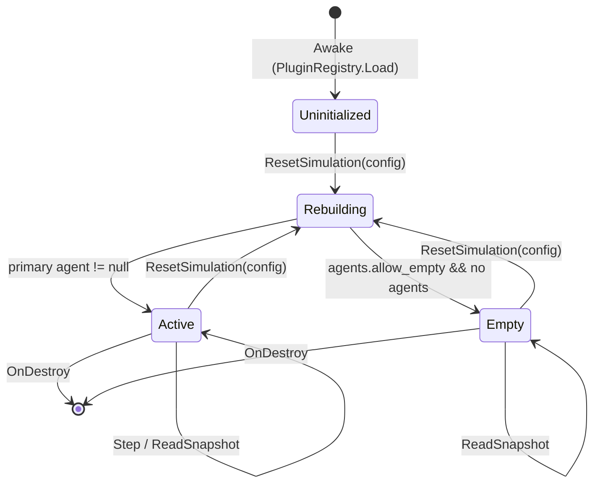

# 3 Реализация ключевых компонентов

## 3.1 Подходы к реализации

Глава 2 фиксирует архитектуру платформы — границы контуров, транспортные контракты, расположение модулей в репозитории. Настоящая глава спускается на уровень кода: разбираются конкретные классы, методы и инварианты, обеспечивающие работу четырёх контуров. Цель раздела — показать, как архитектурные решения превращаются в исполняемый код, и какие компромиссы при этом приняты. Изложение опирается на актуальные исходники из `src/UnityProject/uav-simulator/Assets/Scripts/`, `src/ks0223-web-mac/backend/Services/` и `src/ks0223-web-mac/frontend/src/`; все цитируемые имена классов и методов существуют в дереве на момент написания работы и могут быть проверены поиском.

### 3.1.1 Принципы декомпозиции по ответственности

При реализации платформы выдержан общий принцип: один класс — одна ответственность, и эта ответственность формулируется в терминах внешнего наблюдателя, а не внутреннего устройства. `SimulationManager` отвечает за жизненный цикл активной симуляции: что в сцене сейчас существует, как оно реагирует на `reset` и `step`. `PluginRegistry` отвечает за каталог доступных плагинов и порядок их слияния из разных источников. `BuiltinPluginFactory` отвечает за создание встроенных плагинов и runtime-instance конкретного транспортного средства или трассы. `Ks0223Vehicle` отвечает за физическую и сенсорную модель робота. `RuntimeSessionManager` на стороне backend отвечает за пользовательскую сессию и маршрутизацию команд в одну из двух подложек. `AutopilotService` отвечает за фон inference loop и взаимодействие с `AutopilotSafetyFilter`. Каждый из перечисленных классов остаётся в своих границах: `SimulationManager` не знает о существовании HTTP-сервера, `PluginRegistry` не знает о Rigidbody, `AutopilotService` не знает о JSON-сериализации сцены. Такое разделение позволяет независимо тестировать и эволюционировать модули.

Критерий проверки декомпозиции — на код-ревью: если изменение одной функциональности затрагивает более двух классов, либо распределение ответственностей нарушено, либо вводится новая ответственность, для которой нет дома. Так появилась потребность вынести `AutopilotSafetyFilter` из `AutopilotService` отдельно — фильтр безопасности оказался самодостаточной сущностью с собственным состоянием (счётчик E-stop, фаза hold, ramp-up); его держание внутри inference loop делало бы тесты безопасности неотличимыми от тестов inference, что неудобно.

### 3.1.2 Использование DI и singleton-сервисов на стороне backend

Backend-контур построен на стандартной для ASP.NET Core схеме внедрения зависимостей через `IServiceCollection` и регистрации сервисов в `Program.cs`. Доменные сервисы — `RuntimeSessionManager`, `AutopilotService`, `AutopilotSafetyFilter`, `ModelRegistryService`, `SessionLogger`, `SessionVideoRecorder`, `DemoReplayService`, `TelemetryParser` — регистрируются как singleton, поскольку их состояние обслуживает один процесс backend и должно сохраняться между HTTP-запросами. Контроллеры (`Ks0223Controller`, `AutopilotController`, `ModelsController`, `LogsController`, `DemoReplayController`) регистрируются по умолчанию как scoped и получают зависимости через конструктор. SignalR-хаб `TelemetryHub` получает `RuntimeSessionManager` через `IHubContext` инверсию, чтобы сервис не зависел от хаба напрямую и публиковал телеметрию вне зависимости от наличия активных подключений.

Singleton-семантика влечёт два инварианта, выдерживаемых в коде явно. Первый — потокобезопасность: сервисы, обслуживающие параллельные HTTP-запросы и фоновые таймеры, защищают изменяемое состояние через `lock` (`AutopilotService.gate`, `DemoReplayService.stateLock`), `SemaphoreSlim` (`SessionLogger.writeLock`, `RuntimeSessionManager.lifecycleLock`) или используют `ConcurrentDictionary` (`RuntimeSessionManager.realSessions`, `RuntimeSessionManager.unityWorlds`). Второй — управляемая инициализация. Сервисы, требующие настройки в момент старта приложения, реализуют `IHostedService` (так сделано для `RuntimeSessionManager`), что позволяет хосту корректно вызвать `StartAsync` и `StopAsync` в нужные фазы жизненного цикла, в частности — при остановке backend закрыть активные сессии и выгрузить ONNX-сессии модели.

Конфигурация сервисов вынесена в options-классы (`PiConnectionOptions`, `CameraOptions`, `SensorBridgeOptions`, `LoggingOptions`, `AutopilotSafetyOptions`), а они привязаны к секциям `appsettings.json` через `IOptions<T>`. Эта схема позволяет хранить настройки в текстовом виде, переопределять их переменными окружения (через стандартный механизм ASP.NET Core) и подменять в тестах без модификации кода.

### 3.1.3 Lifecycle-управление через MonoBehaviour и ScriptableObject в Unity

Unity-контур опирается на две существенно различные базы — `MonoBehaviour` для объектов сцены и `ScriptableObject` для дескрипторов и ассетов. `MonoBehaviour` живёт в иерархии сцены, имеет `Awake`/`Start`/`Update`/`FixedUpdate` колбэки и завязан на `GameObject`. На этом уровне реализованы `SimulationManager`, `Ks0223Vehicle`, `BasicArenaTrack`, `CityPolygonTrack`, `TrafficLight`, `TrafficLightController`, `TrafficLightPolygonAdapter`, `TrafficLightAwareController`. `ScriptableObject` живёт как ассет на диске, не имеет позиции в сцене и используется для описаний, не зависящих от runtime-состояния. На этом уровне реализованы `VehiclePluginDescriptor`, `TrackPluginDescriptor`, `PluginRegistryAsset`, `DeviceContractDescriptorAsset`. Различие принципиальное: дескриптор плагина — это данные о возможностях, а не сама возможность, поэтому он не нуждается в физическом теле в сцене и может быть свободно загружен из `Resources` в момент запуска.

Жизненный цикл `MonoBehaviour`-объектов в Unity нелинеен: `Awake` вызывается при инстанцировании префаба, `Start` — перед первым кадром, `OnEnable`/`OnDisable` — при изменении активности, `OnDestroy` — при уничтожении. Это обстоятельство учитывается в `Ks0223Vehicle.Awake`, где компонент идемпотентно создаёт `Rigidbody` и сенсорную камеру; в `BasicArenaTrack.Awake` и `CityPolygonTrack.Awake`, где трасса собирается через `BuildIfNeeded` с ленивой инициализацией; в `TrafficLightPolygonAdapter.OnEnable` и `OnDisable`, где подписка на `TrafficLight.StateChanged` устанавливается симметрично с отпиской при выключении компонента. Каждое из этих правил — следствие нелинейного жизненного цикла; нарушение порождает либо двойную инициализацию (сценарий `Awake` после `Reset`), либо утечку обработчика события (подписка без отписки приводит к фантомным вызовам при перезагрузке сцены).

## 3.2 SimulationManager: ядро жизненного цикла

### 3.2.1 Состояния и переходы

`SimulationManager` (см. `src/UnityProject/uav-simulator/Assets/Scripts/Core/SimulationManager.cs`, 1244 строки) — центральный `MonoBehaviour` Unity-контура, проводящий через себя все запросы на изменение и чтение состояния симуляции. С точки зрения внешнего наблюдателя класс имеет четыре наблюдаемых состояния: непроинициализированное (после `Awake`, но до первого `ResetSimulation`), активное (трасса и хотя бы один агент инстанцированы), пустое (трасса инстанцирована, агентов нет — допустимо, если сценарий установил флаг `agents.allow_empty`) и пересобираемое (внутри `ResetSimulation` старые экземпляры уничтожены, новые ещё не созданы). Переходы между состояниями детерминированы и инициируются исключительно публичными методами: `ResetSimulation(SimulationConfig)`, `Step(ControlCommand)`, `ReadSnapshot`, `GetContract`, `GetDiagnostics`. Внутренние таймеры и колбэки Unity ничего не меняют в этой классификации; единственный фоновый шаг — `FixedUpdate` у `Ks0223Vehicle` — действует уже над инстанцированным агентом и не переводит сам менеджер в новое состояние.



Рисунок 3.1 — Состояния `SimulationManager` и переходы между ними

Поведение в каждом состоянии задано контрактом. В непроинициализированном состоянии `Step` выбрасывает `InvalidOperationException` с сообщением «Active vehicle is not initialized. Call ResetSimulation first.», но `GetContract` и `GetDiagnostics` отрабатывают штатно — они опираются только на загруженный реестр плагинов, который доступен сразу после `Awake`. В активном состоянии полный набор операций исполнен. В пустом состоянии `ReadSnapshot` возвращает «нулевой» `StepResult` с пустыми массивами агентов, чтобы клиент мог отличить ситуацию «сцена есть, но агентов нет» от ошибки. В пересобираемом состоянии методы недоступны: `ResetSimulation` синхронен и возвращает управление только после полного завершения пересборки.

### 3.2.2 ResetWithConfig: применение сценария

Метод `ResetSimulation` — наиболее сложная процедура в `SimulationManager`. Он принимает `SimulationConfig`, содержащий идентификаторы трассы и агентов, параметры трассы, параметры каждого агента, флаги и seed, и за один вызов приводит сцену в состояние, соответствующее этому описанию. Высокоуровневая последовательность шагов закреплена кодом и важна для понимания последующих частей главы.

```csharp
public void ResetSimulation(SimulationConfig config)
{
    var validation = SimulationConfigValidator.Validate(config, registry);
    var allowEmptyAgents = TryReadFlag(config.flags, AllowEmptyAgentsKey, out var allowEmptyValue) && allowEmptyValue;
    var resolvedAgents = ResolveAgentConfigs(config, validation.Vehicle, allowEmptyAgents);
    var qualityProfile = ReadConfigValue(config.flags, RenderQualityProfileKey);
    ApplyRuntimeGraphicsProfile(string.IsNullOrWhiteSpace(qualityProfile) ? "high" : qualityProfile);

    DestroyActiveInstances();

    activeTrack = InstantiateTrack(validation.Track);
    activeTrackId = validation.Track != null ? validation.Track.id ?? string.Empty : string.Empty;
    activeTrack.ApplyTrackParams(config.trackParams ?? Array.Empty<ConfigKeyValue>());
    activeTrack.ResetTrack(config.seed);
    Time.timeScale = validation.TimeScale;
    ConfigureRoute(config.trackParams);

    for (var index = 0; index < resolvedAgents.Count; index++)
    {
        var agent = resolvedAgents[index];
        var vehicle = InstantiateVehicle(agent.Descriptor);
        vehicle.ApplyVehicleConfig(agent.VehicleParams);
        vehicle.ResetVehicle(config.seed + index);
        ApplyVehicleSpawn(vehicle, agent.TrackParams, index, config.seed);
        // ...
    }

    var primary = activeAgents.FirstOrDefault(agent => agent.IsPrimary) ?? activeAgents.FirstOrDefault();
    // ...
    ApplyAgentInteractions(config.flags);
}
```

Алгоритм состоит из четырёх логических фаз. Первая — валидация конфигурации через отдельный класс `SimulationConfigValidator`. Этот класс проверяет, что заявленные идентификаторы трассы и транспортных средств присутствуют в загруженном реестре, и возвращает разрешённые дескрипторы вместе с производным `TimeScale`. Вторая — уничтожение активных экземпляров (`DestroyActiveInstances`), которое перебирает текущие агенты, удаляет их `GameObject` через `Destroy`, обнуляет идентификаторы и сбрасывает `Time.timeScale` к значению, запомненному в `Awake`. Третья — инстанцирование трассы и применение её параметров. Здесь сначала вызывается `InstantiateTrack`, затем `ApplyTrackParams` и `ResetTrack(seed)` — этот порядок важен, поскольку процедурные трассы (например, `CardboardMazeTrack`) используют параметры именно при сбросе для построения сетки коридоров. Четвёртая — инстанцирование агентов, применение конфигурации каждого, размещение в spawn-позиции и запись их в `activeAgents`.

Заключительный шаг — применение взаимодействий между агентами через `ApplyAgentInteractions`. Метод читает три флага: `agents.isolated`, `agents.see_each_other`, `agents.collisions_enabled` и выставляет соответствующие layer-маски и пары `Physics.IgnoreCollision`. Это решает практически встречающуюся задачу: при обучении одной модели в присутствии скриптовых агентов основное транспортное средство не должно ни видеть их в кадре, ни сталкиваться с ними. Без `ApplyAgentInteractions` второй агент в сцене либо создавал бы ложные сигналы для зрительной модели, либо мешал движению.

Параметры маршрута извлекаются отдельно через `ConfigureRoute`. Метод парсит ключи `route.waypoints`, `route.reach_distance_m`, `route.loop` из `trackParams` и при их отсутствии запрашивает у трассы её собственный список waypoint-ов через `activeTrack.GetDefaultWaypoints()`. Такая логика позволяет процедурным трассам (`CardboardMazeTrack`) поставлять путь самостоятельно, а ручным сценариям — переопределять путь конфигурацией. Заглушек на этом пути нет: если ни сценарий, ни трасса waypoint-ы не предоставили, `activeRouteWaypoints` остаётся пустым массивом, и поле `route.completed` в `info` всегда сообщает `false`.

### 3.2.3 Step: цикл управления и наблюдения

Метод `Step(ControlCommand)` — основная горячая точка симулятора. Он вызывается на каждом шаге training loop, операторского пульта или autopilot inference loop с частотой до 30 Hz и образует единственный путь, через который внешний клиент применяет команду и получает наблюдение. Реализация компактна:

```csharp
public StepResult Step(ControlCommand command)
{
    var target = ResolveTargetAgent(command?.targetAgentId, command?.targetVehicleId);
    if (target == null)
    {
        throw new InvalidOperationException("Active vehicle is not initialized. Call ResetSimulation first.");
    }

    target.Vehicle.ApplyControl(command);
    target.Vehicle.TryReadCameraFrame(out var frame);
    var state = target.Vehicle.ReadState();
    var routeCompleted = target.IsPrimary && UpdateRouteProgress(state);
    return BuildStepResult(target, state, frame, routeCompleted);
}
```

Семантика шага следующая. Сначала команда направляется конкретному агенту через `ResolveTargetAgent`. Этот резолвер допускает три способа адресации: явное указание `targetAgentId`, явное указание `targetVehicleId` (если он уникален), и неявная привязка к primary-агенту в случае отсутствия адресной информации. Адресация по `targetVehicleId` реализована честно: если идентификатор транспортного средства встречается в нескольких агентах (например, обе ученические машины — это `vehicle.ks0223.v1`), резолвер выбрасывает `InvalidOperationException` с сообщением о неоднозначности. Так делается потому, что неявное приведение «возьми первого» в этой ситуации — источник трудно отлавливаемых ошибок при работе с двумя агентами одинакового типа.

После применения команды менеджер последовательно собирает наблюдение. `TryReadCameraFrame` возвращает кадр в формате JPEG в base64 (формат закреплён контрактом `CameraFrame`), `ReadState` — численное состояние с полями скорости, угловой скорости и массивом телеметрии, в который `Ks0223Vehicle` укладывает значения PWM, ультразвука, line tracker и оценок мощности. Затем — обновление прогресса по маршруту через `UpdateRouteProgress`, причём только для primary-агента: вторичные агенты не имеют собственного маршрута, и сигнал `done` для них не имеет смысла. На выходе формируется `StepResult` с текущим целевым агентом в качестве «головы» и массивом `agents` — состояниями всех остальных активных агентов. Кадр камеры передаётся только для целевого агента, поскольку JPEG-кодирование одного кадра 1280×720 уже обходится в несколько миллисекунд, и кодировать кадры для всех агентов одновременно нецелесообразно.

Кроме `Step`, существует менее нагруженный путь — `ReadSnapshot`. Он отличается тем, что не применяет команду и не продвигает прогресс маршрута. Его назначение — получить состояние сцены без вмешательства, например для веб-интерфейса, обновляющего показатели сенсоров между управляющими действиями. Возможность отказаться от кодирования кадра (флаг `includeFrame = false`) сохраняет ресурсы при частых обращениях.

### 3.2.4 Управление множеством агентов

В первоначальной версии симулятора сцена содержала ровно одно транспортное средство. В текущей реализации `SimulationManager` поддерживает произвольное число одновременных агентов, при этом ровно один из них помечается как primary — именно к нему привязаны маршрут, основной канал управления оператором и кадр камеры по умолчанию. Внутреннее представление — список `activeAgents` элементов `ActiveAgentRuntime`, каждый из которых хранит идентификатор агента, идентификатор `VehicleBase`-инстанса, флаг primary, ссылку на `VehicleBase` и применённые параметры трассы и транспортного средства.

Многоагентность потребовала уточнить два места: адресацию команды (см. выше) и взаимодействия между агентами. Последнее реализовано в `ApplyAgentInteractions` через комбинацию двух механизмов Unity: layer-масок и `Physics.IgnoreCollision`. Если флаг `agents.see_each_other` равен `false`, то все агенты, кроме целевого, переводятся на отдельный layer `VehicleBase.PeerVehicleLayer`, а сенсорная камера маскирует этот layer через `cullingMask`. Если флаг `agents.collisions_enabled` равен `false`, попарно для всех активных агентов выставляется `Physics.IgnoreCollision`. Эти два флага независимы: возможны конфигурации «вижу, но не сталкиваюсь» (демонстрационный режим) и «сталкиваюсь, но не вижу» (обучение в присутствии слепой опасности).

Многоагентный сценарий использовался при разработке демо «город» — сцена `CityPolygonTrack` могла содержать обучаемого робота KS0223 и дополнительный скриптовый автомобиль на тех же дорогах. На стороне обучения многоагентный режим пока не задействован: тренировочные среды (`python/training/`) запрашивают по одному агенту на сцену. Но контракт `SimulationConfig` уже допускает массив `agents`, и backend-сторона `RuntimeSessionManager` маршрутизирует команды с указанием `targetAgentId`, что делает дальнейшее расширение в сторону multi-agent training шагом без структурной перестройки.

## 3.3 PluginRegistry и BuiltinPluginFactory

### 3.3.1 Two-tier реестр и merge-логика

`PluginRegistry` (см. `src/UnityProject/uav-simulator/Assets/Scripts/Plugins/PluginRegistry.cs`, 129 строк) — статический фасад над загрузчиком плагинов. На вход внешнего наблюдателя класс предоставляет единственный метод `Load`, возвращающий `PluginRegistrySnapshot` — неизменяемый снапшот доступных в текущем процессе плагинов. Внутри `Load` собирает реестр из трёх источников и склеивает их по приоритету.

```csharp
public static PluginRegistrySnapshot Load()
{
    var registryAsset = Resources.Load<PluginRegistryAsset>(RegistryAssetPath);
    var vehicles = Resources.LoadAll<VehiclePluginDescriptor>(DescriptorsFolderPath) ?? new VehiclePluginDescriptor[0];
    var tracks = Resources.LoadAll<TrackPluginDescriptor>(DescriptorsFolderPath) ?? new TrackPluginDescriptor[0];
    var builtinSnapshot = BuiltinPluginFactory.CreateSnapshot(PluginRegistrySource.BuiltinFactory);
    var resourceSnapshot = new PluginRegistrySnapshot(...);
    resourceSnapshot = PluginRegistrySnapshot.MergePreferPrimary(
        resourceSnapshot,
        builtinSnapshot,
        PluginRegistrySource.ResourcesDescriptorsFolder);

    if (registryAsset != null)
    {
        var registrySnapshot = PluginRegistrySnapshot.FromAsset(registryAsset, PluginRegistrySource.RegistryAsset);
        return PluginRegistrySnapshot.MergePreferPrimary(registrySnapshot, resourceSnapshot, PluginRegistrySource.RegistryAsset);
    }

    return resourceSnapshot;
}
```

Иерархия источников в порядке убывания приоритета: явный `PluginRegistryAsset` (если он положен в `Resources/UavSimulator/PluginRegistry`), отдельные дескрипторы из папки `Resources/UavSimulator/Plugins`, встроенный каталог `BuiltinPluginFactory`. Слияние выполняется попарно через `PluginRegistrySnapshot.MergePreferPrimary`, который проходит сначала по primary-источнику, затем по secondary, и при совпадении идентификаторов оставляет primary. Идентификаторы — поле `id` дескриптора — играют здесь роль ключа: если разработчик плагина положил собственный `VehiclePluginDescriptor` с `id = "vehicle.ks0223.v1"` в `Resources/UavSimulator/Plugins/`, он переопределит встроенный KS0223 без необходимости править исходники платформы.

Такое разделение на «жёсткие» (registry asset), «мягкие» (descriptors folder) и «встроенные» (factory) источники отражает три практических способа доставки плагина: централизованный — поддерживаемый куратором проекта список; индивидуальный — drop-in одного дескриптора без модификации общего списка; платформенный — то, что доступно «из коробки» в любой сборке. Все три уживаются одновременно, что упрощает эволюцию каталога.

### 3.3.2 BuiltinPluginFactory как декларативный каталог

`BuiltinPluginFactory` (см. `src/UnityProject/uav-simulator/Assets/Scripts/Plugins/BuiltinPluginFactory.cs`, 926 строк) — статический класс, выполняющий две функции. Первая — создание снапшота `PluginRegistrySnapshot` со встроенными дескрипторами (метод `CreateSnapshot`). Вторая — runtime-инстанцирование объекта плагина по идентификатору без необходимости иметь собранный prefab (`TryCreateVehicleInstance`, `TryCreateTrackInstance`).

В части декларативного каталога `BuiltinPluginFactory` хранит идентификаторы как константы-литералы и формирует `ScriptableObject`-дескрипторы поштучно. В таблице 3.1 приведён актуальный список встроенных идентификаторов транспортных средств и трасс на момент написания работы.

Таблица 3.1 — Встроенные плагины из `BuiltinPluginFactory`

| Категория | Идентификатор | Назначение |
|---|---|---|
| Vehicle | `vehicle.ks0223.v1` | Основной обучаемый робот; differential-drive, размеры 0,15×0,12×0,25 м |
| Vehicle | `vehicle.prometeo.sport.v1` | Спортивная машинка из пакета PROMETEO; визуальная модель только |
| Vehicle | `vehicle.arcade.blue.v1` … `arcade.purple.v1` | Четыре расцветки Arcade Free Racing Car как презентационные машинки |
| Vehicle | `vehicle.drone.simple.v1` | Простой квадрокоптер с упрощённой динамикой |
| Track | `track.basic_arena.v1` | Procedural S-образный коридор для базовой навигации |
| Track | `track.roadsystem_arena.v1` | RoadSystem-сплайны, арена с разметкой |
| Track | `track.roadsystem_realistic.v2` | Реалистичная сцена на RoadSystem с бордюрами и стартовой меткой |
| Track | `track.cardboard_corridor.v1` | L-образный картонный коридор, повторяющий реальный sim-to-real стенд |
| Track | `track.cardboard_maze.v1` | Процедурный лабиринт, параметризуется через `parametersSchemaJson` |
| Track | `track.city_polygon.v1` | Город из POLYGON City Pack с четырьмя светофорами на центральном перекрёстке |

Для каждого транспортного средства фабрика конструирует `VehiclePluginDescriptor` с прикреплённым `DeviceContractDescriptorAsset`. Контракт описывает доступные сенсоры — для наземного робота это камера 480×640 RGB, спидометр, передний ультразвук и пятиточечный line tracker, частотные характеристики и единицы измерения. Контракт публикуется в API `/contract` и позволяет внешним клиентам (training-обвязке, операторскому пульту) автоматически адаптироваться к набору сенсоров без жёсткой привязки к модели робота.

Декларативный стиль `BuiltinPluginFactory` сознательно выбран взамен ScriptableObject-ассетов из проекта: ассеты на диске были бы более гибки, но сложнее в поддержке и тяжелее в ревью, особенно при множественной параметризации. В коде же все идентификаторы и параметры по умолчанию находятся в одном файле и проверяются компилятором.

### 3.3.3 Procedural-fallback для отсутствующих ассетов

Принципиальная ситуация в платформе — ассеты, на которые ссылаются плагины, могут отсутствовать. Это связано с тем, что часть визуальных моделей берётся из сторонних пакетов Unity Asset Store (PROMETEO Car Controller, Arcade Free Racing Car, Simple Drone, POLYGON City Pack), которые не входят в репозиторий, требуют отдельной установки и могут отсутствовать в чистом клоне. Без фоллбэка такая ситуация привела бы к падению на старте симулятора и невозможности обучать или демонстрировать что-либо до выполнения дополнительных шагов установки.

Фоллбэк построен в два уровня. Первый — в `BuiltinPluginFactory.TryCreateVehicleInstance`: при невозможности загрузить prefab визуальной модели через `AssetDatabase.LoadAssetAtPath` фабрика создаёт «fallback shell» — простой составной объект из примитивов с цветовой акцентной палитрой. Этот объект не претендует на эстетику, но обеспечивает три практических качества — корректную физическую коробку (`BoxCollider`), назначенный `Rigidbody` и `Ks0223Vehicle` как поведенческий компонент. Робот при этом полностью функционален: он применяет команды, отдаёт телеметрию и кадр сенсорной камеры; меняется только то, что видно постороннему наблюдателю в spectator-камере.

Второй уровень — в трассах. `CityPolygonTrack` при отсутствии `Assets/POLYGON city pack/scene/DemoScene.unity` падает обратно в процедурную сборку через `BuildProcedural` — собирает (2N+1)×(2N+1) сетку из остальных доступных prefab-ов или, если и они отсутствуют, оставляет пустую трассу с одним перекрёстком и четырьмя процедурно созданными светофорами. `BasicArenaTrack` вообще не зависит от сторонних ассетов — собирает свой коридор из примитивов.

Архитектурно фоллбэк обеспечивает свойство «всё всегда запускается». Чистый клон репозитория без сторонних пакетов даёт работоспособный simulator: тренировка KS0223 на `track.basic_arena.v1` проходит без участия внешних ассетов, а демонстрационные сценарии деградируют до процедурных версий с лог-предупреждением, явно указывающим, что используется fallback и какой prefab отсутствует.

### 3.3.4 RuntimeMaterialCompatibility: конверсия Built-in в URP

При интеграции сторонних ассетов возникает ещё одна осложняющая ситуация — несовместимость render pipeline. POLYGON City Pack, PROMETEO и часть других пакетов поставляются с материалами, рассчитанными на Built-in render pipeline; платформа же использует Universal Render Pipeline (URP). Без преобразования такие материалы рендерятся как пурпурные «броken-shader» поверхности, что делает визуальное сопоставление обучаемой политики сцене невозможным.

`RuntimeMaterialCompatibility` (см. одноимённый файл, 323 строки) реализует runtime-конверсию материалов. Класс предоставляет три ключевых метода. `IsUrpActive` определяет активный pipeline через `GraphicsSettings.currentRenderPipeline` и сравнивает имя типа с подстроками «UniversalRenderPipeline» или «URP». `NeedsReplacement(Material)` проверяет, нужно ли менять материал: если у источника отсутствует shader, либо shader не поддерживается на текущем оборудовании, либо имя shader-а не подходит активному pipeline. `CreateReplacementMaterial(Material)` создаёт новый материал на совместимом shader-е, копируя цвет, текстуру и smoothness из источника.

Логика разрешения совместимого shader-а сделана многоступенчатой, чтобы корректно работать в разных конфигурациях сборки.

```csharp
public static Shader ResolveCompatibleLitShader()
{
    var seededUrpLit = LoadShaderFromMaterialResource(UrpLitResourcePath);
    if (seededUrpLit != null) return seededUrpLit;

    var configuredShader = ResolveConfiguredDefaultLitShader();
    if (configuredShader != null) return configuredShader;

    var urpLit = Shader.Find("Universal Render Pipeline/Lit");
    if (urpLit != null) return urpLit;
    // ... ещё четыре fallback-шага через Standard, Unlit/Texture, Unlit/Color, Legacy/Diffuse
    throw new MissingReferenceException(...);
}
```

Первый шаг — попытка загрузить материал-«seed» из `Resources/UavSimulator/RuntimeShaders/`. Это сделано потому, что `Shader.Find("Universal Render Pipeline/Lit")` в IL2CPP-сборке для standalone-плеера возвращает `null` для shader-ов, не упомянутых ни в одном материале сцены — они вырезаются stripping-ом. Положенный в `Resources/` материал гарантированно сохраняет ссылку на shader. Дальнейшие шаги — попытка использовать defaultMaterial pipeline-asset, прямой `Shader.Find`, fallback на Standard, на Unlit, и в крайнем случае — на Legacy/Diffuse. Только если ни один из шагов не успешен, метод выбрасывает `MissingReferenceException`.

`CityPolygonTrack` интегрируется с `RuntimeMaterialCompatibility` напрямую: после загрузки DemoScene класс рекурсивно обходит все `Renderer`-ы, проверяет каждый материал через `NeedsReplacement` и заменяет несовместимые на новые через `CreateReplacementMaterial`. Без этого шага городская сцена POLYGON-а под URP отрисовывалась бы как сплошное розовое пятно.

## 3.4 Реализация Vehicle: Ks0223Vehicle

### 3.4.1 Физический контур: Rigidbody и интегрирование скоростей

`Ks0223Vehicle` (см. `src/UnityProject/uav-simulator/Assets/Scripts/Vehicles/Ks0223Vehicle.cs`, 1057 строк) — реализация транспортного средства, отражающая физические и сенсорные характеристики реального робота Keyestudio KS0223. Класс наследует `VehicleBase` и реализует контракт, определённый в главе 4: `ApplyControl`, `ReadState`, `TryReadCameraFrame`, `ResetVehicle`, `ApplyVehicleConfig`. Внутри класса физика, сенсоры и презентация разделены на отдельные смысловые блоки, что позволяет работать с каждым из них независимо.

Физический контур построен на `Rigidbody` с фиксированными вращениями вокруг X и Z (`RigidbodyConstraints.FreezeRotationX | FreezeRotationZ`), массой 1,0 кг, линейным затуханием 0,2 и угловым затуханием 1,5. Эти значения отражают реальный робот: измеренная масса KS0223 составляет около 1 кг с батареей, а затухания подобраны так, чтобы при отпущенном газе движение прекращалось за приблизительно один корпус. Дополнительно вокруг указанных значений добавляется per-episode jitter в ±20 % при включённом флаге `randomizeDynamics`, что повышает робастность обучаемой политики к разбросу реального оборудования.

Калибровочные параметры скорости и угловой скорости подобраны экспериментально на реальном устройстве и закреплены в коде явными комментариями.

```csharp
// Calibrated against real Keyestudio KS0223 (4x 4.5V 200 RPM motors,
// ~65 mm wheels, ~150 mm wheelbase).
//
// Linear: ruler-measured 0.73 m/s steady state (Apr 25 calibration).
// Yaw: 3-point calibration Apr 26
//   90deg burst (238ms) -> 50deg actual = 210 deg/s avg (spinup)
//   180deg burst (466ms) -> 180deg actual = 386 deg/s avg
//   360deg burst (927ms) -> 350deg actual = 378 deg/s avg
[SerializeField] private float maxSpeedMps = 0.73f;
[SerializeField] private float accelerationMps2 = 4.0f;
[SerializeField] private float brakeDecelerationMps2 = 6.5f;
[SerializeField] private float maxYawRateDegPerSec = 380f;
[SerializeField] private float yawAccelerationDegPerSec2 = 1900f;
```

Интегрирование происходит в `FixedUpdate` через `Mathf.MoveTowards`: целевая скорость и угловая скорость не достигаются мгновенно, а приближаются за фиксированное время разгона. Это важно: реальный KS0223 не реверсирует мгновенно, ему требуется около 200 мс на смену направления, и без аналогичного inertial-поведения политика, обученная в идеализированном симуляторе, на реальном железе совершала бы перерегулирование. Сама позиция при этом обновляется через `body.linearVelocity = forward * currentSpeed`, что заставляет Unity-физику честно проверять коллизии с препятствиями. Альтернативный путь через `MovePosition` отвергнут потому, что он кинематический и проходит сквозь стены — для обучения избеганию столкновений это неприемлемо.

### 3.4.2 Сенсоры: камера, ультразвук, line tracker

Класс предоставляет три типа сенсорных данных: фронтальную камеру, передний ультразвуковой дальномер и пятиточечный line tracker. Все три формируются в момент `ReadState` и `TryReadCameraFrame` и упаковываются в стандартизованные поля `VehicleState.telemetry` и `CameraFrame`.

Камера — отдельный `GameObject` с `Camera`-компонентом, прикреплённый к корпусу робота на высоте 0,09 м со смещением 0,12 м вперёд и наклоном 6 градусов вниз. Угол обзора 68 градусов соответствует объективу штатной камеры KS0223. Размеры кадра по умолчанию — 1280×720 RGB, JPEG-кодирование с качеством 95. Размеры и качество настраиваются через профиль `camera.profile` (поддерживаются варианты `performance`, `balanced`, `high`, `ultra`) или через явные параметры в `ApplyVehicleConfig`. Сам процесс получения кадра идёт через off-screen `RenderTexture`: `Camera.targetTexture` устанавливается в собственный `frontCameraRt`, выполняется `Camera.Render()`, активный `RenderTexture.active` указывается на этот же `frontCameraRt`, и `Texture2D.ReadPixels` копирует пиксели обратно в управляемую память. Завершающий `EncodeToJPG` отдаёт массив байт, который затем кодируется в base64 для транспорта.

```csharp
public override bool TryReadCameraFrame(out CameraFrame frame)
{
    // ...
    frontCamera.targetTexture = frontCameraRt;
    frontCamera.Render();
    RenderTexture.active = frontCameraRt;
    frontCameraTexture.ReadPixels(new Rect(0f, 0f, cameraImageWidth, cameraImageHeight), 0, 0, false);
    frontCameraTexture.Apply(false, false);
    var bytes = frontCameraTexture.EncodeToJPG(cameraJpegQuality);
    // ...
    frame = new CameraFrame { ... encoding = "base64", dataBase64 = Convert.ToBase64String(bytes) };
    return true;
}
```

Ультразвуковой дальномер реализован через `Physics.Raycast` из позиции переднего сенсора в направлении вперёд с максимальной дистанцией `ultrasonicMaxDistanceM = 3,5` м. Возвращаемое значение в метрах укладывается в телеметрию под ключом `sensor.ultrasonic.front.m`. Сценарий «нет эха» (луч не попал ни в один collider) представляется значением 0, что соответствует поведению реального HC-SR04 — при отсутствии эха драйвер возвращает 0 или null. На стороне `AutopilotSafetyFilter` этот случай явно интерпретируется как «датчик не дал валидного отсчёта» и приводит к E-stop, чтобы политика не приняла отсутствие сигнала за свободный путь.

Line tracker реализован через пять позиционных проб: пять точек вдоль фронтальной поперечной оси на высоте над поверхностью, в каждой выполняется raycast вниз и проверяется попадание в коллайдер с тегом «road line». Возвращаются нормализованные значения 0..1 в полях `sensor.line_tracker.s1_norm` … `s5_norm`. Эта схема упрощена по отношению к реальному ИК-датчику, но достаточна для обучения политик, опирающихся на разметку.

Помимо сенсорных значений, телеметрия включает производные оценки энергопотребления — напряжение батареи, ток и расчётную мощность, которые вычисляются из текущих PWM-команд по эмпирической линейной модели. Эти поля используются индикаторной панелью операторского пульта и не несут физического смысла на уровне модели; они нужны лишь для визуальной согласованности симуляции с реальным роботом, у которого аналогичные показатели читает сенсорный мост.

Таблица 3.2 — Состав телеметрии в `VehicleState.telemetry`, формируемой `Ks0223Vehicle.ReadState`

| Ключ | Источник | Семантика |
|---|---|---|
| `drive.left_pwm_norm`, `drive.right_pwm_norm` | Поля команды | Нормированный PWM на левую и правую стороны, [-1; 1] |
| `sensor.speedometer.mps` | `body.linearVelocity` | Модуль линейной скорости в плоскости XZ, м/с |
| `sensor.ultrasonic.front.m` | `Physics.Raycast` вперёд | Расстояние до препятствия, 0 при отсутствии эха |
| `sensor.line_tracker.s1_norm` … `s5_norm` | Пять raycast-ов вниз | Нормированные значения пяти проб line tracker |
| `power.battery.voltage_v` | Эмпирическая модель | Оценка напряжения, В |
| `power.battery.current_a` | Производная от мощности и напряжения | Оценка тока, А |
| `power.motor.estimated_w` | Эмпирическая модель | Расчётная мощность мотора, Вт |

### 3.4.3 Применение ControlCommand: маппинг на физические каналы

Метод `ApplyControl` принимает `ControlCommand` и переводит его в три внутренних канала: `speedCmd`, `yawCmd`, `brakeCmd`. Метод поддерживает два эквивалентных способа задания команды. Первый — через высокоуровневые поля `throttle` и `steer`: они напрямую интерпретируются как нормированные продольная и поперечная команды, а левый и правый PWM выводятся как `speedCmd ± yawCmd`. Второй — через расширения команды (`extensions`) с ключами `drive.left_pwm_norm` и `drive.right_pwm_norm`: это путь нативного PWM-управления, при котором клиент задаёт PWM-каналы напрямую, а `speedCmd` и `yawCmd` восстанавливаются обратной формулой `(left + right)/2` и `(right - left)/2`.

```csharp
if (TryGetExtension(command.extensions, LeftPwmKey, out var left) &&
    TryGetExtension(command.extensions, RightPwmKey, out var right))
{
    leftPwmCmd = Mathf.Clamp(left, -1f, 1f);
    rightPwmCmd = Mathf.Clamp(right, -1f, 1f);
    var effLeft = leftPwmCmd * leftMotorMult;
    var effRight = rightPwmCmd * rightMotorMult;
    speedCmd = Mathf.Clamp((effLeft + effRight) * 0.5f, -1f, 1f);
    yawCmd = Mathf.Clamp((effRight - effLeft) * 0.5f, -1f, 1f);
    brakeCmd = Mathf.Clamp01(command.brake);
    return;
}

speedCmd = Mathf.Clamp(command.throttle, -1f, 1f);
yawCmd = Mathf.Clamp(command.steer, -1f, 1f);
brakeCmd = Mathf.Clamp01(command.brake);
leftPwmCmd = Mathf.Clamp(speedCmd - yawCmd, -1f, 1f);
rightPwmCmd = Mathf.Clamp(speedCmd + yawCmd, -1f, 1f);
```

В обоих путях применяется per-episode мультипликатор асимметрии моторов `leftMotorMult` и `rightMotorMult`, выбираемый в `ResetVehicle` из per-seed RNG в диапазоне ±10 %. Без этой асимметрии команда `DirForward` (`throttle=1`, `steer=0`) приводила бы к идеально прямому движению, тогда как у реального KS0223 моторы не идентичны и при максимальном forward-throttle прослеживается слабое смещение влево или вправо. Воспроизведение этого эффекта в симуляторе оказывается необходимым: политика, обученная без асимметрии, не вырабатывает коррекции и на реальном устройстве отклоняется от заданного курса.

Тормоз (`brakeCmd`) применяется в `FixedUpdate` через дополнительный вызов `Mathf.MoveTowards(currentSpeed, 0, brakeCmd * brakeDecelerationMps2 * dt)`, который суперпонируется на изменение скорости от двигателя. Это позволяет одновременно задать throttle и brake, что используется адаптивным контролем светофоров (`TrafficLightAwareController` отдаёт `brakeIntensity` отдельно от throttle).

### 3.4.4 Презентационные visual-режимы

Сенсорная камера может работать в нескольких режимах, выбираемых параметром `camera.mode` в `ApplyVehicleConfig`. Поддерживаются режимы `driver` (дефолт, камера в глазной точке робота), `bumper` (низко на бампере, широкий FOV), `chase` (третье лицо сзади-сверху), `spectator` (изометрия с разворотом), `top_down` (вертикально вниз с FOV 90°). Каждый режим — это набор `localPosition`, `localEuler` и `fieldOfView`; переключение производит метод `ApplyCameraMode`.

В `chase`, `bumper` и `spectator` режимах камера может видеть собственный корпус робота, что в задачах обучения политики мешало бы — модель училась бы по видимости корпуса, а не по сцене. Поэтому в `TryReadCameraFrame` перед рендерингом для этих режимов все `Renderer`-ы дочерних объектов транспортного средства временно отключаются (с восстановлением после `Camera.Render()`). В режимах `driver` и `top_down` отключение не требуется, поскольку корпус всё равно за пределами кадра.

Презентационная визуальная оболочка строится в `EnsurePresentationVisuals` и применяется только в случае, когда у машины нет импортированной визуальной модели (например, для KS0223, у которого собственная маленькая визуальная модель из примитивов с акцентным цветом). Метод `SetPresentationAccentColor`, доступный извне, используется фабрикой при инстанцировании Arcade-варианта: акцентный цвет берётся из идентификатора (синий, красный, серый, фиолетовый), что позволяет различать машинки в multi-agent-сценарии при использовании fallback-shell.

## 3.5 Реализация Track: BasicArenaTrack и CityPolygonTrack

### 3.5.1 Procedural arena как минимальный track

`BasicArenaTrack` (см. `src/UnityProject/uav-simulator/Assets/Scripts/Tracks/BasicArenaTrack.cs`, 503 строки) — простейшая трасса, на которой проводится основная часть обучения навигационных политик. С точки зрения геометрии это S-образный коридор шириной три метра, состоящий из трёх прямых сегментов и двух «площадей» в местах поворотов. Стартовая позиция робота — `(0, 0,2, -6)` лицом к +Z, целевая — `(6, *, 5)`. Out-of-bounds — отдельный механизм Python-обвязки: `BasicArenaTrack` намеренно не строит невидимых стен, поскольку лимит латерального отклонения от центра коридора рассчитывается на стороне Gymnasium-окружения и используется как часть функции вознаграждения.

Сборка трассы выполняется в `BuildIfNeeded`, вызываемом из `Awake` и из `ResetTrack`. Внутренний флаг `built` гарантирует идемпотентность: повторный вызов после `Awake` не пересоздаёт геометрию. Само построение разбито на пять фаз — сегменты дороги, обочины, краевые линии, штриховая разметка и сценография. Каждая фаза собирает дочерние `GameObject`-ы из примитивов (`PrimitiveType.Cube`, `PrimitiveType.Cylinder`, `PrimitiveType.Sphere`) и применяет к ним материал через `ApplyColorByName` — функцию, выбирающую цвет и smoothness по имени объекта. Этот декларативный стиль удобен в поддержке: добавление нового типа объекта на трассу требует только добавить ветку в `ApplyColorByName`, не трогая саму геометрию.

Принцип «всё всегда запускается», обсуждавшийся в подразделе 3.3.3, выдержан здесь полностью. `BasicArenaTrack` не зависит ни от одного стороннего ассета — все материалы создаются runtime через `RuntimeMaterialCompatibility.ResolveCompatibleLitShader`. В чистом клоне репозитория без сторонних пакетов трасса собирается без предупреждений и пригодна для тренировки за минуты после `git clone`.

Сценография (метод `CreateScenery`) намеренно избыточна — двенадцать деревьев, шесть кустов, шесть конусов, четыре участка травы, шесть фонарных столбов. Цель — дать обучаемой политике достаточный контекст для зрительной локализации. Без объектов, выходящих за пределы коридора, кадр сенсорной камеры превращался бы в монотонную «трубу» с одной только разметкой, и сеть на таких кадрах вырождается к решениям, не использующим визуальную информацию. С деревьями и фонарями кадр содержит точки привязки, помогающие сети отличать прямые сегменты от поворотов.

### 3.5.2 CityPolygonTrack: загрузка стороннего ассета

`CityPolygonTrack` (см. `src/UnityProject/uav-simulator/Assets/Scripts/Tracks/CityPolygonTrack.cs`, 422 строки) реализует демонстрационную городскую сцену поверх Unity Asset Store-пакета POLYGON City Pack. Пакет в репозиторий не входит и должен быть установлен отдельно. Класс предусматривает два режима сборки. Первый — `useDemoScene = true` (по умолчанию): дополнительная загрузка готовой сцены `Assets/POLYGON city pack/scene/DemoScene.unity` через `EditorSceneManager.LoadSceneAsyncInPlayMode` с последующим репарентингом её корневых `GameObject`-ов под трассу. Второй — `useDemoScene = false` или фоллбэк при отсутствии DemoScene: процедурная сборка сетки `(2N+1)×(2N+1)` из отдельных POLYGON-prefab-ов улицы, перекрёстка, светофоров, фонарей и зданий.

Загрузка DemoScene выполняется асинхронно и завершается через колбэк `op.completed += _ => AdoptLoadedScene()`. В `AdoptLoadedScene` все корневые `GameObject`-ы целевой сцены переносятся под `transform` трассы с сохранением мировой позиции, что позволяет встраивать готовый ассет в любую host-сцену. Параллельно из ассета удаляются собственные `Camera`, `Light` и `AudioListener` (флаг `stripDemoSceneRig`) — иначе они конкурировали бы с camera-rig-ом host-сцены, в которую трасса встраивается. После переноса каждый корневой объект пропускается через `ReplaceIncompatibleMaterials`, реализованный поверх `RuntimeMaterialCompatibility` (см. подраздел 3.3.4); без этого шага POLYGON-материалы под URP отрисовываются некорректно.

Режим процедурной сборки отвечает на ситуацию, когда DemoScene-ассет недоступен. `BuildProcedural` сначала измеряет фактический мировой размер prefab-а улицы через `MeasureWorldSize` — это нужно потому, что разные версии POLYGON-пакета поставляют улицы разного размера, и фиксированный шаг сетки приводил бы к видимым швам или наложениям. Затем строится сетка ячеек: на пересечениях нечётной строки и нечётного столбца ставится перекрёсток с четырьмя светофорами; на пересечениях, где «дорогой» является только одна координата, ставится одиночный сегмент улицы; в остальных ячейках — здание из псевдослучайно выбранного prefab-а с углом поворота, выводимым из координат через детерминированный хэш `(row * 73 + col * 31) & 3`.

### 3.5.3 Светофоры: TrafficLight FSM, Controller, Adapter, Aware controller

Реализация светофоров разнесена на четыре класса с разной ответственностью, что отражает декомпозицию из подраздела 3.1.1: FSM, координатор группы FSM на одном перекрёстке, адаптер визуального представления и фильтр-наблюдатель на стороне транспортного средства.

`TrafficLight` (`src/UnityProject/uav-simulator/Assets/Scripts/CityDemo/TrafficLight.cs`, 100 строк) — FSM одной лампы с тремя состояниями `Red`, `Green`, `Yellow`. Класс содержит только хранение текущего состояния и обновление эмиссии трёх mesh-renderer-ов через `ApplyEmission`. Времени и циклов он не знает — переход между состояниями инициируется снаружи через `SetState`. Событие `StateChanged` срабатывает только при фактическом изменении состояния, что важно для слушателей, не желающих обрабатывать «перерисовку без изменений».

`TrafficLightController` (172 строки) координирует группы NS- и EW-светофоров на одном перекрёстке. Цикл состоит из четырёх фаз — `NsGreen`, `NsYellow`, `EwGreen`, `EwYellow` — длительностью `greenSeconds` и `yellowSeconds`. Реализация специально выделяет метод `AdvanceTime(float dt)` как публичный test-friendly tick: основной приводящий цикл — корутина `Drive`, которая вызывает `AdvanceTime(Time.deltaTime)` каждый кадр, но edit-mode тесты могут управлять FSM детерминированно без корутин. Метод `ResetCycle(seed)` устанавливает случайную начальную фазу и случайное смещение внутри неё, основываясь на `seed`. Это важно для процедурной сборки: соседние перекрёстки, поднятые с одним глобальным seed-ом, при детерминированной начальной фазе одинаковы, и движение по городу превращается в синхронное переключение всех светофоров одновременно. Разнесение через `seed + i * 7919` (простое число для уменьшения коллизий) даёт каждый перекрёсток в случайной точке цикла.

`TrafficLightPolygonAdapter` (135 строк) — мост между `TrafficLight` FSM и POLYGON-prefab-ом светофора, у которого все три лампы хранятся в одном `MeshRenderer` с разными slot-ами материалов. Класс подписывается на `StateChanged` в `OnEnable` и отписывается в `OnDisable`, что обеспечивает корректную симметрию подписок при пересборке сцены. На событие он переключает материалы в массиве `MeshRenderer.materials` — и важно, что обращение идёт именно к свойству `materials` (а не к `sharedMaterials`), которое в Unity создаёт per-instance копию. Без этого все четыре светофора одного перекрёстка делили бы один материал, и переключение цвета на одном из них меняло бы вид всех четырёх.

`TrafficLightAwareController` (`src/UnityProject/uav-simulator/Assets/Scripts/Vehicles/TrafficLightAwareController.cs`, 88 строк) — фильтр на стороне транспортного средства. Класс не управляет автомобилем, а отдаёт рекомендацию по интенсивности торможения: красный сигнал даёт `brakeIntensity = 1,0`, жёлтый — `0,5`, зелёный или отсутствие зоны — `0,0`. Решение о применении рекомендации принимает upstream-контроллер (например, контроллер Arcade-машинки в демо-сценарии); тем самым `TrafficLightAwareController` остаётся чистой функцией, не имеющей побочных эффектов на физику. Чистая часть выделена в `internal static EvaluateZone`, что позволяет тестам проверять решение без поднимания коллайдеров; raycast-путь — отдельный `ResolveZoneAhead`, использующий `Physics.Raycast` через `lookAheadDistance = 15` метров и `QueryTriggerInteraction.Collide` (зоны светофоров — триггеры).

## 3.6 Backend services

### 3.6.1 RuntimeSessionManager: маршрутизация в две подложки

### 3.6.2 UnityKs0223RuntimeProvider: HTTP-клиент к Unity

### 3.6.3 AutopilotService: inference loop

### 3.6.4 AutopilotSafetyFilter: deadman, sonar E-stop, dropout

### 3.6.5 ModelRegistryService: lifecycle ONNX-артефакта

### 3.6.6 SessionLogger и SessionVideoRecorder

### 3.6.7 DemoReplayService: воспроизведение записанных сессий

## 3.7 Frontend: операторский пульт

### 3.7.1 Архитектура tabs и SignalR

### 3.7.2 ControlPad: keyboard и виртуальный джойстик

### 3.7.3 Camera panel и MJPEG streaming

### 3.7.4 Scenario picker: выбор сценария из YAML

## 3.8 Качество реализации

### 3.8.1 Тестовое покрытие

### 3.8.2 Линтинг и компиляция

### 3.8.3 Производительность и узкие места
