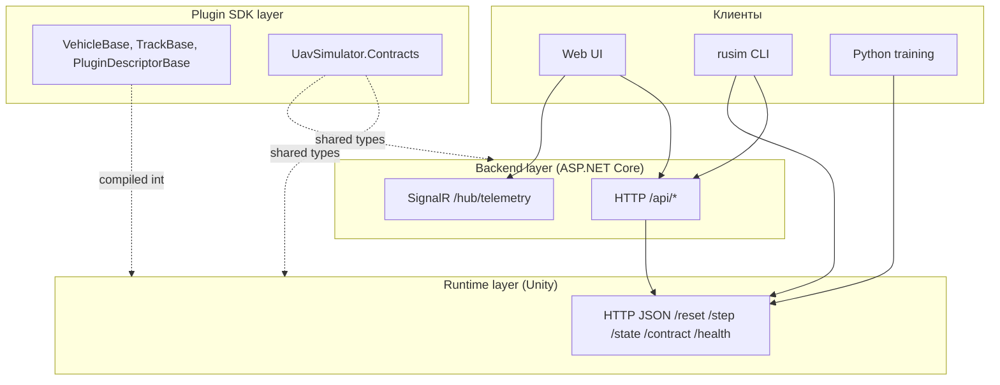

# 6 Спецификация API

## 6.1 Поверхность платформы и слои интеграции

### 6.1.1 Три уровня API: Unity HTTP, backend HTTP/SignalR, plugin SDK

Внешняя поверхность платформы `uav-simulator` распадается на три различных по уровню слоя интеграции, каждый из которых обслуживает собственный сценарий взаимодействия и адресован собственной целевой аудитории. Самый низкий слой — Unity HTTP JSON API, реализованный сервером `HttpJsonSimulatorApiServer` (см. [src/UnityProject/uav-simulator/Assets/Scripts/Api/HttpJsonSimulatorApiServer.cs](../../src/UnityProject/uav-simulator/Assets/Scripts/Api/HttpJsonSimulatorApiServer.cs)) — фиксирует контракт между runtime-ом симулятора и любым его клиентом, будь то операторский backend, тренировочный скрипт на Python или инженерная утилита `rusim`. Этот слой работает с понятиями физической симуляции напрямую — `reset`, `step`, `state`, `frame` — и не несёт операторской семантики (сессии, журналы, реестр моделей). Второй слой — backend на `ASP.NET Core` (см. [src/ks0223-web-mac/backend/Program.cs](../../src/ks0223-web-mac/backend/Program.cs)) — поднимается над runtime и вводит понятия пользовательской сессии, активного клиента, активной модели и записанного демо. Backend выступает единственным транспортом для веб-интерфейса и одновременно публикует семантически совместимый интерфейс над двумя различными подложками — симулятором и физическим роботом. Третий слой — plugin SDK — представляет собой `.NET`-библиотеку (`packages/com.uav-simulator.plugin-sdk/Runtime/`), которая компилируется в плагин и определяет внутреннюю поверхность расширяемости платформы.

Различие между тремя слоями отражает различные временные горизонты обращения: к Unity HTTP API обращается training loop с частотой до 30 Hz, к backend — оператор в темпе человеческого взаимодействия, к plugin SDK — разработчик плагина однократно при сборке. Это различие диктует и стиль контрактов: на runtime-уровне применяется минимальный набор маршрутов с компактными DTO без вложенных метаданных; на backend-уровне маршрутов на порядок больше и они обогащены диагностикой, журналом и информацией о привязках; на SDK-уровне поверхность задана не маршрутами, а наследованием от абстрактных базовых классов и набором атрибутов на полях `ScriptableObject`-дескрипторов.



Рисунок 6.1 — Три слоя API платформы и направления обращений между ними.

### 6.1.2 Контракты как точка единственной истины

Все три слоя делят между собой набор сериализуемых типов данных, объявленных в namespace `UavSimulator.Contracts` (см. [src/UnityProject/uav-simulator/Assets/Scripts/Contracts/SimulatorContracts.cs](../../src/UnityProject/uav-simulator/Assets/Scripts/Contracts/SimulatorContracts.cs)) и продублированных в plugin SDK как [packages/com.uav-simulator.plugin-sdk/Runtime/SimulatorContracts.cs](../../packages/com.uav-simulator.plugin-sdk/Runtime/SimulatorContracts.cs). Именно эти типы — `ControlCommand`, `VehicleState`, `CameraFrame`, `SimulationConfig`, `StepResult`, `DeviceContractDescriptor` — образуют единственный источник истины для платформы. Любое изменение поля в этих типах автоматически попадает в публичную поверхность runtime, в backend через клиентский `JsonSerializer`, в плагин через прямое использование класса и в Python через JSON-десериализацию ответа сервера.

Такой подход избран сознательно как альтернатива двум распространённым практикам — генерации DTO из OpenAPI-описания и ручному поддержанию параллельных моделей на каждом языке. Генерация из OpenAPI вносит в проект промежуточный артефакт, который требует отдельного конвейера и постоянно отстаёт от изменений; ручное поддержание двойников приводит к дрейфу контрактов и тонким несовместимостям, которые проявляются только во время выполнения. Унификация на одной C#-модели возможна постольку, поскольку и runtime, и backend, и SDK — это `.NET`-проекты, а Python-клиент работает с JSON в виде словарей и не нуждается в типизированных моделях вне исследовательского цикла.

### 6.1.3 Версионирование API

Версионирование API организовано на двух различных уровнях. Уровень runtime-контракта обозначается строковым полем `contractVersion` в дескрипторе `SimulatorContractDescriptor` ([SimulatorContracts.cs:192](../../src/UnityProject/uav-simulator/Assets/Scripts/Contracts/SimulatorContracts.cs)) и читается клиентами при инициализации соединения через `GET /contract`. Это глобальная версия поверхности симулятора, изменяемая при структурном обновлении DTO или поведения базовых маршрутов. Уровень контрактов плагинов обозначается отдельной структурой `ContractVersion` ([ContractVersion.cs](../../packages/com.uav-simulator.plugin-sdk/Runtime/ContractVersion.cs)) с тремя целочисленными полями `major`, `minor`, `patch` и реализацией `IComparable<ContractVersion>` для сравнения. Тип используется в `PluginDescriptorBase.version` и описывает версию конкретного робота или трассы, а не платформы в целом.

Семантика семантического версионирования соблюдается явно. Несовместимое изменение порождает увеличение `major` и в случае плагина — новый идентификатор с суффиксом `.vN+1` (например, `vehicle.ks0223.v2`); это позволяет двум версиям одного и того же плагина сосуществовать в реестре одновременно. Совместимое расширение увеличивает `minor`; исправление поведения без изменения поверхности — `patch`. На уровне runtime API соответствующая стратегия описана в разделе 6.6 настоящей главы.

## 6.2 Unity HTTP JSON API

### 6.2.1 Конфигурация: хост, порт, переменные среды

Unity HTTP API поднимается классом `HttpJsonApiHost` ([HttpJsonApiHost.cs](../../src/UnityProject/uav-simulator/Assets/Scripts/Api/HttpJsonApiHost.cs)) в каждой загружаемой сцене. Поведение хоста параметризуется тремя путями: значениями полей в инспекторе Unity Editor (`port = 8000`, `host = "127.0.0.1"`, `autoStart = true`), переменными окружения `UAVSIM_API_HOST` и `UAVSIM_API_PORT`, читаемыми в `Awake` через `ApplyEnvironmentOverrides` (`HttpJsonApiHost.cs:50-63`), и значениями, переданными в конструктор `HttpJsonSimulatorApiServer` напрямую. Приоритет переменных среды над полями инспектора выбран сознательно: тренировочные запуски часто параллелизуются на одной машине и каждому из них требуется свой свободный порт; в этих случаях оркестратор передаёт `UAVSIM_API_PORT=8001`, `UAVSIM_API_PORT=8002` без перенастройки сцены Unity.

Когда в качестве хоста указан `127.0.0.1` или `localhost`, метод `GetPrefixes` (`HttpJsonSimulatorApiServer.cs:177-191`) регистрирует одновременно три префикса в `HttpListener`: `http://127.0.0.1:port/`, `http://localhost:port/` и `http://*:port/`. Третий префикс гарантирует, что любой клиент с локальной машины достучится до сервера независимо от того, какой alias он использует. На macOS и Windows такой бинд не требует прав администратора, поскольку речь идёт о non-privileged-портах в диапазоне 1024-65535. Если в качестве хоста указан конкретный публичный адрес, регистрируется только он — в этом случае предполагается осознанный выбор оператором сетевого интерфейса.

### 6.2.2 Маршрут /reset — инициализация сцены

Маршрут `POST /reset` принимает тело с JSON-структурой `SimulationConfig` и возвращает первое наблюдение в виде `StepResult`. Семантически это атомарная операция: к моменту возврата ответа сцена пересобрана, плагины проверены через `SimulationConfigValidator`, агенты заспавнены, и первое состояние с кадром камеры доступно клиенту. Атомарность критична для тренировочного цикла: устранение race condition между завершением `reset` и первым `step` позволяет training-обёртке писать прямой код без явных синхронизаций.

Пример запроса:

```json
{
  "seed": 42,
  "timeScale": 1.0,
  "selectedTrackId": "track.cardboard_corridor.v1",
  "selectedVehicleId": "vehicle.ks0223.v1",
  "trackParams": [
    { "key": "obstacle_density", "value": "0.3" }
  ],
  "vehicleParams": [],
  "flags": [
    { "key": "agents.isolated", "value": "false" }
  ],
  "agents": [
    { "agentId": "ego", "vehicleId": "vehicle.ks0223.v1", "isPrimary": true }
  ]
}
```

Пример ответа (укороченный, с пропуском бинарных полей кадра):

```json
{
  "activeAgentId": "ego",
  "activeVehicleId": "vehicle.ks0223.v1",
  "state": {
    "pose": { "position": { "x": 0.0, "y": 0.05, "z": 0.0 }, "rotation": { "x": 0, "y": 0, "z": 0, "w": 1 } },
    "linearVelocity": { "x": 0, "y": 0, "z": 0 },
    "angularVelocity": { "x": 0, "y": 0, "z": 0 },
    "speed": 0.0,
    "timestamp": 1714780000123,
    "timeBase": "unix_ms",
    "telemetry": []
  },
  "reward": 0.0,
  "done": false,
  "info": [],
  "frame": { "frameId": "...", "width": 96, "height": 96, "format": "RGB24", "encoding": "base64", "dataBase64": "..." },
  "agents": []
}
```

Возможные коды состояния — `200 OK` при успешной инициализации, `400 Bad Request` при невалидной конфигурации (неизвестный `selectedTrackId`, отсутствующий плагин, повторяющиеся `agentId`), `500 Internal Server Error` при сбое инстанцирования префаба. Все ошибки оборачиваются в JSON-объект `{"error": "<message>"}` обработчиком исключений в `HandleContextAsync` (`HttpJsonSimulatorApiServer.cs:97-118`).

### 6.2.3 Маршрут /step — управление и наблюдение

Маршрут `POST /step` — основная рабочая точка training-цикла. Принимает тело со структурой `ControlCommand`, применяет её к указанному агенту и возвращает `StepResult` с новым состоянием, опциональным кадром камеры, скалярной наградой и флагом `done`. Семантика шага синхронна и атомарна: запрос блокируется до завершения одного шага физического движка Unity, поэтому клиент получает наблюдение, точно соответствующее применённой команде, без необходимости отдельных вызовов для чтения состояния.

Пример минимального запроса:

```json
{ "throttle": 0.6, "steer": -0.2, "brake": 0.0 }
```

В multi-agent-сценариях команда адресуется конкретному агенту через `targetAgentId` или `targetVehicleId`:

```json
{ "throttle": 0.6, "steer": 0.0, "brake": 0.0, "targetAgentId": "agent_2" }
```

Поле `extensions` несёт device-specific каналы управления, описанные в `DeviceContractDescriptor` плагина — раздельные PWM на колёсах робота, сервоприводы поворота камеры и подобные. Пример с прямым PWM-управлением:

```json
{
  "throttle": 0.0, "steer": 0.0, "brake": 0.0,
  "extensions": [
    { "key": "drive.left_pwm_norm", "value": "0.7" },
    { "key": "drive.right_pwm_norm", "value": "0.5" }
  ]
}
```

Возвращаемый `StepResult` включает четыре основных раздела: state агента (поза, скорости, скаляры в `telemetry`), кадр камеры (опционально, при наличии attached-камеры на vehicle-плагине), скалярная награда `reward` и флаг `done`. Поле `agents` массив — содержит снимок состояния всех агентов в multi-agent-сцене и используется обёртками среды `MultiAgentVisionVecEnv` для одновременного чтения наблюдений всех агентов в одной операции вместо `n` параллельных HTTP-запросов.

### 6.2.4 Маршрут /state и /health — состояние и диагностика

Текущая реализация Unity HTTP API не выделяет `/state` как отдельный маршрут — снимок состояния доставляется в составе ответа `/step` или может быть прочитан через `SimulationManager.ReadSnapshot` без отправки команды управления. Сам `ReadSnapshot` доступен внутри runtime, но в HTTP-поверхность не вынесен; доступным аналогом служит «холостой» `step` с нулевыми командами. Это консервативное проектное решение: добавление лишнего маршрута увеличивает площадь контракта без явной выгоды, поскольку любой step и так возвращает текущее состояние.

Маршрут `GET /health` (`HttpJsonSimulatorApiServer.cs:122-126`) возвращает компактную диагностическую структуру `SimulatorHealthStatus`. Типичный ответ:

```json
{
  "status": "ok",
  "pluginRegistrySource": "RegistryAsset",
  "availableVehicles": 6,
  "availableTracks": 3,
  "activeAgentId": "ego",
  "activeVehicleId": "vehicle.prometeo.sport.v1",
  "activeTrackId": "track.roadsystem_realistic.v2",
  "activeVehicleCount": 1
}
```

`/health` используется в трёх различных сценариях. Backend читает его при попытке connect-а к Unity для проверки готовности runtime до отправки реальных команд. CLI `rusim discover` использует его для сканирования диапазона портов и определения работающих экземпляров Unity. Тренировочные скрипты пингуют `/health` в начале запуска, чтобы отказаться от попыток отправки `reset` к не запущенному Unity и выдать пользователю диагностическое сообщение немедленно.

Маршрут `GET /contract` (`HttpJsonSimulatorApiServer.cs:128-132`) возвращает структуру `SimulatorContractDescriptor` со списком всех доступных vehicle- и track-плагинов вместе с их `DeviceContractDescriptor`. Этот маршрут — точка discovery каталога: CLI команды `rusim list vehicles`, `rusim list tracks` и `rusim inspect <id>` читают его и выводят пользователю человеко-читаемый список без необходимости знать о реестре плагинов на стороне Unity.

### 6.2.5 Маршруты model lifecycle

Жизненный цикл моделей в текущей версии платформы реализован полностью на стороне backend — Unity-runtime не хранит и не активирует ONNX-артефакты самостоятельно. Это сознательное решение: runtime отвечает за физику и наблюдения, а autopilot и inference loop живут в operator stack, поскольку требуют истории сессии, версионирования и интеграции с операторской поверхностью. Такое разделение исключает дублирование model registry между runtime и backend и сохраняет за Unity HTTP API минимальный набор маршрутов (`/health`, `/contract`, `/reset`, `/step`).

Полный набор маршрутов Unity HTTP API на текущий момент исчерпывающе перечислен в таблице 6.1.

Таблица 6.1 — Маршруты Unity HTTP JSON API

| Метод | Путь | Назначение | Тело запроса | Тело ответа |
|---|---|---|---|---|
| GET | `/health` | Диагностическая сводка | — | `SimulatorHealthStatus` |
| GET | `/contract` | Каталог плагинов и контрактов | — | `SimulatorContractDescriptor` |
| POST | `/reset` | Инициализация сцены | `SimulationConfig` | `StepResult` |
| POST | `/step` | Шаг управления | `ControlCommand` | `StepResult` |

Именно такая компактная поверхность определяет философию runtime-уровня: четыре маршрута, четыре сериализуемых типа, ноль внешних зависимостей помимо `System.Net.HttpListener`. Любое расширение требует осознанного решения и попадает в раздел breaking changes (см. 6.6.2).

### 6.2.6 Сериализация: Unity JsonUtility и его особенности

Сериализация на стороне Unity выполняется встроенным сериализатором `UnityEngine.JsonUtility` (вызовы `ToJson`/`FromJson` в `SimulatorApiFacade`). Этот выбор продиктован двумя обстоятельствами. Во-первых, классы DTO в `UavSimulator.Contracts` помечены атрибутом `[Serializable]` и одновременно используются как поля в `MonoBehaviour`-ах сцены: использование того же сериализатора, что и для Editor-инспектора, гарантирует совпадение поведения между сценой и сетевым контрактом без дополнительной разметки. Во-вторых, `JsonUtility` не вносит в проект сторонней зависимости и сокращает размер сборки.

Особенности `JsonUtility` следует учитывать на стороне клиента. Сериализатор не поддерживает `Dictionary<TKey, TValue>` напрямую — именно поэтому все «карты» в DTO сделаны массивами `ConfigKeyValue[]`. Сериализатор не различает `null` и значение по умолчанию: отсутствующее в JSON поле инициализируется `default(T)`, что особенно важно для опциональных полей `targetAgentId` и `targetVehicleId` в `ControlCommand`. Сериализатор полностью игнорирует свойства (`get`/`set`) и работает только с public-полями, поэтому DTO в платформе сделаны чистыми data-классами без логики.

Клиенты на Python используют стандартный модуль `json` без типизированных моделей: HTTP-клиент `SimClient` ([python/sim_client/http_client.py](../../python/sim_client/http_client.py)) принимает и возвращает `Dict[str, Any]`, не валидирует структуру и оставляет соответствие именам полей на ответственности вызывающего кода. Это упрощает быстрое прототипирование тренировочных обёрток и не требует поддержания параллельной модели типов в исследовательском контуре.

## 6.3 Транспортные DTO

### 6.3.1 ControlCommand

`ControlCommand` ([SimulatorContracts.cs:67-82](../../src/UnityProject/uav-simulator/Assets/Scripts/Contracts/SimulatorContracts.cs)) — структура управляющей команды от клиента к runtime. Минимальная команда задаётся тремя нормализованными скалярами `throttle`, `steer`, `brake`; этого достаточно для большинства colon-style роботов класса KS0223 и универсально работает с встроенными vehicle-плагинами.

```csharp
[Serializable]
public sealed class ControlCommand
{
    public float throttle;
    public float steer;
    public float brake;

    public string targetAgentId;
    public string targetVehicleId;

    public long timestamp;
    public string timeBase;

    public ConfigKeyValue[] extensions;
}
```

Таблица 6.2 — Поля `ControlCommand`

| Поле | Тип | Единица/диапазон | Обязательно | Описание |
|---|---|---|---|---|
| `throttle` | float | [-1, 1] | да | Нормализованная тяга. Положительное — вперёд, отрицательное — назад |
| `steer` | float | [-1, 1] | да | Нормализованный угол поворота. -1 — крайнее левое, +1 — крайнее правое |
| `brake` | float | [0, 1] | да | Нормализованное торможение |
| `targetAgentId` | string | — | нет | Адресация команды конкретному агенту в multi-agent-сцене |
| `targetVehicleId` | string | — | нет | Альтернатива `targetAgentId` через `vehicleId` плагина |
| `timestamp` | long | unix_ms | нет | Метка времени отправки. Используется журналом и записью демо |
| `timeBase` | string | "unix_ms" | нет | База времени метки |
| `extensions` | ConfigKeyValue[] | — | нет | Device-specific каналы управления (PWM, серво, LED) |

Приоритет адресации — сначала `targetAgentId`, затем `targetVehicleId`, в случае пустых обоих полей — primary-агент сцены. Это позволяет одиночному клиенту обращаться к простой однокамерной сцене без указания идентификаторов и тому же клиенту — управлять конкретным агентом в multi-agent-конфигурации без изменения формата команды.

### 6.3.2 VehicleState

`VehicleState` ([SimulatorContracts.cs:50-64](../../src/UnityProject/uav-simulator/Assets/Scripts/Contracts/SimulatorContracts.cs)) — структура состояния транспортного средства, возвращаемая в каждом `StepResult` и доступная через `VehicleBase.ReadState` ([VehicleBase.cs:17-45](../../packages/com.uav-simulator.plugin-sdk/Runtime/VehicleBase.cs)).

```csharp
[Serializable]
public sealed class VehicleState
{
    public Posef pose;
    public Vector3f linearVelocity;
    public Vector3f angularVelocity;
    public float speed;
    public long timestamp;
    public string timeBase;
    public ConfigKeyValue[] telemetry;
}
```

Поле `pose` содержит позицию и ориентацию через `Posef` (вложенные `Vector3f` и `Quaternionf`). Поле `linearVelocity` — линейная скорость в системе координат сцены, `angularVelocity` — угловая скорость в радианах в секунду. Поле `speed` — скалярная величина скорости, удобная для использования в качестве компонента наблюдения в reinforcement-learning без вычисления нормы вектора на стороне клиента. Поле `telemetry` несёт device-specific скаляры: показания линейных датчиков, ультразвука, заряда батареи; набор ключей задаётся плагином и формально описан в `DeviceContractDescriptor.sensors`.

### 6.3.3 CameraFrame

`CameraFrame` ([SimulatorContracts.cs:30-47](../../src/UnityProject/uav-simulator/Assets/Scripts/Contracts/SimulatorContracts.cs)) описывает кадр с камеры робота, возвращаемой как часть `StepResult.frame` или `AgentStepResult.frame`.

```csharp
[Serializable]
public sealed class CameraFrame
{
    public string frameId;
    public int width;
    public int height;
    public string format;
    public string encoding;
    public long timestamp;
    public string timeBase;
    public int bytesLength;
    public string dataRef;
    public string dataBase64;
}
```

Таблица 6.3 — Поля `CameraFrame`

| Поле | Тип | Описание |
|---|---|---|
| `frameId` | string | Уникальный идентификатор кадра, монотонно возрастает |
| `width`, `height` | int | Размер кадра в пикселях |
| `format` | string | Формат пикселей: `RGB24`, `RGBA32`, `JPEG` |
| `encoding` | string | Кодирование payload-а: `base64` для inline или `ref` для внешнего хранилища |
| `bytesLength` | int | Длина полезных данных в байтах до кодирования |
| `dataBase64` | string | Inline-данные в base64 (заполняется при `encoding == "base64"`) |
| `dataRef` | string | Указатель на внешнее хранилище (заполняется при `encoding == "ref"`) |

Двухвариантное кодирование через `dataBase64` или `dataRef` отражает компромисс между простотой и пропускной способностью. Для тренировочных сценариев на одном хосте inline-base64 проще: HTTP-клиенту достаточно прочитать тело и декодировать поле напрямую. Для production-сценариев и удалённого исполнения в дальнейшем планируется добавление транспорта `dataRef`, при котором кадр публикуется в shared memory или по отдельному WebRTC-каналу, а HTTP-ответ несёт только идентификатор.

### 6.3.4 SensorDescriptor + ActuatorDescriptor

Дескрипторы каналов сенсоров и актуаторов формализуют контракт устройства в machine-readable форме и применяются для валидации совместимости плагина и сценария обучения.

```csharp
[Serializable]
public sealed class SensorDescriptor
{
    public string id;
    public string sensorType;
    public string format;
    public string unit;
    public int[] shape;
    public float rateHz;
}

[Serializable]
public sealed class ActuatorDescriptor
{
    public string id;
    public string actuatorType;
    public string unit;
    public float min;
    public float max;
}
```

В `SensorDescriptor` поле `sensorType` принимает значения `camera`, `ultrasonic`, `line_array`, `imu` и подобные; `format` уточняет тип данных (`RGB24` для камеры, `float32` для ультразвука); `shape` — форма тензора в случае массивных данных; `rateHz` — целевая частота обновления. В `ActuatorDescriptor` поля `min` и `max` задают физические границы канала, что используется obstacle-driven рандомизацией параметров на стороне backend и сценарным валидатором.

Дескрипторы агрегируются в `DeviceContractDescriptor` ([SimulatorContracts.cs:165-175](../../src/UnityProject/uav-simulator/Assets/Scripts/Contracts/SimulatorContracts.cs)), который связывает идентификатор устройства с его типом и наборами сенсоров и актуаторов:

```csharp
public sealed class DeviceContractDescriptor
{
    public string deviceId;
    public string deviceType;
    public SensorDescriptor[] sensors;
    public ActuatorDescriptor[] actuators;
    public string observationSchemaJson;
    public string actionSchemaJson;
}
```

Поля `observationSchemaJson` и `actionSchemaJson` несут JSON-схему наблюдений и действий в текстовом виде. Это сделано осознанно: schema по своей природе вложенная и динамическая, и попытка её структурного представления через `[Serializable]`-DTO противоречила бы парадигме `JsonUtility`. Хранение схемы как текста позволяет автоматически валидировать наблюдения на стороне Python через `jsonschema` и одновременно сохраняет компактность runtime-DTO.

### 6.3.5 ConfigKeyValue и параметры сценария

Структура `ConfigKeyValue` ([SimulatorContracts.cs:84-89](../../src/UnityProject/uav-simulator/Assets/Scripts/Contracts/SimulatorContracts.cs)) — самая простая в платформе и самая часто встречающаяся в DTO:

```csharp
[Serializable]
public sealed class ConfigKeyValue
{
    public string key;
    public string value;
}
```

Все «карты ключ-значение» в платформе сериализуются как массивы `ConfigKeyValue[]` — это вынужденная мера, обусловленная отсутствием поддержки `Dictionary` в `JsonUtility`. Структура применяется в шести различных контекстах: `trackParams` и `vehicleParams` в `SimulationConfig` для параметров плагинов, `flags` для логических переключателей сцены, `extensions` в `ControlCommand` для device-specific каналов, `telemetry` в `VehicleState` для скалярных датчиков и `info` в `StepResult` для произвольной диагностической информации. Конвенция значений — все значения хранятся как строки, парсинг в нужный тип — на стороне потребителя.

Соглашения об именовании ключей зафиксированы в плагинах: `agents.isolated`, `agents.see_each_other`, `agents.collisions_enabled` для multi-agent-режима; `drive.left_pwm_norm`, `drive.right_pwm_norm` для дифференциального привода; `camera.pan_norm`, `camera.tilt_norm` для серво-камеры. Точечная нотация используется как пространство имён и упрощает документирование контракта плагина.

## 6.4 Backend HTTP API и SignalR

(в работе)

## 6.5 Plugin SDK API (краткий обзор)

(в работе)

## 6.6 Стабильность и совместимость API

(в работе)

## 6.7 Примеры взаимодействия

(в работе)
