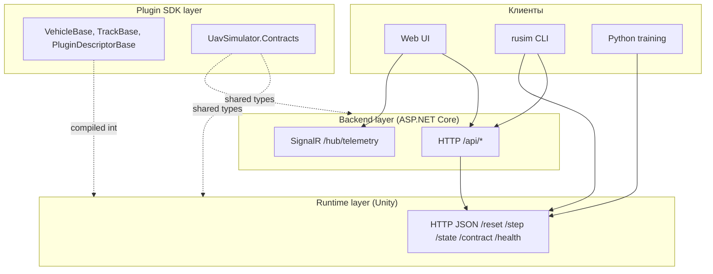

# 4 Спецификация API

## 4.1 Поверхность платформы и слои интеграции

### 4.1.1 Три уровня API: Unity HTTP, backend HTTP/SignalR, plugin SDK

Внешняя поверхность платформы `uav-simulator` распадается на три различных по уровню слоя интеграции, каждый из которых обслуживает собственный сценарий взаимодействия и адресован собственной целевой аудитории. Самый низкий слой — Unity HTTP JSON API, реализованный сервером `HttpJsonSimulatorApiServer` (см. [src/UnityProject/uav-simulator/Assets/Scripts/Api/HttpJsonSimulatorApiServer.cs](../../src/UnityProject/uav-simulator/Assets/Scripts/Api/HttpJsonSimulatorApiServer.cs)) — фиксирует контракт между runtime-ом симулятора и любым его клиентом, будь то операторский backend, тренировочный скрипт на Python или инженерная утилита `rusim`. Этот слой работает с понятиями физической симуляции напрямую — `reset`, `step`, `state`, `frame` — и не несёт операторской семантики (сессии, журналы, реестр моделей). Второй слой — backend на `ASP.NET Core` (см. [src/ks0223-web-mac/backend/Program.cs](../../src/ks0223-web-mac/backend/Program.cs)) — поднимается над runtime и вводит понятия пользовательской сессии, активного клиента, активной модели и записанного демо. Backend выступает единственным транспортом для веб-интерфейса и одновременно публикует семантически совместимый интерфейс над двумя различными подложками — симулятором и физическим роботом. Третий слой — plugin SDK — представляет собой `.NET`-библиотеку (`packages/com.uav-simulator.plugin-sdk/Runtime/`), которая компилируется в плагин и определяет внутреннюю поверхность расширяемости платформы.

Различие между тремя слоями отражает различные временные горизонты обращения: к Unity HTTP API обращается training loop с частотой до 30 Hz, к backend — оператор в темпе человеческого взаимодействия, к plugin SDK — разработчик плагина однократно при сборке. Это различие диктует и стиль контрактов: на runtime-уровне применяется минимальный набор маршрутов с компактными DTO без вложенных метаданных; на backend-уровне маршрутов на порядок больше и они обогащены диагностикой, журналом и информацией о привязках; на SDK-уровне поверхность задана не маршрутами, а наследованием от абстрактных базовых классов и набором атрибутов на полях `ScriptableObject`-дескрипторов.



Рисунок 4.1 — Три слоя API платформы и направления обращений между ними.

### 4.1.2 Контракты как точка единственной истины

Все три слоя делят между собой набор сериализуемых типов данных, объявленных в namespace `UavSimulator.Contracts` (см. [src/UnityProject/uav-simulator/Assets/Scripts/Contracts/SimulatorContracts.cs](../../src/UnityProject/uav-simulator/Assets/Scripts/Contracts/SimulatorContracts.cs)) и продублированных в plugin SDK как [packages/com.uav-simulator.plugin-sdk/Runtime/SimulatorContracts.cs](../../packages/com.uav-simulator.plugin-sdk/Runtime/SimulatorContracts.cs). Именно эти типы — `ControlCommand`, `VehicleState`, `CameraFrame`, `SimulationConfig`, `StepResult`, `DeviceContractDescriptor` — образуют единственный источник истины для платформы. Любое изменение поля в этих типах автоматически попадает в публичную поверхность runtime, в backend через клиентский `JsonSerializer`, в плагин через прямое использование класса и в Python через JSON-десериализацию ответа сервера.

Такой подход избран сознательно как альтернатива двум распространённым практикам — генерации DTO из OpenAPI-описания и ручному поддержанию параллельных моделей на каждом языке. Генерация из OpenAPI вносит в проект промежуточный артефакт, который требует отдельного конвейера и постоянно отстаёт от изменений; ручное поддержание двойников приводит к дрейфу контрактов и тонким несовместимостям, которые проявляются только во время выполнения. Унификация на одной C#-модели возможна постольку, поскольку и runtime, и backend, и SDK — это `.NET`-проекты, а Python-клиент работает с JSON в виде словарей и не нуждается в типизированных моделях вне исследовательского цикла.

### 4.1.3 Версионирование API

Версионирование API организовано на двух различных уровнях. Уровень runtime-контракта обозначается строковым полем `contractVersion` в дескрипторе `SimulatorContractDescriptor` ([SimulatorContracts.cs:192](../../src/UnityProject/uav-simulator/Assets/Scripts/Contracts/SimulatorContracts.cs)) и читается клиентами при инициализации соединения через `GET /contract`. Это глобальная версия поверхности симулятора, изменяемая при структурном обновлении DTO или поведения базовых маршрутов. Уровень контрактов плагинов обозначается отдельной структурой `ContractVersion` ([ContractVersion.cs](../../packages/com.uav-simulator.plugin-sdk/Runtime/ContractVersion.cs)) с тремя целочисленными полями `major`, `minor`, `patch` и реализацией `IComparable<ContractVersion>` для сравнения. Тип используется в `PluginDescriptorBase.version` и описывает версию конкретного робота или трассы, а не платформы в целом.

Семантика семантического версионирования соблюдается явно. Несовместимое изменение порождает увеличение `major` и в случае плагина — новый идентификатор с суффиксом `.vN+1` (например, `vehicle.ks0223.v2`); это позволяет двум версиям одного и того же плагина сосуществовать в реестре одновременно. Совместимое расширение увеличивает `minor`; исправление поведения без изменения поверхности — `patch`. На уровне runtime API соответствующая стратегия описана в разделе 4.6 настоящей главы.

## 4.2 Unity HTTP JSON API

### 4.2.1 Конфигурация: хост, порт, переменные среды

Unity HTTP API поднимается классом `HttpJsonApiHost` ([HttpJsonApiHost.cs](../../src/UnityProject/uav-simulator/Assets/Scripts/Api/HttpJsonApiHost.cs)) в каждой загружаемой сцене. Поведение хоста параметризуется тремя путями: значениями полей в инспекторе Unity Editor (`port = 8000`, `host = "127.0.0.1"`, `autoStart = true`), переменными окружения `UAVSIM_API_HOST` и `UAVSIM_API_PORT`, читаемыми в `Awake` через `ApplyEnvironmentOverrides` (`HttpJsonApiHost.cs:50-63`), и значениями, переданными в конструктор `HttpJsonSimulatorApiServer` напрямую. Приоритет переменных среды над полями инспектора выбран сознательно: тренировочные запуски часто параллелизуются на одной машине и каждому из них требуется свой свободный порт; в этих случаях оркестратор передаёт `UAVSIM_API_PORT=8001`, `UAVSIM_API_PORT=8002` без перенастройки сцены Unity.

Когда в качестве хоста указан `127.0.0.1` или `localhost`, метод `GetPrefixes` (`HttpJsonSimulatorApiServer.cs:177-191`) регистрирует одновременно три префикса в `HttpListener`: `http://127.0.0.1:port/`, `http://localhost:port/` и `http://*:port/`. Третий префикс гарантирует, что любой клиент с локальной машины достучится до сервера независимо от того, какой alias он использует. На macOS и Windows такой бинд не требует прав администратора, поскольку речь идёт о non-privileged-портах в диапазоне 1024-65535. Если в качестве хоста указан конкретный публичный адрес, регистрируется только он — в этом случае предполагается осознанный выбор оператором сетевого интерфейса.

### 4.2.2 Маршрут /reset — инициализация сцены

Маршрут `POST /reset` принимает тело с JSON-структурой `SimulationConfig` и возвращает первое наблюдение в виде `StepResult`. Семантически это атомарная операция: к моменту возврата ответа сцена пересобрана, плагины проверены через `SimulationConfigValidator`, агенты заспавнены, и первое состояние с кадром камеры доступно клиенту. Атомарность критична для тренировочного цикла: устранение race condition между завершением `reset` и первым `step` позволяет training-обёртке писать прямой код без явных синхронизаций.

Пример запроса:

```json
{
  "seed": 42,
  "timeScale": 1.0,
  "selectedTrackId": "track.cardboard_corridor.v1",
  "selectedVehicleId": "vehicle.ks0223.v1",
  "trackParams": [
    { "key": "obstacle_density", "value": "0.3" }
  ],
  "vehicleParams": [],
  "flags": [
    { "key": "agents.isolated", "value": "false" }
  ],
  "agents": [
    { "agentId": "ego", "vehicleId": "vehicle.ks0223.v1", "isPrimary": true }
  ]
}
```

Пример ответа (укороченный, с пропуском бинарных полей кадра):

```json
{
  "activeAgentId": "ego",
  "activeVehicleId": "vehicle.ks0223.v1",
  "state": {
    "pose": { "position": { "x": 0.0, "y": 0.05, "z": 0.0 }, "rotation": { "x": 0, "y": 0, "z": 0, "w": 1 } },
    "linearVelocity": { "x": 0, "y": 0, "z": 0 },
    "angularVelocity": { "x": 0, "y": 0, "z": 0 },
    "speed": 0.0,
    "timestamp": 1714780000123,
    "timeBase": "unix_ms",
    "telemetry": []
  },
  "reward": 0.0,
  "done": false,
  "info": [],
  "frame": { "frameId": "...", "width": 96, "height": 96, "format": "RGB24", "encoding": "base64", "dataBase64": "..." },
  "agents": []
}
```

Возможные коды состояния — `200 OK` при успешной инициализации, `400 Bad Request` при невалидной конфигурации (неизвестный `selectedTrackId`, отсутствующий плагин, повторяющиеся `agentId`), `500 Internal Server Error` при сбое инстанцирования префаба. Все ошибки оборачиваются в JSON-объект `{"error": "<message>"}` обработчиком исключений в `HandleContextAsync` (`HttpJsonSimulatorApiServer.cs:97-118`).

### 4.2.3 Маршрут /step — управление и наблюдение

Маршрут `POST /step` — основная рабочая точка training-цикла. Принимает тело со структурой `ControlCommand`, применяет её к указанному агенту и возвращает `StepResult` с новым состоянием, опциональным кадром камеры, скалярной наградой и флагом `done`. Семантика шага синхронна и атомарна: запрос блокируется до завершения одного шага физического движка Unity, поэтому клиент получает наблюдение, точно соответствующее применённой команде, без необходимости отдельных вызовов для чтения состояния.

Пример минимального запроса:

```json
{ "throttle": 0.6, "steer": -0.2, "brake": 0.0 }
```

В multi-agent-сценариях команда адресуется конкретному агенту через `targetAgentId` или `targetVehicleId`:

```json
{ "throttle": 0.6, "steer": 0.0, "brake": 0.0, "targetAgentId": "agent_2" }
```

Поле `extensions` несёт device-specific каналы управления, описанные в `DeviceContractDescriptor` плагина — раздельные PWM на колёсах робота, сервоприводы поворота камеры и подобные. Пример с прямым PWM-управлением:

```json
{
  "throttle": 0.0, "steer": 0.0, "brake": 0.0,
  "extensions": [
    { "key": "drive.left_pwm_norm", "value": "0.7" },
    { "key": "drive.right_pwm_norm", "value": "0.5" }
  ]
}
```

Возвращаемый `StepResult` включает четыре основных раздела: state агента (поза, скорости, скаляры в `telemetry`), кадр камеры (опционально, при наличии attached-камеры на vehicle-плагине), скалярная награда `reward` и флаг `done`. Поле `agents` массив — содержит снимок состояния всех агентов в multi-agent-сцене и используется обёртками среды `MultiAgentVisionVecEnv` для одновременного чтения наблюдений всех агентов в одной операции вместо `n` параллельных HTTP-запросов.

### 4.2.4 Маршрут /state и /health — состояние и диагностика

Текущая реализация Unity HTTP API не выделяет `/state` как отдельный маршрут — снимок состояния доставляется в составе ответа `/step` или может быть прочитан через `SimulationManager.ReadSnapshot` без отправки команды управления. Сам `ReadSnapshot` доступен внутри runtime, но в HTTP-поверхность не вынесен; доступным аналогом служит «холостой» `step` с нулевыми командами. Это консервативное проектное решение: добавление лишнего маршрута увеличивает площадь контракта без явной выгоды, поскольку любой step и так возвращает текущее состояние.

Маршрут `GET /health` (`HttpJsonSimulatorApiServer.cs:122-126`) возвращает компактную диагностическую структуру `SimulatorHealthStatus`. Типичный ответ:

```json
{
  "status": "ok",
  "pluginRegistrySource": "RegistryAsset",
  "availableVehicles": 6,
  "availableTracks": 3,
  "activeAgentId": "ego",
  "activeVehicleId": "vehicle.prometeo.sport.v1",
  "activeTrackId": "track.roadsystem_realistic.v2",
  "activeVehicleCount": 1
}
```

`/health` используется в трёх различных сценариях. Backend читает его при попытке connect-а к Unity для проверки готовности runtime до отправки реальных команд. CLI `rusim discover` использует его для сканирования диапазона портов и определения работающих экземпляров Unity. Тренировочные скрипты пингуют `/health` в начале запуска, чтобы отказаться от попыток отправки `reset` к не запущенному Unity и выдать пользователю диагностическое сообщение немедленно.

Маршрут `GET /contract` (`HttpJsonSimulatorApiServer.cs:128-132`) возвращает структуру `SimulatorContractDescriptor` со списком всех доступных vehicle- и track-плагинов вместе с их `DeviceContractDescriptor`. Этот маршрут — точка discovery каталога: CLI команды `rusim list vehicles`, `rusim list tracks` и `rusim inspect <id>` читают его и выводят пользователю человеко-читаемый список без необходимости знать о реестре плагинов на стороне Unity.

### 4.2.5 Маршруты model lifecycle

Жизненный цикл моделей в текущей версии платформы реализован полностью на стороне backend — Unity-runtime не хранит и не активирует ONNX-артефакты самостоятельно. Это сознательное решение: runtime отвечает за физику и наблюдения, а autopilot и inference loop живут в operator stack, поскольку требуют истории сессии, версионирования и интеграции с операторской поверхностью. Такое разделение исключает дублирование model registry между runtime и backend и сохраняет за Unity HTTP API минимальный набор маршрутов (`/health`, `/contract`, `/reset`, `/step`).

Полный набор маршрутов Unity HTTP API на текущий момент исчерпывающе перечислен в таблице 4.1.

Таблица 4.1 — Маршруты Unity HTTP JSON API

| Метод | Путь | Назначение | Тело запроса | Тело ответа |
|---|---|---|---|---|
| GET | `/health` | Диагностическая сводка | — | `SimulatorHealthStatus` |
| GET | `/contract` | Каталог плагинов и контрактов | — | `SimulatorContractDescriptor` |
| POST | `/reset` | Инициализация сцены | `SimulationConfig` | `StepResult` |
| POST | `/step` | Шаг управления | `ControlCommand` | `StepResult` |

Именно такая компактная поверхность определяет философию runtime-уровня: четыре маршрута, четыре сериализуемых типа, ноль внешних зависимостей помимо `System.Net.HttpListener`. Любое расширение требует осознанного решения и попадает в раздел breaking changes (см. 4.6.2).

### 4.2.6 Сериализация: Unity JsonUtility и его особенности

Сериализация на стороне Unity выполняется встроенным сериализатором `UnityEngine.JsonUtility` (вызовы `ToJson`/`FromJson` в `SimulatorApiFacade`). Этот выбор продиктован двумя обстоятельствами. Во-первых, классы DTO в `UavSimulator.Contracts` помечены атрибутом `[Serializable]` и одновременно используются как поля в `MonoBehaviour`-ах сцены: использование того же сериализатора, что и для Editor-инспектора, гарантирует совпадение поведения между сценой и сетевым контрактом без дополнительной разметки. Во-вторых, `JsonUtility` не вносит в проект сторонней зависимости и сокращает размер сборки.

Особенности `JsonUtility` следует учитывать на стороне клиента. Сериализатор не поддерживает `Dictionary<TKey, TValue>` напрямую — именно поэтому все «карты» в DTO сделаны массивами `ConfigKeyValue[]`. Сериализатор не различает `null` и значение по умолчанию: отсутствующее в JSON поле инициализируется `default(T)`, что особенно важно для опциональных полей `targetAgentId` и `targetVehicleId` в `ControlCommand`. Сериализатор полностью игнорирует свойства (`get`/`set`) и работает только с public-полями, поэтому DTO в платформе сделаны чистыми data-классами без логики.

Клиенты на Python используют стандартный модуль `json` без типизированных моделей: HTTP-клиент `SimClient` ([python/sim_client/http_client.py](../../python/sim_client/http_client.py)) принимает и возвращает `Dict[str, Any]`, не валидирует структуру и оставляет соответствие именам полей на ответственности вызывающего кода. Это упрощает быстрое прототипирование тренировочных обёрток и не требует поддержания параллельной модели типов в исследовательском контуре.

## 4.3 Транспортные DTO

### 4.3.1 ControlCommand

`ControlCommand` ([SimulatorContracts.cs:67-82](../../src/UnityProject/uav-simulator/Assets/Scripts/Contracts/SimulatorContracts.cs)) — структура управляющей команды от клиента к runtime. Минимальная команда задаётся тремя нормализованными скалярами `throttle`, `steer`, `brake`; этого достаточно для большинства colon-style роботов класса KS0223 и универсально работает с встроенными vehicle-плагинами.

```csharp
[Serializable]
public sealed class ControlCommand
{
    public float throttle;
    public float steer;
    public float brake;

    public string targetAgentId;
    public string targetVehicleId;

    public long timestamp;
    public string timeBase;

    public ConfigKeyValue[] extensions;
}
```

Таблица 4.2 — Поля `ControlCommand`

| Поле | Тип | Единица/диапазон | Обязательно | Описание |
|---|---|---|---|---|
| `throttle` | float | [-1, 1] | да | Нормализованная тяга. Положительное — вперёд, отрицательное — назад |
| `steer` | float | [-1, 1] | да | Нормализованный угол поворота. -1 — крайнее левое, +1 — крайнее правое |
| `brake` | float | [0, 1] | да | Нормализованное торможение |
| `targetAgentId` | string | — | нет | Адресация команды конкретному агенту в multi-agent-сцене |
| `targetVehicleId` | string | — | нет | Альтернатива `targetAgentId` через `vehicleId` плагина |
| `timestamp` | long | unix_ms | нет | Метка времени отправки. Используется журналом и записью демо |
| `timeBase` | string | "unix_ms" | нет | База времени метки |
| `extensions` | ConfigKeyValue[] | — | нет | Device-specific каналы управления (PWM, серво, LED) |

Приоритет адресации — сначала `targetAgentId`, затем `targetVehicleId`, в случае пустых обоих полей — primary-агент сцены. Это позволяет одиночному клиенту обращаться к простой однокамерной сцене без указания идентификаторов и тому же клиенту — управлять конкретным агентом в multi-agent-конфигурации без изменения формата команды.

### 4.3.2 VehicleState

`VehicleState` ([SimulatorContracts.cs:50-64](../../src/UnityProject/uav-simulator/Assets/Scripts/Contracts/SimulatorContracts.cs)) — структура состояния транспортного средства, возвращаемая в каждом `StepResult` и доступная через `VehicleBase.ReadState` ([VehicleBase.cs:17-45](../../packages/com.uav-simulator.plugin-sdk/Runtime/VehicleBase.cs)).

```csharp
[Serializable]
public sealed class VehicleState
{
    public Posef pose;
    public Vector3f linearVelocity;
    public Vector3f angularVelocity;
    public float speed;
    public long timestamp;
    public string timeBase;
    public ConfigKeyValue[] telemetry;
}
```

Поле `pose` содержит позицию и ориентацию через `Posef` (вложенные `Vector3f` и `Quaternionf`). Поле `linearVelocity` — линейная скорость в системе координат сцены, `angularVelocity` — угловая скорость в радианах в секунду. Поле `speed` — скалярная величина скорости, удобная для использования в качестве компонента наблюдения в reinforcement-learning без вычисления нормы вектора на стороне клиента. Поле `telemetry` несёт device-specific скаляры: показания линейных датчиков, ультразвука, заряда батареи; набор ключей задаётся плагином и формально описан в `DeviceContractDescriptor.sensors`.

### 4.3.3 CameraFrame

`CameraFrame` ([SimulatorContracts.cs:30-47](../../src/UnityProject/uav-simulator/Assets/Scripts/Contracts/SimulatorContracts.cs)) описывает кадр с камеры робота, возвращаемой как часть `StepResult.frame` или `AgentStepResult.frame`.

```csharp
[Serializable]
public sealed class CameraFrame
{
    public string frameId;
    public int width;
    public int height;
    public string format;
    public string encoding;
    public long timestamp;
    public string timeBase;
    public int bytesLength;
    public string dataRef;
    public string dataBase64;
}
```

Таблица 4.3 — Поля `CameraFrame`

| Поле | Тип | Описание |
|---|---|---|
| `frameId` | string | Уникальный идентификатор кадра, монотонно возрастает |
| `width`, `height` | int | Размер кадра в пикселях |
| `format` | string | Формат пикселей: `RGB24`, `RGBA32`, `JPEG` |
| `encoding` | string | Кодирование payload-а: `base64` для inline или `ref` для внешнего хранилища |
| `bytesLength` | int | Длина полезных данных в байтах до кодирования |
| `dataBase64` | string | Inline-данные в base64 (заполняется при `encoding == "base64"`) |
| `dataRef` | string | Указатель на внешнее хранилище (заполняется при `encoding == "ref"`) |

Двухвариантное кодирование через `dataBase64` или `dataRef` отражает компромисс между простотой и пропускной способностью. Для тренировочных сценариев на одном хосте inline-base64 проще: HTTP-клиенту достаточно прочитать тело и декодировать поле напрямую. Для production-сценариев и удалённого исполнения в дальнейшем планируется добавление транспорта `dataRef`, при котором кадр публикуется в shared memory или по отдельному WebRTC-каналу, а HTTP-ответ несёт только идентификатор.

### 4.3.4 SensorDescriptor + ActuatorDescriptor

Дескрипторы каналов сенсоров и актуаторов формализуют контракт устройства в machine-readable форме и применяются для валидации совместимости плагина и сценария обучения.

```csharp
[Serializable]
public sealed class SensorDescriptor
{
    public string id;
    public string sensorType;
    public string format;
    public string unit;
    public int[] shape;
    public float rateHz;
}

[Serializable]
public sealed class ActuatorDescriptor
{
    public string id;
    public string actuatorType;
    public string unit;
    public float min;
    public float max;
}
```

В `SensorDescriptor` поле `sensorType` принимает значения `camera`, `ultrasonic`, `line_array`, `imu` и подобные; `format` уточняет тип данных (`RGB24` для камеры, `float32` для ультразвука); `shape` — форма тензора в случае массивных данных; `rateHz` — целевая частота обновления. В `ActuatorDescriptor` поля `min` и `max` задают физические границы канала, что используется obstacle-driven рандомизацией параметров на стороне backend и сценарным валидатором.

Дескрипторы агрегируются в `DeviceContractDescriptor` ([SimulatorContracts.cs:165-175](../../src/UnityProject/uav-simulator/Assets/Scripts/Contracts/SimulatorContracts.cs)), который связывает идентификатор устройства с его типом и наборами сенсоров и актуаторов:

```csharp
public sealed class DeviceContractDescriptor
{
    public string deviceId;
    public string deviceType;
    public SensorDescriptor[] sensors;
    public ActuatorDescriptor[] actuators;
    public string observationSchemaJson;
    public string actionSchemaJson;
}
```

Поля `observationSchemaJson` и `actionSchemaJson` несут JSON-схему наблюдений и действий в текстовом виде. Это сделано осознанно: schema по своей природе вложенная и динамическая, и попытка её структурного представления через `[Serializable]`-DTO противоречила бы парадигме `JsonUtility`. Хранение схемы как текста позволяет автоматически валидировать наблюдения на стороне Python через `jsonschema` и одновременно сохраняет компактность runtime-DTO.

### 4.3.5 ConfigKeyValue и параметры сценария

Структура `ConfigKeyValue` ([SimulatorContracts.cs:84-89](../../src/UnityProject/uav-simulator/Assets/Scripts/Contracts/SimulatorContracts.cs)) — самая простая в платформе и самая часто встречающаяся в DTO:

```csharp
[Serializable]
public sealed class ConfigKeyValue
{
    public string key;
    public string value;
}
```

Все «карты ключ-значение» в платформе сериализуются как массивы `ConfigKeyValue[]` — это вынужденная мера, обусловленная отсутствием поддержки `Dictionary` в `JsonUtility`. Структура применяется в шести различных контекстах: `trackParams` и `vehicleParams` в `SimulationConfig` для параметров плагинов, `flags` для логических переключателей сцены, `extensions` в `ControlCommand` для device-specific каналов, `telemetry` в `VehicleState` для скалярных датчиков и `info` в `StepResult` для произвольной диагностической информации. Конвенция значений — все значения хранятся как строки, парсинг в нужный тип — на стороне потребителя.

Соглашения об именовании ключей зафиксированы в плагинах: `agents.isolated`, `agents.see_each_other`, `agents.collisions_enabled` для multi-agent-режима; `drive.left_pwm_norm`, `drive.right_pwm_norm` для дифференциального привода; `camera.pan_norm`, `camera.tilt_norm` для серво-камеры. Точечная нотация используется как пространство имён и упрощает документирование контракта плагина.

## 4.4 Backend HTTP API и SignalR

### 4.4.1 Группировка маршрутов по доменам

Backend ([Program.cs](../../src/ks0223-web-mac/backend/Program.cs)) в текущей версии публикует около 46 HTTP-маршрутов и один SignalR-хаб. По функциональному назначению маршруты группируются в десять доменов: status/health, connection, models, autopilot, sensors, LED, camera, command, logs, demo, scenarios. Группировка отражает прямые соответствия с разделами Web UI и одновременно служит точкой входа для CLI и автоматизации.

Таблица 4.4 — Сводка backend HTTP-маршрутов по доменам

| Домен | Маршруты | Назначение |
|---|---|---|
| Status/health | `GET /api/status`, `GET /api/health` | Сводка о подключениях и текущих сессиях |
| Connection | `POST /api/connection/connect`, `POST /api/connection/disconnect`, `GET /api/connection/target` | Управление сессией клиента к runtime |
| Unity discovery | `GET /api/unity/runtime-catalog`, `POST /api/unity/runtime-selection`, `POST /api/unity/client-selection`, `GET /api/unity/discover` | Каталог Unity-runtime и переключение track/vehicle |
| Models | `POST /api/models/upload`, `GET /api/models`, `GET /api/model-catalog`, `GET /api/models/active`, `POST /api/models/activate`, `GET /api/model-bindings/current`, `POST /api/model-bindings` | Реестр ONNX-моделей и привязка их к клиенту |
| Autopilot | `POST /api/autopilot/start`, `POST /api/autopilot/stop`, `GET /api/autopilot/preview`, `GET /api/autopilot/status` | Запуск inference loop на активной модели |
| Sensors | `GET /api/sensors/status`, `GET /api/sensors/latest`, `POST /api/sensors/config`, `POST /api/sensors/ultrasonic/position`, `POST /api/sensors/ultrasonic/auto-scan` | Sensor bridge к Pi и параметры авто-скана |
| LED | `POST /api/led/pattern`, `POST /api/led/custom`, `POST /api/led/clear` | Управление LED-матрицей робота |
| Camera | `GET /api/camera/status`, `GET /api/camera/snapshot`, `GET /api/camera/mjpeg` | Доступ к видеопотоку с Pi или Unity |
| Command | `POST /api/command` | Низкоуровневая команда оператора |
| Logs/demo | `POST /api/logs/start`, `POST /api/logs/stop`, `GET /api/logs/files`, `POST /api/logs/open-folder`, `POST /api/demo/start`, `POST /api/demo/stop`, `POST /api/demo/replay/start`, `POST /api/demo/replay/stop`, `GET /api/demo/replay/status`, `GET /api/demo/replay/sessions` | Журналирование и запись/воспроизведение демо |
| Scenarios | `GET /api/scenarios`, `POST /api/scenarios/load` | Список и применение сценарных YAML-файлов |
| Protocol | `GET /api/protocol` | Описание транспорта для активного режима |
| SignalR | `MapHub /hub/telemetry` | Push-телеметрия в Web UI |

Полный перечень определён непосредственно в `Program.cs` и привязан к сервисам `RuntimeSessionManager`, `ModelRegistryService`, `AutopilotService`, `SessionLogger`, `SessionVideoRecorder`, `DemoReplayService`. Каждый маршрут реализован как minimal API endpoint без отдельного controller-класса, что отражает компактный размер backend (один файл `Program.cs` объёмом порядка 1060 строк) и сознательный отказ от шаблона `MVC` в пользу плоской декомпозиции.

### 4.4.2 Маршруты сессий (connect, disconnect, status)

Маршрут `POST /api/connection/connect` (`Program.cs:82-93`) принимает структуру `ConnectRequest` ([Models/Contracts.cs:11-15](../../src/ks0223-web-mac/backend/Models/Contracts.cs)) с полями `ClientId`, `RuntimeMode`, `Host`, `Port` и устанавливает сессию указанного клиента к одной из двух подложек — `unity-sim` или `real-robot`. Логика подключения делегирована `RuntimeSessionManager.ConnectAsync`; ответ — `StatusDto` со сводкой о состоянии подключения, включая `DesiredConnection`, `TcpConnected`, `LatencyMs` и `LastError`.

Симметричный маршрут `POST /api/connection/disconnect` (`Program.cs:95-106`) разрывает сессию по тем же ключам. Маршрут `GET /api/status` агрегирует состояние сессии и позволяет Web UI и CLI читать его без отправки запроса в runtime, а `GET /api/health` дополняет его сведениями о состоянии sensor bridge и cameras.

### 4.4.3 Маршруты автопилота и моделей

Реестр моделей и autopilot тесно связаны в платформе и образуют пару доменов с шестью endpoint-ами на каждом. `POST /api/models/upload` (`Program.cs:108-140`) принимает `multipart/form-data` с полями `file` (ONNX-артефакт), `name`, `version`, `source`, `metadata`, `metrics` и возвращает `ModelInfoDto` ([Models/Contracts.cs:151-161](../../src/ks0223-web-mac/backend/Models/Contracts.cs)) — структуру с `ModelId`, `CreatedAtUtc`, `IsActive`, путями к артефакту и метаданным и полем `Compatibility` (`CompatibilityHintsDto`), описывающим совместимые runtime-режимы и идентификаторы транспортных средств. Загрузка через multipart выбрана осознанно: ONNX-файлы могут достигать сотен мегабайт, и stream-загрузка экономит память по сравнению с base64-в-JSON.

Маршрут `GET /api/models` возвращает плоский список моделей; `GET /api/model-catalog` группирует их по полю `Name` в записи `ModelCatalogEntryDto` со списком `Versions` для удобства отображения в Web UI. `POST /api/models/activate` (`Program.cs:162-173`) принимает `ActivateModelRequest` с одним полем `ModelId` и помечает указанную модель как активную в реестре. `GET /api/models/active` возвращает `ModelInfoDto` активной модели или `404 Not Found`, если активация не была выполнена.

Маршруты model bindings (`/api/model-bindings/current` и `/api/model-bindings`) добавляют к простой активации привязку модели к конкретному `(ClientId, RuntimeMode, AgentId)`-ключу — это позволяет в multi-client-сценарии иметь одновременно несколько активных привязок различных клиентов к разным моделям.

Запуск автопилота — `POST /api/autopilot/start` (`Program.cs:206-217`) принимает `StartAutopilotRequest` ([Models/Contracts.cs:209-215](../../src/ks0223-web-mac/backend/Models/Contracts.cs)) с полями `ClientId`, `RuntimeMode`, `AgentId`, `ModelId`, `LoopIntervalMs`, `MaxDurationSeconds`. Backend создаёт inference loop, читающий кадры из активного runtime, запускающий ONNX-модель через `Microsoft.ML.OnnxRuntime` и отправляющий выводимую команду обратно в runtime. Маршрут `POST /api/autopilot/stop` останавливает loop; `GET /api/autopilot/status` возвращает `AutopilotStatusDto` ([Models/Contracts.cs:221-242](../../src/ks0223-web-mac/backend/Models/Contracts.cs)) с сводкой о шагах, командах и времени последней активности; `GET /api/autopilot/preview` сэмплирует одну итерацию inference без отправки команды и возвращает `PreviewSampleDto` с logits и probabilities — это используется Web UI в режиме отладки модели.

### 4.4.4 Маршруты сенсоров и LED

Sensor- и LED-маршруты — наиболее KS0223-специфичная часть API, сопрягающаяся с Pi-овским addon-ом, опубликованным как отдельная HTTP-надстройка над рабочим протоколом контроллера. `GET /api/sensors/status` возвращает `SensorBridgeStatusDto` со сводкой о доступности bridge-а и числе последовательных ошибок; `GET /api/sensors/latest` — последнее принятое сообщение в виде `SensorTelemetryDto`. `POST /api/sensors/config` (`Program.cs:359-386`) принимает `SensorConfigRequest` с опциональными полями `AutoScanEnabled`, `SampleIntervalMs`, `ScanIntervalSec`, `ScanSettleMs`, `DriveSpeedPercent`, `CameraSpeedPercent` и применяет их к bridge-у через addon-овский endpoint.

Маршруты `POST /api/sensors/ultrasonic/position` и `POST /api/sensors/ultrasonic/auto-scan` управляют сервоприводом ультразвукового датчика на физическом роботе. На стороне `unity-sim` те же запросы приводят к смене направления виртуального ультразвука в сцене — это согласовано в обеих подложках через `IKs0223RuntimeProvider`.

LED-маршруты (`/api/led/pattern`, `/api/led/custom`, `/api/led/clear`) принимают `LedPatternRequest` или `LedCustomFrameRequest` со строкой паттерна или hex-кадром и применяют их к LED-матрице робота — на физической стороне напрямую через TCP-команду, на симуляционной — через корневой компонент vehicle-плагина, реализующий соответствующий канал.

### 4.4.5 Маршруты сценариев и плагинов

`GET /api/scenarios` (`Program.cs:648-680`) перечисляет все YAML-файлы из директории `<repo>/configs/scenarios/` и возвращает их с размером, временем последней модификации и отображаемым именем. Поиск директории выполняется через `ResolveScenariosDir` с тремя кандидатами: переменная окружения `SCENARIOS_DIR`, путь `/app/configs/scenarios` для Docker-сборки и относительный путь от рабочего каталога backend для локальной разработки.

`POST /api/scenarios/load` (`Program.cs:682-759`) принимает `LoadScenarioRequest` с полем `FilePath` и применяет сценарий через subprocess-вызов CLI `rusim scenario reset`. Этот выбор архитектурно неочевиден на первый взгляд: backend мог бы парсить YAML и формировать `SimulationConfig` сам. Делегирование в `rusim` решает две задачи. Во-первых, парсер сценариев в `python/sim_client/scenario.py` уже реализует валидацию, разрешение include-ов и применение defaults; дублировать это в `.NET` — лишняя работа. Во-вторых, единая реализация гарантирует, что Web UI и CLI применяют сценарии одинаково. Единственное требование — наличие `rusim` в PATH или в переменной `RUSIM_PATH`.

В текущей версии backend не содержит отдельных маршрутов управления плагинами: установка плагинов происходит через CLI `rusim plugin install`, а runtime читает реестр `~/.rusim/plugin-registry.json` при старте. Backend узнаёт о составе плагинов через `GET /api/unity/runtime-catalog` (`Program.cs:254-269`), который проксирует запрос к Unity `GET /contract` и возвращает Web UI каталог в виде `UnityRuntimeCatalogDto`.

### 4.4.6 SignalR-хаб для push-телеметрии

Telemetry-хаб ([Hubs/TelemetryHub.cs](../../src/ks0223-web-mac/backend/Hubs/TelemetryHub.cs)) — единственный SignalR-хаб платформы, доступный по маршруту `/hub/telemetry` (`Program.cs:816`). Он реализует push-доставку телеметрии в браузер: backend, получая обновления статуса подключения, кадров камеры, sensor telemetry или прогресса демо-реплея, рассылает их подписанным клиентам без необходимости polling-а.

Метод `BindClient(string clientId)` группирует SignalR-соединение с `clientId` через стандартные SignalR Groups; имя группы вычисляется `RuntimeSessionManager.GetClientGroup`. Это позволяет одному backend-процессу обслуживать несколько браузеров, открытых разными операторами, и доставлять каждому только релевантные ему обновления. При обрыве соединения метод `OnDisconnectedAsync` (`TelemetryHub.cs:44-53`) удаляет привязку и снимает регистрацию клиента в `RuntimeSessionManager`.

Выбор SignalR над raw WebSocket мотивирован двумя соображениями. SignalR автоматически выбирает транспорт (WebSocket, Server-Sent Events, long polling) в зависимости от возможностей клиента и сети, что снимает с фронтенда задачу диагностики транспорта. SignalR имеет первоклассную интеграцию с `ASP.NET Core` и DI-контейнером, что позволяет инжектировать `RuntimeSessionManager` в хаб напрямую.

## 4.5 Plugin SDK API (краткий обзор)

Полное руководство по разработке плагинов составляет содержание раздела 5 настоящей работы. В данном подразделе зафиксирован архитектурный обзор API-поверхности SDK с акцентом на её роль в интеграционной модели платформы; детали реализации, lifecycle Editor-валидации и формат архива `.rusim-plugin.zip` рассмотрены в указанном разделе.

### 4.5.1 PluginDescriptorBase и наследники

Корнем иерархии описаний плагинов служит абстрактный класс `PluginDescriptorBase` ([packages/com.uav-simulator.plugin-sdk/Runtime/PluginDescriptorBase.cs](../../packages/com.uav-simulator.plugin-sdk/Runtime/PluginDescriptorBase.cs)):

```csharp
public abstract class PluginDescriptorBase : ScriptableObject
{
    public string id;
    public string displayName;
    public ContractVersion version;
    [TextArea] public string description;
}
```

Конкретные типы — `VehiclePluginDescriptor` и `TrackPluginDescriptor` — sealed-наследники, добавляющие специфичные для типа поля (`prefab`, `deviceContract` для vehicle; `prefab`, `parametersSchemaJson` для track). Сама база плагина определяется как `ScriptableObject`, что обеспечивает редактируемость через Unity Editor и сериализацию в asset-файл; внешний код взаимодействует с дескрипторами через стандартные Unity-механизмы загрузки и не требует знания о конкретной реализации плагина.

Таблица 4.5 — Поверхность Plugin SDK API

| Класс | Назначение | Точки расширения |
|---|---|---|
| `PluginDescriptorBase` | Общие поля идентификации и версии | Поля `id`, `displayName`, `version`, `description` |
| `VehiclePluginDescriptor` | Описание робота | Поля `prefab`, `deviceContract` |
| `TrackPluginDescriptor` | Описание трассы | Поля `prefab`, `parametersSchemaJson` |
| `VehicleBase` | Логика робота | `ApplyControl`, `ReadState`, `TryReadCameraFrame`, `ApplyVehicleConfig`, `SetPeerVisibility`, `ResetVehicle` |
| `TrackBase` | Логика трассы | `ResetTrack(int seed)` |
| `DeviceContractDescriptorAsset` | Контракт устройства как asset | `DeviceContractDescriptor` поле |
| `ContractVersion` | Семантическое версионирование | `major`, `minor`, `patch`, `IComparable` |

### 4.5.2 VehicleBase и TrackBase: lifecycle hooks

Базовый класс `VehicleBase` ([VehicleBase.cs](../../packages/com.uav-simulator.plugin-sdk/Runtime/VehicleBase.cs)) задаёт шесть точек расширения, которые runtime вызывает в определённые моменты lifecycle симуляции. `ApplyControl(ControlCommand command)` — горячий путь, вызывается каждый шаг, должен быть безаллокационным; `ReadState()` возвращает `VehicleState` и вызывается также каждый шаг; `TryReadCameraFrame(out CameraFrame frame)` — опциональный метод для роботов с камерой, по умолчанию возвращает `false`; `ApplyVehicleConfig(ConfigKeyValue[] vehicleParams)` вызывается один раз при reset для применения параметров domain randomization; `SetPeerVisibility(bool visible)` управляет видимостью робота для других агентов в multi-agent-сцене; `ResetVehicle(int seed)` сбрасывает робот в начальное состояние с заданным seed.

Базовый класс `TrackBase` ([TrackBase.cs](../../packages/com.uav-simulator.plugin-sdk/Runtime/TrackBase.cs)) минимален и содержит единственную точку расширения — `ResetTrack(int seed)`. Это отражает асимметрию между транспортными средствами и трассами: робот участвует в каждом шаге симуляции и активно реагирует на команды, тогда как трасса в большинстве сценариев пассивна и нуждается лишь в инициализации с заданным seed.

### 4.5.3 DeviceContractDescriptor

`DeviceContractDescriptor` (структура из `UavSimulator.Contracts`, упомянутая в 4.3.4) дублируется в SDK как обёртка `DeviceContractDescriptorAsset`. Asset-вариант — `ScriptableObject`, на который ссылается `VehiclePluginDescriptor.deviceContract`, и который Editor-валидатор `PluginValidator` ([packages/com.uav-simulator.plugin-sdk/Editor/PluginValidator.cs](../../packages/com.uav-simulator.plugin-sdk/Editor/PluginValidator.cs)) проверяет на соответствие реальной конфигурации префаба перед экспортом плагина в архив.

Дублирование контрактных типов в SDK — мера осознанная. SDK-проект не имеет ссылки на runtime-проект Unity напрямую; идентичные `[Serializable]`-классы в двух местах гарантируют совпадение бинарного представления при сериализации и одновременно позволяют разработчику плагина не таскать за собой полную иерархию runtime. Согласованность поддерживается тем, что обе копии классов формально объявлены идентично и любое расхождение немедленно проявляется при экспорте плагина — через ошибку валидации.

## 4.6 Стабильность и совместимость API

### 4.6.1 Семантическое версионирование контрактов

Версия контракта runtime отслеживается через поле `contractVersion` в `SimulatorContractDescriptor`. Текущее значение фиксируется в `BuiltinPluginFactory.CreateSnapshot` и публикуется через `GET /contract`. Принцип семантического версионирования соблюдается явно. Major-инкремент отражает несовместимое изменение поверхности — удаление поля DTO, изменение типа поля, удаление маршрута или несовместимая смена семантики ответа. Minor-инкремент отражает совместимое расширение — добавление опционального поля, добавление нового маршрута, добавление нового значения в enum-подобное строковое поле. Patch-инкремент отражает исправление поведения без изменения поверхности.

Версия плагина отслеживается через поле `version` типа `ContractVersion` в `PluginDescriptorBase` и сериализуется как структура `{major, minor, patch}`. На уровне идентификатора плагина major-версия дублируется в виде суффикса `.vN` — это эквивалентно стратегии «major in path», применяемой в публичных HTTP API: новая major-версия публикуется под новым идентификатором, и старые клиенты не ломаются.

### 4.6.2 Стратегия breaking changes

Платформа в текущей фазе развития (pre-1.0) допускает breaking changes в рамках сознательной стратегии: новая major-версия contract-а публикуется в release notes, и предыдущие плагины помечаются как несовместимые с новым runtime до их обновления. Такая жёсткая модель применима постольку, поскольку количество внешних плагинов невелико и контролируется автором платформы; для post-1.0 модели рассматривается переход к параллельному обслуживанию двух последних major-версий с явным истечением поддержки.

Несовместимое изменение всегда сопровождается тремя артефактами. Запись в `CHANGELOG.md` с явной отметкой `BREAKING`. Обновление `contractVersion` в `SimulatorContractDescriptor` (на runtime-уровне) или major-инкремент в `PluginDescriptorBase.version` и идентификаторе (на уровне плагина). Раздел миграции в release notes с описанием шагов адаптации существующего кода. Совместимые расширения такого ритуала не требуют — достаточно записи в `CHANGELOG.md` и minor-инкремента.

### 4.6.3 Compatibility-проверки на этапе install плагина

При установке плагина CLI `rusim plugin install` выполняет три проверки совместимости. Первая — структурная: архив должен содержать manifest с полями `id`, `version`, `compatibleRuntime` и набор asset-файлов в ожидаемом layout-е. Вторая — версионная: значение `compatibleRuntime` сравнивается с major-версией текущего runtime, и при несовпадении установка отклоняется с диагностическим сообщением. Третья — конфликтная: при наличии в локальном реестре уже установленного плагина с тем же `id` пользователю предлагается перезаписать, отказаться или указать новый идентификатор.

Эти проверки выполняются полностью на стороне CLI до записи в `~/.rusim/plugin-registry.json`. Runtime сам проверки совместимости не дублирует — это минимизирует нагрузку при загрузке сцены и предполагает, что плагин в реестре заведомо валиден относительно текущей версии. Соответственно, при обновлении runtime между двумя major-версиями пользователю необходимо переустановить несовместимые плагины через `rusim plugin install` повторно, что и фиксируется в release notes.

## 4.7 Примеры взаимодействия

### 4.7.1 Полный цикл reset → step → state на стороне Python

Минимальный тренировочный цикл через `SimClient` ([python/sim_client/http_client.py](../../python/sim_client/http_client.py)) выглядит компактно:

```python
from sim_client.http_client import SimClient

client = SimClient(base_url="http://127.0.0.1:8000", timeout_s=10.0)

assert client.health()["status"] == "ok"

reset_payload = {
    "seed": 42,
    "timeScale": 1.0,
    "selectedTrackId": "track.cardboard_corridor.v1",
    "selectedVehicleId": "vehicle.ks0223.v1",
    "trackParams": [{"key": "obstacle_density", "value": "0.3"}],
    "vehicleParams": [],
    "flags": [],
    "agents": [
        {"agentId": "ego", "vehicleId": "vehicle.ks0223.v1", "isPrimary": True}
    ],
}
obs = client.reset(reset_payload)

for _ in range(1000):
    command = {"throttle": 0.5, "steer": 0.0, "brake": 0.0}
    obs = client.step(command)
    if obs["done"]:
        break
```

`SimClient` под капотом использует `requests.Session()` с настроенным `HTTPAdapter` (`pool_connections=4, pool_maxsize=16`) — это критично для тренировочных запусков на Windows, где per-request соединения быстро исчерпывают пул TCP ephemeral-портов и приводят к ошибкам `WinError 10055` в subprocess-воркерах. Пример использования сессии — комментарий в `http_client.py:14-17`. Метод `_raise_for_status` ([http_client.py:146-156](../../python/sim_client/http_client.py)) разворачивает поле `error` из ответа Unity в осмысленное `requests.HTTPError`, что делает диагностику пять минут потраченных на сценарий с опечаткой в `selectedTrackId` мгновенно понятной.

### 4.7.2 Загрузка ONNX-модели через backend и активация

Полный цикл загрузки и активации ONNX-модели через backend и `SimClient`:

```python
from pathlib import Path
from sim_client.http_client import SimClient

client = SimClient(base_url="http://127.0.0.1:5210")

uploaded = client.upload_model(
    artifact_path=Path("artifacts/policy.onnx"),
    name="cardboard-corridor",
    version="rev37",
    source="train_cardboard_corridor_v9.py",
    metadata_json='{"frameStack": 4, "imageSize": 96}',
    metrics_json='{"successRate": 0.83}',
)
model_id = uploaded["modelId"]

activated = client.activate_model(model_id)
assert activated["isActive"] is True

binding = client.set_model_binding(
    client_id="operator-1",
    runtime_mode="unity-sim",
    model_id=model_id,
    agent_id="ego",
)
```

Метод `upload_model` ([http_client.py:94-126](../../python/sim_client/http_client.py)) формирует `multipart/form-data` запрос, читая ONNX-файл потоком — это позволяет загружать артефакты сотни мегабайт без удвоения по памяти. Поле `metadata` принимает произвольный JSON-объект и сохраняется в model registry как часть записи `ModelInfoDto.MetadataPath`; типичное использование — фиксация гиперпараметров обучения и характеристик архитектуры (frame stack, размер входа, encoder type), которые потом нужны при запуске autopilot для соответствующей предобработки кадра.

После активации привязка модели к конкретному оператору и режиму через `POST /api/model-bindings` позволяет системе работать с несколькими активными клиентами одновременно — каждый со своей моделью на своём агенте без конфликтов.

### 4.7.3 Установка пользовательского плагина через CLI

Инсталляция собранного пользовательского плагина выглядит так:

```bash
$ rusim plugin install ./vehicle.my-robot.v1.rusim-plugin.zip
[rusim] reading manifest…
[rusim]   id           = vehicle.my-robot.v1
[rusim]   version      = 1.0.0
[rusim]   contract     = 1
[rusim] verifying compatibility against runtime contract 1 — ok
[rusim] writing to ~/.rusim/plugins/vehicle.my-robot.v1/
[rusim] updating ~/.rusim/plugin-registry.json
[rusim] installed.

$ rusim list vehicles
vehicle.ks0223.v1                 KS0223 (built-in)
vehicle.prometeo.sport.v1         Prometeo Sport (built-in)
vehicle.my-robot.v1               My Robot

$ rusim inspect vehicle.my-robot.v1
id          : vehicle.my-robot.v1
displayName : My Robot
version     : 1.0.0
sensors     : camera (RGB24, 96x96, 30Hz), ultrasonic (float32, 1, 10Hz)
actuators   : drive (-1..+1), steer (-1..+1)
```

CLI выполняет описанные в 4.6.3 проверки совместимости и при успехе обновляет реестр в `~/.rusim/plugin-registry.json`. При следующем запуске Unity `PluginRegistry.Load` читает реестр через папку `Resources/UavSimulator/Plugins`, сливает с встроенным `PluginRegistryAsset` и добавляет новый плагин в каталог. Команды `rusim list vehicles` и `rusim inspect <id>` используют `GET /contract` runtime-API и отображают каталог в человеко-читаемой форме.

Описанные три примера покрывают типовые точки взаимодействия с платформой — тренировочный цикл, операторская работа с моделями и расширение каталога — и одновременно демонстрируют, как три уровня API (Unity HTTP, backend, plugin SDK) работают совместно, не пересекаясь по ответственности.
