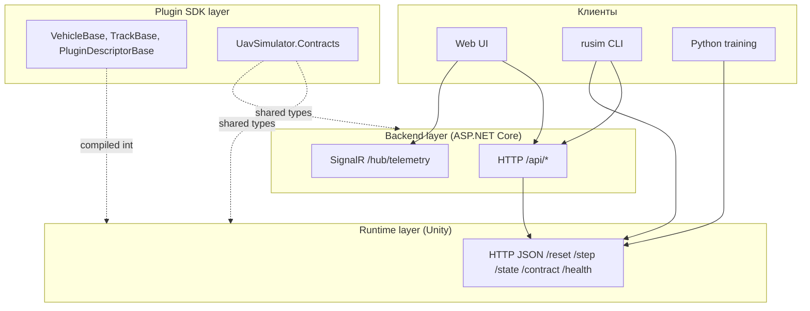

# 6 Спецификация API

## 6.1 Поверхность платформы и слои интеграции

### 6.1.1 Три уровня API: Unity HTTP, backend HTTP/SignalR, plugin SDK

Внешняя поверхность платформы `uav-simulator` распадается на три различных по уровню слоя интеграции, каждый из которых обслуживает собственный сценарий взаимодействия и адресован собственной целевой аудитории. Самый низкий слой — Unity HTTP JSON API, реализованный сервером `HttpJsonSimulatorApiServer` (см. [src/UnityProject/uav-simulator/Assets/Scripts/Api/HttpJsonSimulatorApiServer.cs](../../src/UnityProject/uav-simulator/Assets/Scripts/Api/HttpJsonSimulatorApiServer.cs)) — фиксирует контракт между runtime-ом симулятора и любым его клиентом, будь то операторский backend, тренировочный скрипт на Python или инженерная утилита `rusim`. Этот слой работает с понятиями физической симуляции напрямую — `reset`, `step`, `state`, `frame` — и не несёт операторской семантики (сессии, журналы, реестр моделей). Второй слой — backend на `ASP.NET Core` (см. [src/ks0223-web-mac/backend/Program.cs](../../src/ks0223-web-mac/backend/Program.cs)) — поднимается над runtime и вводит понятия пользовательской сессии, активного клиента, активной модели и записанного демо. Backend выступает единственным транспортом для веб-интерфейса и одновременно публикует семантически совместимый интерфейс над двумя различными подложками — симулятором и физическим роботом. Третий слой — plugin SDK — представляет собой `.NET`-библиотеку (`packages/com.uav-simulator.plugin-sdk/Runtime/`), которая компилируется в плагин и определяет внутреннюю поверхность расширяемости платформы.

Различие между тремя слоями отражает различные временные горизонты обращения: к Unity HTTP API обращается training loop с частотой до 30 Hz, к backend — оператор в темпе человеческого взаимодействия, к plugin SDK — разработчик плагина однократно при сборке. Это различие диктует и стиль контрактов: на runtime-уровне применяется минимальный набор маршрутов с компактными DTO без вложенных метаданных; на backend-уровне маршрутов на порядок больше и они обогащены диагностикой, журналом и информацией о привязках; на SDK-уровне поверхность задана не маршрутами, а наследованием от абстрактных базовых классов и набором атрибутов на полях `ScriptableObject`-дескрипторов.

Рисунок 6.1 — Три слоя API платформы и направления обращений между ними.

### 6.1.2 Контракты как точка единственной истины

Все три слоя делят между собой набор сериализуемых типов данных, объявленных в namespace `UavSimulator.Contracts` (см. [src/UnityProject/uav-simulator/Assets/Scripts/Contracts/SimulatorContracts.cs](../../src/UnityProject/uav-simulator/Assets/Scripts/Contracts/SimulatorContracts.cs)) и продублированных в plugin SDK как [packages/com.uav-simulator.plugin-sdk/Runtime/SimulatorContracts.cs](../../packages/com.uav-simulator.plugin-sdk/Runtime/SimulatorContracts.cs). Именно эти типы — `ControlCommand`, `VehicleState`, `CameraFrame`, `SimulationConfig`, `StepResult`, `DeviceContractDescriptor` — образуют единственный источник истины для платформы. Любое изменение поля в этих типах автоматически попадает в публичную поверхность runtime, в backend через клиентский `JsonSerializer`, в плагин через прямое использование класса и в Python через JSON-десериализацию ответа сервера.

Такой подход избран сознательно как альтернатива двум распространённым практикам — генерации DTO из OpenAPI-описания и ручному поддержанию параллельных моделей на каждом языке. Генерация из OpenAPI вносит в проект промежуточный артефакт, который требует отдельного конвейера и постоянно отстаёт от изменений; ручное поддержание двойников приводит к дрейфу контрактов и тонким несовместимостям, которые проявляются только во время выполнения. Унификация на одной C#-модели возможна постольку, поскольку и runtime, и backend, и SDK — это `.NET`-проекты, а Python-клиент работает с JSON в виде словарей и не нуждается в типизированных моделях вне исследовательского цикла.

### 6.1.3 Версионирование API

Версионирование API организовано на двух различных уровнях. Уровень runtime-контракта обозначается строковым полем `contractVersion` в дескрипторе `SimulatorContractDescriptor` ([SimulatorContracts.cs:192](../../src/UnityProject/uav-simulator/Assets/Scripts/Contracts/SimulatorContracts.cs)) и читается клиентами при инициализации соединения через `GET /contract`. Это глобальная версия поверхности симулятора, изменяемая при структурном обновлении DTO или поведения базовых маршрутов. Уровень контрактов плагинов обозначается отдельной структурой `ContractVersion` ([ContractVersion.cs](../../packages/com.uav-simulator.plugin-sdk/Runtime/ContractVersion.cs)) с тремя целочисленными полями `major`, `minor`, `patch` и реализацией `IComparable<ContractVersion>` для сравнения. Тип используется в `PluginDescriptorBase.version` и описывает версию конкретного робота или трассы, а не платформы в целом.

Семантика семантического версионирования соблюдается явно. Несовместимое изменение порождает увеличение `major` и в случае плагина — новый идентификатор с суффиксом `.vN+1` (например, `vehicle.ks0223.v2`); это позволяет двум версиям одного и того же плагина сосуществовать в реестре одновременно. Совместимое расширение увеличивает `minor`; исправление поведения без изменения поверхности — `patch`. На уровне runtime API соответствующая стратегия описана в разделе 6.6 настоящей главы.

## 6.2 Unity HTTP JSON API

(в работе)

## 6.3 Транспортные DTO

(в работе)

## 6.4 Backend HTTP API и SignalR

(в работе)

## 6.5 Plugin SDK API (краткий обзор)

(в работе)

## 6.6 Стабильность и совместимость API

(в работе)

## 6.7 Примеры взаимодействия

(в работе)
