# 7. Разработка плагинов

## 7.1. Концепция плагинной архитектуры

Симулятор позиционируется как платформа для исследования sim-to-real задач на роботах класса KS0223 и схожих по уровню сложности устройствах. Это означает, что состав поддерживаемых роботов, трасс и тестовых сред заведомо не известен на этапе проектирования ядра: каждое новое исследование может потребовать собственный робот с уникальной геометрией и набором датчиков, либо специализированную трассу под задачу навигации, обхода препятствий или maze-поиска. Если бы ядро runtime содержало hard-coded список роботов и сцен, любое такое расширение требовало бы пересборки и переустановки runtime у конечного пользователя — что несовместимо с целевыми сценариями работы платформы.

Плагинная архитектура снимает это ограничение и формализует две независимые роли. Ядро (Unity runtime + backend + Web UI) поддерживает стабильные транспортные контракты, lifecycle симуляции и API наблюдений; разработчик плагина добавляет новый робот или трассу, не модифицируя исходный код ядра и не пересобирая бинарники. Такое разделение также изолирует research-код от production: экспериментальные конфигурации роботов, нестандартные трассы и временные сцены живут в отдельных плагинах и не загромождают основную кодовую базу.

В основу выбранного подхода положены три принципа. Во-первых, контракты устройств (`DeviceContractDescriptor`) являются единственным источником истины: они описывают ID и схемы всех датчиков и каналов управления, которые робот предоставляет training-коду. Во-вторых, сам плагин описывается как данные — `ScriptableObject`-дескрипторы (`VehiclePluginDescriptor`, `TrackPluginDescriptor`), что позволяет редактировать и валидировать плагины в Unity Editor без написания дополнительного boilerplate-кода. В-третьих, для конечного пользователя установка плагина не требует написания ни одной строки кода — достаточно команды `rusim plugin install`.

Среди альтернатив рассматривались hard-coded подход (минимальная гибкость, требует пересборки runtime), DLL hot-reload (даёт максимум гибкости, но создаёт значительные риски совместимости версий Unity и нестабильность исполнения), и descriptor-based подход на базе `ScriptableObject` и архивного формата. Последний выбран как наиболее предсказуемый: контракты явные, схема архива фиксированная, валидация выполняется на этапе экспорта, а совместимость версий проверяется по полю `compatibleRuntime` в manifest.

## 7.2. Типы плагинов и точки расширения

Текущая версия Plugin SDK поддерживает два типа плагинов: vehicle (новый робот) и track (новая трасса или тестовая сцена). Оба типа описываются дескриптором — `ScriptableObject`-наследником `PluginDescriptorBase`, к которому привязан Unity-префаб с готовой иерархией компонентов.

**Vehicle plugin** описывается классом `VehiclePluginDescriptor` и содержит две сущности: `prefab` (Unity GameObject с физикой, моделью робота и навешенными сенсорами) и `deviceContract` (`DeviceContractDescriptorAsset`), фиксирующий идентификаторы и схемы каналов управления и датчиков. Логика робота описывается наследником абстрактного класса `VehicleBase`. Точки расширения определяются методами этого класса: `ApplyControl(ControlCommand command)` принимает управляющую команду от training-цикла или autopilot и применяет её к физике робота; `ReadState()` возвращает структуру `VehicleState` с pose, скоростями и временной меткой; `TryReadCameraFrame(out CameraFrame frame)` выдаёт кадр с навешенной на робот камеры (если она есть); `ApplyVehicleConfig(ConfigKeyValue[] vehicleParams)` принимает параметры из сценария или domain randomization-конфигурации; `SetPeerVisibility(bool visible)` управляет видимостью робота в multi-agent сценариях; `ResetVehicle(int seed)` сбрасывает робот в начальное состояние с заданным seed для воспроизводимости.

**Track plugin** описывается классом `TrackPluginDescriptor` и содержит `prefab` сцены и поле `parametersSchemaJson` — JSON-схему параметров трассы, которые могут задаваться сценарием при reset (например, размеры арены, расстановка препятствий, тип покрытия). Логика трассы наследуется от `TrackBase` с единственной точкой расширения — `ResetTrack(int seed)`, выполняющей рандомизацию или восстановление детерминированного состояния трассы по seed.

Lifecycle плагина от автора до запуска в runtime:

```mermaid
flowchart LR
    Author["Plugin Author"] --> Editor["Unity Editor + SDK"]
    Editor --> Validate["Validate Plugins"]
    Validate --> Export["Export Plugin (.zip)"]
    Export --> Archive[".rusim-plugin.zip"]
    Archive --> Install["rusim plugin install"]
    Install --> Registry["PluginRegistryAsset"]
    Registry --> Spawn["SimulationManager spawn"]
```

Out-of-scope для текущей версии SDK сознательно оставлены три типа расширений. Physics plugins (альтернативные физические движки или существенные модификации физики) не поддерживаются: ядро использует встроенный физический контур Unity, и его подмена в рамках descriptor-based подхода невозможна без DLL hot-reload. Sensor plugins как самостоятельная сущность отсутствуют — добавление нового сенсора выполняется в составе vehicle plugin через `DeviceContractDescriptor` и компоненты на префабе. Reward plugins не входят в Unity-сторону платформы: функция награды относится к training pipeline и реализуется на стороне Python (`stable-baselines3` callbacks и обёртки среды).

## 7.3. Plugin SDK: API и базовые классы
### 7.3.1. PluginDescriptorBase
### 7.3.2. VehiclePluginDescriptor + VehicleBase
### 7.3.3. TrackPluginDescriptor + TrackBase
### 7.3.4. DeviceContractDescriptor
### 7.3.5. ContractVersion и совместимость
### 7.3.6. PluginRegistryAsset

## 7.4. Worked example: vehicle plugin (vehicle.arcade.green.v1)
### 7.4.1. Создание Unity-проекта плагина
### 7.4.2. Подключение SDK как Unity Package
### 7.4.3. Создание префаба и наследника VehicleBase
### 7.4.4. Создание VehiclePluginDescriptor + DeviceContract
### 7.4.5. Validate + Export
### 7.4.6. Установка в runtime через rusim CLI

## 7.5. Worked example: track plugin (track.city_demo.v1)
### 7.5.1. Префаб трассы и наследник TrackBase
### 7.5.2. ParametersSchemaJson — параметризация трассы
### 7.5.3. Validate + Export + Install

## 7.6. Распространение плагинов: формат архива и CLI
### 7.6.1. Структура .rusim-plugin.zip
### 7.6.2. CLI: rusim plugin install/list/remove/new
### 7.6.3. Регистрация в PluginRegistryAsset

## 7.7. Версионирование и совместимость
### 7.7.1. ContractVersion: semver для контрактов
### 7.7.2. compatibleRuntime в manifest.json
### 7.7.3. Стратегия breaking changes

## 7.8. Заключение
