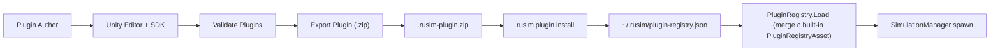

# 7. Разработка плагинов

## 7.1. Концепция плагинной архитектуры

Симулятор позиционируется как платформа для исследования sim-to-real задач на роботах класса KS0223 и схожих по уровню сложности устройствах. Это означает, что состав поддерживаемых роботов, трасс и тестовых сред заведомо не известен на этапе проектирования ядра: каждое новое исследование может потребовать собственный робот с уникальной геометрией и набором датчиков, либо специализированную трассу под задачу навигации, обхода препятствий или maze-поиска. Если бы ядро runtime содержало hard-coded список роботов и сцен, любое такое расширение требовало бы пересборки и переустановки runtime у конечного пользователя — что несовместимо с целевыми сценариями работы платформы.

Плагинная архитектура снимает это ограничение и формализует две независимые роли. Ядро (Unity runtime + backend + Web UI) поддерживает стабильные транспортные контракты, lifecycle симуляции и API наблюдений; разработчик плагина добавляет новый робот или трассу, не модифицируя исходный код ядра и не пересобирая бинарники. Такое разделение также изолирует research-код от production: экспериментальные конфигурации роботов, нестандартные трассы и временные сцены живут в отдельных плагинах и не загромождают основную кодовую базу.

В основу выбранного подхода положены три принципа. Во-первых, контракты устройств (`DeviceContractDescriptor`) являются единственным источником истины: они описывают ID и схемы всех датчиков и каналов управления, которые робот предоставляет training-коду. Во-вторых, сам плагин описывается как данные — `ScriptableObject`-дескрипторы (`VehiclePluginDescriptor`, `TrackPluginDescriptor`), что позволяет редактировать и валидировать плагины в Unity Editor без написания дополнительного boilerplate-кода. В-третьих, для конечного пользователя установка плагина не требует написания ни одной строки кода — достаточно команды `rusim plugin install`.

Среди альтернатив рассматривались hard-coded подход (минимальная гибкость, требует пересборки runtime), DLL hot-reload (даёт максимум гибкости, но создаёт значительные риски совместимости версий Unity и нестабильность исполнения), и descriptor-based подход на базе `ScriptableObject` и архивного формата. Последний выбран как наиболее предсказуемый: контракты явные, схема архива фиксированная, валидация выполняется на этапе экспорта, а совместимость версий проверяется по полю `compatibleRuntime` в manifest.

## 7.2. Типы плагинов и точки расширения

Текущая версия Plugin SDK поддерживает два типа плагинов: vehicle (новый робот) и track (новая трасса или тестовая сцена). Оба типа описываются дескриптором — `ScriptableObject`-наследником `PluginDescriptorBase`, к которому привязан Unity-префаб с готовой иерархией компонентов.

**Vehicle plugin** описывается классом `VehiclePluginDescriptor` и содержит две сущности: `prefab` (Unity GameObject с физикой, моделью робота и навешенными сенсорами) и `deviceContract` (`DeviceContractDescriptorAsset`), фиксирующий идентификаторы и схемы каналов управления и датчиков. Логика робота описывается наследником абстрактного класса `VehicleBase`. Точки расширения определяются методами этого класса: `ApplyControl(ControlCommand command)` принимает управляющую команду от training-цикла или autopilot и применяет её к физике робота; `ReadState()` возвращает структуру `VehicleState` с pose, скоростями и временной меткой; `TryReadCameraFrame(out CameraFrame frame)` выдаёт кадр с навешенной на робот камеры (если она есть); `ApplyVehicleConfig(ConfigKeyValue[] vehicleParams)` принимает параметры из сценария или domain randomization-конфигурации; `SetPeerVisibility(bool visible)` управляет видимостью робота в multi-agent сценариях; `ResetVehicle(int seed)` сбрасывает робот в начальное состояние с заданным seed для воспроизводимости.

**Track plugin** описывается классом `TrackPluginDescriptor` и содержит `prefab` сцены и поле `parametersSchemaJson` — JSON-схему параметров трассы, которые могут задаваться сценарием при reset (например, размеры арены, расстановка препятствий, тип покрытия). Логика трассы наследуется от `TrackBase` с единственной точкой расширения — `ResetTrack(int seed)`, выполняющей рандомизацию или восстановление детерминированного состояния трассы по seed.

Lifecycle плагина от автора до запуска в runtime:



Out-of-scope для текущей версии SDK сознательно оставлены три типа расширений. Physics plugins (альтернативные физические движки или существенные модификации физики) не поддерживаются: ядро использует встроенный физический контур Unity, и его подмена в рамках descriptor-based подхода невозможна без DLL hot-reload. Sensor plugins как самостоятельная сущность отсутствуют — добавление нового сенсора выполняется в составе vehicle plugin через `DeviceContractDescriptor` и компоненты на префабе. Reward plugins не входят в Unity-сторону платформы: функция награды относится к training pipeline и реализуется на стороне Python (`stable-baselines3` callbacks и обёртки среды).

## 7.3. Plugin SDK: API и базовые классы

### 7.3.1. PluginDescriptorBase

Корнем иерархии дескрипторов плагинов является абстрактный класс `PluginDescriptorBase`. Это `ScriptableObject`, на котором сосредоточена общая для всех типов плагинов идентификационная и версионная информация. Конкретные типы плагинов — `VehiclePluginDescriptor` и `TrackPluginDescriptor` — наследуют от него и добавляют специфичные для типа поля.

```csharp
namespace UavSimulator.Plugins
{
    public abstract class PluginDescriptorBase : ScriptableObject
    {
        public string id;
        public string displayName;
        public ContractVersion version;
        [TextArea] public string description;
    }
}
```

Поле `id` представляет собой уникальный идентификатор плагина и подчиняется конвенции `vehicle.{brand}.{model}.v{major}` для роботов (например, `vehicle.ks0223.v1`) и `track.{name}.v{major}` для трасс (например, `track.cardboard_corridor.v1`). Идентификатор включает мажорную версию контракта непосредственно в имя — это отражает ключевое архитектурное решение: ломающее изменение в контракте устройства порождает новый идентификатор, и старая и новая версии могут сосуществовать в реестре одновременно. Поле `displayName` содержит человекочитаемое имя для UI Editor-а и Web UI; в отличие от `id`, оно не используется в логике сопоставления и может меняться свободно.

Поле `version` имеет тип `ContractVersion` (struct, см. 7.3.5) и описывает полную семантическую версию `major.minor.patch` плагина. Поле `description` помечено атрибутом `[TextArea]`, благодаря чему Unity Editor отображает его как многострочное поле; оно предназначено для краткого описания назначения плагина и попадает в выводимый CLI список установленных плагинов.

### 7.3.2. VehiclePluginDescriptor + VehicleBase

`VehiclePluginDescriptor` — sealed-наследник `PluginDescriptorBase`, добавляющий два поля, специфичных для робота: ссылку на префаб с физикой и моделью и ссылку на `DeviceContractDescriptorAsset` с описанием каналов управления и датчиков.

```csharp
namespace UavSimulator.Plugins
{
    [CreateAssetMenu(menuName = "UavSimulator/Plugins/Vehicle Plugin", fileName = "VehiclePlugin")]
    public sealed class VehiclePluginDescriptor : PluginDescriptorBase
    {
        public GameObject prefab;
        public DeviceContractDescriptorAsset deviceContract;
    }
}
```

Поле `prefab` указывает на Unity-префаб, который runtime инстанцирует при каждом reset-е симуляции. Префаб должен содержать корневой `MonoBehaviour`-наследник `VehicleBase` (см. ниже), а также все компоненты, реализующие физику (`Rigidbody`, `WheelCollider`, etc.) и сенсоры (камера, скаляры телеметрии — текущая версия SDK специализирует именно эти типы, см. 7.3.4). Поле `deviceContract` ссылается на `ScriptableObject`-обёртку вокруг `DeviceContractDescriptor` (подробнее в 7.3.4), фиксирующую идентификаторы и схемы сенсоров и актуаторов в machine-readable форме. Эта связка необходима для валидации плагина на этапе загрузки: runtime сравнивает каналы, объявленные в контракте, с реальной конфигурацией префаба и со сценарием обучения.

Логика робота описывается классом `VehicleBase` — абстрактным `MonoBehaviour`, который автор плагина должен унаследовать в собственном компоненте на префабе:

```csharp
namespace UavSimulator.Vehicles
{
    public abstract class VehicleBase : MonoBehaviour
    {
        public const int PeerVehicleLayer = 30;

        [SerializeField] private string vehicleId;
        public string VehicleId => vehicleId;

        public abstract void ApplyControl(ControlCommand command);

        public virtual VehicleState ReadState() { /* default: pose-only state */ }

        public virtual bool TryReadCameraFrame(out CameraFrame frame)
        {
            frame = null;
            return false;
        }

        public virtual void ApplyVehicleConfig(ConfigKeyValue[] vehicleParams) { }
        public virtual void SetPeerVisibility(bool visible) { }
        public virtual void ResetVehicle(int seed) { }
    }
}
```

Распределение между `abstract` и `virtual` методами не случайно. Метод `ApplyControl(ControlCommand command)` — единственный, помеченный как `abstract`, и его реализация обязательна для любого плагина: без неё робот физически не сможет реагировать на команды training-цикла или на ручное управление. Все остальные точки расширения объявлены `virtual` с осмысленными значениями по умолчанию, что позволяет автору плагина реализовывать только то, что действительно требуется для конкретного робота.

`ReadState()` по умолчанию возвращает позу из `transform` без скоростей и телеметрии; для роботов, у которых есть `Rigidbody`, осмысленно переопределить его и заполнить `linearVelocity`, `angularVelocity`, `speed` и опциональный массив `telemetry`. `TryReadCameraFrame(out CameraFrame frame)` по умолчанию возвращает `false` — это корректное поведение для робота без камеры; если камера на префабе есть, переопределение должно отрендерить кадр с её `Camera`-компонента и упаковать его в `CameraFrame`. `ApplyVehicleConfig(ConfigKeyValue[] vehicleParams)` принимает список ключ-значение из YAML-сценария или из конфигурации domain randomization (масса, трение, максимальная скорость) и должно применить их к компонентам на префабе. `SetPeerVisibility(bool visible)` управляет видимостью робота из observation-камер других агентов и используется в multi-agent сценариях; для single-agent плагинов значение по умолчанию (no-op) является правильным поведением. `ResetVehicle(int seed)` вызывается при reset-е эпизода и должен привести робот в детерминированно-определённое начальное состояние, используя переданный seed для воспроизводимости стохастических элементов (например, начального угла поворота).

В качестве иллюстрации `ApplyControl` для дифференциального привода (как у KS0223) псевдокод выглядит следующим образом:

```csharp
public override void ApplyControl(ControlCommand command)
{
    var throttle = Mathf.Clamp(command.throttle, -1f, 1f);
    var steer = Mathf.Clamp(command.steer, -1f, 1f);

    var leftMotor = throttle - steer;
    var rightMotor = throttle + steer;

    leftWheelCollider.motorTorque = leftMotor * maxTorque;
    rightWheelCollider.motorTorque = rightMotor * maxTorque;
    leftWheelCollider.brakeTorque = command.brake * maxBrakeTorque;
    rightWheelCollider.brakeTorque = command.brake * maxBrakeTorque;
}
```

В отличие от ackermann-привода, отдельного канала рулевого угла здесь нет: разворот достигается дифференциалом моментов на левом и правом колёсах. Канал `brake` обрабатывается симметрично на обоих колёсах.

### 7.3.3. TrackPluginDescriptor + TrackBase

`TrackPluginDescriptor` устроен проще, чем `VehiclePluginDescriptor`: у трассы нет device contract, поскольку она пассивна — не имеет ни сенсоров, ни актуаторов. Описание сводится к ссылке на префаб сцены и JSON-схеме параметров.

```csharp
namespace UavSimulator.Plugins
{
    [CreateAssetMenu(menuName = "UavSimulator/Plugins/Track Plugin", fileName = "TrackPlugin")]
    public sealed class TrackPluginDescriptor : PluginDescriptorBase
    {
        public GameObject prefab;
        [TextArea] public string parametersSchemaJson;
    }
}
```

Поле `prefab` ссылается на префаб сцены — иерархию игровых объектов, описывающих геометрию трассы, освещение и точки спавна. Поле `parametersSchemaJson` хранит JSON Schema (как строку), описывающую параметры, которые сценарий обучения может задать при reset-е трассы. Схема нужна для документирования и валидации: runtime проверяет параметры из YAML-сценария на соответствие схеме перед передачей их в `ResetTrack`.

Логика трассы наследуется от `TrackBase`:

```csharp
namespace UavSimulator.Tracks
{
    public abstract class TrackBase : MonoBehaviour
    {
        [SerializeField] private string trackId;
        public string TrackId => trackId;

        public virtual void ResetTrack(int seed) { }
    }
}
```

Единственная точка расширения `ResetTrack(int seed)` объявлена `virtual` с no-op реализацией по умолчанию: для статической трассы без рандомизации этого достаточно. Для трасс с процедурными элементами (расположение препятствий, текстура пола, размеры арены) переопределение должно использовать `seed` как источник псевдослучайности, гарантируя воспроизводимость эпизода между запусками с одинаковым seed-ом.

Параметризация на практике выглядит так. Для трассы `track.cardboard_corridor.v1` JSON Schema может объявлять три параметра — длину коридора, его ширину и идентификатор текстуры пола:

```json
{
  "type": "object",
  "properties": {
    "length":        { "type": "number", "minimum": 1.0,  "maximum": 20.0 },
    "width":         { "type": "number", "minimum": 0.3,  "maximum": 2.0  },
    "floor_texture": { "type": "string", "enum": ["plywood", "carpet", "tile"] }
  },
  "required": ["length", "width"]
}
```

Сценарий обучения передаёт конкретные значения этих параметров в `ResetTrack` через механизм `ConfigKeyValue` (тот же тип, что и в `VehicleBase.ApplyVehicleConfig`); реализация `ResetTrack` ответственна за их применение к геометрии префаба.

### 7.3.4. DeviceContractDescriptor

`DeviceContractDescriptor` — это POCO data class (помечен `[Serializable]`), описывающий полный контракт устройства: его идентификатор, тип, набор сенсоров, набор актуаторов и опциональные JSON Schema для observation- и action-пространств training-стороны. В Plugin SDK он живёт в одном файле с описаниями сенсоров и актуаторов:

```csharp
namespace UavSimulator.Contracts
{
    [Serializable]
    public sealed class SensorDescriptor
    {
        public string id;
        public string sensorType;
        public string format;
        public string unit;

        public int[] shape;
        public float rateHz;
    }

    [Serializable]
    public sealed class ActuatorDescriptor
    {
        public string id;
        public string actuatorType;
        public string unit;

        public float min;
        public float max;
    }

    [Serializable]
    public sealed class DeviceContractDescriptor
    {
        public string deviceId;
        public string deviceType;

        public SensorDescriptor[] sensors;
        public ActuatorDescriptor[] actuators;

        public string observationSchemaJson;
        public string actionSchemaJson;
    }
}
```

Поле `deviceId` совпадает по семантике с `id` плагина и служит ключом для сопоставления устройств между runtime-ом и training-стороной. Поле `deviceType` фиксирует категорию робота через строковый идентификатор по конвенции snake_case: `ground_robot_differential` для дифференциальных наземных роботов, `quadcopter` для квадрокоптеров и т. п. Эта категория используется training-стороной для выбора подходящего набора обёрток среды и стратегии rollout-а.

Массив `sensors[]` описывает все датчики устройства. Каждый `SensorDescriptor` содержит уникальный `id` (например, `camera`, `speedometer`, `imu`), `sensorType` (классификатор; в текущей версии runtime валидирует и специализированно обрабатывает два значения: `camera` и `scalar`), `format` (кодировка данных: `jpeg_base64`, `float32`, `raw`), `unit` (единица измерения, опционально), форму данных `shape[]` и частоту `rateHz`. Поле `sensorType` в JSON-схеме объявлено open-string, поэтому авторы плагинов формально могут расширять номенклатуру, но runtime в текущей версии не имеет специализированной обработки для типов помимо `camera` и `scalar`. Массив `actuators[]` описывает каналы управления: `id` (`throttle`, `steer`, `brake`), `actuatorType` (как правило `continuous`), единицу измерения и допустимый диапазон `min..max`.

Поля `observationSchemaJson` и `actionSchemaJson` хранят JSON Schema для observation- и action-пространств, передаваемые в training-обёртку среды на стороне Python; в текущих плагинах эти поля часто остаются пустыми, поскольку observation- и action-spaces выводятся непосредственно из `sensors[]` и `actuators[]`.

Здесь критично разделять две сущности. `DeviceContractDescriptor` — это POCO (plain C# data class), пригодный для сериализации в JSON и использования в произвольных контекстах (включая training-сторону). `DeviceContractDescriptorAsset` — это `ScriptableObject`-обёртка вокруг него, добавляющая поле `contractVersion` и пригодная для использования в Unity Editor (это и есть тип поля `deviceContract` в `VehiclePluginDescriptor`):

```csharp
[CreateAssetMenu(menuName = "UavSimulator/Contracts/Device Contract Descriptor", fileName = "DeviceContractDescriptor")]
public sealed class DeviceContractDescriptorAsset : ScriptableObject
{
    public ContractVersion contractVersion;
    public DeviceContractDescriptor descriptor;
}
```

Эти две сущности нельзя путать: одна предназначена для сериализации/межсистемного обмена, другая — для редактирования в Editor.

В качестве справки ниже приведены типы сенсоров, для которых runtime в текущей версии SDK имеет специализированную обработку, выведенные из шаблона плагина (`templates/plugin-vehicle/device-contract.json`) и из реализаций runtime-а:

| sensorType | format                       | shape         | пример rateHz | назначение                                |
| ---------- | ---------------------------- | ------------- | ------------- | ----------------------------------------- |
| `camera`   | `jpeg_base64`, `png`, `raw`  | `[H, W, C]`   | 30            | RGB/Grayscale-кадр с навешенной камеры    |
| `scalar`   | `float32`                    | `[1]`         | 50            | Скалярная телеметрия (скорость, IMU, ...) |

Конкретный пример из шаблона: сенсор `camera` объявляется с `format: jpeg_base64`, `shape: [480, 640, 3]`, `rateHz: 30`, что соответствует RGB-кадру 480×640 при частоте обновления 30 Hz. Для `scalar`-сенсоров `unit` имеет содержательное значение (например, `m/s` для одометрии или `m/s²` для акселерометра), для `camera` оно остаётся пустым.

### 7.3.5. ContractVersion и совместимость

Семантическая версия контрактов и плагинов представлена структурой `ContractVersion`. Это `[Serializable]` value-type, реализующий `IEquatable<ContractVersion>` и `IComparable<ContractVersion>`, что позволяет использовать его в коллекциях и в операторах сравнения:

```csharp
namespace UavSimulator.Contracts
{
    [Serializable]
    public struct ContractVersion : IEquatable<ContractVersion>, IComparable<ContractVersion>
    {
        public int major;
        public int minor;
        public int patch;

        public ContractVersion(int major, int minor, int patch);

        public bool IsValid => major >= 0 && minor >= 0 && patch >= 0;

        public int CompareTo(ContractVersion other);
        public bool Equals(ContractVersion other);
        public override string ToString() => $"{major}.{minor}.{patch}";
        public static bool TryParse(string value, out ContractVersion version);

        public static bool operator ==(ContractVersion left, ContractVersion right);
        public static bool operator !=(ContractVersion left, ContractVersion right);
        public static bool operator  <(ContractVersion left, ContractVersion right);
        public static bool operator  >(ContractVersion left, ContractVersion right);
        public static bool operator <=(ContractVersion left, ContractVersion right);
        public static bool operator >=(ContractVersion left, ContractVersion right);
    }
}
```

Семантика полей соответствует semver: `major` обозначает ломающие изменения контракта, `minor` — обратимо-совместимые расширения, `patch` — исправления, не меняющие интерфейс. Свойство `IsValid` требует неотрицательности всех трёх компонент, что отбраковывает default-значения структуры (`0.0.0` остаётся валидным, но `-1` в любой компоненте — нет).

Сравнение версий определено лексикографически по тройке `(major, minor, patch)` через `CompareTo`, на основе которого реализованы операторы `<`, `>`, `<=`, `>=`, `==` и `!=`. Это позволяет писать выражения совместимости естественно: `pluginVersion >= minRequired && pluginVersion < nextBreaking`.

Метод `TryParse(string value, out ContractVersion version)` парсит строковый формат `"major.minor.patch"` (с обязательными тремя точечно-разделёнными целочисленными компонентами) и возвращает `false` при любом отклонении: пустая строка, неверное число компонент, нечисловые компоненты, отрицательные значения. Этот метод используется при чтении строкового поля `version` из `manifest.json` плагина (конвенция формата manifest и стратегия `compatibleRuntime` обсуждаются в 7.7).

### 7.3.6. Реестры плагинов: PluginRegistryAsset + plugin-registry.json

Архитектура хранения списка плагинов в текущей версии платформы двухуровневая. Это не случайный артефакт, а сознательное разделение по двум измерениям: что зашито в скомпилированный runtime build (built-in плагины) против что устанавливается пользователем в существующий runtime (user-installed плагины), и кто владеет соответствующим состоянием — Unity Editor против CLI.

Первый уровень — `PluginRegistryAsset`, `ScriptableObject`-каталог встроенных плагинов, попадающих в build на этапе компиляции. Структура актива тривиальна:

```csharp
namespace UavSimulator.Plugins
{
    [CreateAssetMenu(menuName = "UavSimulator/Plugins/Registry", fileName = "PluginRegistry")]
    public sealed class PluginRegistryAsset : ScriptableObject
    {
        public VehiclePluginDescriptor[] vehicles;
        public TrackPluginDescriptor[] tracks;
    }
}
```

Канонический путь актива — `Assets/Resources/UavSimulator/PluginRegistry.asset`; его расположение внутри `Resources/`-папки критично, поскольку именно оттуда runtime загружает реестр через `Resources.Load<PluginRegistryAsset>("UavSimulator/PluginRegistry")` (см. `Assets/Scripts/Plugins/PluginRegistry.cs`). Заполнение этого актива выполняется в Unity Editor на этапе разработки runtime-а: автор платформы добавляет ссылки на descriptor-ы тех плагинов, которые должны быть встроены в .exe (на момент текущей итерации это набор демонстрационных vehicle- и track-плагинов, перечисленных в `_BUILTIN_PLUGINS` в CLI: `vehicle.prometeo.sport.v1`, `vehicle.arcade.{blue,red,gray,purple}.v1`, `vehicle.drone.simple.v1`, `track.basic_arena.v1`, `track.roadsystem_arena.v1`, `track.roadsystem_realistic.v2`). После компиляции содержимое этого актива зафиксировано: built-in плагины удалить из конкретного runtime build нельзя — это и есть смысл слова «built-in».

Второй уровень — `~/.rusim/plugin-registry.json`, JSON-реестр пользовательских плагинов, которым владеет CLI и который не зависит от runtime build-а. Этот реестр находится не внутри Unity-проекта, а в пользовательском home-каталоге, рядом с распакованными артефактами (`~/.rusim/plugins/<pluginId>/`). Команда `rusim plugin install <archive.zip>` распаковывает плагин в `~/.rusim/plugins/<pluginId>/` и атомарно дописывает запись в JSON-реестр (`pluginId`, `type`, `displayName`, `version`, `installedFrom`, `installedAt`). Команда `rusim plugin remove` обратна установке: удаляет директорию плагина и стирает запись из JSON. CLI запрещает обе операции для built-in идентификаторов: `Cannot overwrite built-in plugin: <id>` при попытке install/remove — встроенный плагин неприкосновенен.

Команда `rusim plugin list` объединяет оба источника и возвращает плоский список с тегом источника:

```
[built-in]    vehicle.prometeo.sport.v1    PROMETEO Sport Car        1.0.0
[built-in]    vehicle.drone.simple.v1      Simple Quadcopter         1.0.0
...
[user]        vehicle.arcade.green.v1      Arcade Free Racing (Green) 1.0.0
```

Built-in плагины читаются из жёстко закодированного списка `_BUILTIN_PLUGINS` в `python/sim_client/cli.py` (что, по сути, является зеркалом содержимого `PluginRegistryAsset` со стороны клиента); user-плагины — из `~/.rusim/plugin-registry.json`.

Мотивация двухуровневой схемы. Built-in плагины зашиты в build не потому что это удобно, а потому что они являются частью distributable runtime: пользователь скачивает `.exe`, и набор встроенных плагинов уже работает без дополнительных шагов установки. User-плагины же по определению должны быть отделены от build-а — иначе любая установка нового плагина требовала бы пересборки runtime-а в Unity Editor, что противоречит самой идее plugin-системы. JSON-реестр в home-каталоге — простейшая форма mutable state, которой может управлять CLI без участия Unity Editor; descriptor-based подход (с прямыми ссылками на префабы) для user-плагинов реализуется через runtime-загрузку артефактов из `~/.rusim/plugins/<pluginId>/` по записям JSON-реестра, без необходимости открывать Unity Editor для регистрации каждого нового плагина.

## 7.4. Worked example: vehicle plugin (vehicle.arcade.green.v1)

В качестве сквозного примера ниже описывается процедура создания плагина `vehicle.arcade.green.v1` — зелёного варианта существующего arcade-автомобиля. Сам плагин на момент написания главы ещё не создан в репозитории; тутор показывает, как plugin author мог бы его собрать на базе существующих arcade-плагинов (`vehicle.arcade.blue.v1`, `vehicle.arcade.red.v1`) и SDK.

### 7.4.1. Создание Unity-проекта плагина

Для разработки плагина возможны два подхода. Первый — создание отдельного Unity 6 (URP) проекта, целиком посвящённого этому плагину. Такой подход даёт чистое разделение исходного кода плагина от ядра и упрощает дистрибуцию: содержимое проекта целиком переносимо. Недостаток — необходимость дублировать общие assets (материалы, текстуры, dependency-пакеты), а также отсутствие быстрого тестирования в составе симулятора без отдельной сборки runtime. Второй подход — разработка плагина внутри основного uav-simulator проекта, во вложенной директории `Assets/Plugins/<id>/`. Это сокращает цикл итераций (можно сразу запускать сценарий и видеть результат), но стоит понимать, что без явного cleanup плагин не будет переносим в виде самостоятельной поставки. Для production-плагинов рекомендован первый вариант, для прототипирования и встроенных в платформу плагинов — второй.

### 7.4.2. Подключение SDK как Unity Package

Plugin SDK поставляется как Unity Package и подключается стандартным механизмом UPM. В Unity Editor: `Window > Package Manager > + > Add package from git URL` с адресом

```
https://github.com/NMGorovenko/uav-simulator.git?path=packages/com.uav-simulator.plugin-sdk
```

Альтернативно — вручную в `Packages/manifest.json`:

```json
{
  "dependencies": {
    "com.uav-simulator.plugin-sdk": "https://github.com/NMGorovenko/uav-simulator.git?path=packages/com.uav-simulator.plugin-sdk"
  }
}
```

После импорта в Project window появляются пункты меню `Create > UavSimulator/Plugins/Vehicle Plugin`, `Create > UavSimulator/Plugins/Track Plugin` и `Create > UavSimulator/Plugins/Registry`; в меню `Tools` — `UavSimulator > Validate Plugins` и `UavSimulator > Export Plugin (.zip)`. Корректность импорта удобно проверить именно по наличию этих пунктов.

### 7.4.3. Создание префаба и наследника VehicleBase

Для arcade-плагина в качестве отправной точки удобно дублировать префаб существующего `Arcade Blue Car` (он лежит в директории `Assets/ARCADE - FREE Racing Car/`), переименовать его в `ArcadeGreenCar` и заменить материал кузова на зелёный (создать новый material на базе существующего, изменить базовый цвет albedo).

На корневой GameObject префаба необходимо повесить наследник `VehicleBase` — например, компонент `ArcadeGreenController`. В минимальной реализации он переопределяет единственный обязательный (abstract) метод `ApplyControl(ControlCommand command)`, маршрутизируя управляющую команду к существующему PROMETEO car controller на префабе:

```csharp
public class ArcadeGreenController : VehicleBase
{
    [SerializeField] private CarController carController; // PROMETEO

    public override void ApplyControl(ControlCommand cmd)
    {
        carController.SetExternalControl(
            throttle: cmd.throttle,
            steer: cmd.steer,
            brake: cmd.brake);
    }

    public override void ResetVehicle(int seed)
    {
        // teleport to spawn pose, zero velocities, reset PROMETEO state
    }
}
```

Псевдокод выше иллюстрирует общий принцип; конкретный API контроллера зависит от выбранной модели — для arcade-плагинов в текущем репозитории используется PROMETEO car controller (см. `Assets/PROMETEO - Car Controller/`), и точная сигнатура `SetExternalControl` определяется его реализацией. Остальные методы `VehicleBase` (`ReadState`, `TryReadCameraFrame`, `ApplyVehicleConfig`, `SetPeerVisibility`, `ResetVehicle`) объявлены как `virtual` и имеют sensible defaults (см. 7.3.2); переопределять их следует только при необходимости — например, override `TryReadCameraFrame` нужен, если плагин предоставляет камеру как сенсор.

### 7.4.4. Создание VehiclePluginDescriptor + DeviceContract

В Project window выбрать `Create > UavSimulator/Plugins/Vehicle Plugin` — создаётся ScriptableObject-asset, который удобно сохранить как `VehicleArcadeGreen.asset` в директории плагина. В Inspector необходимо заполнить поля дескриптора: `id` = `vehicle.arcade.green.v1`, `displayName` = `Arcade Green`, `version` = `{ major: 1, minor: 0, patch: 0 }`, `description` — краткое описание назначения. В поле `prefab` через drag-n-drop кладётся ссылка на созданный в 7.4.3 префаб.

Далее создаётся `DeviceContractDescriptorAsset` (`Create > UavSimulator/Plugins/Device Contract`), описывающий интерфейс робота. В нём заполняются `descriptor.deviceId` (значение совпадает с `pluginId` плагина), `descriptor.deviceType` (например, `ground_robot_differential`), массив `sensors` (камера 640×480 RGB jpeg @ 30 Hz, плюс скаляр скорости в `m/s` @ 50 Hz) и массив `actuators` (`throttle` continuous `[-1, 1]`, `steer` continuous `[-1, 1]`, `brake` continuous `[0, 1]`). Готовый contract drag-n-drop'ом подключается в поле `deviceContract` дескриптора плагина.

Здесь стоит явно различать две сущности: `DeviceContractDescriptor` — POCO data-класс из `SimulatorContracts.cs` (см. 7.3.4), описывающий собственно контракт; `DeviceContractDescriptorAsset` — ScriptableObject-обёртка над ним, нужная для редактирования в Editor. В архив плагина при экспорте сериализуется именно содержимое POCO, а не ScriptableObject-обёртка.

### 7.4.5. Validate + Export

После заполнения descriptors нужно проверить корректность плагина: `Tools > UavSimulator > Validate Plugins`. Утилита (см. `PluginValidator.cs`) находит все ассеты типов `VehiclePluginDescriptor` и `TrackPluginDescriptor` в проекте и проверяет инварианты. Для vehicle plugin: `id` не пустой, `displayName` не пустой, `version.IsValid`, `prefab` не равен `null`, `deviceContract` не `null`, его внутренний `descriptor` не `null`, массив `sensors` не пуст, массив `actuators` не пуст. Все обнаруженные нарушения выводятся в Console как `LogWarning` и в итоговый dialog с подсчётом валидных и проблемных плагинов.

Когда Validate проходит чисто, descriptor выделяется в Project window и запускается `Tools > UavSimulator > Export Plugin (.zip)`. Утилита (`PluginExporter.cs`) показывает диалог сохранения с предложенным именем файла `<pluginId>.rusim-plugin.zip` и собирает архив следующего состава: `manifest.json` (поля `pluginId`, `type`, `displayName`, `version`, `compatibleRuntime` со значением `>=0.2.0`, `author`), `descriptor.json` (сериализованный `VehiclePluginDescriptor`), `device-contract.json` (сериализованный `DeviceContractDescriptor` — только для vehicle), `README.md` (auto-generated с инструкцией по установке). Если в Project window не выделен ни один descriptor, утилита возвращает диалог с ошибкой `No asset selected`.

### 7.4.6. Установка в runtime через rusim CLI

Готовый архив устанавливается на target-машине одной командой:

```bash
rusim plugin install vehicle.arcade.green.v1.rusim-plugin.zip
```

Команда (см. `_plugin_install` в `python/sim_client/cli.py`) распаковывает архив в `~/.rusim/plugins/vehicle.arcade.green.v1/`, валидирует `manifest.json` на обязательные поля (`pluginId`, `type`, `displayName`, `version`) и регистрирует плагин в `~/.rusim/plugin-registry.json`. Built-in плагины перезаписать нельзя — попытка установить плагин с тем же `pluginId`, что у одного из встроенных, отклоняется с сообщением `Cannot overwrite built-in plugin`.

Проверить установку можно командой `rusim plugin list` — установленный плагин появится с тегом source `[user]` (в отличие от тега `[built-in]` у плагинов, зашитых в build). После этого плагин доступен в YAML-сценариях как `vehicle.vehicleId: vehicle.arcade.green.v1` либо в массиве `agents.vehicles[]`. Для удаления используется команда `rusim plugin remove vehicle.arcade.green.v1` — она удаляет директорию плагина и убирает запись из реестра.

## 7.5. Worked example: track plugin (track.city_demo.v1)

Параллельно с vehicle-плагином в качестве сквозного примера track-плагина рассматривается `track.city_demo.v1` — городская сцена с улицами, перекрёстками и светофорами, на которой запускается arcade-машина из 7.4. Сам плагин также ещё не существует в репозитории; данная секция показывает authoring workflow на минимальном примере, оставляя интеграцию city-asset'а и логики светофоров за рамками туториала.

### 7.5.1. Префаб трассы и наследник TrackBase

Track plugin состоит из одного префаба сцены и его описания. В новой сцене создаётся root GameObject (например, `CityDemoTrack`), на который вешается наследник `TrackBase` — компонент `CityDemoTrack : TrackBase`. У `TrackBase` единственная точка расширения — метод `ResetTrack(int seed)`, переопределяемый при необходимости рандомизации или восстановления детерминированного состояния трассы.

```csharp
public class CityDemoTrack : TrackBase
{
    [SerializeField] private TrafficLightController[] trafficLights;
    [SerializeField] private NpcTrafficSpawner npcSpawner;

    public override void ResetTrack(int seed)
    {
        var rng = new System.Random(seed);
        foreach (var tl in trafficLights) tl.ResetCycle(rng.Next());
        npcSpawner.RespawnAll(rng.Next());
    }
}
```

Дочерние объекты префаба содержат непосредственно содержимое сцены: ground-меши, дома, дорожные сегменты, точки спавна и префабы светофоров. Готовая иерархия сохраняется как prefab — он подключается в дескриптор как `prefab` (см. 7.5.3). В отличие от vehicle, track не требует `DeviceContractDescriptor`: трасса пассивна и не предоставляет каналов observation/action, поэтому SDK для track-плагинов проще.

### 7.5.2. ParametersSchemaJson — параметризация трассы

Поле `parametersSchemaJson` дескриптора `TrackPluginDescriptor` хранит JSON Schema, описывающую параметры, которые YAML-сценарий может передавать трассе при reset через `world.params`. Поле необязательно, но настоятельно рекомендуется к заполнению: схема является контрактом между автором плагина и автором сценария, и её наличие позволяет валидировать конфигурации до запуска симуляции.

Пример schema для city demo:

```json
{
  "$schema": "https://json-schema.org/draft/2020-12/schema",
  "type": "object",
  "properties": {
    "traffic.density": { "type": "string", "enum": ["low", "medium", "high"] },
    "time_of_day":     { "type": "string", "enum": ["day", "dusk", "night"] },
    "weather":         { "type": "string", "enum": ["clear", "rain", "fog"] }
  }
}
```

В YAML-сценарии параметры передаются как обычные key-value пары:

```yaml
world:
  trackId: track.city_demo.v1
  params:
    traffic.density: medium
    time_of_day: day
    weather: clear
```

Consumer'ом параметров на стороне Unity является сам автор плагина: в текущей версии SDK runtime передаёт массив `ConfigKeyValue[]` в lifecycle-хуки трассы, а как именно эти значения интерпретируются — определяет реализация `ResetTrack` или вспомогательных компонентов на префабе. Валидация значений против schema выполняется до запуска сценария: в Editor — утилитой `Validate Plugins` (синтаксическая корректность JSON, см. 7.5.3), на runtime — при загрузке сценария в backend.

### 7.5.3. Validate + Export + Install

В Project window выбирается `Create > UavSimulator/Plugins/Track Plugin` — создаётся `CityDemoTrackDescriptor.asset`. В Inspector заполняются: `id` = `track.city_demo.v1`, `displayName` = `City Demo`, `version` = `{ major: 1, minor: 0, patch: 0 }`, `prefab` (drag-n-drop), `parametersSchemaJson` (paste из 7.5.2). `Tools > UavSimulator > Validate Plugins` для track-плагинов проверяет: `id` непустой, `displayName` непустой, `version.IsValid`, `prefab` не `null`, и если `parametersSchemaJson` непустая строка — что она парсится как JSON. Поле `deviceContract` для track не существует и не проверяется.

После прохождения Validate плагин экспортируется через `Tools > UavSimulator > Export Plugin (.zip)`. Архив `track.city_demo.v1.rusim-plugin.zip` имеет ту же структуру, что и vehicle-архив, но без `device-contract.json`: `manifest.json` (с `type` = `track`), `descriptor.json`, `README.md`. Установка идентична vehicle-плагину: `rusim plugin install track.city_demo.v1.rusim-plugin.zip`, после чего трасса доступна в YAML как `world.trackId: track.city_demo.v1`.

## 7.6. Распространение плагинов: формат архива и CLI

### 7.6.1. Структура .rusim-plugin.zip

Готовый плагин распространяется как ZIP-архив с фиксированной структурой, генерируемой утилитой `PluginExporter` (см. 7.4.5). Имя архива по конвенции совпадает с pluginId и оканчивается на `.rusim-plugin.zip` — например, `vehicle.arcade.green.v1.rusim-plugin.zip`. На верхнем уровне архива четыре файла:

```
manifest.json          — метаданные плагина (pluginId, type, version, compatibleRuntime, author)
descriptor.json        — сериализованный VehiclePluginDescriptor или TrackPluginDescriptor
device-contract.json   — сериализованный DeviceContractDescriptor (только для vehicle-плагинов)
README.md              — auto-generated PluginExporter'ом инструкция по установке
```

Пример `manifest.json` (формат соответствует шаблону в `templates/plugin-vehicle/manifest.json`):

```json
{
  "pluginId": "vehicle.arcade.green.v1",
  "type": "vehicle",
  "displayName": "Arcade Green",
  "version": "1.0.0",
  "compatibleRuntime": ">=0.2.0",
  "author": ""
}
```

Поле `compatibleRuntime` использует синтаксис ограничений в стиле npm/pip и трактуется как минимальная версия runtime, с которой плагин совместим (подробнее в 7.7.2). Все четыре файла лежат в корне архива без дополнительных директорий — это упрощает inspection через стандартные ZIP-утилиты и явно фиксирует формат на уровне SDK.

### 7.6.2. CLI: rusim plugin install/list/remove/new

Подсистема `rusim plugin` предоставляет четыре команды:

| Команда | Назначение |
|---|---|
| `rusim plugin new --type {vehicle\|track} <id>` | Скопировать template из `templates/plugin-{vehicle\|track}/`, заменить плейсхолдеры (`{{PLUGIN_ID}}`, `{{DISPLAY_NAME}}`, `{{DESCRIPTION}}`, `{{AUTHOR}}`) и создать каркас проекта плагина в `--output-dir/<id>/` |
| `rusim plugin install <archive>` | Распаковать `.rusim-plugin.zip` в `~/.rusim/plugins/<id>/`, провалидировать manifest, добавить запись в `~/.rusim/plugin-registry.json` |
| `rusim plugin list [--json]` | Вывести объединённый список всех плагинов (built-in из `_BUILTIN_PLUGINS` в CLI + user-installed из JSON-реестра) с тегом источника |
| `rusim plugin remove <id>` | Удалить директорию плагина и убрать запись из реестра; built-in плагины удалить нельзя — попытка завершается ошибкой `Cannot remove built-in plugin` |

Пример вывода `rusim plugin list` (текстовый режим):

```
  [built-in]   vehicle.prometeo.sport.v1                PROMETEO Sport Car                  1.0.0
  [built-in]   vehicle.arcade.blue.v1                   Arcade Free Racing Car (Blue)       1.0.0
  ...
  [user]       vehicle.arcade.green.v1                  Arcade Green                        1.0.0
```

Команды `install` и `remove` дополнительно возвращают JSON-отчёт со статусом операции на stdout — это упрощает встраивание `rusim plugin` в CI/CD-пайплайны и автоматизированные тесты совместимости.

### 7.6.3. Регистрация в plugin-registry.json и merge с built-in PluginRegistryAsset

Поведение `rusim plugin install` детально разобрано в 7.3.6. Кратко: команда не модифицирует Unity-asset `PluginRegistry.asset`, который содержит исключительно built-in плагины и компилируется в распространяемый build runtime'а. Вместо этого `install` ведёт собственный JSON-реестр `~/.rusim/plugin-registry.json` с записями вида `{ "pluginId", "type", "displayName", "version" }` и распакованными директориями плагинов в `~/.rusim/plugins/<id>/`.

При запуске симулятора Unity-сторона runtime в `PluginRegistry.Load()` (см. `src/UnityProject/uav-simulator/Assets/Scripts/Plugins/PluginRegistry.cs`) собирает финальный snapshot из трёх источников: built-in `PluginRegistryAsset` (опциональный `ScriptableObject` по пути `Resources/UavSimulator/PluginRegistry`), descriptor-ы, выложенные как отдельные `ScriptableObject`-asset'ы внутри `Resources/UavSimulator/Plugins/` (для плагинов, разрабатываемых внутри основного проекта), и фабрика `BuiltinPluginFactory`, формирующая дескрипторы зашитых в код плагинов программно. При коллизии `pluginId` приоритет получает источник, помеченный как primary в `PluginRegistrySource`. Такая схема разрешает безопасный override built-in плагинов в development-сборках и одновременно гарантирует неизменяемость built-in каталога в production-сборке.

### 7.6.4. Известные ограничения и runtime-side-loading

В текущей версии CLI-реестр (`~/.rusim/plugin-registry.json`) и Unity-реестр (`PluginRegistry.Load()`) функционально разделены: командой `rusim plugin install` плагин попадает в CLI-реестр и становится виден в `rusim plugin list`, но Unity runtime автоматически не «подхватывает» такой плагин из домашней директории `~/.rusim/plugins/<id>/`. Чтобы плагин был доступен симулятору, его дескрипторы (`VehiclePluginDescriptor` или `TrackPluginDescriptor`) и связанные `prefab`-ассеты должны находиться внутри директории `Resources/UavSimulator/Plugins/` подключаемого Unity-проекта — то есть фактически быть скопированы в дерево исходников основного проекта или ассемблированы в собственный Unity Package, добавленный к runtime в Editor. Это сознательный компромисс текущей итерации: ядро нацелено на поддержку плагинов, разрабатываемых in-tree совместно с основным проектом, а CLI-реестр служит метаданным и формат-контролем для распространения плагина как переносного архива.

Полноценный runtime-side-loading плагинов из произвольной директории — задача, отнесённая к этапу `v0.3.0` платформы (см. `ROADMAP.md`). Минимально необходимые работы для её реализации: переход с Editor-only API `AssetDatabase.LoadAssetAtPath` на `Resources` или `Addressables` для всех ассетов плагина (текущие track-плагины наподобие `track.city_polygon.v1` загружают сцену через `EditorSceneManager.LoadSceneAsyncInPlayMode` и работают только в Editor); расширение `PluginRegistry.Load()` источником, читающим `~/.rusim/plugin-registry.json` и подгружающим дескрипторы либо через `Addressables.LoadAssetAsync`, либо через локальный `AssetBundle`; механизм проверки `compatibleRuntime` на этапе loading с понятной диагностикой при несовместимости версий. До завершения этих работ установленный через CLI плагин предлагается интегрировать в основной проект вручную — последовательность шагов описана в 7.4.6 для vehicle-плагина и в 7.5.3 для track-плагина.

## 7.7. Версионирование и совместимость

### 7.7.1. ContractVersion: semver для контрактов

Версия плагина описывается struct'ом `ContractVersion` (см. 7.3.5) и подчиняется обычной semver-семантике `major.minor.patch`. Major-инкремент означает breaking change в контракте плагина (изменение сигнатур override'ов `VehicleBase`/`TrackBase`, удаление полей в `DeviceContractDescriptor`, переименование sensor/actuator id). Minor-инкремент — обратносовместимое расширение (добавление нового sensor'а к контракту, новые опциональные поля в descriptor, новые лейблы в `ParametersSchemaJson`). Patch-инкремент — bugfix-релиз без изменения публичной поверхности.

Сама версия фигурирует в двух местах: внутри сериализованного дескриптора плагина (`descriptor.json` поле `version` как структура `{ major, minor, patch }`) и в строковом представлении в `manifest.json` (поле `version` формата `"1.2.3"`). Парсинг строкового формата выполняется методом `ContractVersion.TryParse` — он отвергает строки, не распадающиеся на ровно три неотрицательных целых через точку. Compare-операторы `<`, `>`, `==` etc. позволяют runtime'у и backend'у проверять upgrade-цепочки и минимальные версии пакета без отдельной библиотеки сравнения semver.

### 7.7.2. compatibleRuntime в manifest.json

Поле `compatibleRuntime` в `manifest.json` описывает контракт между плагином и runtime'ом: минимальную (а опционально — максимальную) версию runtime'а, с которой плагин гарантированно работает. Формат — строка-ограничение в стиле `>=0.2.0`, `>=1.0.0,<2.0.0`. Текущий `PluginExporter` записывает значение по умолчанию `>=0.2.0` (см. `PluginExporter.cs`), но автор плагина может переопределить это значение в собственной сборочной утилите или вручную после экспорта.

Принципиальное отличие от `ContractVersion` (7.7.1) состоит в том, что `compatibleRuntime` фиксирует диапазон **runtime**-версий, а `ContractVersion` фиксирует версию **самого плагина**. Один и тот же плагин может выходить в нескольких major-версиях (`v1`, `v2`), каждая со своим диапазоном `compatibleRuntime`; пользователь устанавливает ту, которая совместима с его установленной версией ядра.

### 7.7.3. Стратегия breaking changes

При выпуске breaking change в SDK или транспортных контрактах рекомендованная стратегия — bump major-версии runtime, выпуск двух параллельных runtime-релизов на один цикл (старая major-версия в режиме maintenance, новая — для активной разработки) и постепенная миграция плагинов. В наименовании плагинов major-версия SDK явно фигурирует в `pluginId` (по конвенции, `vehicle.arcade.blue.v1` против гипотетической `vehicle.arcade.blue.v2`) — это позволяет двум поколениям одного и того же плагина сосуществовать в реестре одновременно, а пользователю — выбирать совместимую с его runtime'ом версию через YAML-сценарий. На стороне SDK breaking change оформляется через bump major-версии пакета `com.uav-simulator.plugin-sdk`: автор плагина обновляет git URL в Package Manager и проходит compile-fix цикл, пока его override'ы `VehicleBase`/`TrackBase` снова не соберутся.

## 7.8. Заключение

Plugin-архитектура, описанная в данной главе, формализует расширяемость симулятора как самостоятельный feature ядра, а не как побочный эффект случайной модулярности. Ключевые свойства полученного решения: descriptor-as-data модель на базе `ScriptableObject`, явный device contract для каждого vehicle, фиксированный архивный формат `.rusim-plugin.zip`, two-tier реестр (built-in `PluginRegistryAsset` + пользовательский `~/.rusim/plugin-registry.json`) и валидация на этапе экспорта. С точки зрения plugin author'а workflow сведён к нескольким явным шагам в Unity Editor + одной команде установки `rusim plugin install`; с точки зрения конечного пользователя плагин выглядит как обычный архив, не требующий ни написания кода, ни пересборки runtime.

Текущий SDK сознательно ограничен двумя типами плагинов — vehicle и track. Очевидные направления развития: (а) plugin'ы для альтернативных типов сенсоров с runtime-обработкой выходящих за `camera`/`scalar` форматов (lidar, depth, IMU); (б) plugin'ы reward-функций на стороне Python для обмена изолированными research-задачами без привязки к конкретному ядру training-цикла; (в) signed plugins и plugin marketplace — необходимые шаги при выходе платформы за пределы исследовательского контекста. Однако приоритетом текущей версии остаётся стабильность контрактов, описанных в этой главе: масштабирование и автоматизация имеют смысл только поверх предсказуемого ядра, который уже имеется.
