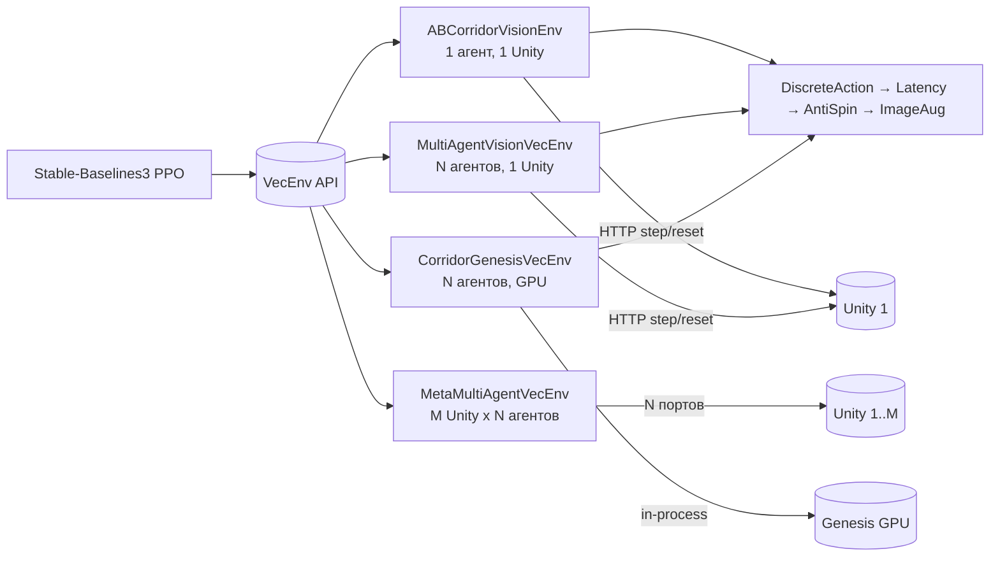

# 6 Программная обвязка обучения

Главы 4 и 5 описывают платформу со стороны runtime-контуров — Unity, backend, Web UI и плагинная подложка. Настоящая глава смотрит на ту же платформу со стороны исследователя машинного обучения: разбирает Python-обвязку, которая превращает Unity-симулятор в источник наблюдений для Stable-Baselines3, оркестрирует параллельный запуск, выполняет PPO, сохраняет артефакты и возвращает обученную ONNX-модель в backend через тот же контракт, что и операторский интерфейс. Изложение опирается на исходники из `python/sim_client/` и `python/training/`; цитируемые имена существуют в репозитории на момент написания работы.

Глава описывает программную обвязку обучения, а не результаты sim-to-real-переноса — последние выделены в главу 7 настоящей работы. Когда речь заходит о наблюдаемых проблемах сходимости при тяжёлой доменной рандомизации, материал ограничивается описанием реализации и фиксацией факта: подбор архитектуры и гиперпараметров находится в исследовательской фазе.

## 6.1 Связь Python-контура с симулятором

### 6.1.1 SimClient как единственная точка получения наблюдений

Все взаимодействия Python-кода с Unity-runtime проходят через один класс — `SimClient` (`python/sim_client/http_client.py`). Это сознательное архитектурное решение: для всей тренировочной обвязки Unity существует исключительно как HTTP-сервер на `http://127.0.0.1:8000`, отвечающий по контракту `runtime API`, описанному в главе 6 диссертации. Никакая часть тренировочного кода не импортирует Unity-сборку напрямую, не разделяет с ней процессное пространство и не использует общую память — связь идёт только через сетевые запросы.

```python
class SimClient:
    def __init__(self, base_url: str, timeout_s: float = 10.0):
        self.base_url = base_url
        self.timeout_s = timeout_s
        self.session = requests.Session()
        adapter = HTTPAdapter(pool_connections=4, pool_maxsize=16, max_retries=0)
        self.session.mount("http://", adapter)
        self.session.mount("https://", adapter)

    def health(self) -> Dict[str, Any]: ...
    def get_contract(self) -> Dict[str, Any]: ...
    def reset(self, config: Dict[str, Any]) -> Dict[str, Any]: ...
    def step(self, command: Dict[str, Any]) -> Dict[str, Any]: ...
```

Использование `requests.Session` с явно сконфигурированным `HTTPAdapter` решает проблему, выявленную при ранних запусках на Windows. В Python без сессии каждый HTTP-запрос порождает новое TCP-соединение; при тренировке со скоростью порядка сотни шагов в секунду на четыре параллельных Unity-инстанции пул эфемерных портов исчерпывается за несколько минут (TIME_WAIT накапливается быстрее, чем освобождается), и `SubprocVecEnv`-воркеры начинают падать с `WinError 10055` или `EOFError`. Постоянная сессия и keep-alive снимают проблему. Параметр `pool_maxsize=16` подобран эмпирически — потолок одновременных вызовов от одного Python-процесса к одному Unity-серверу при N агентах в `MultiAgentVisionVecEnv`.

Класс намеренно содержит минимальный набор методов и не вводит уровней абстракции поверх HTTP. Семантические интерпретации — поля наблюдения, поля команды, форматы JPEG-кадров, идентификаторы агентов — остаются на стороне environment-классов из `python/training/`. Такое разделение позволяет переиспользовать клиент в трёх контекстах: тренировочном цикле, KPI-оценке `evaluate_ab_policy.py` и в инструментах `rusim doctor`/`rusim contract`.

Помимо тренировочных endpoint-ов клиент содержит методы для работы с реестром моделей backend: `list_models`, `get_active_model`, `activate_model`, `set_model_binding`, `upload_model`. Эти методы используются на этапе доставки артефакта; размещение их в том же классе оправдано тем, что инструменты `rusim model install` и `rusim model activate` через тот же `SimClient` обращаются к backend-API.

### 6.1.2 Семантика reset и step

Контракт между Python-контуром и Unity сводится к двум методам: `reset` и `step`. Семантика этих методов на стороне Unity описана в главе 5 («SimulationManager: ядро жизненного цикла»); здесь рассматривается, как тренировочная обвязка с ними работает.

`reset(config)` принимает структуру `SimulationConfig` в JSON-форме: идентификаторы трассы и транспортного средства, параметры трассы, параметры агента, флаги и seed. Метод синхронен — Python-вызов блокируется, пока Unity не завершит уничтожение прошлой сцены, инстанцирование новой, применение параметров и первый snapshot. Возвращается полный `StepResult`, который содержит начальное наблюдение для policy и пустой `info` (на стороне Unity это вырожденный шаг с командой `(0, 0)`). Тренировочный код использует возвращаемое значение `reset` непосредственно — никакой дополнительной фазы прогрева нет.

`step(command)` принимает `ControlCommand` — пару (`throttle`, `steer`) для непрерывных моделей, либо одно из дискретных значений `DirStop/Forward/Back/Left/Right`, переданное через wrapper. Возвращаемый `StepResult` содержит поле `state.camera.frame` (base64-кодированный JPEG камеры primary-агента), массив `telemetry`, поля `state.pose` (позиция и ориентация Rigidbody) и `info` со служебными ключами (`frame_id`, `agent_count`, `route.completed`, `route.distance_m`).

```python
def reset(self, *, seed=None, options=None):
    step = self.client.reset(self._reset_config)
    obs, _ = self._build_observation(step)
    self._steps = 0
    self._last_progress = 0.0
    return obs, {}

def step(self, action):
    cmd = {"throttle": float(action[0]), "steer": float(action[1])}
    step = self.client.step(cmd)
    obs, info = self._build_observation(step)
    reward, terminated, truncated = self._compute_reward(step, action)
    self._steps += 1
    return obs, reward, terminated, truncated, info
```

Принципиальное свойство этой пары — синхронность. Тренировочный цикл PPO работает в стандартном Gymnasium-режиме: «получили obs, посчитали действие, отправили action, дождались следующего obs». Никаких асинхронных колбэков, очередей телеметрии или потоковой подписки на стороне Python нет. Все хитрости параллелизма вынесены в `MultiAgentVisionVecEnv` и `MetaMultiAgentVecEnv`, которые работают над тем же синхронным контрактом, отправляя в одну итерацию пакеты команд для нескольких агентов через явный `targetAgentId`.

### 6.1.3 Загрузка сценария и параметризация запуска

Источником `SimulationConfig` для всех тренировочных запусков служит файл сценария в формате YAML. Сценарии размещены в `configs/scenarios/`; типичный пример — `cardboard-corridor-v1.yaml`, описывающий узкий коридор шириной 0.6 м, KS0223-агента и waypoint-маршрут «A → B». Загрузку и валидацию сценариев выполняет модуль `python/sim_client/scenario.py`.

```python
def load_scenario_file(path: str | Path) -> Dict[str, Any]:
    file_path = Path(path)
    suffix = file_path.suffix.lower()
    raw = file_path.read_text(encoding="utf-8")
    if suffix == ".json":
        payload = json.loads(raw)
    elif suffix in {".yaml", ".yml"}:
        if yaml is None:
            raise RuntimeError("PyYAML is required to load YAML scenarios.")
        payload = yaml.safe_load(raw)
    else:
        raise ValueError(f"Unsupported scenario file extension: {suffix}")
    if not isinstance(payload, dict):
        raise ValueError("Scenario document must be a JSON/YAML object.")
    return payload
```

Функция `validate_scenario` дополнительно проверяет согласованность полей: наличие `runtime.runtimeMode`, ключа `world.trackId`, типов поля `vehicle.vehicleId`, корректности списка `route.waypoints`, согласованности счётчика `agents.count` с массивом `agents.vehicles`. Валидация происходит на стороне Python до отправки конфигурации в Unity — это позволяет получить осмысленную диагностику с указанием конкретного отсутствующего поля.

Преобразование загруженного сценария в `SimulationConfig`-payload выполняет `scenario_to_reset_config`. Значения по умолчанию для `time_scale`, `max_steps`, `oob_margin_m` берутся из CLI-аргументов тренировочного скрипта; параметры маршрута и геометрии трассы — из секций `route.params` и `route.waypoints`. Сценарий служит «паспортом эксперимента»: пара (commit, scenario file) однозначно описывает, в какой среде шло обучение. Этот паспорт сохраняется в `metadata.json` рядом с моделью под ключом `scenario`.

Помимо сценариев тренировочный пайплайн принимает параметры через CLI трёх категорий. Первая — параметры запуска Unity (адрес, порт, число параллельных инстанций). Вторая — параметры обучения (число шагов, гиперпараметры PPO, опции wrapper-стека). Третья — параметры доменной рандомизации (`spawn-jitter-m`, `ultrasonic-noise-sigma`, `lateral-penalty-mult`); они частично попадают в Unity через `trackParams` и частично остаются в env-обёртках. В `metadata.json` зафиксированы все три категории, что обеспечивает воспроизводимость.

## 6.2 Обёртки сред: единый VecEnv-интерфейс

Stable-Baselines3 ожидает на входе либо обычную `gym.Env`, либо `VecEnv`, обслуживающий несколько параллельных эпизодов с единым observation/action space. В Python-контуре платформы реализованы четыре варианта среды, эквивалентные с точки зрения PPO, но различающиеся по тому, как именно они получают наблюдения и куда отправляют команды.



Рисунок 6.1 — Варианты сред и их связь с тренировочным циклом

Все четыре варианта возвращают одно и то же `observation_space`: словарь с ключами `image` (84×84×3 uint8 RGB) и `ultrasonic` (одномерный float32 в диапазоне 0..1). Это позволяет тренировать одну и ту же CNN-policy под любой из бэкендов без модификации кода policy.

### 6.2.1 Одиночная среда (ABCorridorVisionEnv)

`ABCorridorVisionEnv` (`python/training/ab_corridor_vision_env.py`, 836 строк) — базовый класс, описывающий одиночного агента в одиночной Unity-инстанции. Это `gym.Env`, не `VecEnv`: каждый его шаг — один HTTP `step` к одному Unity-серверу. Предполагается, что Unity запущен оператором отдельно (`./rusim server up --count 1`), а среда подключается к существующему серверу по `base_url`.

```python
class ABCorridorVisionEnv(gym.Env):
    def __init__(self, base_url="http://127.0.0.1:8000",
                 scenario_path=None, max_steps=600,
                 corridor_width_m=None, oob_margin_m=0.3,
                 goal_radius_m=None, time_scale=2.0,
                 grayscale=False, img_size=84,
                 track_id="track.basic_arena.v1",
                 vehicle_id="vehicle.prometeo.sport.v1",
                 ...):
        self.client = SimClient(base_url, timeout_s=30.0)
        self.observation_space = spaces.Dict({
            "image": spaces.Box(0, 255, (img_size, img_size, 3), dtype=np.uint8),
            "ultrasonic": spaces.Box(0.0, 1.0, (1,), dtype=np.float32),
        })
        self.action_space = spaces.Box(-1.0, 1.0, (2,), dtype=np.float32)
```

Среда отвечает за три функции, не покрываемые Unity-runtime: вычисление reward, проекция позиции агента на маршрут (для метрики `progress`) и формирование `observation` из base64-кадра камеры (декодирование, ресайз). Функция `_compute_reward` собирает суммарную награду из компонентов `progress`, `lateral_penalty`, `heading_alignment_bonus`, `survival`, `time`, `backward_penalty`, `goal_bonus`, `oob_penalty`, `stall_penalty`. Каждый компонент возвращается в `info["reward_breakdown"]` для логирования через `RewardBreakdownCallback`. Эта структура нужна для отладки: разложение по компонентам показывает, какой именно член склоняет policy в нежелательное поведение, тогда как суммарная награда такого ответа не даёт.

Геометрия маршрута реконструируется из `route.waypoints` сценария. На каждом шаге вычисляются ближайшая точка на ломаной (`_seg_dist`), параметр проекции (`_project_t`) и накопленный прогресс (`_route_progress`). Геометрические функции вынесены в отдельные `_*` помощники, что позволяет переиспользовать их в `MultiAgentVisionVecEnv` и в `evaluate_ab_policy.py` без дублирования.

### 6.2.2 Multi-agent в одной Unity-инстанции (MultiAgentVisionVecEnv)

Базовый класс `ABCorridorVisionEnv` обслуживает один агент. Параллельное обучение через `SubprocVecEnv` SB3 требует N отдельных Python-процессов, каждый из которых поднимает собственный `SimClient` к собственной Unity-инстанции — N инстанций Unity со своими физическими движками, своими камерами и своими серверами. Это даёт честный параллелизм, но обходится в 5-7 ГБ оперативной памяти на инстанцию и значительный CPU-overhead.

`MultiAgentVisionVecEnv` (`python/training/multi_agent_vision_env.py`, 564 строки) реализует альтернативную модель: одна Unity-инстанция содержит N агентов в одной сцене (через `SimulationConfig.agents`), и Python-контур обращается к ним по очереди в одной HTTP-сессии. Это срабатывает потому, что Unity физически считает все N агентов одним `FixedUpdate`-циклом — суммарная стоимость на сцене в N раз меньше, чем у N независимых инстанций.

```python
class MultiAgentVisionVecEnv(VecEnv):
    def __init__(self, n_agents, base_url, scenario_path,
                 max_steps, time_scale, img_size,
                 corridor_width_m, goal_radius_m,
                 waypoints, track_id="track.cardboard_corridor.v1",
                 maze_randomize=False, ...):
        self.n_agents = int(n_agents)
        self.client = SimClient(base_url, timeout_s=30.0)
        observation_space = spaces.Dict({...})
        action_space = spaces.Box(-1.0, 1.0, (2,), dtype=np.float32)
        super().__init__(self.n_agents, observation_space, action_space)
```

Принципиальный момент — поведение при терминации эпизода одного из агентов. SB3 ожидает, что `VecEnv` поддерживает auto-reset: при `done=True` для агента `i` среда формирует `terminal_observation` в `info[i]["terminal_observation"]`, а затем посылает в Unity `reset` для этого агента с сохранением остальных. Соответствующий вызов в Unity-runtime — `reset_agent(agent_id, vehicle_params, spawn_params)` — реализован в `SimulationManager` ровно для этого случая.

Параметры `maze_randomize` и `maze_regen_every` предназначены для трассы `track.cardboard_maze.v1`, поддерживающей процедурную генерацию лабиринта при `reset`. При их включении `MultiAgentVisionVecEnv` передаёт набор `trackParams` (`maze.seed`, `maze.length_cells`, `maze.left_turns`, `maze.right_turns`, `maze.corridor_width_m`, `maze.wall_height_m`), которые Unity-runtime считывает в `CardboardMazeTrack.ResetTrack`.

### 6.2.3 Meta-multi-agent: N Unity на M агентов (MetaMultiAgentVecEnv)

`MultiAgentVisionVecEnv` упирается в потолок производительности одиночной Unity-инстанции: при достижении примерно восьми агентов в одной сцене стоимость рендеринга восьми отдельных камерных текстур начинает доминировать над выгодой от единого `FixedUpdate`. Дополнительно при некоторых настройках Unity-сцены наблюдается сериализация камерных проходов, и время одного шага растёт нелинейно.

`MetaMultiAgentVecEnv` (`python/training/meta_multi_agent_vec_env.py`) обходит этот потолок, объединяя несколько `MultiAgentVisionVecEnv` поверх отдельных Unity-процессов на разных портах.

```python
class MetaMultiAgentVecEnv(VecEnv):
    def __init__(self, n_unity, agents_per_unity, base_url_template, ...):
        self.inner_envs: list[MultiAgentVisionVecEnv] = []
        for i in range(self.n_unity):
            url = base_url_template.format(port=base_port + i)
            env = MultiAgentVisionVecEnv(
                n_agents=self.agents_per_unity, base_url=url, ...)
            self.inner_envs.append(env)
        total_agents = self.n_unity * self.agents_per_unity
        self._executor = ThreadPoolExecutor(max_workers=self.n_unity)
        super().__init__(total_agents, ...)
```

Ключевая деталь — пул потоков: вызовы `inner.step` для разных Unity-инстанций отправляются параллельно через `ThreadPoolExecutor`, а не последовательно. Поскольку каждый вызов блокируется в `socket.recv` на ответе Unity-runtime, Python GIL во время блокировки освобождён, и параллельный execution случается на уровне ОС — N сетевых ожиданий протекают одновременно. Это позволяет получить почти линейный прирост производительности по числу Unity-инстанций без перехода на multiprocessing.

Меta-VecEnv введён как обход проблемы: на Windows с Python 3.13 `SubprocVecEnv` детерминированно падал примерно на 116-тысячном шаге с разрывом pipe. Воспроизводимость отказа подтверждалась многократно. Многопоточная meta-VecEnv-обёртка обходит её: pipe не используется, обмен идёт по TCP-сокетам, переиспользуемым через `requests.Session`.

### 6.2.4 Genesis-вариант для GPU-параллельной симуляции

Все три рассмотренные среды используют Unity как симулятор и упираются в его пропускную способность: порядка двухсот шагов в секунду на одну инстанцию, до 1500-1800 в meta-multi-agent с тремя Unity и восьмью агентами. Этого достаточно для исследовательских прогонов, но недостаточно для серьёзных sweep-ов гиперпараметров.

Четвёртый вариант — `CorridorGenesisVecEnv` (`python/training/corridor_genesis_env.py`, 419 строк) — реализован поверх Genesis, GPU-параллельного физического симулятора. Genesis запускает N сред в одном процессе на GPU, что снимает HTTP-overhead и параллелизирует физику и рендеринг на уровне CUDA-ядер. Целевая пропускная способность на RTX 5080 — порядка пяти тысяч шагов в секунду при `n_envs=512`.

```python
class CorridorGenesisVecEnv(VecEnv):
    def __init__(self, n_envs=64, max_steps=400,
                 corridor_width_m=0.60, oob_margin_m=0.10,
                 goal_radius_m=0.25, waypoints=None,
                 img_size=84, env_spacing=(12.0, 12.0),
                 backend="auto", dt=DEFAULT_DT, show_viewer=False):
        ...
```

KS0223 в Genesis-варианте моделируется не как полная физическая модель с колёсами, а как кинематический box, у которого напрямую задаются линейная и угловая скорости. Реальный KS0223 имеет дифференциальный привод, его динамика близка к идеальному кинематическому управлению, поэтому потеря точности компенсируется выигрышем в скорости. Калибровка — `ROBOT_MAX_SPEED = 0.73` м/с, `ROBOT_MAX_YAW_RATE = 380 °/с`, `DEFAULT_DT = 0.14` с — взята из натурных замеров (глава 7). Структура reward повторяет `ABCorridorVisionEnv._compute_reward`: те же компоненты с теми же весами. На уровне обвязки Genesis-бэкенд взаимозаменяем с Unity-бэкендом.

### 6.2.5 Wrappers: DiscreteActionWrapper, image augmentation, latency

Над любой из четырёх сред поднимается стек обёрток, превращающий её непрерывный action-space в дискретный, добавляющий action latency и применяющий аугментации к наблюдениям. Стек применяется в строго заданном порядке, который реализован в функции `_wrap_env` тренировочного скрипта.

```python
def _wrap_env(base_env, *, enable_aug, enable_anti_spin,
              enable_latency, latency_steps, seed,
              enable_discrete=True, strong_aug=False, latency_max=-1):
    env = base_env
    if enable_discrete:
        env = DiscreteActionWrapper(env)
        if enable_latency and latency_steps > 0:
            dmax = latency_max if latency_max > latency_steps else None
            env = DelayedActionWrapper(env, delay_steps=latency_steps, delay_max=dmax)
        if enable_anti_spin:
            env = AntiSpinRewardWrapper(env)
    if enable_aug:
        env = ImageAugObservationWrapper(env, enable=True, seed=seed)
    return env
```

`DiscreteActionWrapper` (`python/training/discrete_action_wrapper.py`) превращает `Box(-1, 1, (2,))` в `Discrete(5)`. Каждое из пяти действий маппится в фиксированную пару `(throttle, steer)`: `DirStop=(0,0)`, `DirForward=(+1,0)`, `DirBack=(-1,0)`, `DirLeft=(0,+1)`, `DirRight=(0,-1)`. Это сделано ради соответствия реальному KS0223: робот через `MainControl.py` принимает только пять дискретных команд, и обучать policy в континуальном action space — значит на стороне backend всё равно проецировать выход на дискретное множество, теряя плавность управления, которой policy научили в симе.

Тест `test_discrete_action_wrapper.py` фиксирует, что вектор действия совпадает с указанной таблицей. В ранней ревизии `DirLeft` имел форму `(+0.5, +1.0)` («forward+turn arc»), позже выяснилось, что `Ks0223Vehicle` в Unity реализует чистый дифференциальный привод, и `(0, +1)` корректно трактуется как поворот на месте.

`DelayedActionWrapper` (`python/training/latency_wrapper.py`) добавляет лаг между подачей действия и его применением. Реальный inference loop на KS0223 работает с интервалом порядка 140 мс (7 Гц), и за этот интервал среда меняется. Без латентности policy учится по «свежим» кадрам, а на реальном роботе её действие применяется к состоянию, наступившему через тик. Wrapper хранит очередь длиной `delay_steps`. Опциональный `delay_max` включает рандомизацию задержки в `[delay_steps, delay_max]`, моделируя jitter USB- и сетевых задержек.

`ImageAugObservationWrapper` (`python/training/image_aug_wrapper.py`) применяет к `obs["image"]` стохастический набор аугментаций: яркость, контраст, hue-shift, размытие, JPEG-recompression, гауссов шум. Режим `--strong-aug` усиливает диапазоны (0.30 вместо 0.15, blur radius до 2.0). Цель — подготовить policy к различиям между чистыми Unity-кадрами и зашумлёнными кадрами реальной USB-камеры.

`AntiSpinRewardWrapper` (`python/training/anti_spin_reward.py`) добавляет штраф за повторение одного и того же действия. На ранних этапах обучения PPO иногда сходился к degenerate-policy, повторявшей `DirLeft` бесконечно — крутящееся на месте поведение давало небольшой положительный reward от `survival`, но не приносило прогресса. Штраф за пять и более одинаковых действий подряд делает такое поведение невыгодным.

## 6.3 Тренировочный пайплайн на Stable-Baselines3

### 6.3.1 PPO как основной алгоритм

В качестве основного RL-алгоритма выбран PPO (Proximal Policy Optimization) в реализации Stable-Baselines3. Выбор обоснован тремя соображениями. Первое — устойчивость к гиперпараметрам: в отличие от off-policy методов вроде SAC или TD3, PPO предполагает on-policy буфер, не накапливающий stale-данные и не требующий тонкой настройки таргет-сетей и priority replay. Второе — наличие реализации `MultiInputPolicy`, поддерживающей обсервации в виде словаря (`{image, ultrasonic}`). Третье — поддержка `RecurrentPPO` через `sb3-contrib`: переход на LSTM-policy для non-Markovian задач (см. 6.4.2) делается одной CLI-опцией.

Альтернативой рассматривался DQN. От него отказались из-за того, что для CNN-policy с словарным observation space потребовалась бы адаптация `QNetwork`, тогда как PPO работал «из коробки». Оба алгоритма проверены на ранних спайках (rev1-rev4); PPO давал более стабильную кривую обучения на тех же 200 тысячах шагов.

Дискретное действие на стороне PPO превращается в `Categorical(5)`-распределение поверх логитов размерности 5, выходящих из `action_net` policy. Этот факт явно проверяется ассертом в тренировочном скрипте, чтобы исключить ситуацию, когда `MultiInputPolicy` ошибочно соберёт `DiagGaussianDistribution`:

```python
print(f"  Action dist: {type(model.policy.action_dist).__name__}")
assert "Categorical" in type(model.policy.action_dist).__name__, \
    f"Expected Categorical action dist for Discrete action_space, got {type(model.policy.action_dist)}"
```

### 6.3.2 train_cardboard_corridor_v9.py: общий поток

Главный тренировочный скрипт — `python/training/train_cardboard_corridor_v9.py` (978 строк). «v9» в названии указывает на ревизию набора wrapper-ов; v6-v8 сохранены как `train_cardboard_corridor.py` для воспроизводимости старых результатов.

Поток исполнения идёт в одной функции `main` и состоит из шести фаз: парсинг CLI и подготовка путей; построение тренировочной среды (выбор одной из четырёх реализаций по флагам `--meta-multi-agent`, `--multi-agent`, `--num-envs`); оборачивание в `VecFrameStack` и `VecNormalize`; построение PPO (новый экземпляр или `PPO.load` при `--resume`); сборка callback-ов и `model.learn`; сохранение SB3-чекпоинта, ONNX-экспорт, запись `metadata.json`.

```python
def main() -> int:
    args = parse_args()
    output_dir = resolve_artifact_dir(ROOT, args.output_dir,
                                      args.model_name, args.model_version)
    log_dir = Path(args.log_dir)
    output_dir.mkdir(parents=True, exist_ok=True)
    log_dir.mkdir(parents=True, exist_ok=True)
    ...
    model = ppo_cls(policy_id, train_env,
                   learning_rate=args.learning_rate,
                   n_steps=args.n_steps, batch_size=args.batch_size,
                   n_epochs=args.n_epochs, gamma=args.gamma,
                   clip_range=args.clip_range, ent_coef=ent_coef_value,
                   target_kl=target_kl, verbose=1, seed=args.seed,
                   device=args.device, tensorboard_log=tensorboard_log,
                   policy_kwargs=policy_kwargs)
    ...
    model.learn(total_timesteps=args.total_timesteps,
                callback=callbacks, progress_bar=False)
    model.save(str(model_path))
    export_to_onnx_discrete(model, onnx_path, img_size=args.img_size)
    write_json(output_dir / "metadata.json", metadata)
```

Флаг `--resume` предусматривает продолжение обучения с прошлого чекпоинта с обновлёнными гиперпараметрами. `PPO.load` восстанавливает policy и optimizer из `.zip`, а поверх ставятся `learning_rate`, `clip_range`, `ent_coef` и `target_kl` из новых CLI-аргументов. `num_timesteps` сохраняется автоматически, что позволяет не сбрасывать total-счётчик и сохранять прогресс curriculum-стейджей.

### 6.3.3 Гиперпараметры и их обоснование

Дефолты гиперпараметров выбраны по итогам последовательности ревизий rev1-rev42, зафиксированных в `python/training/artifacts/cardboard-corridor-ppo-v9-rev*`. Каждый rev-ID соответствует одному прогону с фиксированной комбинацией параметров; их изменение явно прописано в commit message и в комментариях `parse_args`. Текущие defaults и их назначение приведены в таблице 6.1.

Таблица 6.1 — Гиперпараметры PPO в `train_cardboard_corridor_v9.py`

| Параметр | Default | Назначение | Когда менять |
|---|---|---|---|
| `learning_rate` | 3e-4 | Стандартный SB3 PPO LR | На R3M-extractor: понижают до 1e-4 |
| `n_steps` | 512 | Длина rollout-а | rev38: подняли с 256 — мало transitions/update на vision RL |
| `batch_size` | 64 | Mini-batch GAE | На GPU с большой памятью повышают до 256 |
| `n_epochs` | 10 | PPO update epochs | rev38: подняли с 4 — стандарт для vision RL |
| `gamma` | 0.99 | Discount factor | Длинные эпизоды (>400 шагов) на 0.995 |
| `clip_range` | 0.2 | PPO clip ratio | Не трогать без оснований |
| `ent_coef` | 0.1 | Entropy bonus | rev29: явно зафиксирован 0.1 после drift на 0.02 |
| `target_kl` | 0.02 | Anti-collapse early stop | rev30: введён, по умолчанию активен |
| `frame_stack` | 1 | Stacking k frames | rev38: рекомендуется 4 для maze |
| `seed` | 42 | RNG seed | Sweep-ы: 42, 1337, 7, 11, 23 |

`ent_coef = 0.1` зафиксирован после неприятного открытия: ревизии rev24-rev28 наследовали значение 0.02 от ранних экспериментов (rev10-rev18 обучались с 0.1), что в пять раз снижало entropy-бонус и приводило к раннему схлопыванию policy в degenerate-режим. Default явно поднят в коммите 4c46ef8 с комментарием в коде. Hyperparameter-инварианты дублируются в `metadata.json` под ключом `hyperparameters`.

`target_kl = 0.02` — anti-collapse-значение из литературы по PPO; SB3 досрочно прерывает update, если KL-divergence между старой и новой policy превысила порог. До rev30 параметр был отключён, что в комбинации с большими `ent_coef` иногда давало catastrophic update.

`n_steps = 512` и `n_epochs = 10` подняты в rev38 после анализа литературы по vision RL. До rev37 значения были 256 и 4, что давало 1024 transitions per update при четырёх агентах — недостаточно для CNN-policy. Подъём до 4096 transitions per update (`512 × 8`) выровнял условия с эталонными конфигами.

Параметр `--ent-coef-schedule linear` включает линейную интерполяцию `ent_coef` через callback `EntCoefScheduleCallback`. SB3 нативно умеет планировать только `learning_rate`. Высокий entropy в начале предотвращает раннее схлопывание, низкий в конце даёт sharp-policy.

### 6.3.4 Курикулум и мониторинг через EvalCallback

Тренировочный цикл оснащён четырьмя стандартными callback-ами (`ProgressCallback`, `CheckpointCallback`, `EvalCallback`, `MazeCurriculumCallback`) и двумя авторскими (`ActionStatsCallback`, `RewardBreakdownCallback`).

`ActionStatsCallback` ведёт скользящее окно последних N действий и публикует доли пяти дискретных действий в TensorBoard как scalar-метрики `actions/frac_DirStop`, `actions/frac_DirForward`, …, `actions/top_frac`. Цель — раннее обнаружение degenerate-collapse: если за первые 50 тысяч шагов 95% действий — это `DirRight`, тренировку имеет смысл прервать вручную.

`RewardBreakdownCallback` агрегирует компоненты reward, возвращаемые env-обёртками в `info["reward_breakdown"]`. Каждые `--reward-log-freq` шагов средние значения (`progress_mean`, `lateral_penalty_mean`, `goal_bonus_mean`) публикуются в TensorBoard, что позволяет диагностировать причину застоя без перезапуска тренировки.

`MazeCurriculumCallback` (`python/training/maze_curriculum.py`) реализует staged-difficulty для процедурного maze-track-а. Конфигурация по умолчанию состоит из четырёх стадий: `stage-A-easy` (5 клеток, 1 поворот направо), `stage-B-medium` (5-7 клеток, до одного поворота налево, 1-2 направо), `stage-C-hard` (6-8 клеток, 1-2 налево, 1-3 направо) и `stage-D-full` (6-10 клеток, 1-3 в обе стороны). Стадии переключаются по total timesteps: 0, 25 000, 60 000, 100 000.

```python
DEFAULT_STAGES: List[CurriculumStage] = [
    CurriculumStage(name="stage-A-easy", start_step=0,
                    ranges={"length_cells": (5, 5), "left_turns": (0, 0),
                            "right_turns": (1, 1),
                            "corridor_width_m": (0.58, 0.62), ...}),
    CurriculumStage(name="stage-B-medium", start_step=25_000, ranges={...}),
    CurriculumStage(name="stage-C-hard", start_step=60_000, ranges={...}),
    CurriculumStage(name="stage-D-full", start_step=100_000, ranges={...}),
]
```

Пороговые значения выбраны эмпирически: на rev2-rev5 наивная полнодиапазонная maze-рандомизация с первого шага не сходилась — policy не получала ни одного успешного эпизода и optimizer не имел сигнала. `stage-A-easy` гарантирует положительный reward на первой попытке. Дальнейшие стадии расширяют распределение по одному параметру за раз — стандартный приём curriculum learning (Bengio, 2009).

`EvalCallback` использует отдельную Unity-инстанцию на отдельном порту (`./rusim server up --count 4` плюс `--eval-base-url http://127.0.0.1:8003`). Среда оценки строится `_build_eval_env` с отключёнными аугментациями и anti-spin-штрафом — eval должен идти на «чистом» дистрибуции. `latency` оставлен включённым как часть симулируемой реальности, а не рандомизации.

## 6.4 Domain randomization и подготовка к sim-to-real

### 6.4.1 Heavy-DR: текстуры, освещение, спавны

Доменная рандомизация (DR) — техника, при которой тренировочная среда генерируется со случайными вариациями визуальных и физических параметров, чтобы policy училась на распределении, более широком, чем реальная среда развёртывания. В Python-обвязке DR разделена на «лёгкую» (image augmentation, ultrasonic noise, action latency в env-обёртках) и «тяжёлую» (heavy-DR), реализуемую на стороне Unity через `trackParams` и `vehicleParams`.

Heavy-DR охватывает четыре класса вариаций: геометрия лабиринта (`maze.seed`, `maze.length_cells`, `maze.left_turns`, `maze.right_turns`, `maze.corridor_width_m`, `maze.wall_height_m`); визуальное оформление (текстуры стен, цвет освещения, интенсивность ambient, угол солнца); спавн (`spawn.jitter_xy_m`, `spawn.jitter_yaw_deg`); зашумление сенсоров (`sensor.ultrasonic.noise_sigma`, `sensor.ultrasonic.dropout_prob`).

```python
p.add_argument("--spawn-jitter-m", type=float, default=0.0,
               help="±N metres XY spawn jitter (Unity-side via trackParams)")
p.add_argument("--spawn-yaw-jitter-deg", type=float, default=0.0,
               help="±N degrees spawn yaw jitter (Unity-side via trackParams)")
p.add_argument("--ultrasonic-noise-sigma", type=float, default=0.0,
               help="Gaussian noise stddev (meters) added to front ultrasonic")
p.add_argument("--ultrasonic-dropout-prob", type=float, default=0.0,
               help="Per-step probability ultrasonic returns 0 or 5m")
```

Дефолты для всех heavy-DR-параметров — нули. Включение каждого требует эмпирической проверки, что добавленный шум не уничтожает сходимость. Рекомендуемые значения для rev39+ — `spawn-jitter-m=0.10`, `spawn-yaw-jitter-deg=30`, `ultrasonic-noise-sigma=0.02`, `ultrasonic-dropout-prob=0.02`.

При исследовании sim-to-real-переноса наблюдалось систематическое схлопывание PPO под heavy-DR. В rev30-rev35 шесть последовательных попыток на разных seed-ах дали 0% success rate на eval-среде. Env-revert bisect подтвердил, что регрессия не вызвана багом в env-обёртках — те же seed-ы на rev16-rev18 без heavy-DR давали порядка 60% success. Вывод: проблема в дисперсии PPO под широким DR-распределением. Отсюда два направления (6.4.2 и 6.4.3): расширение архитектуры (frame stacking, R3M, RecurrentPPO) и более узкие визуальные изменения. Reward-шейпинг как лекарство отвергнут — изменение весов компонентов не разрешает фундаментальной проблемы.

### 6.4.2 Frame stacking и историческая память

Стандартное наблюдение — один кадр 84×84×3. На детерминированном коридоре Markov-предположение приближённо выполняется. На задаче навигации в случайном лабиринте (`track.cardboard_maze.v1`) Markov-предположение нарушается: policy, оказавшись на пересечении коридоров, не может определить из единственного кадра, по какому ответвлению уже двигалась.

Решение в виде frame stacking: к текущему кадру конкатенируются k предыдущих по канальной оси, и policy получает на вход тензор `(84, 84, 3·k)`. Схема стандартна для Atari-RL (Mnih et al., 2015); в Python-обвязке реализована через `VecFrameStack` SB3.

```python
if args.frame_stack > 1:
    if not isinstance(train_env, _VecEnvType):
        train_env = DummyVecEnv([lambda: train_env])
    train_env = VecFrameStack(train_env, n_stack=args.frame_stack,
                              channels_order='last')
```

Параметр `channels_order='last'` важен: NatureCNN ожидает канальной размерности на последнем месте, а frame_stack по умолчанию в старых версиях SB3 вставлял каналы в начало. Явное указание избавляет от источника ошибок.

Альтернативный механизм — `RecurrentPPO` с LSTM-policy, включаемый флагом `--recurrent`. Он переключает `ppo_cls` на `sb3_contrib.RecurrentPPO` и `policy_id` на `MultiInputLstmPolicy`; LSTM hidden state переносится между шагами эпизода и обнуляется при `reset`. Этот вариант мощнее frame stacking теоретически, но на практике сложнее в обучении и чаще требует ручной настройки `n_steps` и `batch_size`. В rev40+ оба варианта пробовались.

### 6.4.3 Real-camera post-processing

Флаг `--real-cam-postprocess` включает специализированный пайплайн пост-обработки 84×84-кадра, имитирующий характеристики реальной USB-камеры KS0223. В отличие от обычной image augmentation он не рандомизирует, а применяет фиксированную последовательность операций, выведенную из натурных съёмок реальной камеры: затемнение, десатурацию (теплота ламп), JPEG-recompression на низкое качество (артефакты USB-кодека).

Цель — не расширить распределение, а сдвинуть его центр в сторону реального. При обычной image augmentation policy учится на распределении, центрированном в Unity-render с шумовой оболочкой; при `real-cam-postprocess` центр смещён ближе к реальной системе. Опции совместимы: при включении обеих сначала применяется пост-обработка, затем стохастические аугментации. Часть параметров (ауто-экспозиция) выставляется на стороне Unity через `vehicleParams`, поэтому конструктор `ABCorridorVisionEnv(real_cam_postprocess=...)` пробрасывает флаг и в Unity, и в собственный пост-обрабатывающий шаг.

## 6.5 KPI-оценка и evidence

### 6.5.1 evaluate_ab_policy.py: 20-эпизодный success rate

Финальная оценка модели вынесена в отдельный скрипт `python/training/evaluate_ab_policy.py` (524 строки). Он не зависит от Stable-Baselines3: загружает ONNX через `onnxruntime`, подключается к Unity через `SimClient`, выполняет фиксированное число эпизодов (по умолчанию двадцать) и сохраняет KPI в JSON и SVG.

```python
def parse_args() -> argparse.Namespace:
    parser = argparse.ArgumentParser(...)
    parser.add_argument("--base-url", default="http://127.0.0.1:8000")
    parser.add_argument("--scenario", default=str(ROOT / "configs/scenarios/ab-corridor-v1.yaml"))
    parser.add_argument("--model", default=str(ROOT / "python/training/artifacts/.../ab_corridor_policy_v1.onnx"))
    parser.add_argument("--episodes", type=int, default=20)
    parser.add_argument("--max-steps", type=int, default=220)
    parser.add_argument("--seed-offset", type=int, default=0)
    parser.add_argument("--target-agent-id", default="ego")
    parser.add_argument("--include-trajectories", action="store_true")
    parser.add_argument("--output-json", default="")
    parser.add_argument("--output-svg", default="")
    return parser.parse_args()
```

Использование ONNX-runtime вместо SB3 нужно по двум причинам: eval должен проверять именно тот артефакт, который окажется в backend, и не должен унаследовать SB3-стек (нормализаций, exploration noise). ONNX-модель — «чистая» функция от observation к action_logits, и `argmax` по логитам даёт детерминированное действие.

Эпизод считается успешным при двух условиях: агент достиг финального waypoint в пределах `goal_radius_m` и не вышел за пределы коридора (`oob_threshold_m`). Из 20 эпизодов вычисляются success rate, mean steps to goal и max distance from corridor centerline. Метрики сохраняются в `<output_dir>/metrics.json`. SVG-отчёт визуализирует траектории всех эпизодов с раскраской по успеху.

### 6.5.2 Структура evidence-папки и воспроизводимость

Каждая ревизия модели сохраняется в отдельной директории `python/training/artifacts/<model-name>/<version>/`. Содержимое такой директории формирует самодостаточный «паспорт ревизии», по которому она однозначно идентифицируется и воспроизводится. Структура зафиксирована в `model_artifacts.py`:

- `cardboard-corridor-ppo-v9-rev16_sb3.zip` — SB3-чекпоинт (policy + optimizer + replay-state);
- `cardboard-corridor-ppo-v9-rev16.onnx` — экспортированная ONNX-модель;
- `metadata.json` — паспорт ревизии: гиперпараметры, сценарий, путь к чекпоинту, runtime/vehicle compatibility;
- `metrics.json` — KPI после прогона `evaluate_ab_policy.py`;
- `checkpoints/` — промежуточные SB3-чекпоинты с шагом `--checkpoint-freq`;
- `best_model/` — лучший чекпоинт, сохранённый `EvalCallback` (если eval включён);
- `tb_v9/` — TensorBoard-логи прогона.

`metadata.json` достаточно подробен, чтобы по нему можно было воссоздать тот же прогон. Он содержит секции `name/version`, `compatibility`, `observationSchema`, `actionSchema`, `wrappers`, `hyperparameters` и `monitoring`. Пример секции из реальной ревизии:

```json
{
  "name": "cardboard-corridor-ppo-v9-rev16",
  "version": "1.0.0",
  "policyId": "cardboard-corridor-ppo-v9-rev16:1.0.0",
  "format": "sb3",
  "compatibility": {
    "runtimeModes": ["unity-sim", "real-robot"],
    "vehicleIds": ["vehicle.prometeo.sport.v1", "vehicle.ks0223.arcade.blue.v1"],
    "robotKinds": ["ks0223"]
  },
  "wrappers": {"discreteAction": true, "delayedAction": false,
               "antiSpinReward": false, "imageAug": true, "latencySteps": 1},
  "hyperparameters": {"learningRate": 0.0003, "nSteps": 256, "batchSize": 64,
                      "nEpochs": 4, "gamma": 0.99, "clipRange": 0.2, "entCoef": 0.1}
}
```

Поле `compatibility` перечисляет runtime-моды, vehicle-id и robot-kind, к которым модель применима. Backend сверяет `compatibility` с текущей сессией и отказывается активировать неподходящую модель — fail-safe против случайной активации policy с гоночной машины на KS0223-сессии.

### 6.5.3 Сравнение revisions (rev16 → rev30+)

Полный список revisions для cardboard-corridor-PPO-v9 на момент написания работы насчитывает примерно 25 успешных прогонов. В таблице 6.2 представлены ключевые ревизии и их особенности, иллюстрирующие траекторию исследовательской работы.

Таблица 6.2 — Сравнительная таблица ревизий cardboard-corridor-ppo-v9

| Revision | Изменения | KPI (sim-eval) | Заметка |
|---|---|---|---|
| rev10 | Базовая v9: discrete action, image aug, latency=0 | success≈55% | Первая стабильная ревизия |
| rev16 | Добавлен latency=1, ent_coef=0.1 | success≈60% | Эталон для дальнейших сравнений |
| rev18 | Multi-agent (1 Unity x N), real_cam_postprocess | success≈58% | Performance-rev, KPI без регрессии |
| rev24 | Resume с rev18, новый scenario | success≈45% | Молчаливый ent_coef=0.02 — degraded |
| rev29 | Default ent_coef поднят до 0.1, fix | success≈62% | Восстановление эталона |
| rev30 | Heavy-DR: spawn jitter, ultrasonic noise | success=0% | Первый провал на heavy-DR |
| rev31-rev35 | Bisect heavy-DR, 6/6 seed-ов = 0% | 0% | Подтверждена variance, не bug |
| rev37 | Frame stack k=4, n_steps=512, n_epochs=10 | в исследовании | Plan 2 |
| rev39 | Latency randomization, ultrasonic noise 0.02 | в исследовании | Plan 4 |
| rev40 | R3M frozen feature extractor, 256-d | в исследовании | Plan 5 |
| rev42 | RecurrentPPO с LSTM hidden_size=128 | в исследовании | Plan 5 alt |

Ревизии rev30-rev35 заслуживают комментария. Шесть прогонов на разных seed-ах под одной конфигурацией heavy-DR показали 0% success rate в каждом случае. Env-revert bisect (откат к env-коду rev16) с rev16-ными гиперпараметрами восстанавливал KPI в 60% диапазон. Вывод: проблема — в дисперсии PPO под heavy-DR, а не в коде среды.

После rev35 reward-шейпинг как направление отвергнут, фокус сместился на архитектурные изменения: frame stacking (rev37+), pretrained feature extractor (rev40), recurrent policy (rev42). Это стандартные приёмы повышения семплоэффективности vision RL; их применение — открытая исследовательская часть, не претендующая на завершённость. Сама программная обвязка (CLI-флаги, callbacks, ONNX-export) одинаково обслуживает все варианты.

## 6.6 Экспорт ONNX-артефакта и связь с backend

### 6.6.1 torch.onnx.export: тонкие места

После завершения тренировки SB3-чекпоинт превращается в ONNX-артефакт через `export_to_onnx_discrete`. Backend на стороне `AutopilotService` использует `Microsoft.ML.OnnxRuntime` для inference; SB3-чекпоинт `.zip` содержит torch-pickle-данные, требующие интерпретатора Python, и для backend-а непригоден.

Реализация экспорта решает три тонких проблемы. Первая — SB3 хранит policy как сложный объект; `torch.onnx.export(policy)` не работает, потому что forward-сигнатура `MultiInputPolicy` принимает Dict-обсервацию, не поддерживаемую ONNX-export-ом. Решение — обёртка `DiscretePolicyWrapper` с двумя именованными tensor-входами:

```python
class DiscretePolicyWrapper(torch.nn.Module):
    def __init__(self, sb3_policy):
        super().__init__()
        self.features_extractor = sb3_policy.features_extractor
        self.mlp_extractor = sb3_policy.mlp_extractor
        self.action_net = sb3_policy.action_net

    def forward(self, image: torch.Tensor, ultrasonic: torch.Tensor):
        image_chw = image.permute(0, 3, 1, 2).contiguous()
        obs = {"image": image_chw, "ultrasonic": ultrasonic}
        features = self.features_extractor(obs)
        latent_pi, _ = self.mlp_extractor(features)
        return self.action_net(latent_pi)
```

Вторая проблема — формат image-tensor. Тренировочный код использует layout `(batch, H, W, C)` (channels-last, native для Unity JPEG-кадра); NatureCNN ожидает `(batch, C, H, W)`. Перестановка через `permute` внутри обёртки даёт ONNX-модели channels-last на входе (то, что отдаёт backend без преобразований), а внутренние слои получают channels-first.

Третья проблема — выходной формат. PPO-policy возвращает `Categorical` distribution; ONNX не поддерживает sampling. Решение — экспортировать raw action_logits `(batch, 5)`, без softmax и sampling. Backend выполняет `argmax` и получает дискретное действие.

```python
torch.onnx.export(
    wrapper,
    (dummy_img, dummy_ultra),
    str(output_path),
    input_names=["image", "ultrasonic"],
    output_names=["action_logits"],
    external_data=False,
    dynamic_axes={
        "image": {0: "batch"},
        "ultrasonic": {0: "batch"},
        "action_logits": {0: "batch"},
    },
    opset_version=11,
)
```

`opset_version=11` — минимальная версия, поддерживающая все используемые операторы. `dynamic_axes` оставляет batch-размерность изменяемой, чтобы при желании переключиться на batched-inference без переэкспорта.

### 6.6.2 metadata.json и metrics.json: формат

ONNX-артефакт сам по себе не содержит достаточно информации для backend. Нужны имя модели, версия, runtime-моды, vehicle-id и формат observation/action. Информация хранится в `metadata.json`, формируемом `build_model_metadata`.

Поле `policyId = "<slugified-name>:<version>"` — первичный ключ модели в registry. `format` указывает, какой файл загружать (`"onnx"` направляет в `OnnxRuntime`, `"sb3"` — legacy). `observationSchema` описывает форму и dtype каждого входа; backend сверяет схему с конфигурацией камеры и отказывается активировать несовместимые модели. `actionSchema` описывает выходы (`size=5, type=discrete-categorical, mapping={0: "DirStop", ...}`); backend по этому маппингу преобразует `argmax`-индекс в текстовую команду для TCP-канала `5051`.

Файл `metrics.json` содержит результаты `evaluate_ab_policy.py`. Backend не использует его в runtime, но публикует в Web UI как «паспорт качества модели» — оператор видит success rate перед активацией, что предотвращает случайную активацию модели с низким KPI.

### 6.6.3 rusim model install / activate / bind

Доставка ONNX-артефакта в backend выполняется через CLI `rusim model install` (subcommand в `python/sim_client/cli.py`). Команда принимает путь к ONNX-файлу, автоматически находит рядом `metadata.json` и `metrics.json`, и загружает всё в backend через `/api/models/upload`.

```bash
$ rusim model install python/training/artifacts/cardboard-corridor-ppo-v9-rev16/1.0.0/cardboard-corridor-ppo-v9-rev16.onnx
```

Команда `_model_install` использует `SimClient.upload_model`, передающий артефакт как `multipart/form-data` с полями `file`, `metadata`, `metrics`. Backend валидирует metadata, регистрирует модель в БД и возвращает `policyId`. Флаг `--activate` делает свежую модель активной для дефолтного binding-а.

`rusim model activate <model_id>` вызывает `/api/models/activate` для переключения активной ревизии без переустановки. Персональные bindings создаются через Web UI: оператор выбирает `clientId`, runtime-mode и модель из реестра; backend-эндпоинт `/api/model-bindings` сохраняет тройку `(clientId, runtimeMode, modelId)`. При запросе на инференс `AutopilotService` сначала ищет binding по этой паре и только при его отсутствии откатывается к активной по умолчанию модели. Это позволяет в одном backend-инстансе держать несколько активных моделей одновременно.

С точки зрения тренировочной обвязки цикл «обучить — экспортировать — поставить в backend» проходит без пересборки backend-а или Unity-runtime: всё взаимодействие идёт через один HTTP-эндпоинт и один CLI-инструмент.

## 6.7 Тестовое покрытие

Python-обвязка обучения покрыта набором pytest-тестов в `python/tests/training/`. Тесты разделены на две группы: чистые unit-тесты, не требующие ни Unity-runtime, ни GPU (`test_discrete_action_wrapper.py`, `test_image_aug_wrapper.py`, `test_latency_wrapper.py`, `test_anti_spin_reward.py`, `test_resume_curriculum.py`), и интеграционные тесты, требующие живых Unity-инстанций и активируемые переменной окружения (`test_multi_runtime_launch.py`). Совокупный размер test-suite составляет около 570 строк — на порядок меньше, чем сама обвязка, но покрывает критические инварианты, разрушение которых тихо ломает обучение.

Таблица 6.3 — Тестовое покрытие Python-обвязки

| Файл | LOC | Тип | Что проверяет |
|---|---|---|---|
| `test_discrete_action_wrapper.py` | 130 | unit | Маппинг 5 дискретных действий → (throttle, steer); ошибки на out-of-range |
| `test_image_aug_wrapper.py` | 138 | unit | Сохранение dtype/shape obs["image"]; eval=True отключает рандомизацию |
| `test_latency_wrapper.py` | 102 | unit | Action queue, neutral action на первых N шагах, randomize delay |
| `test_anti_spin_reward.py` | 105 | unit | Штраф только после порога повторений; сброс при смене действия |
| `test_resume_curriculum.py` | 37 | unit | Curriculum stage по `num_timesteps` после resume; CLI-флаг `--start-timestep` |
| `test_multi_runtime_launch.py` | 59 | integration | 3 Unity-инстанции отвечают на `/health`; принимают `/reset` |

### 6.7.1 Wrapper-тесты

Тесты на четыре env-обёртки фиксируют их поведенческие инварианты. Самый важный из них — соответствие таблицы `ACTION_TABLE` ожидаемым действиям. В `test_discrete_action_wrapper.py` используется минимальный mock-окружение:

```python
class _ContinuousActionStub(gym.Env):
    def __init__(self):
        self.action_space = spaces.Box(-1.0, 1.0, (2,), dtype=np.float32)
        self.observation_space = spaces.Box(0, 1, (4,), dtype=np.float32)
        self.last_action: np.ndarray | None = None

    def step(self, action):
        self.last_action = np.asarray(action, dtype=np.float32).copy()
        return np.zeros(4, dtype=np.float32), 0.0, False, False, {}
```

Через mock вокруг `DiscreteActionWrapper` подаётся каждое из пяти действий, и тест проверяет, что `last_action` совпадает в точности с ожидаемой парой `(throttle, steer)` из `ACTION_TABLE`. Дополнительно проверяется, что `action_space` обёрнутой среды — `Discrete(5)`, а не `Box`. Тест существует именно потому, что `ACTION_TABLE` за время разработки изменялась дважды: первый раз — при попытке использовать `(0.5, ±1.0)` для `DirLeft/Right`, второй — при возврате к `(0, ±1)` после открытия, что `Ks0223Vehicle` корректно реализует чистый дифференциальный привод. Без теста любая последующая правка таблицы тихо нарушила бы соответствие между sim-policy и backend-командами.

`test_image_aug_wrapper.py` проверяет три ключевых свойства. Первое — сохранение типа: после применения wrapper `obs["image"].dtype` остаётся `uint8`, а `obs["image"].shape` остаётся `(84, 84, 3)`. Второе — eval-режим: при `enable=False` все аугментации детерминированно отключаются, и obs возвращается без изменений. Третье — статистическая проверка: на серии шагов средняя яркость должна оставаться в разумных пределах от исходного значения, иначе аугментация ломала бы распределение настолько, что policy не имела бы шансов на обучение.

`test_latency_wrapper.py` проверяет очередь действий: при `delay_steps=2` первые два шага возвращают neutral-action (нулевое действие — `DirStop` для дискретного, `(0, 0)` для непрерывного), а с третьего шага среда получает первое поданное действие. Также проверяется randomize-режим: при `delay_max=4` фактический lag варьируется в `[delay_steps, delay_max]` и в среднем по большому числу шагов сходится к ожидаемому диапазону.

`test_anti_spin_reward.py` проверяет два инварианта: штраф не применяется до достижения порога (по умолчанию пять повторений одного действия), и счётчик повторений сбрасывается при смене действия. Эти проверки гарантируют, что wrapper не «душит» policy случайными штрафами на самых первых шагах эпизода, когда повторение естественно (например, `DirForward` в начале коридора).

### 6.7.2 Multi-runtime launch test

Один интеграционный тест — `test_multi_runtime_launch.py` — проверяет, что три Unity-инстанции, поднятые `./rusim server up --count 3`, корректно отвечают на `/health` и принимают `/reset`. Тест активируется только при выставленной переменной окружения `RUSIM_MULTI_RUNTIME_TEST=1`; без неё `pytest.skip` пропускает его, что нужно для CI, в котором Unity недоступен.

```python
@pytest.mark.skipif(
    os.environ.get("RUSIM_MULTI_RUNTIME_TEST") != "1",
    reason="requires 3 live Unity runtimes on :8000-:8002",
)
def test_three_runtimes_healthy():
    for port in (8000, 8001, 8002):
        r = requests.get(f"http://127.0.0.1:{port}/health", timeout=5)
        assert r.ok, f"port {port} returned {r.status_code}"
        body = r.json()
        assert body.get("status") == "ok", f"port {port} unhealthy: {body}"
```

Тест короткий, но он закрывает важный практический кейс: оператор хочет запустить meta-multi-agent-обучение и сначала проверить, что три параллельных Unity-инстанции живы и принимают reset с теми же `trackParams`, что и ожидаются в реальной тренировке. Запуск теста занимает порядка 15 секунд и не требует никакого тренировочного оборудования; перед длительным прогоном (несколько часов) это разумный smoke-test.

### 6.7.3 Resume curriculum test

`test_resume_curriculum.py` фиксирует тонкий инвариант, обнаруженный после неудачной попытки resume-обучения. Сценарий: тренировка останавливается на 30 000 шагов; оператор перезапускает её с `--resume <checkpoint>`. Без специальной обработки `MazeCurriculumCallback` интерпретирует `num_timesteps=0` (значение в свежеподнятом callback-объекте) как «начало обучения» и переключается в `stage-A-easy`, хотя реальный `num_timesteps` модели уже равен 30 000 и должен соответствовать `stage-B-medium`.

```python
def test_resume_with_start_timestep_sets_num_timesteps():
    cb = MazeCurriculumCallback(stages=DEFAULT_STAGES, verbose=0)
    idx_at_30k = cb._current_stage(30_000)
    assert DEFAULT_STAGES[idx_at_30k].name == "stage-B-medium"
    idx_at_5k = cb._current_stage(5_000)
    assert DEFAULT_STAGES[idx_at_5k].name == "stage-A-easy"
```

Тест проверяет, что внутренняя функция `_current_stage` возвращает правильный stage при заданном `num_timesteps`. Кроме того, отдельная проверка убеждается, что CLI-флаг `--start-timestep` присутствует в argparse-схеме старого тренировочного скрипта `train_cardboard_corridor.py`. Этот флаг — критичная часть resume-механизма, и его удаление при рефакторинге сломало бы curriculum-resume для всех ревизий, использующих старую тренировочную обвязку. Закрепление инварианта в тесте предотвращает такие регрессии.

Совокупно набор тестов покрывает четыре wrapper-инварианта, два инварианта resume-механизма и два кейса multi-runtime-запуска. Это не полное покрытие — env-классы (`ABCorridorVisionEnv`, `MultiAgentVisionVecEnv`, `MetaMultiAgentVecEnv`) тестируются только косвенно через тренировочные прогоны, потому что построить корректный mock Unity-runtime с реалистичными observation-кадрами оказывается непрактично. Этот компромисс принят сознательно: тесты ловят наиболее частые регрессии в wrapper-стеке (где они и наблюдались), а корректность env-классов проверяется fact-of-training — несходимость PPO в первых 5000 шагов даёт быстрый сигнал о поломке.
