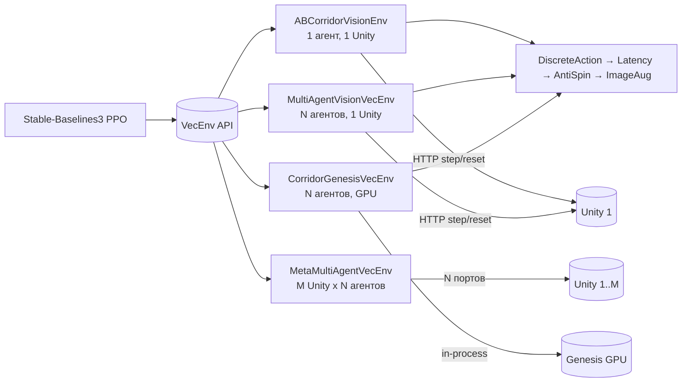

# 6 Программная обвязка обучения

Главы 4 и 5 описывают платформу как набор runtime-контуров — Unity, backend, Web UI и плагинная подложка. Настоящая глава смотрит на ту же платформу со стороны исследователя машинного обучения: она разбирает Python-обвязку, которая превращает Unity-симулятор в источник наблюдений для Stable-Baselines3, оркестрирует параллельный запуск, выполняет PPO, сохраняет артефакты и возвращает обученную ONNX-модель в backend через тот же контракт, что и операторский интерфейс. Изложение опирается на исходники из `python/sim_client/` и `python/training/`; все цитируемые имена существуют в репозитории на момент написания работы и проверяются поиском.

Важная оговорка касается границ ответственности раздела. Глава описывает программную обвязку обучения, а не результаты sim-to-real-переноса — последние выделены в главу 7 настоящей работы. Когда речь заходит о наблюдаемых проблемах сходимости при тяжёлой доменной рандомизации, материал ограничивается описанием реализации и фиксацией факта: подбор архитектуры и гиперпараметров находится в исследовательской фазе, и часть обсуждаемых решений принята именно ради повышения воспроизводимости при отрицательном результате обучения, а не для оптимистичной презентации успехов.

## 6.1 Связь Python-контура с симулятором

### 6.1.1 SimClient как единственная точка получения наблюдений

Все взаимодействия Python-кода с Unity-runtime проходят через один класс — `SimClient` (`python/sim_client/http_client.py`). Это сознательное архитектурное решение: для всей тренировочной обвязки Unity существует исключительно как HTTP-сервер на `http://127.0.0.1:8000`, отвечающий по контракту `runtime API`, описанному в главе 6 диссертации. Никакая часть тренировочного кода не импортирует Unity-сборку напрямую, не разделяет с ней процессное пространство и не использует общую память — связь идёт только через сетевые запросы.

```python
class SimClient:
    def __init__(self, base_url: str, timeout_s: float = 10.0):
        self.base_url = base_url
        self.timeout_s = timeout_s
        self.session = requests.Session()
        adapter = HTTPAdapter(pool_connections=4, pool_maxsize=16, max_retries=0)
        self.session.mount("http://", adapter)
        self.session.mount("https://", adapter)

    def health(self) -> Dict[str, Any]: ...
    def get_contract(self) -> Dict[str, Any]: ...
    def reset(self, config: Dict[str, Any]) -> Dict[str, Any]: ...
    def step(self, command: Dict[str, Any]) -> Dict[str, Any]: ...
```

Использование `requests.Session` с явно сконфигурированным `HTTPAdapter` решает практическую проблему, выявленную при ранних запусках на Windows. В Python без сессии каждый HTTP-запрос порождает новое TCP-соединение; при тренировке со скоростью порядка сотни шагов в секунду на четыре параллельных Unity-инстанции пул эфемерных портов исчерпывается за несколько минут (TIME_WAIT накапливается быстрее, чем освобождается), и `SubprocVecEnv`-воркеры начинают падать с `WinError 10055` или `EOFError`. Постоянная сессия и keep-alive снимают эту проблему: одно соединение переиспользуется на всё время эпизода. Параметр `pool_maxsize=16` подобран эмпирически — это потолок одновременных вызовов от одного Python-процесса к одному Unity-серверу, наблюдаемый при N агентах в `MultiAgentVisionVecEnv`.

Класс намеренно содержит минимальный набор методов и не вводит уровней абстракции поверх HTTP. Все семантические интерпретации — поля наблюдения, поля команды, форматы JPEG-кадров, идентификаторы агентов — остаются на стороне environment-классов из `python/training/`. `SimClient` отвечает только за то, что строка превратилась в HTTP-запрос, дождалась ответа и вернула распарсенный JSON. Такое разделение позволяет переиспользовать клиент в трёх существенно разных контекстах: тренировочном цикле, KPI-оценке `evaluate_ab_policy.py` и в инструментах командной строки `rusim doctor`/`rusim contract`. Все три контекста используют один и тот же класс, не пересекаясь по бизнес-логике.

Помимо тренировочных endpoint-ов клиент содержит методы для работы с реестром моделей backend: `list_models`, `get_active_model`, `activate_model`, `set_model_binding`, `upload_model`. Эти методы не используются во время обучения — они нужны на этапе доставки артефакта, но размещены в том же классе сознательно, потому что ровно тот же `SimClient` инструменты `rusim model install` и `rusim model activate` используют для загрузки готовой ONNX-модели в backend. Единая точка контакта с двумя серверами — Unity-runtime и backend — упрощает обработку ошибок и таймаутов.

### 6.1.2 Семантика reset и step

Контракт между Python-контуром и Unity сводится к двум методам: `reset` и `step`. Семантика этих методов на стороне Unity описана в главе 5 («SimulationManager: ядро жизненного цикла»); здесь рассматривается, как тренировочная обвязка с ними работает.

`reset(config)` принимает структуру `SimulationConfig` в JSON-форме: идентификаторы трассы и транспортного средства, параметры трассы, параметры агента, флаги и seed. Метод синхронен — Python-вызов блокируется, пока Unity не завершит уничтожение прошлой сцены, инстанцирование новой, применение параметров и первый snapshot. Возвращается полный `StepResult`, который содержит начальное наблюдение для policy и пустой `info` (на стороне Unity это вырожденный шаг с командой `(0, 0)`). Тренировочный код использует возвращаемое значение `reset` непосредственно — никакой дополнительной фазы прогрева нет.

`step(command)` принимает `ControlCommand` — пару (`throttle`, `steer`) для непрерывных моделей, либо одно из дискретных значений `DirStop/Forward/Back/Left/Right`, переданное через wrapper. Возвращаемый `StepResult` содержит поле `state.camera.frame` (base64-кодированный JPEG камеры primary-агента), массив `telemetry`, поля `state.pose` (позиция и ориентация Rigidbody) и `info` со служебными ключами (`frame_id`, `agent_count`, `route.completed`, `route.distance_m`).

```python
def reset(self, *, seed=None, options=None):
    step = self.client.reset(self._reset_config)
    obs, _ = self._build_observation(step)
    self._steps = 0
    self._last_progress = 0.0
    return obs, {}

def step(self, action):
    cmd = {"throttle": float(action[0]), "steer": float(action[1])}
    step = self.client.step(cmd)
    obs, info = self._build_observation(step)
    reward, terminated, truncated = self._compute_reward(step, action)
    self._steps += 1
    return obs, reward, terminated, truncated, info
```

Принципиальное свойство этой пары — синхронность. Тренировочный цикл PPO работает в стандартном Gymnasium-режиме: «получили obs, посчитали действие, отправили action, дождались следующего obs». Никаких асинхронных колбэков, очередей телеметрии или потоковой подписки на стороне Python нет. Все хитрости параллелизма вынесены в `MultiAgentVisionVecEnv` и `MetaMultiAgentVecEnv`, которые работают над тем же синхронным контрактом, просто отправляя в одну итерацию пакеты команд для нескольких агентов.

Пакетирование на стороне backend требует от Python-кода соблюдать одно правило: между `step` для разных агентов одного Unity-инстанса не должна вмешиваться команда `step` без `targetAgentId`. Когда такое случается, Unity воспринимает команду как обращение к primary-агенту, а primary-агент мог быть закрыт прошлой эпизодической терминацией. На уровне `MultiAgentVisionVecEnv` каждый шаг отдельного агента сопровождается явным `targetAgentId`; primary-команды не используются.

### 6.1.3 Загрузка сценария и параметризация запуска

Источником `SimulationConfig` для всех тренировочных запусков служит файл сценария в формате YAML. Сценарии размещены в `configs/scenarios/`; типичный пример — `cardboard-corridor-v1.yaml`, описывающий узкий коридор шириной 0.6 м, KS0223-агента и waypoint-маршрут «A → B». Загрузку и валидацию сценариев выполняет модуль `python/sim_client/scenario.py`.

```python
def load_scenario_file(path: str | Path) -> Dict[str, Any]:
    file_path = Path(path)
    suffix = file_path.suffix.lower()
    raw = file_path.read_text(encoding="utf-8")
    if suffix == ".json":
        payload = json.loads(raw)
    elif suffix in {".yaml", ".yml"}:
        if yaml is None:
            raise RuntimeError("PyYAML is required to load YAML scenarios.")
        payload = yaml.safe_load(raw)
    else:
        raise ValueError(f"Unsupported scenario file extension: {suffix}")
    if not isinstance(payload, dict):
        raise ValueError("Scenario document must be a JSON/YAML object.")
    return payload
```

Функция `validate_scenario` дополнительно проверяет согласованность полей: наличие `runtime.runtimeMode`, ключа `world.trackId`, типов поля `vehicle.vehicleId`, корректности списка `route.waypoints`, согласованности счётчика `agents.count` с массивом `agents.vehicles`. Валидация происходит на стороне Python до отправки конфигурации в Unity — это позволяет получить осмысленную диагностику с указанием конкретного отсутствующего поля, а не безличное «schema validation failed» от Unity-runtime.

Преобразование загруженного сценария в `SimulationConfig`-payload выполняет `scenario_to_reset_config`. Значения по умолчанию для `time_scale`, `max_steps`, `oob_margin_m` берутся из CLI-аргументов тренировочного скрипта; параметры маршрута и геометрии трассы — из секций `route.params` и `route.waypoints`. Сценарий тем самым служит «паспортом эксперимента»: пара (commit, scenario file) однозначно описывает, в какой среде шло обучение. Этот паспорт сохраняется в `metadata.json` рядом с моделью под ключом `scenario`.

Помимо сценариев тренировочный пайплайн принимает дополнительные параметры через CLI. Их три категории. Первая — параметры запуска Unity (адрес, порт, число параллельных инстанций); они влияют на физическое расположение HTTP-серверов, но не на содержимое симуляции. Вторая — параметры обучения (число шагов, гиперпараметры PPO, опции wrapper-стека); они меняют только Python-сторону. Третья — параметры доменной рандомизации (`spawn-jitter-m`, `ultrasonic-noise-sigma`, `lateral-penalty-mult`); они частично попадают в Unity через `trackParams` и частично остаются в env-обёртках. Разделение полностью описано в `parse_args()` главного тренировочного скрипта; в файле `metadata.json` зафиксированы все три категории, что обеспечивает воспроизводимость.

## 6.2 Обёртки сред: единый VecEnv-интерфейс

Stable-Baselines3 ожидает на входе либо обычную `gym.Env`, либо `VecEnv`, обслуживающий несколько параллельных эпизодов с единым observation/action space. В Python-контуре платформы реализованы четыре варианта среды, эквивалентные с точки зрения PPO, но различающиеся по тому, как именно они получают наблюдения и куда отправляют команды.



Рисунок 6.1 — Варианты сред и их связь с тренировочным циклом

Все четыре варианта возвращают одно и то же `observation_space`: словарь с ключами `image` (84×84×3 uint8 RGB) и `ultrasonic` (одномерный float32 в диапазоне 0..1). Это позволяет тренировать одну и ту же CNN-policy под любой из бэкендов без модификации кода policy.

### 6.2.1 Одиночная среда (ABCorridorVisionEnv)

`ABCorridorVisionEnv` (`python/training/ab_corridor_vision_env.py`, 836 строк) — базовый класс, описывающий одиночного агента в одиночной Unity-инстанции. Это `gym.Env`, не `VecEnv`: каждый его шаг — один HTTP `step` к одному Unity-серверу. Предполагается, что Unity запущен оператором отдельно (`./rusim server up --count 1`), а среда подключается к существующему серверу по `base_url`.

```python
class ABCorridorVisionEnv(gym.Env):
    def __init__(self, base_url="http://127.0.0.1:8000",
                 scenario_path=None, max_steps=600,
                 corridor_width_m=None, oob_margin_m=0.3,
                 goal_radius_m=None, time_scale=2.0,
                 grayscale=False, img_size=84,
                 track_id="track.basic_arena.v1",
                 vehicle_id="vehicle.prometeo.sport.v1",
                 ...):
        self.client = SimClient(base_url, timeout_s=30.0)
        self.observation_space = spaces.Dict({
            "image": spaces.Box(0, 255, (img_size, img_size, 3), dtype=np.uint8),
            "ultrasonic": spaces.Box(0.0, 1.0, (1,), dtype=np.float32),
        })
        self.action_space = spaces.Box(-1.0, 1.0, (2,), dtype=np.float32)
```

Среда отвечает за три функции, не покрываемые Unity-runtime: вычисление reward, проекция позиции агента на маршрут (для метрики `progress`) и формирование `observation` из base64-кадра камеры (декодирование, ресайз, опциональное grayscale-преобразование). Значимая часть кода — функция `_compute_reward`, которая собирает суммарную награду из компонентов `progress`, `lateral_penalty`, `heading_alignment_bonus`, `survival`, `time`, `backward_penalty`, `goal_bonus`, `oob_penalty`, `stall_penalty`. Каждый компонент возвращается в `info["reward_breakdown"]` для последующего логирования через `RewardBreakdownCallback`. Эта структура необходима именно для отладки: суммарная награда плохо помогает понять, почему модель остановилась в локальном минимуме, тогда как разложение по компонентам быстро показывает, какой именно член склоняет policy в нежелательное поведение.

Геометрия маршрута реконструируется из `route.waypoints` сценария. На каждом шаге вычисляется ближайшая точка на ломаной (`_seg_dist`), параметр проекции (`_project_t`) и накопленный прогресс (`_route_progress`); из этих трёх величин выводятся почти все компоненты reward. Вынесение геометрических функций в отдельные `_*` помощники (а не в методы `gym.Env`) позволяет переиспользовать их в `MultiAgentVisionVecEnv` и в `evaluate_ab_policy.py` без дублирования.

### 6.2.2 Multi-agent в одной Unity-инстанции (MultiAgentVisionVecEnv)

Базовый класс `ABCorridorVisionEnv` обслуживает один агент. Параллельное обучение через `SubprocVecEnv` SB3 требует N отдельных Python-процессов, каждый из которых поднимает собственный `SimClient` к собственной Unity-инстанции — N инстанций Unity со своими физическими движками, своими камерами и своими серверами. Это даёт честный параллелизм, но обходится в 5-7 ГБ оперативной памяти на инстанцию и значительный CPU-overhead.

`MultiAgentVisionVecEnv` (`python/training/multi_agent_vision_env.py`, 564 строки) реализует альтернативную модель: одна Unity-инстанция содержит N агентов в одной сцене (через `SimulationConfig.agents`), и Python-контур обращается к ним по очереди в одной HTTP-сессии. Это срабатывает потому, что Unity физически считает все N агентов одним `FixedUpdate`-циклом — суммарная стоимость на сцене в N раз меньше, чем у N независимых инстанций.

```python
class MultiAgentVisionVecEnv(VecEnv):
    def __init__(self, n_agents, base_url, scenario_path,
                 max_steps, time_scale, img_size,
                 corridor_width_m, goal_radius_m,
                 waypoints, track_id="track.cardboard_corridor.v1",
                 maze_randomize=False, ...):
        self.n_agents = int(n_agents)
        self.client = SimClient(base_url, timeout_s=30.0)
        observation_space = spaces.Dict({...})
        action_space = spaces.Box(-1.0, 1.0, (2,), dtype=np.float32)
        super().__init__(self.n_agents, observation_space, action_space)
```

Принципиальный момент — поведение при терминации эпизода одного из агентов. SB3 ожидает, что `VecEnv` поддерживает auto-reset: когда агент терминируется, следующий `step` для него возвращает уже obs из новой эпизодической инициализации. В реализации это означает, что при возврате `done=True` для агента `i` среда формирует трассируемый `terminal_observation` в `info[i]["terminal_observation"]`, а затем посылает в Unity `reset` именно для этого агента (с сохранением остальных). Соответствующий вызов в Unity-runtime — `reset_agent(agent_id, vehicle_params, spawn_params)` — реализован в `SimulationManager` ровно для этого случая.

Параметры `maze_randomize` и `maze_regen_every` предназначены для трассы `track.cardboard_maze.v1`, которая поддерживает процедурную генерацию лабиринта при каждом `reset`. Когда они включены, `MultiAgentVisionVecEnv` запрашивает новую конфигурацию maze через специальный набор `trackParams` (`maze.seed`, `maze.length_cells`, `maze.left_turns`, `maze.right_turns`, `maze.corridor_width_m`, `maze.wall_height_m`) — Unity-runtime считывает их в `CardboardMazeTrack.ResetTrack` и собирает новый коридор.

### 6.2.3 Meta-multi-agent: N Unity на M агентов (MetaMultiAgentVecEnv)

`MultiAgentVisionVecEnv` упирается в потолок производительности одиночной Unity-инстанции: при достижении примерно восьми агентов в одной сцене стоимость рендеринга восьми отдельных камерных текстур начинает доминировать над выгодой от единого `FixedUpdate`. Дополнительно при некоторых настройках Unity-сцены наблюдается сериализация камерных проходов, и время одного шага растёт нелинейно.

`MetaMultiAgentVecEnv` (`python/training/meta_multi_agent_vec_env.py`) обходит этот потолок, объединяя несколько `MultiAgentVisionVecEnv` поверх отдельных Unity-процессов на разных портах.

```python
class MetaMultiAgentVecEnv(VecEnv):
    def __init__(self, n_unity, agents_per_unity, base_url_template, ...):
        self.inner_envs: list[MultiAgentVisionVecEnv] = []
        for i in range(self.n_unity):
            url = base_url_template.format(port=base_port + i)
            env = MultiAgentVisionVecEnv(
                n_agents=self.agents_per_unity, base_url=url, ...)
            self.inner_envs.append(env)
        total_agents = self.n_unity * self.agents_per_unity
        self._executor = ThreadPoolExecutor(max_workers=self.n_unity)
        super().__init__(total_agents, ...)
```

Ключевая деталь — пул потоков: вызовы `inner.step` для разных Unity-инстанций отправляются параллельно через `ThreadPoolExecutor`, а не последовательно. Поскольку каждый вызов блокируется в `socket.recv` на ответе Unity-runtime, Python GIL во время блокировки освобождён, и параллельный execution случается на уровне ОС — N сетевых ожиданий протекают одновременно. Это позволяет получить почти линейный прирост производительности по числу Unity-инстанций без перехода на multiprocessing.

Меta-VecEnv был введён в качестве обхода обнаруженной проблемы: на Windows с Python 3.13 `SubprocVecEnv` детерминированно падал примерно на 116-тысячном тренировочном шаге с разрывом pipe. Воспроизводимость отказа подтверждалась многократно, но устранить его в рамках стандартной SB3-схемы не удалось. Многопоточная meta-VecEnv-обёртка обходит проблему: pipe не используется, обмен идёт по TCP-сокетам, переиспользуемым через `requests.Session`, и проблема исчезает.

### 6.2.4 Genesis-вариант для GPU-параллельной симуляции

Все три рассмотренные среды используют Unity как симулятор и упираются в его пропускную способность. Производительность Unity-runtime на одной инстанции — порядка двухсот шагов в секунду на M2 Max при `time_scale=3.0`, и в meta-multi-agent с тремя Unity и восьмью агентами совокупно достигаются порядка 1500-1800 шагов в секунду. Этого достаточно для исследовательских прогонов в рамках магистерской работы, но недостаточно для серьёзных sweep-ов гиперпараметров.

Поэтому реализован четвёртый вариант — `CorridorGenesisVecEnv` (`python/training/corridor_genesis_env.py`, 419 строк) — поверх Genesis, GPU-параллельного физического симулятора. Genesis запускает N сред в одном процессе на GPU, что снимает HTTP-overhead и параллелизирует вычисления физики и рендеринга на уровне CUDA-ядер. Целевая пропускная способность на RTX 5080 составляет порядка пяти тысяч шагов в секунду при `n_envs=512`.

```python
class CorridorGenesisVecEnv(VecEnv):
    def __init__(self, n_envs=64, max_steps=400,
                 corridor_width_m=0.60, oob_margin_m=0.10,
                 goal_radius_m=0.25, waypoints=None,
                 img_size=84, env_spacing=(12.0, 12.0),
                 backend="auto", dt=DEFAULT_DT, show_viewer=False):
        ...
```

KS0223 в Genesis-варианте моделируется не как полная физическая модель с колёсами и подвеской, а как кинематический box, у которого напрямую задаются линейная и угловая скорости. Это намеренное упрощение: реальный KS0223 имеет дифференциальный привод, и его динамика близка к идеальному кинематическому управлению на разумных скоростях, поэтому потеря точности в физике компенсируется выигрышем в скорости. Калибровка кинематики — `ROBOT_MAX_SPEED = 0.73` м/с, `ROBOT_MAX_YAW_RATE = 380 °/с`, `DEFAULT_DT = 0.14` с — взята из натурных замеров, которые описаны в главе 7.

Структура reward в Genesis-варианте полностью повторяет `ABCorridorVisionEnv._compute_reward`: те же компоненты с теми же весами. Это даёт policy, обученной в Genesis, шанс работать в Unity и наоборот; в реальности кросс-перенос оказался плохим (см. главу 7), но на уровне обвязки Genesis-бэкенд является взаимозаменяемым с Unity-бэкендом.

### 6.2.5 Wrappers: DiscreteActionWrapper, image augmentation, latency

Над любой из четырёх сред поднимается стек обёрток, превращающий её непрерывный action-space в дискретный, добавляющий action latency и применяющий аугментации к наблюдениям. Стек применяется в строго заданном порядке, который реализован в функции `_wrap_env` тренировочного скрипта.

```python
def _wrap_env(base_env, *, enable_aug, enable_anti_spin,
              enable_latency, latency_steps, seed,
              enable_discrete=True, strong_aug=False, latency_max=-1):
    env = base_env
    if enable_discrete:
        env = DiscreteActionWrapper(env)
        if enable_latency and latency_steps > 0:
            dmax = latency_max if latency_max > latency_steps else None
            env = DelayedActionWrapper(env, delay_steps=latency_steps, delay_max=dmax)
        if enable_anti_spin:
            env = AntiSpinRewardWrapper(env)
    if enable_aug:
        env = ImageAugObservationWrapper(env, enable=True, seed=seed)
    return env
```

`DiscreteActionWrapper` (`python/training/discrete_action_wrapper.py`) превращает `Box(-1, 1, (2,))` в `Discrete(5)`. Каждое из пяти дискретных действий маппится в фиксированную пару `(throttle, steer)`: `DirStop=(0,0)`, `DirForward=(+1,0)`, `DirBack=(-1,0)`, `DirLeft=(0,+1)`, `DirRight=(0,-1)`. Это сделано не ради уменьшения action space (хотя это и помогает PPO сходиться быстрее на vision-задачах), а ради соответствия реальному KS0223. Реальный робот через `MainControl.py` принимает только пять дискретных команд, и обучать policy в континуальном action space — значит выпускать модель, которая в моменте развёртывания будет тривиально проецировать свой выход на дискретное множество, теряя любую плавность управления, которой её научили в симе. Дискретизация на стороне обучения снимает это несоответствие.

Задание `DirLeft = (0, +1)` без forward-throttle проходит проверку с помощью теста `test_discrete_action_wrapper.py`, гарантирующего, что вектор действия совпадает в точности с указанной таблицей. Тест существует именно потому, что в одной из ранних ревизий `DirLeft` имел форму `(+0.5, +1.0)` («forward+turn arc») — это казалось разумным для Ackermann-подобных колёс, но позже выяснилось, что `Ks0223Vehicle` в Unity реализует чистый дифференциальный привод, и `(0, +1)` корректно трактуется как поворот на месте без линейного движения. Запись этого инварианта в тест предотвращает регрессии.

`DelayedActionWrapper` (`python/training/latency_wrapper.py`) добавляет лаг между подачей действия и его применением. Реальный inference loop на KS0223 работает с интервалом порядка 140 мс (7 Гц), и за этот интервал среда успевает существенно измениться. Без латентности policy учится принимать решения по «свежим» кадрам, а на реальном роботе сталкивается с тем, что её действие применяется к состоянию, наступившему через тик. Wrapper хранит очередь действий длиной `delay_steps` и при каждом `step` подаёт в env действие, поданное `delay_steps` шагов назад. Опциональный `delay_max` включает рандомизацию задержки в диапазоне `[delay_steps, delay_max]` — это моделирует jitter сетевых и USB-задержек на реальной системе.

`ImageAugObservationWrapper` (`python/training/image_aug_wrapper.py`) применяет к `obs["image"]` стохастический набор аугментаций: яркость, контраст, hue-shift, размытие, JPEG-recompression, добавление гауссова шума. Параметры по умолчанию подобраны под умеренную доменную рандомизацию; режим `--strong-aug` усиливает их (диапазоны 0.30 вместо 0.15, blur radius до 2.0 вместо 1.2). Цель wrapper-а — подготовить policy к различиям между чистыми Unity-кадрами и зашумлёнными кадрами реальной USB-камеры.

`AntiSpinRewardWrapper` (`python/training/anti_spin_reward.py`) добавляет штраф за многократное повторение одного и того же дискретного действия. Это отдельная попытка лечения наблюдаемой деградации: на ранних этапах обучения PPO иногда сходился к degenerate-policy, повторявшей `DirLeft` или `DirRight` бесконечно — крутящееся на месте поведение давало небольшой положительный reward от `survival`, но не приносило прогресса. Штраф за пять и более одинаковых действий подряд делает такое поведение невыгодным.

## 6.3 Тренировочный пайплайн на Stable-Baselines3

### 6.3.1 PPO как основной алгоритм

В качестве основного RL-алгоритма выбран PPO (Proximal Policy Optimization) в реализации Stable-Baselines3. Выбор обоснован тремя соображениями. Первое — устойчивость к гиперпараметрам: в отличие от off-policy методов вроде SAC или TD3, PPO предполагает on-policy буфер, лимитирующий длину rollout-а одной итерации; такой буфер не накапливает stale-данные и не порождает эффектов, требующих тонкой настройки таргет-сетей и priority replay. Второе — наличие реализации `MultiInputPolicy`, поддерживающей обсервации в виде словаря; именно такая форма используется во всех env-обёртках платформы (`{image, ultrasonic}`). Третье — поддержка `RecurrentPPO` через `sb3-contrib`: при необходимости перейти на LSTM-policy для non-Markovian задач (см. подраздел 6.4.2) переключение делается одной CLI-опцией без переписывания training-loop.

Альтернативой рассматривался DQN — он естественно ложится на дискретный action-space из пяти команд KS0223, и его off-policy характер позволял бы использовать prioritized replay для редких terminal-эпизодов. От DQN отказались из-за того, что для CNN-policy с словарным observation space SB3 нужна была бы заметная адаптация `QNetwork`, тогда как PPO работал «из коробки». Оба алгоритма проверены на ранних спайках (rev1-rev4 в `python/training/artifacts/ab_corridor_*`); PPO давал более стабильную кривую обучения на одних и тех же 200 тысячах шагов.

Дискретное действие, подаваемое в env, превращается на стороне PPO в `Categorical(5)`-распределение. Соответствующий action_dist класс — `CategoricalDistribution`; он построен поверх логитов размерности 5, выходящих из `action_net` policy. Этот факт явно проверяется ассертом в тренировочном скрипте, чтобы исключить ситуацию, когда `MultiInputPolicy` ошибочно соберёт `DiagGaussianDistribution` (что произошло бы, если бы env-обёртки оставили continuous action space):

```python
print(f"  Action dist: {type(model.policy.action_dist).__name__}")
assert "Categorical" in type(model.policy.action_dist).__name__, \
    f"Expected Categorical action dist for Discrete action_space, got {type(model.policy.action_dist)}"
```

### 6.3.2 train_cardboard_corridor_v9.py: общий поток

Главный тренировочный скрипт — `python/training/train_cardboard_corridor_v9.py` (978 строк). Его «v9» в названии указывает на ревизию набора wrapper-ов: версии v6-v8 (continuous-action, без latency, без anti-spin) сохранены в репозитории как `train_cardboard_corridor.py` для воспроизводимости старых результатов; v9 — текущая основная.

Поток исполнения скрипта идёт в одной функции `main` и состоит из шести фаз. Первая — парсинг CLI-аргументов и подготовка путей к артефактам и логам (`resolve_artifact_dir` собирает `python/training/artifacts/<model-name>/<version>/` по умолчанию). Вторая — построение тренировочной среды: в зависимости от флагов `--meta-multi-agent`, `--multi-agent` и `--num-envs` выбирается одна из четырёх описанных в 6.2 реализаций. Третья — оборачивание среды в дополнительные SB3-обёртки: `VecFrameStack` для frame stacking при `--frame-stack > 1`, `VecNormalize` для нормализации reward при `--normalize-rewards`. Четвёртая — построение модели PPO: либо `PPO.load(args.resume, ...)` для resume, либо новый экземпляр с явно собранным `policy_kwargs`. Пятая — сборка списка callback-ов и запуск `model.learn`. Шестая — сохранение SB3-чекпоинта, ONNX-экспорт и запись `metadata.json`.

```python
def main() -> int:
    args = parse_args()
    output_dir = resolve_artifact_dir(ROOT, args.output_dir,
                                      args.model_name, args.model_version)
    log_dir = Path(args.log_dir)
    output_dir.mkdir(parents=True, exist_ok=True)
    log_dir.mkdir(parents=True, exist_ok=True)
    ...
    model = ppo_cls(policy_id, train_env,
                   learning_rate=args.learning_rate,
                   n_steps=args.n_steps, batch_size=args.batch_size,
                   n_epochs=args.n_epochs, gamma=args.gamma,
                   clip_range=args.clip_range, ent_coef=ent_coef_value,
                   target_kl=target_kl, verbose=1, seed=args.seed,
                   device=args.device, tensorboard_log=tensorboard_log,
                   policy_kwargs=policy_kwargs)
    ...
    model.learn(total_timesteps=args.total_timesteps,
                callback=callbacks, progress_bar=False)
    model.save(str(model_path))
    export_to_onnx_discrete(model, onnx_path, img_size=args.img_size)
    write_json(output_dir / "metadata.json", metadata)
```

Флаг `--resume` предусматривает важный для исследовательской работы сценарий: продолжение обучения с прошлого чекпоинта с обновлёнными гиперпараметрами. Когда он указан, `PPO.load` восстанавливает policy и optimizer из `.zip`-файла, а затем поверх восстановленных значений ставятся `learning_rate`, `clip_range`, `ent_coef` и `target_kl` из новых CLI-аргументов. `num_timesteps` сохраняется автоматически — это позволяет продолжать обучение, не сбрасывая total-счётчик и сохраняя прогресс curriculum-стейджей.

### 6.3.3 Гиперпараметры и их обоснование

Дефолты гиперпараметров выбраны по итогам последовательности ревизий rev1-rev42, зафиксированных в `python/training/artifacts/cardboard-corridor-ppo-v9-rev*`. Каждый rev-ID соответствует одному прогону с фиксированной комбинацией параметров; их изменение явно прописано в commit message и в комментариях `parse_args`. Текущие defaults и их назначение приведены в таблице 6.1.

Таблица 6.1 — Гиперпараметры PPO в `train_cardboard_corridor_v9.py`

| Параметр | Default | Назначение | Когда менять |
|---|---|---|---|
| `learning_rate` | 3e-4 | Стандартный SB3 PPO LR | На R3M-extractor: понижают до 1e-4 |
| `n_steps` | 512 | Длина rollout-а | rev38: подняли с 256 — мало transitions/update на vision RL |
| `batch_size` | 64 | Mini-batch GAE | На GPU с большой памятью повышают до 256 |
| `n_epochs` | 10 | PPO update epochs | rev38: подняли с 4 — стандарт для vision RL |
| `gamma` | 0.99 | Discount factor | Длинные эпизоды (>400 шагов) на 0.995 |
| `clip_range` | 0.2 | PPO clip ratio | Не трогать без оснований |
| `ent_coef` | 0.1 | Entropy bonus | rev29: явно зафиксирован 0.1 после drift на 0.02 |
| `target_kl` | 0.02 | Anti-collapse early stop | rev30: введён, по умолчанию активен |
| `frame_stack` | 1 | Stacking k frames | rev38: рекомендуется 4 для maze |
| `seed` | 42 | RNG seed | Sweep-ы: 42, 1337, 7, 11, 23 |

Несколько пунктов требуют пояснения. `ent_coef = 0.1` зафиксирован после неприятного открытия: ревизии rev24-rev28 наследовали значение 0.02 от ранних экспериментов (rev10-rev18 обучались с 0.1), что в пять раз снижало entropy-бонус и приводило к ранней схлопыванию policy в degenerate-режим на тяжёлой доменной рандомизации. Default был явно поднят в коммите 4c46ef8 с комментарием в коде, фиксирующим инвариант. Это пример случая, когда «молчаливое наследование» дефолтов из чужого скрипта оказалось хрупкой точкой; в дальнейшем все hyperparameter-инварианты дублируются в `metadata.json` под ключом `hyperparameters`.

`target_kl = 0.02` — стандартное anti-collapse-значение из литературы по PPO. Параметр заставляет SB3-implementation досрочно прервать update, если KL-divergence между старой и новой policy превысила порог за один epoch. До rev30 параметр был отключён (`None`), что в комбинации с большими `ent_coef` иногда давало catastrophic update — единичный rollout с экстремальным advantage сдвигал policy так сильно, что она теряла сходимость. Включение `target_kl` устранило эти эпизодические провалы.

`n_steps = 512` и `n_epochs = 10` подняты в rev38 после анализа PPO-литературы для vision RL. До rev37 значения были `n_steps = 256, n_epochs = 4` — это давало 1024 transitions per update при четырёх агентах, что в стандартных vision-бенчмарках (Procgen, Atari) считается недостаточным. Подъём до 4096 transitions per update при восьми агентах (`512 × 8`) выровнял условия с эталонными конфигами.

Параметр `--ent-coef-schedule linear` включает линейную интерполяцию `ent_coef` от стартового значения до `--ent-coef-end`. Реализация — в виде callback `EntCoefScheduleCallback`, переписывающего `model.ent_coef` на каждом шаге; SB3 нативно умеет планировать только `learning_rate`. Высокий entropy в начале обучения предотвращает раннее схлопывание в неправильный basin, низкий в конце даёт sharp-policy с детерминированными решениями.

### 6.3.4 Курикулум и мониторинг через EvalCallback

Тренировочный цикл оснащён четырьмя стандартными callback-ами и двумя авторскими. Стандартные — `ProgressCallback` (печатает процент и FPS), `CheckpointCallback` (сохраняет SB3-чекпоинт каждые `--checkpoint-freq` шагов), `EvalCallback` (запускает policy на отдельной clean-DR-среде и сохраняет лучшую модель), и `MazeCurriculumCallback` (см. ниже). Авторские — `ActionStatsCallback` и `RewardBreakdownCallback`.

`ActionStatsCallback` ведёт скользящее окно из последних N действий и публикует доли каждого из пяти дискретных действий в TensorBoard как scalar-метрики `actions/frac_DirStop`, `actions/frac_DirForward`, …, `actions/top_idx`, `actions/top_frac`. Цель — раннее обнаружение degenerate-collapse: если за первые 50 тысяч шагов 95% действий — это `DirRight`, дальше учить бесполезно, и тренировку лучше прервать вручную. Формат scalar-серий вместо `Histogram` выбран из-за того, что в TensorBoard scalar-серии лучше группируются и допускают сравнение между прогонами — критично для исследовательской работы с десятками ревизий.

`RewardBreakdownCallback` агрегирует разложенные компоненты reward, возвращаемые env-обёртками в `info["reward_breakdown"]`. Каждые `--reward-log-freq` шагов средние значения (`progress_mean`, `lateral_penalty_mean`, `goal_bonus_mean`, …) публикуются в TensorBoard. Это даёт возможность отвечать на вопросы вида «Почему reward не растёт — penalty душит progress, или progress сам по себе мал?» без перезапуска тренировки.

`MazeCurriculumCallback` (`python/training/maze_curriculum.py`) реализует staged-difficulty для процедурного maze-track-а. Конфигурация по умолчанию состоит из четырёх стадий: `stage-A-easy` (5 клеток, 1 поворот направо), `stage-B-medium` (5-7 клеток, до одного поворота налево, 1-2 направо), `stage-C-hard` (6-8 клеток, 1-2 налево, 1-3 направо) и `stage-D-full` (6-10 клеток, 1-3 в обе стороны). Стадии переключаются по числу total timesteps: 0, 25 000, 60 000, 100 000.

```python
DEFAULT_STAGES: List[CurriculumStage] = [
    CurriculumStage(name="stage-A-easy", start_step=0,
                    ranges={"length_cells": (5, 5), "left_turns": (0, 0),
                            "right_turns": (1, 1),
                            "corridor_width_m": (0.58, 0.62), ...}),
    CurriculumStage(name="stage-B-medium", start_step=25_000, ranges={...}),
    CurriculumStage(name="stage-C-hard", start_step=60_000, ranges={...}),
    CurriculumStage(name="stage-D-full", start_step=100_000, ranges={...}),
]
```

Выбор пороговых значений зафиксирован эмпирически: на rev2-rev5 наивная полнодиапазонная maze-рандомизация с первого шага не сходилась — policy не получала ни одного успешного эпизода и optimizer не имел сигнала, поверх которого можно было бы строить градиент. Стадия `stage-A-easy` гарантирует положительный reward на первой же попытке и даёт PPO стабильный градиент. Дальнейшие стадии расширяют распределение по одному параметру за раз. Такая схема — стандартный приём curriculum learning, описанный, например, у Bengio (2009), и здесь применена в чистом виде.

`EvalCallback` использует отдельную Unity-инстанцию, поднимаемую оператором на отдельном порту перед запуском тренировки (`./rusim server up --count 4` плюс `--eval-base-url http://127.0.0.1:8003`). Среда оценки строится тем же `_build_eval_env`, но с отключёнными аугментациями и anti-spin-штрафом — на eval policy должна работать на «чистом» дистрибуции, а не на том, что она видела в training. Параметр `latency` оставлен включённым: это часть симулируемой реальности, а не часть рандомизации.

## 6.4 Domain randomization и подготовка к sim-to-real

### 6.4.1 Heavy-DR: текстуры, освещение, спавны

Доменная рандомизация (DR) — техника, при которой тренировочная среда генерируется со случайными вариациями визуальных и физических параметров на каждом эпизоде, чтобы policy училась на распределении, более широком, чем реальная среда развёртывания. В Python-обвязке платформы DR разделена на две части: «лёгкая» рандомизация, реализуемая внутри env-обёрток (image augmentation, ultrasonic noise, action latency), и «тяжёлая» рандомизация (heavy-DR), реализуемая на стороне Unity через `trackParams` и `vehicleParams` сценария.

Heavy-DR-параметры передаются в Unity при каждом `reset` через секцию `trackParams`. Они охватывают четыре класса вариаций. Первый — параметры геометрии лабиринта: `maze.seed`, `maze.length_cells`, `maze.left_turns`, `maze.right_turns`, `maze.corridor_width_m`, `maze.wall_height_m`. Второй — параметры визуального оформления: текстуры стен (выбор из набора), цвет освещения, интенсивность ambient-источника, угол солнца. Третий — параметры спавна: `spawn.jitter_xy_m` и `spawn.jitter_yaw_deg`, добавляющие смещение и поворот к стартовой позе агента. Четвёртый — параметры зашумления сенсоров: `sensor.ultrasonic.noise_sigma`, `sensor.ultrasonic.dropout_prob`.

```python
p.add_argument("--spawn-jitter-m", type=float, default=0.0,
               help="±N metres XY spawn jitter (Unity-side via trackParams)")
p.add_argument("--spawn-yaw-jitter-deg", type=float, default=0.0,
               help="±N degrees spawn yaw jitter (Unity-side via trackParams)")
p.add_argument("--ultrasonic-noise-sigma", type=float, default=0.0,
               help="Gaussian noise stddev (meters) added to front ultrasonic")
p.add_argument("--ultrasonic-dropout-prob", type=float, default=0.0,
               help="Per-step probability ultrasonic returns 0 or 5m")
```

Дефолты для всех heavy-DR-параметров — нули, то есть рандомизация по умолчанию выключена. Это сделано сознательно: включение каждого параметра требует обоснования и эмпирической проверки, что добавленный шум не уничтожает сходимость. Рекомендуемые значения для rev39+ — `spawn-jitter-m=0.10`, `spawn-yaw-jitter-deg=30`, `ultrasonic-noise-sigma=0.02`, `ultrasonic-dropout-prob=0.02`.

При исследовании sim-to-real-переноса наблюдалось систематическое схлопывание PPO под heavy-DR. В ревизиях rev30-rev35 (ночные прогоны на ssh-машине с RTX) шесть последовательных попыток на разных seed-ах дали 0% success rate на eval-среде. Bisect по env-коду подтвердил, что регрессия не вызвана багом в env-обёртках — те же seed-ы на rev16-rev18 (без heavy-DR, но с image augmentation) давали порядка 60% success. Вывод: проблема в дисперсии PPO под широким DR-распределением, а не в реализации. Отсюда два направления, описанных в 6.4.2 и 6.4.3: расширение архитектуры (frame stacking, R3M, RecurrentPPO) и более узкие визуальные изменения, ориентированные на конкретные особенности реальной камеры. Reward-шейпинг в качестве лекарства не рассматривался — изменение весов компонентов не разрешает фундаментальной проблемы, что под широким распределением PPO теряет сигнал.

### 6.4.2 Frame stacking и историческая память

Стандартное наблюдение в `ABCorridorVisionEnv` — один кадр 84×84×3, отвечающий мгновенному состоянию сцены. На многих RL-задачах это достаточно: маршрут детерминирован, фронтальная камера видит препятствия, и Markov-предположение приближённо выполняется. На задаче навигации в случайном лабиринте (`track.cardboard_maze.v1`) Markov-предположение нарушается: policy, оказавшись на пересечении коридоров, не может определить из единственного кадра, по какому ответвлению уже двигалась в прошлом. Без памяти policy в лучшем случае осваивает эвристику «всегда поворачивай налево», которая работает на маленьких лабиринтах и проваливается на больших.

Решение в виде frame stacking: к текущему кадру конкатенируются k предыдущих по канальной оси, и policy получает на вход тензор `(84, 84, 3·k)`. Эта схема — стандарт RL на Atari (Mnih et al., 2015) и на гонках в reinforcement-learning-окружениях; в Python-обвязке платформы она реализована через стандартный `VecFrameStack` SB3.

```python
if args.frame_stack > 1:
    if not isinstance(train_env, _VecEnvType):
        train_env = DummyVecEnv([lambda: train_env])
    train_env = VecFrameStack(train_env, n_stack=args.frame_stack,
                              channels_order='last')
```

Параметр `channels_order='last'` важен: NatureCNN, используемый SB3 по умолчанию, ожидает наличия канальной размерности на последнем месте, а frame_stack сам по себе мог бы вставить новые каналы в начало (это default в более старых версиях SB3, поведение которого зависит от версии gym). Явное указание избавляет от этого источника ошибок.

Альтернативный механизм исторической памяти — `RecurrentPPO` с LSTM-policy. В тренировочном скрипте он включается флагом `--recurrent`, что переключает `ppo_cls` с `PPO` на `sb3_contrib.RecurrentPPO` и `policy_id` на `MultiInputLstmPolicy`. LSTM hidden state переносится между шагами одного эпизода и обнуляется при `reset`. Этот вариант теоретически мощнее frame stacking — он способен интегрировать произвольно длинную историю, а не фиксированные k кадров, — но на практике RecurrentPPO в SB3 заметно сложнее в обучении и чаще требует ручной настройки `n_steps` и `batch_size`. В исследовательских прогонах rev40+ оба варианта пробовались.

### 6.4.3 Real-camera post-processing

Опция `--real-cam-postprocess` (флаг `--real-cam-postprocess` в CLI) включает специализированный пайплайн пост-обработки 84×84-кадра, имитирующий характеристики реальной USB-камеры KS0223. Он отличается от обычной image augmentation тем, что не рандомизирует — а применяет фиксированную последовательность операций, выведенную из натурных съёмок реальной камеры в условиях лабораторного стенда: затемнение (потеря яркости при ауто-экспозиции), десатурация (теплоту лампы), JPEG-recompression на низкое качество (артефакты USB-кодека).

Цель опции — не расширить распределение наблюдений, а сдвинуть его в сторону реального. Логика следующая: при обычной image augmentation policy учится на распределении, центрированном в чистом Unity-render, с добавленной шумовой оболочкой; при `real-cam-postprocess` распределение центрируется ближе к тому, что policy увидит на реальной системе. Опция совместима с обычной image augmentation: при включении обеих сначала применяется реальная пост-обработка, затем поверх — стохастические аугментации.

Опция передаётся в Unity-runtime, а не реализуется только на стороне Python: ряд параметров (например, ауто-экспозиция камеры) проще выставить через `vehicleParams`, чем имитировать пост-обработкой. Это разделение нашло отражение в env-конструкторе `ABCorridorVisionEnv(real_cam_postprocess=...)`, который пробрасывает флаг и в Unity, и в собственный пост-обрабатывающий шаг для тех аспектов, которые проще делать в Python.

## 6.5 KPI-оценка и evidence

### 6.5.1 evaluate_ab_policy.py: 20-эпизодный success rate

### 6.5.2 Структура evidence-папки и воспроизводимость

### 6.5.3 Сравнение revisions (rev16 → rev30+)

## 6.6 Экспорт ONNX-артефакта и связь с backend

### 6.6.1 torch.onnx.export: тонкие места

### 6.6.2 metadata.json и metrics.json: формат

### 6.6.3 rusim model install / activate / bind

## 6.7 Тестовое покрытие

### 6.7.1 Wrapper-тесты (DiscreteAction, image augmentation, latency, anti-spin reward)

### 6.7.2 Multi-runtime launch test

### 6.7.3 Resume curriculum test
