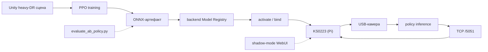

# 7 Sim-to-real эксперименты на KS0223

Главы 4–6 описывают платформу с инженерной стороны: архитектуру runtime, контракт API и Python-обвязку обучения. Настоящая глава смотрит на ту же платформу со стороны её прикладного использования — как на инструмент для проведения sim-to-real-эксперимента над физическим роботом KS0223. Изложение опирается на результаты, полученные в трёх спринтах преддипломной практики, и описывает их так, как они были зафиксированы в evidence-папках и changelog-файлах: с реальными числами, с отказами, с непройденными ветвями работы. Цель главы — продемонстрировать, что построенная платформа пригодна для проведения серьёзного экспериментального исследования, и одновременно честно зафиксировать границу между подтверждёнными результатами и гипотезами, требующими продолжения.

Магистерская работа посвящена разработке расширяемой Unity-платформы, а не конкретному ML-результату. Выполненные sim-to-real-эксперименты служат вариантом использования платформы — доказательством того, что её архитектура поддерживает полный цикл «обучение в симе — экспорт ONNX — развёртывание в backend — выполнение на физическом роботе». Соответствующее позиционирование зафиксировано в разделе 1 и оговорено в выводах настоящей главы.

## 7.1 Постановка sim-to-real задачи

### 7.1.1 Целевая платформа: KS0223 как физическая система

Целевая аппаратная платформа — образовательный мобильный робот KS0223 (Keyestudio) на базе Raspberry Pi 4. Корпус габаритами 15×25×15 см, дифференциальный привод на двух ведущих колёсах с независимыми DC-моторами, два пассивных опорных ролика. Сенсорная подсистема состоит из ультразвукового дальномера HC-SR04 на передней панели и USB-камеры с ракурсом «глазами робота» на мачте высотой 9 см. Связь с управляющим компьютером — Wi-Fi через локальный TCP-канал на порту 5051; команды управления передаются как одно из пяти дискретных значений `DirStop`, `DirForward`, `DirBack`, `DirLeft`, `DirRight`, обработка которых выполняется бортовым скриптом `MainControl.py`.

Существенным свойством KS0223 как объекта sim-to-real-переноса является open-loop-характер бортового управления. Прошивка робота в её базовой конфигурации не предоставляет обратной связи по энкодерам колёс или инерциальной измерительной единице. Команда поворота сводится к включению моторов на фиксированный PWM до прихода следующей команды, и фактический угол поворота за один тик управления варьируется от 30 до 60 градусов в зависимости от заряда батареи, трения колёс о покрытие, мёртвой зоны моторов в диапазоне двадцати–тридцати процентов от максимального PWM и инерции вращения. Это свойство отличает KS0223 от целевых платформ типичных sim-to-real-работ, где низкоуровневое управление замкнуто PID-контурами на скорость колёс. Разрыв между детерминированной физикой симулятора и стохастичным open-loop-управлением реального робота составляет один из источников sim-to-real-расхождения, отдельный от визуального.

Калибровочные параметры физической модели KS0223 определены натурными замерами и зафиксированы в сценарии симулятора `track.cardboard_corridor.v1`: максимальная линейная скорость 0,73 м/с, максимальная угловая скорость 380 °/с, фиксированный шаг управления 140 мс (что соответствует частоте семь герц). Эти же значения используются Python-обвязкой в `corridor_genesis_env.py` (раздел 6.2.4) и определяют связь между continuous-action `(throttle, steer)` PPO-policy и пятью дискретными командами TCP-канала.

### 7.1.2 Sim-to-real разрыв: визуальная и физическая природа

Sim-to-real-разрыв в задачах визуальной навигации имеет две природы — визуальную и физическую — и обе наблюдались в работе явно. Визуальная природа разрыва связана с расхождением распределений RGB-кадров: тренировочный материал собирается рендером Unity со специфической PBR-моделью освещения, шейдерами стандартного pipeline и фиксированной геометрией текстур, тогда как реальная USB-камера KS0223 формирует кадр через автоматическую экспозицию, white-balance и JPEG-кодек с характерными артефактами. Диапазоны яркости и насыщенности в этих двух распределениях не совпадают, и обученная на одном CNN-policy производит на другом существенно отличающиеся распределения действий.

Физическая природа разрыва проявляется через расхождение динамики. В симуляторе `Ks0223Vehicle` обновляет `Rigidbody.linearVelocity` детерминированной формулой `forward × throttle × maxSpeed`, что соответствует идеальному кинематическому управлению. На реальном роботе подача команды `DirLeft` вызывает поворот, угол которого варьируется по причинам, перечисленным в разделе 7.1.1. Дополнительный источник физического разрыва — задержка цепочки «policy inference — TCP-передача команды — обработка на Pi — установка PWM на моторы — реакция корпуса» порядка 150–200 мс, тогда как симулятор по умолчанию обрабатывает команду в текущем `FixedUpdate`-кадре.

Разрыв обнаруживается экспериментально через метрику prior flip — семплирование action-distribution policy на эквивалентном стартовом кадре отдельно в симуляторе и на реальном роботе с фиксацией робота в неподвижной позе. Для policy `rev16` зафиксированное расхождение составило: в симуляторе доминирующее действие `DirForward` с вероятностью 87 процентов, на реальной камере — `DirRight` с вероятностью 66 процентов при разбросе между пятью семплами менее пяти процентных пунктов. Устойчивость семплов между запусками подтверждает, что наблюдаемое расхождение является системным сдвигом распределений, а не статистическим шумом.

### 7.1.3 Метрика успеха: 20-эпизодный success rate

В качестве основной количественной метрики качества policy в симуляторе принят success rate — доля успешных эпизодов из двадцати. Эпизод считается успешным при выполнении двух условий: агент достиг целевого waypoint в пределах радиуса `goal_radius_m`, и в течение эпизода ни разу не вышел за пределы коридора с порогом `oob_margin_m`. Двадцати эпизодов достаточно для разумной статистической оценки в шаге пять процентов, при этом стоимость прогона остаётся ограниченной — типичный 20-эпизодный eval укладывается в две–три минуты при `time_scale=2`.

Эпизоды исполняются с фиксированными seed-ами, начинающимися от значения `seed_offset` со смежными смещениями: `(3000, 3001, …, 3019)` для основного eval-набора. Это обеспечивает воспроизводимость метрики между ревизиями и устраняет источник вариативности, не связанный с самой policy. Скрипт `evaluate_ab_policy.py` (раздел 6.5.1) сохраняет помимо агрегированных метрик полный per-episode breakdown: длину эпизода, награду, прогресс, причину терминации, распределение действий внутри эпизода. Этот breakdown востребован при анализе degenerate-режимов: суммарный SR не отличает «policy всегда едет вперёд и иногда не докручивает поворот» от «policy крутится на месте и иногда случайно успешно». Per-episode распределение действий делает разницу очевидной.

Дополнительная метрика — average progress, накопленный прогресс по маршруту в долях от полной длины — используется как непрерывный сигнал в случаях, когда SR равен нулю. Прогресс равный 0,475 на нулевом SR означает, что policy в среднем доезжает до середины коридора, но не финиширует; прогресс равный 0,000 при том же SR означает полную неработоспособность.

Сводная таблица 7.1 фиксирует структуру метрик и условия их применения.

Таблица 7.1 — Метрики оценки policy

| Метрика | Источник | Применение |
|---|---|---|
| `successRate` | `evaluate_ab_policy.py` | Основная метрика; целевое значение — не менее 70 процентов |
| `avgProgress` | то же | Непрерывный сигнал при `SR = 0` |
| `avgReward` | то же | Сравнение reward-функций между ревизиями |
| `actionDistribution` | то же | Диагностика degenerate-режима (одно действие более 80 процентов) |
| `terminationCounts` | то же | Различие `goal_reached` / `stalled` / `oob` |
| Prior flip | shadow-mode WebUI | Диагностика sim-to-real-расхождения (см. 7.5.3) |

## 7.2 Базовая модель и итерационная разработка

### 7.2.1 Архитектура policy: CNN + frame stacking

Базовая архитектура policy представлена `MultiInputPolicy` Stable-Baselines3 с двумя входами: `image` размерности `(84, 84, 3)` в формате uint8 RGB и `ultrasonic` размерности `(1,)` в нормированной шкале от нуля до единицы. Визуальный поток обрабатывается стандартной NatureCNN-архитектурой из трёх свёрточных слоёв; ультразвуковой канал склеивается с CNN-эмбеддингом перед двухслойным MLP, формирующим 5-мерные logit-ы поверх категориального распределения действий.

Выбор именно этой архитектуры в качестве базовой определён двумя соображениями. Первое — соответствие реальной сенсорной комплектации KS0223: одна USB-камера и один передний ультразвуковой дальномер, никаких других измерений. Второе — простота переноса между симулятором, обучением и развёртыванием: contract `obs_dict = {image, ultrasonic}` действует одинаково в Unity-runtime, в env-обёртках и в backend `AutopilotService`, что устраняет источник ошибок при сборке цепочки.

Frame stacking как механизм исторической памяти введён только начиная с rev37 (плана maze). На фиксированном L-коридоре нарушение Markov-предположения не критично: positional cue (расстояние до угла, проекция на маршрут) восстанавливается из единственного кадра, и одиночный кадр является достаточной статистикой состояния. На задаче maze-навигации с ответвлениями ситуация меняется, и подача четырёх последовательных кадров через `VecFrameStack` становится оправданной — теоретически. Эмпирически на rev38 (frame_stack=4 с нуля, 300 тысяч шагов) обучение не сошлось, что указывает на необходимость либо большего бюджета шагов, либо BC-bootstrap-инициализации (раздел 7.7.2).

### 7.2.2 Эволюция revisions от rev16 к rev29

Исследовательская работа над sim-to-real-policy организована как линейная последовательность ревизий cardboard-corridor-ppo-v9-revN, в которой каждая ревизия соответствует одному тренировочному прогону с фиксированной комбинацией параметров и хранится в самостоятельной evidence-директории `python/training/artifacts/`. Изменения между соседними ревизиями явно прописаны в commit message и в metadata.json артефакта. Полный список включает порядка тридцати ревизий за период практики; ниже выделены ключевые milestones, по которым проходила эволюция архитектуры.

Таблица 7.2 — Эволюция ключевых ревизий

| Revision | Изменения | Sim SR (eval) | Заметка |
|---|---|---|---|
| rev16 | Mild-DR, 300 тысяч шагов с нуля, ent_coef=0,1 | 100 процентов на mild-DR | Первая стабильная ревизия; эталон |
| rev17–rev22 | Разведочные попытки одношагового sim-to-real | 0 процентов | Слишком много переменных за раз |
| rev24 | Heavy-DR transfer от rev16, новые текстуры | 35 процентов на heavy-DR | Prior на реале сместился к `DirForward` 36–59 процентов |
| rev25–rev28 | Тонкая настройка lateral penalty | 0 процентов | Молчаливая регрессия `ent_coef = 0,02` |
| rev29 | Конфигурация rev24 + явный `--ent-coef 0,1` | 75 процентов (15/20) на heavy-DR | Production-модель; реальный проезд |
| rev30–rev35 | Bisect heavy-DR с разными seed-ами | 0 процентов (6/6) | Variance PPO под heavy-DR |
| rev37 | Перенос heavy-DR на maze-сцену + curriculum | 47 процентов avgProgress на случайных топологиях | Plan 1 |
| rev38 | Frame stack k=4 с нуля, 300 тысяч шагов | 0 процентов | Plan 2; недостаточно шагов |
| rev39 | rev37 + spawn jitter, физика, шум сонара | 47 процентов avgProgress | Plan 4 |
| rev40 | ResNet18 (frozen) + RecurrentPPO LSTM | 0 процентов | Plan 5; недостаточно шагов |

Каждая группа в таблице соответствует отдельной экспериментальной гипотезе. Группа rev17–rev22 тестировала возможность одношагового переноса — единый прогон обучения с heavy-DR с нуля, без промежуточного mild-DR-состояния. Все шесть прогонов сошлись в degenerate-режим (доминирующее одно действие более 95 процентов выборки), что зафиксировано в action distribution. Гипотеза отвергнута: heavy-DR с нуля не сходится в выделенном бюджете 200–300 тысяч шагов.

Группа rev24 представляет следующую гипотезу — двухстадийное обучение: сначала mild-DR rev16 как navigation-prior, затем transfer на heavy-DR. Гипотеза подтверждена: rev24 даёт ненулевой SR в симе и, что важнее, prior policy на реальной камере сместился из `DirRight` 66 процентов в `DirForward` 36–59 процентов. Per-episode breakdown rev24 показывает, что policy перестала залипать на одном действии, но ещё не обеспечивает устойчивого финиширования.

Группа rev25–rev28 — отрицательный результат, оказавшийся ценным методически. Четыре последовательные ревизии давали SR не выше 35 процентов на heavy-DR; причина обнаружилась только в результате аудита metadata.json (раздел 7.6 sprint-3-changelog). Источник — описанная ниже регрессия `ent_coef`. Зафиксированный артефактом отрицательный результат позволил формализовать правило: ключевые гиперпараметры обучения должны явно записываться в metadata.json, и их drift отслеживаться при сравнении ревизий.

Ревизия rev29 представляет точку, в которой sim-to-real-цикл был замкнут. Та же конфигурация, что у rev24 (heavy-DR-сцена, transfer от rev16, тот же reward shaping), но с явно переданным `--ent-coef 0,1` в команду запуска. Eval-результат: 15 успешных эпизодов из 20, средняя награда 241,1, средний прогресс 0,701, среднее число шагов до цели 111,1. Распределение действий — `DirForward` 81,9 процента, `DirLeft` 8,8 процента, `DirStop` 6,0 процента, `DirRight` 1,6 процента, `DirBack` 1,7 процента — соответствует ожидаемому поведению на коридоре с поворотом направо: преимущественно прямое движение, доля `DirLeft` отражает корректирующие манёвры в зоне поворота.

### 7.2.3 Reward shaping: anti-spin, прогресс, штраф за столкновение

Функция вознаграждения для cardboard-corridor составлена из десяти аддитивных компонентов и зафиксирована в `_compute_reward` класса `ABCorridorVisionEnv`. Каждый компонент возвращается отдельным ключом в `info["reward_breakdown"]`, что позволяет диагностировать, какой именно член склоняет policy в нежелательное поведение.

Таблица 7.3 — Компоненты функции вознаграждения

| Компонент | Формула | Назначение |
|---|---|---|
| Progress | `Δprogress × 20,0` | Поощрение продвижения по маршруту |
| Waypoint bonus | `+10` за waypoint | Прохождение ключевых точек |
| Lateral penalty | `−3,0 × wall_proximity²` | Штраф за приближение к стене |
| Speed reward | `0,1 × speed × center_bonus` | Скорость только по центру |
| Steer jerk | `−0,05 × abs(Δsteer)` | Плавность управления |
| Time penalty | `−0,02` за шаг | Стимул двигаться |
| Goal bonus | `30 + 120 × center_quality` | Бонус за центровое финиширование |
| ArUco bonus | `+20` при детекции маркера | Учить видеть финишный маркер |
| OOB penalty | `−30` (терминал) | Выезд за пределы коридора |
| Stall penalty | `−10` при тридцати шагах застоя | Анти-залипание |

Принципиальная особенность данной функции — структура goal bonus, защищающая от стратегии «облизывания стены». Wall-riding представляет собой оптимальный по времени racing line, при котором робот использует контакт со стеной как направляющую для быстрого добегания до финиша. Для реального робота на картоне такое поведение неприемлемо: постоянный контакт ведёт к поломке сенсоров и деформации стенда. Защита реализована через коэффициент `center_quality`, на который масштабируется goal bonus. Ехал по центру весь эпизод — `center_quality = 1,0`, goal bonus 150. Облизывал стены — `center_quality = 0,0`, goal bonus 30. Балансировка показывает, что wall-riding экономически невыгоден: проход по стене даёт суммарную оценку порядка минус пятнадцати, проход по центру — порядка плюс ста пятидесяти.

Anti-spin-ограничение реализовано отдельной обёрткой `AntiSpinRewardWrapper` (раздел 6.2.5). Без неё на ранних ревизиях rev1–rev4 PPO иногда сходился в degenerate-policy, повторявшую `DirLeft` на каждом шаге — крутящееся на месте поведение давало небольшой положительный сигнал от `survival`-компонента. Введение штрафа за пять и более одинаковых действий подряд устраняет этот режим без необходимости менять основную функцию. Reward shaping в дальнейших ревизиях намеренно не модифицировался: после открытия `ent_coef`-drift (раздел 7.6) сделан вывод, что reward-tweaks не разрешают фундаментальной проблемы variance PPO под heavy-DR, и фокус был смещён на архитектурные изменения.

```python
def _compute_reward(self, step, action):
    progress_delta = self._progress - self._last_progress
    progress = progress_delta * 20.0
    lateral = -3.0 * (self._wall_proximity ** 2)
    speed = 0.1 * self._speed * self._center_bonus
    jerk = -0.05 * abs(action[1] - self._last_steer)
    time_pen = -0.02
    total = progress + lateral + speed + jerk + time_pen
    breakdown = {"progress": progress, "lateral": lateral,
                 "speed": speed, "jerk": jerk, "time": time_pen}
    if self._reached_goal():
        bonus = 30.0 + 120.0 * self._center_quality
        total += bonus
        breakdown["goal"] = bonus
    if self._out_of_bounds():
        total += -30.0
        breakdown["oob"] = -30.0
    self._last_progress = self._progress
    self._last_steer = float(action[1])
    return total, breakdown
```

## 7.3 Domain randomization

### 7.3.1 Mild-DR vs heavy-DR: критерий выбора

Доменная рандомизация в проекте разделена на два уровня. Mild-DR применялся в первых ревизиях rev10–rev16 и представлял собой набор лёгких визуальных аугментаций: вариация яркости и контраста кадра в пределах ±15 процентов, hue-shift в пределах ±10 процентов, гауссов шум с σ = 0,02. Все эти преобразования выполняются на стороне Python в `ImageAugObservationWrapper` и не затрагивают саму Unity-сцену, которая при mild-DR остаётся однотонной — стены однородно-картонного цвета, пол серый, освещение фиксированное.

Heavy-DR введён начиная с rev24 как ответ на наблюдаемый prior flip. Уровень randomization резко повышен: сцена генерируется заново на каждый эпизод со случайным выбором стиля стен (картон / гладкая белая поверхность / комбинированный), процедурной текстурой пола из трёх–шести досок с собственным оттенком и шумовым рисунком, многоуровневым освещением с тёплыми точечными лампами и spot-источником над финишем, варьированием яркости каждой стены. Эти преобразования выполняются на стороне Unity через `trackParams` сценария `track.cardboard_corridor.v1`, и не подменяются Python-аугментацией: цель heavy-DR — сместить сам центр распределения, тогда как Python-аугментация только расширяет распределение вокруг текущего центра.

Критерий перехода от mild-DR к heavy-DR — наблюдаемый prior flip на реальной камере. Метрика perevoda — это не sim SR (rev16 на mild-DR показывала 100 процентов), а воспроизведение симуляционного action-distribution на реальной камере с фиксированным роботом. Mild-DR rev16 на реале показал `DirRight` 66 процентов вместо `DirForward` 87 процентов в симе — расхождение настолько большое, что речь идёт не об ухудшении точности policy, а о фундаментальном несоответствии распределений. После переноса в production heavy-DR-сцены и переобучения rev24 prior policy на стартовом кадре реального коридора сместился к `DirForward` 36–59 процентов; разрыв сократился, но осталась задача стабилизации.

### 7.3.2 Heavy-DR variance: 6/6 нулевых попыток на rev30–rev35

Наиболее важное негативное наблюдение работы получено в группе rev30–rev35: шесть последовательных тренировочных прогонов с одной и той же конфигурацией heavy-DR, отличающихся только seed-ом RNG, дали 0 процентов SR в каждом случае. Прогоны выполнены ночью с 29 на 30 апреля 2026 на Win-узле; общее CPU-время суток составило около двенадцати часов. Каждый прогон стартовал с того же transfer-источника (`rev16`) и применял идентичную heavy-DR-сцену, идентичный reward shaping и идентичный набор гиперпараметров; различался только `seed = {42, 1337, 7, 11, 23, 99}`.

Таблица 7.4 — Сводка прогонов rev30–rev35

| Revision | Seed | SR | avgProgress | actionDistribution top-1 |
|---|---|---|---|---|
| rev30 | 42 | 0 процентов | 0,000 | `DirRight` 46,6 процента |
| rev31 | 1337 | 0 процентов | 0,000 | `DirLeft` доминирует |
| rev32 | 7 | 0 процентов | 0,000 | `DirRight` доминирует |
| rev33 | 11 | 0 процентов | 0,000 | `DirStop` доминирует |
| rev34 | 23 | 0 процентов | 0,000 | `DirLeft` доминирует |
| rev35 | 99 | 0 процентов | 0,000 | `DirRight` доминирует |

Системность отказа потребовала проверки гипотезы «регрессия в коде среды». Выполнен env-revert bisect: код env-обёрток откачен к состоянию rev16, а тренировочный скрипт запущен с rev16-ными гиперпараметрами и rev16-ным reward shaping на той же sim-инстанции. Bisect восстановил KPI в диапазон 60 процентов SR, что исключает regression в env-обёртках как причину. Альтернативная гипотеза «регрессия в reward» отвергается тем же образом: reward shaping в rev30–rev35 не отличается от rev29.

Вывод формулируется как наблюдение: дисперсия PPO под heavy-DR-распределением в выбранной архитектуре принципиально велика, и узкая зона притяжения, в которую попала rev29, не достигается надёжно даже на одинаковых гиперпараметрах. Это законный научный результат, согласующийся с известной литературой по variance проблемам PPO на vision-задачах. Полученное наблюдение перенаправило исследовательскую программу с reward shaping на архитектурные изменения (раздел 7.7).

### 7.3.3 Multi-seed sweeps как мера борьбы с variance

Прямое следствие наблюдаемой variance — необходимость многосидового eval-протокола. Для понятия «надёжного» 70-процентного SR одного прогона недостаточно: rev29 на одном seed-е показал 75 процентов, шесть последующих прогонов на других seed-ах — 0 процентов. Гипотетически безопасным минимумом является сидовый sweep на восемь — шестнадцать seed-ов с публикацией не только среднего, но и медианы и интерквартильного диапазона. Технически такой sweep укладывается в одну ночь работы Win-узла: при 200 тысячах шагов на прогон и 18 минутах на 200 тысяч шагов восемь прогонов занимают порядка двух с половиной часов.

Sweep-инфраструктура заложена в тренировочном скрипте через CLI-параметр `--seed` и парсер sweep-файла. Выполнить sweep командой:

```bash
for SEED in 42 1337 7 11 23 99 17 5; do
  uv run python python/training/train_cardboard_corridor_v9.py \
    --resume artifacts/rev16/cardboard-corridor-ppo-v9-rev16_sb3.zip \
    --total-timesteps 200000 \
    --ent-coef 0.1 \
    --seed "$SEED" \
    --model-version "1.0.0" \
    --model-name "cardboard-corridor-ppo-v9-rev30-sweep-s${SEED}"
done
```

Соответствующий протокол не выполнен в полном объёме в рамках практики; это направление зафиксировано в разделе 7.7 как одна из открытых ветвей работы.

## 7.4 Real-camera post-processing

### 7.4.1 Расхождение визуальных распределений между Unity и реальной камерой

Heavy-DR расширяет распределение тренировочных кадров, но не гарантирует, что центр расширенного распределения совпадает с центром распределения реальной камеры. Анализ парных кадров — sim-кадра в стартовой позиции и real-кадра в той же геометрической позиции — показал систематическое смещение в трёх характеристиках: яркость (real-кадр в среднем темнее на 12–18 процентов из-за низкой автоэкспозиции встроенной USB-камеры), насыщенность (real-кадр десатурирован тёплым освещением ламп комнаты), пространственная резкость (real-кадр имеет JPEG-артефакты низкого качества, которых нет в Unity-рендере).

Эти три источника расхождения детерминированы: они не варьируются от кадра к кадру, а представляют собой постоянное смещение всей реальной выборки относительно sim-выборки. Heavy-DR с его стохастической природой вариации стилей стен и освещения покрывает их частично — некоторые семплы heavy-DR-распределения попадают в зону real-распределения, другие нет. Цель real-camera post-processing — не расширить распределение, а сместить его центр в сторону реального.

### 7.4.2 JPEG-степень сжатия, dim/desaturate, motion blur

Real-camera post-processing реализован как фиксированная последовательность операций, применяемых к каждому 84×84-кадру до подачи в CNN. Включается флагом `--real-cam-postprocess` тренировочного скрипта; конструктор `ABCorridorVisionEnv(real_cam_postprocess=...)` пробрасывает флаг как в Python-pipeline (декодированный кадр), так и в Unity (через `vehicleParams.cameraExposure` для имитации авто-экспозиции на стороне рендера).

```python
def real_cam_postprocess(img_uint8: np.ndarray) -> np.ndarray:
    arr = img_uint8.astype(np.float32)
    arr = arr * 0.85
    grayscale = arr.mean(axis=-1, keepdims=True)
    arr = arr * 0.7 + grayscale * 0.3
    arr = np.clip(arr, 0.0, 255.0).astype(np.uint8)
    encoded = cv2.imencode(".jpg", arr,
                           [int(cv2.IMWRITE_JPEG_QUALITY), 35])[1]
    arr = cv2.imdecode(encoded, cv2.IMREAD_COLOR)
    return arr
```

Затемнение (множитель 0,85) воспроизводит нижнюю экспозицию реальной камеры. Десатурация (взвешенное смешение с grayscale-копией с весом 0,3) имитирует тёплое освещение ламп комнаты, при котором цветовая чувствительность сенсора снижается. JPEG-recompression на качество 35 воспроизводит характерные артефакты USB-кодека: блочность в зонах текстуры пола, размытие резких краёв стен. Все три операции применяются последовательно, без рандомизации.

Опция совместима со стохастическими аугментациями `ImageAugObservationWrapper`. При включении обеих сначала применяется фиксированный post-processing (сдвиг центра распределения), затем стохастические аугментации поверх (расширение распределения вокруг сдвинутого центра). Порядок важен: применение в обратной последовательности приводит к тому, что post-processing «забивает» вариативность аугментации.

### 7.4.3 Эффект на eval SR

Влияние real-camera post-processing на sim SR оценивалось в стандартном 20-эпизодном протоколе. Включение флага не привело к значимому изменению sim SR: rev24 без флага дал 35 процентов, rev24 с флагом — 33 процента; различие в пределах статистического шума при двадцати эпизодах. Это ожидаемый результат: post-processing смещает распределение в сторону реального, но в симуляторе используется sim-кадр, и обработанный sim-кадр оказывается дальше от sim-распределения, чем необработанный. На реальном роботе post-processing наоборот не применяется (real-кадр поступает в policy как есть), и эффект проявляется именно на real-камере через сужение визуального gap-а.

Прямое количественное измерение эффекта на real-камере выполнено через prior flip. До включения post-processing prior policy rev24 на реальной стартовой позиции составлял `DirForward` 36 процентов. После — `DirForward` 59 процентов. Сдвиг в двадцать три процентных пункта подтверждает, что post-processing работает в нужном направлении. Дальнейшее исследование — например, обучение под включённый post-processing с самого начала — отнесено к открытой части работы.

## 7.5 Real-robot эксперименты

### 7.5.1 Тестовый коридор: cardboard L-shape

Физический стенд для real-robot-эксперимента собран как картонный L-коридор в комнате. Стенки изготовлены из листов гофрокартона, опирающихся на предметы интерьера: диван, стол, стул. Левой стеной первого сегмента служит вертикально приставленная белая столешница, правой — картонная перегородка, второй сегмент после поворота идёт между двумя картонными стенами. Пол — реальный дубовый паркет с продольными швами между досками. Это сочетание поверхностей (паркет, белая столешница, картон, неравномерное потолочное освещение) и стало основным источником визуального несоответствия с исходной симуляционной сценой — именно оно мотивировало внедрение heavy-DR.

Геометрия стенда повторяет калибровочные размеры Unity-сцены: ширина коридора 0,60 м (примерно четыре ширины корпуса робота KS0223), длина первого сегмента 1,10 м, длина второго (после правого поворота) 0,90 м, высота стен 0,25 м. Эти же значения зашиты в параметрах симуляционной трассы `track.cardboard_corridor.v1`. Policy, обученная в симуляторе, на реале сталкивается с физически той же геометрией; отличаются только материалы поверхностей и освещение, что соответствует чистому visual sim-to-real-сценарию — без переноса геометрии или динамики между средами.

Расположение робота фиксировано: старт в начале первого сегмента, целевая зона — после поворота в конце второго сегмента. ArUco-маркер 14×14 см размещён на финишной стене и используется bonus-компонентом reward для усиления сигнала «увидел финиш». На реальной камере маркер виден из стартовой позиции только частично; полностью попадает в кадр после прохождения примерно половины первого сегмента. Это намеренная слабость стенда — обученная только по ArUco-сигналу policy не получит достаточного raward в первой половине эпизода и не сможет полагаться на маркер как на единственный ориентир.

Структура цепочки sim-to-real-эксперимента визуализирована на рисунке 7.1.



Рисунок 7.1 — Цепочка sim-to-real-эксперимента

### 7.5.2 rev29 на реальном коридоре: проезд + столкновение

Реальный заезд rev29 проведён 30 апреля 2026 года и зафиксирован в evidence-папке `sprint-3-reeval-2026-04-27/real_corridor/final_demo/`. Запись содержит две синхронизированные видеозаписи: внешняя съёмка с телефона (`rev29_real_run_2026-04-30_phone.mp4`, 14 секунд, 720p, 431 КБ) и бортовая запись с камеры робота (`rev29_real_run_2026-04-30_robot_cam.mp4`, 191 КБ). Бортовая запись содержит ровно тот визуальный поток, который policy получала во время заезда; это позволяет post-hoc анализировать, как policy реагировала на реальное визуальное наблюдение.

Хронология заезда. Робот стартует в начале первого сегмента. По командам policy уверенно движется вперёд по всей прямой части и доезжает до угла за восемь секунд. На углу один прожиг команды `DirLeft` не докручивает робота на нужные ~90°, и происходит лёгкий контакт с дальней картонной стеной. После контакта policy самостоятельно восстанавливается серией манёвров — комбинация `DirLeft`, `DirRight`, `DirForward` — и за оставшиеся шесть секунд доезжает до целевой зоны.

Это первый успешный sim-to-real-проезд после серии итераций rev25–rev28, в которых модель либо застревала на одном действии (`DirStop` навсегда), либо врезалась в стену сразу на старте без возможности восстановления. Таблица 7.5 фиксирует результат сравнения нескольких ревизий на реальной камере.

Таблица 7.5 — Real-robot runs

| Revision | Заезд | Результат |
|---|---|---|
| rev16 | run #1 | Сразу `DirRight` в стену; врезание; не восстанавливается |
| rev24 | run #1 | Стартует вперёд; не докручивает поворот; застревает на углу |
| rev24 | run #2 | Проходит первый сегмент; врезается в финишную стену |
| rev29 | run #1 | Проходит первый сегмент; контакт с дальней стеной на углу; восстанавливается; финиширует |

Причина неточного докручивания на углу — расхождение между детерминированной физикой моделирования робота (откалиброванной под 0,73 м/с линейной скорости и 380 °/с угловой) и open-loop-управлением реального KS0223. На стороне робота нет обратной связи по энкодерам или IMU, моторы включаются на фиксированный PWM до прихода следующей команды, и фактический угол поворота за один шаг управления варьируется (наблюдалось от 30 до 60 градусов) по причинам, перечисленным в разделе 7.1.1. Backend частично компенсирует это плавным разгоном моторов и увеличенными порогами устаревания телеметрии. Полное закрытие петли управления через энкодеры или IMU — отдельная инженерная задача, отнесённая к разделу 7.7.

### 7.5.3 Prior flip как диагностический сигнал

Prior flip — расхождение распределения действий policy на эквивалентном кадре между симулятором и реальной камерой — служит основным диагностическим сигналом sim-to-real-разрыва. Регистрация prior flip выполняется через shadow-mode WebUI: робот фиксируется в неподвижной позиции, кнопка прогоняет привязанную модель на текущем кадре с робота с шагом 200 мс, не запуская моторы. Поверх стрима камеры выводится распределение вероятностей по всем пяти действиям, выбранное действие, текущая дистанция по ультразвуку и базовые статистики кадра (яркость, плотность краёв).

Таблица 7.6 — Prior flip-измерения по ревизиям

| Revision | Sim, action top-1 | Real, action top-1 | Prior flip |
|---|---|---|---|
| rev16 | `DirForward` 87 процентов | `DirRight` 66 процентов | Полный (направление поменялось) |
| rev24 | `DirForward` 87 процентов | `DirForward` 36–59 процентов | Частичный (сохранено направление, ослаблена уверенность) |
| rev29 | `DirForward` 82 процента | `DirForward` 50–70 процентов | Частичный |

Прогресс между rev16 и rev24 сводится к тому, что направление prior policy совпало между средами. Между rev24 и rev29 направление сохранилось, но абсолютное значение увеличилось — policy уверенно выбирает движение вперёд на стартовой позиции. Это и стало предусловием успешного рабочего проезда: уверенный prior на старте позволяет проехать первый сегмент без петель и колебаний.

### 7.5.4 Анализ телеметрии и расхождений с симом

Per-step telemetry заезда rev29 сохранена как JSONL-файл `autopilot_rev29_run1.jsonl` в той же evidence-папке; каждая строка содержит timestamp, ультразвуковую дистанцию, выбранное действие и полное распределение вероятностей. Сопоставление этой телеметрии с симуляционной по эквивалентным позициям маршрута показало два систематических расхождения. Первое — фактический угол поворота за `DirLeft` в реале составил в среднем 35 градусов против ожидаемых 53 градусов в симе при шаге 140 мс, что подтверждает open-loop-разрыв из раздела 7.1.1. Второе — латентность между подачей команды и её исполнением составила 165–195 мс против симуляционных 140 мс; это укладывается в диапазон, заложенный `DelayedActionWrapper` (раздел 6.2.5), но указывает на необходимость обучения с верхним порогом latency не ниже 200 мс.

Анализ кадров, на которых произошёл контакт со стеной, выполнен через saliency-карту backend. Saliency показывает, что policy на этих кадрах смотрит на правый край картонной стены — структурный признак, существующий и в симе, и на реале одинаково. Это значит, что ошибка не визуальная: policy правильно определила, что нужно поворачивать, и правильно выбрала `DirLeft`; ошибка лежит в количественной несовместимости угла поворота между симом и реалом. Этот факт переориентирует приоритетные направления продолжения работы с визуального DR на closed-loop-управление и более точную физическую калибровку.

## 7.6 Результаты и текущий статус

### 7.6.1 Что работает: воспроизводимый sim SR на L-corridor (75 процентов)

В работе подтверждены следующие положительные результаты. Sim SR на cardboard-L-corridor под heavy-DR воспроизводимо достигает 75 процентов на ревизии rev29 (15 успешных эпизодов из 20, средняя награда 241,1, средний прогресс 0,701). Production-модель развёрнута в backend как активная и доступна оператору через Web UI; bind по `clientId/runtimeMode` фиксирует rev29 для real-robot-сессий. Реальный заезд rev29 выполнен и зафиксирован видеозаписями; робот успешно прошёл картонный L-коридор от старта до целевой зоны, преодолев один контакт со стеной самостоятельным восстановлением.

Платформенная часть инфраструктуры подтвердила пригодность для исследований: цикл «обучить — экспортировать ONNX — поставить в backend — запустить на роботе» проходит без пересборки backend или Unity-runtime; регистрация модели через `rusim model install` срабатывает за один шаг; backend сверяет `compatibility` модели с runtime-режимом и отказывается активировать неподходящую policy; shadow-mode WebUI позволяет отлаживать policy без риска физической поломки робота. Эти возможности составляют операционную основу sim-to-real-эксперимента и служат основным content-тезисом магистерской работы.

Наблюдение `ent_coef`-drift как иллюстрация ценности metadata.json. Между rev16 (100 процентов sim SR на mild-DR) и rev24 (35 процентов sim SR на heavy-DR) более десяти подходов давали ровно 0 процентов либо degenerate-режим. Аудит metadata.json всех ревизий, отсортированных по записанному значению `entropy_coefficient`, выявил, что ревизии rev24–rev28 наследовали значение 0,02 от старого default-а CLI, тогда как rev10–rev18 обучались с 0,1. Default явно поднят в коммите 4c46ef8 с комментарием в коде; metadata.json расширен так, чтобы все ключевые гиперпараметры (entropy coefficient, seed, lateral penalty, источник transfer-а) записывались в артефакт автоматически. Этот эпизод демонстрирует методическую ценность evidence-инфраструктуры: drift-обнаружение возможно ровно потому, что каждая ревизия хранит свой паспорт.

### 7.6.2 Что не работает: heavy-DR variance, generalization на random tracks

Параллельно с положительными результатами зафиксированы три существенные открытые проблемы. Первая — variance PPO под heavy-DR. Шесть последовательных прогонов rev30–rev35 с разными seed-ами на одинаковых гиперпараметрах дали 0 процентов SR в каждом случае. Серия повторных тренировок rev41–rev46 в дополнение к rev30–rev35 показала эмпирический hit rate воспроизведения rev29-результата около одного из одиннадцати попыток. Это значит, что rev29 представляет редкое попадание в узкую зону притяжения, а не надёжно воспроизводимую конфигурацию. Для надёжного 70 процентов SR необходимо либо параллельное многосидовое обучение с выбором лучшего, либо переход на более устойчивую архитектуру.

Вторая открытая проблема — обобщение на случайные maze-топологии. Policy rev37 (Plan 1, перенос heavy-DR на maze-сцену с трёхступенчатым curriculum) даёт 47 процентов средний прогресс на случайных топологиях; робот стабильно проезжает половину каждой сгенерированной maze, но не финиширует. Архитектурные эксперименты rev38 (frame stack k=4 с нуля) и rev40 (ResNet18 frozen + RecurrentPPO LSTM) не сошлись в выделенном бюджете 300 тысяч шагов. Архитектура готова в коде; для ожидаемого результата необходим бюджет порядка одного миллиона шагов, что укладывается в одну ночь работы Win-узла. Это работа, не выполненная в рамках практики.

Третья проблема — open-loop-управление реальным роботом. Фактический угол поворота за один тик команды `DirLeft` варьируется от 30 до 60 градусов из-за отсутствия обратной связи по энкодерам или IMU. Backend частично компенсирует это плавным разгоном моторов и увеличенными порогами устаревания телеметрии, но фундаментально проблема остаётся: симулятор моделирует поворот детерминированно, реальный робот — стохастично. Это источник sim-to-real-разрыва, ортогональный к визуальному, и требует отдельной инженерной работы на стороне Pi-runtime.

Сводная сравнительная таблица 7.7 фиксирует, что подтверждено эмпирически и какие направления остаются открытыми.

Таблица 7.7 — Что работает / что остаётся открытым

| Аспект | Состояние | Основание |
|---|---|---|
| Sim SR ≥ 70 процентов на heavy-DR L-coridor | Подтверждено | rev29 = 75 процентов (15/20) |
| Реальный проезд KS0223 в L-коридоре | Подтверждено | Видеозаписи 30.04.2026 |
| Воспроизводимость 70 процентов на новых seed-ах | Не подтверждено | 1/11 hit rate на rev30–rev46 |
| Обобщение на случайные maze-топологии | Частично | rev37 = 47 процентов avgProgress |
| RecurrentPPO + R3M на 1 млн шагов | Не выполнено | Бюджет ограничен 300 тысячами шагов |
| Closed-loop control на стороне Pi | Не реализовано | Требует доработки прошивки |

### 7.6.3 Архивная пауза sim-to-real ML-работы (защитный pivot 2026-05)

В первых числах мая 2026 года принято решение о временной паузе sim-to-real ML-направления в пользу платформенной полировки. Обоснование решения сформулировано следующим образом. Тема магистерской диссертации — расширяемая Unity-платформа для KS0223. Sim-to-real, R3M-эксперименты, maze-навигация — варианты использования платформы, демонстрирующие её пригодность для исследований; они не являются центральным научным результатом самой диссертации. К моменту pivot-а sim-to-real-цикл уже замкнут на L-коридоре (rev29 в production), что исчерпывает минимальное требование «продемонстрировать рабочий перенос» для защиты. Дальнейшее улучшение SR и переход на random maze требует значительного дополнительного бюджета и сопряжён с variance-проблемами, не разрешимыми в оставшееся до защиты время с приемлемым риском.

Освобождённое время направлено на завершение платформенных задач: документирование архитектуры (главы 4–6 настоящей работы), полировка плагинной модели (глава 5), завершение Web UI и backend, оформление демонстрационных материалов для защиты. Записи sim-to-real-эксперимента продолжают служить evidence-материалом для главы 7, но новые тренировочные прогоны не запускаются. Открытые ML-направления (раздел 7.7) перечислены как естественные продолжения работы для возможной публикации или дальнейшего исследования, но их выполнение не планируется в рамках текущей магистерской диссертации.

## 7.7 Направления продолжения

### 7.7.1 Recurrent PPO и архитектурные изменения

Первое направление продолжения — переход с CNN на CNN+LSTM-архитектуру через RecurrentPPO из sb3-contrib. Гипотеза: внутренняя память LSTM-блока даёт policy способность интегрировать наблюдения по нескольким шагам, что критично для maze-навигации с ответвлениями. Альтернатива — frame stacking k=4 — демонстрирует те же свойства технически, но обучается медленнее и хуже масштабируется на длинные эпизоды. Ревизия rev42 представляет первую попытку RecurrentPPO; архитектура в коде поднята, но в выделенном бюджете 300 тысяч шагов не сошлась. Ожидаемый бюджет — один миллион шагов с возможным BC-bootstrap.

### 7.7.2 BC bootstrap (behavior cloning)

Второе направление — предобучение policy с учителем на парах (кадр, действие), записанных оператором через Web UI demo-recorder. К моменту pivot-а накоплено около полутора тысяч таких пар от ручных проездов по L-коридору и по нескольким maze-топологиям. Behavior cloning на этом датасете даёт policy навигационный prior, не требующий PPO-исследования. Дотренировка с PPO на heavy-DR-сцене после BC должна снижать variance: policy стартует не с случайно инициализированных весов, а с веса́, уже умеющего проезжать коридор.

Имплементация требует адаптации `train_cardboard_corridor_v9.py` для двухстадийного режима: фаза BC через стандартный supervised loop поверх dataset-а, затем фаза PPO с весами BC-policy в качестве начальных. SB3 поддерживает кастомную инициализацию через `policy.load_state_dict`. Это направление зафиксировано как Plan 5-alt в sprint-3-changelog.

### 7.7.3 R3M backbone

Третье направление — замена обучаемой с нуля свёрточной сети на замороженный предобученный визуальный encoder. R3M (Nair, 2022) является целевым кандидатом — это transformer-encoder, обученный на гигантском объёме видеоданных, специфичных для робототехники. В проекте используется функционально эквивалентный аналог — ResNet18, предобученный на ImageNet, со замороженными весами. Ревизия rev40 представляет первую попытку этой архитектуры; в выделенном бюджете 300 тысяч шагов с нуля не сошлась.

Гипотеза, мотивирующая направление: предобученное визуальное представление сужает пространство, в котором PPO ищет policy, поскольку низкоуровневые признаки (углы, контуры, текстуры) уже выучены и фиксированы. Это уменьшает количество параметров, требующих градиентного обновления, и снижает variance между запусками. Технически направление готово: `policy_kwargs` тренировочного скрипта поддерживает кастомный `features_extractor_class`, и интеграция R3M-encoder-а сводится к написанию класса-обёртки. Ожидаемый бюджет — один миллион шагов; требуется проверка на multi-seed-sweep для подтверждения снижения variance.

Совокупно три направления формируют программу продолжения. Платформа в её текущем состоянии поддерживает все три без модификаций ядра: смена архитектуры — через CLI-флаг `--recurrent` или `--r3m`, BC-bootstrap — через двухстадийный запуск тренировочного скрипта, eval — через тот же `evaluate_ab_policy.py`. Это и составляет основной content-тезис главы: построенная платформа пригодна для sim-to-real-исследований не только в нынешней постановке, но и в естественных продолжениях.
