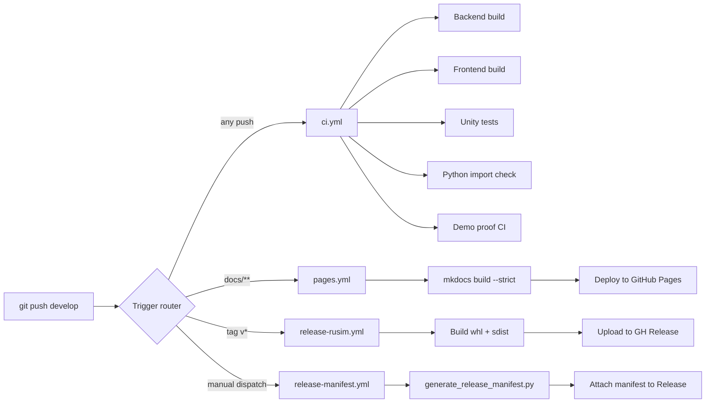

# 8 Тестирование, сборка и поставка

Главы 4–7 описывают, как платформа устроена и как её исследовательский контур применяется в sim-to-real-эксперименте. Настоящая глава смотрит на платформу с инженерно-операционной стороны: какие средства проверки фиксируют корректность реализации, как из исходников собирается готовый к эксплуатации артефакт и каким способом результат попадает к пользователю — оператору, исследователю или разработчику плагинов. Изложение опирается на актуальное состояние репозитория: workflow-файлы в `.github/workflows/`, `Dockerfile` и `Makefile` модуля `src/ks0223-web-mac/`, тестовые проекты в `Assets/Tests/EditMode/`, `backend.Tests/` и `python/tests/training/`, конфигурация документации `mkdocs.yml`, артефакты релизов в `dist/`. Все цифры по объёму тестового покрытия приведены без округления — в рамках работы важно не переоценить степень верификационной готовности платформы.

Раздел сознательно выполнен в более компактном формате, чем главы 4–7. Тестовое покрытие, CI и поставка платформы находятся в инженерной фазе, а не в исследовательской: они описывают реальное состояние инструментов, а не результаты экспериментов. Существенным элементом главы является честная фиксация направлений расширения — раздел 8.1.4 выделяет пробелы тестового покрытия, а раздел 8.7.3 — текущее состояние CHANGELOG и релизной процедуры.

## 8.1 Тестовое покрытие

Тестовое покрытие платформы организовано тремя независимыми наборами, по одному на каждый язык реализации: NUnit-тесты для Unity-runtime в EditMode-режиме, xUnit-тесты для backend-сервисов на `.NET 8` и pytest-тесты для Python-обвязки обучения. Соответствующие проекты живут в самостоятельных каталогах и собираются разными toolchain-ами; единственная связующая точка — workflow `ci.yml`, который запускает каждый набор отдельным job-ом (см. раздел 8.2.1). Сводный объём тестов на момент написания работы зафиксирован в таблице 8.1; цифры намеренно приведены без агрегирования по «количеству строк покрытия», поскольку coverage-инструментация в проекте не настроена и формальная оценка покрытия по `dotCover` или `coverage.py` остаётся направлением расширения (см. 8.1.4).

Таблица 8.1 — Тестовые наборы платформы

| Домен | Каталог | Файлов | Тестов | Стек |
|---|---|---|---|---|
| Unity-runtime (EditMode) | `Assets/Tests/EditMode/` | 5 | 22 | NUnit + Unity Test Framework 1.5 |
| Backend (.NET 8) | `src/ks0223-web-mac/backend.Tests/` | 1 | 13 | xUnit + Microsoft.Extensions.Time.Testing |
| Python-обвязка | `python/tests/training/` | 6 | 28 | pytest + Gymnasium-стабы |
| Frontend | — | 0 | 0 | не реализовано |

### 8.1.1 Unity EditMode тесты

EditMode-режим Unity Test Framework выполняет тесты вне Play-цикла: сцена не инстанцируется, `FixedUpdate` не вызывается, тесты живут в обычном CLR-домене и не требуют активного рендера. Для рассматриваемой платформы такой режим оказался достаточным — все пять тестовых файлов покрывают компоненты, поведение которых может быть выражено через прямые вызовы публичных методов и `JsonUtility`-сериализацию, без необходимости в физическом моделировании или ECS-обновлении. Сборка `UavSimulator.EditModeTests.asmdef` объявляет зависимости от runtime-сборок симулятора (`UavSimulator.Contracts`, `UavSimulator.Core`, `UavSimulator.Plugins`, `UavSimulator.CityDemo`, `UavSimulator.Vehicles`, `UavSimulator.Recording`) и тестовых пакетов NUnit; запуск возможен как из Test Runner-окна Editor, так и из CI через `game-ci/unity-test-runner@v4`.

`ContractSerializationTests` проверяет round-trip-сериализацию транспортных контрактов через `JsonUtility`. Два теста гарантируют, что заполненные структуры `SimulationConfig` и `ControlCommand` корректно проходят `ToJson`/`FromJson`-цикл с сохранением вложенных массивов `ConfigKeyValue` и `SimulationAgentConfig`. Такая проверка важна потому, что Unity использует собственный сериализатор с ограничениями по полиморфизму и null-обработке; ошибка в раскладке полей не вылавливается компилятором и обнаруживается лишь на runtime при невалидном JSON со стороны backend.

`SimulationConfigValidator` тестируется тремя сценариями: ошибка при пустом реестре плагинов, fallback на первый зарегистрированный плагин при отсутствии явных идентификаторов в конфигурации, подстановка `timeScale = 1.0` вместо нулевого значения. Эти три кейса покрывают основные ветви валидации, выполняемой при `reset` со стороны runtime API; назначение тестов — зафиксировать поведение по умолчанию для backwards-совместимости со старыми сценариями и Python-клиентами.

`SceneCameraRecorderTests` (семь тестов) обходит ограничение EditMode на отсутствие активного рендера через специальный hook `SceneCameraRecorder.Tick(capture: false)`, который проводит state-machine рекордера через все ветви — старт, авто-стоп по достижении длительности, подсчёт кадров, повторный старт после завершения — без вызова реального `Camera.Render` и без необходимости в `ffmpeg`. Подход иллюстрирует общий приём, применённый в EditMode-наборе: вместо имитации Play-цикла в коде runtime выделяются точки наблюдения, доступные тесту напрямую.

`TrafficLightFsmTests` (семь тестов) проверяет конечный автомат светофоров для city-demo-сцены: переходы Green → Yellow → Red, синхронизацию пары NS/EW, корректную обработку повторного `StartCycle`. Для тестируемости в `TrafficLightController` введён метод `AdvanceTime(seconds)`, заменяющий накопление `Time.deltaTime`; такая проектируемая под тест поверхность типична для всех Unity-компонентов, попавших в EditMode-набор.

`CityWaypointGraphTests` (три теста) фиксирует контракт `CityWaypointGraph` как `ScriptableObject`: поиск узла по идентификатору, обработка отсутствующего идентификатора, валидность узла с несколькими исходящими рёбрами. Этот набор небольшой, но он закрепляет инвариант графа waypoint-ов, на который опирается процедурный спавн NPC-машин в city-demo-сцене.

```csharp
[Test]
public void SimulationConfig_RoundTrip_JsonUtility()
{
    var config = new SimulationConfig
    {
        seed = 123,
        timeScale = 1.0f,
        selectedTrackId = "track-01",
        selectedVehicleId = "vehicle-01",
        agents = new[] {
            new SimulationAgentConfig { agentId = "ego", isPrimary = true },
        },
    };
    var json = JsonUtility.ToJson(config);
    var parsed = JsonUtility.FromJson<SimulationConfig>(json);
    Assert.That(parsed.agents[0].agentId, Is.EqualTo("ego"));
}
```

Полный объём — двадцать два теста — обеспечивает базовый защитный пояс для тех частей runtime, которые меняются при доработках плагинов и контрактов. PlayMode-тесты, требующие реальной физической симуляции и активной сцены, в наборе отсутствуют и относятся к направлениям расширения (см. 8.1.4).

### 8.1.2 Backend xUnit тесты

Тестовый проект `backend.Tests` собран на xUnit и сосредоточен на одном классе — `AutopilotSafetyFilter`. Это сознательный выбор: фильтр безопасности автопилота отвечает за прерывание управления реальным роботом при обнаружении препятствия по сонару, и любая регрессия в его логике приводит непосредственно к физическому риску — столкновению робота со стенкой картонного коридора. Тринадцать тестов покрывают семь поведений фильтра: срабатывание e-stop при подкритическом расстоянии, sticky-hold с разрешением заднего хода, автоматический релиз после истечения hold-периода, клиппирование throttle вперёд и неклиппирование назад, deadman-таймер на длительной паузе вызовов, агрегация счётчиков срабатываний, корректная инициализация при `Reset`.

В тестах использован `FakeTimeProvider` из `Microsoft.Extensions.Time.Testing` — реализация `TimeProvider`, позволяющая программно сдвигать «текущее время» вызовом `Advance(TimeSpan)`. Такой подход исключает реальные `Thread.Sleep`-задержки в тестах: проверка временного поведения фильтра выполняется в миллисекундах wall-clock, при том что сценарий покрывает восстановление через 510 миллисекунд после срабатывания. `AutopilotSafetyOptions` инжектируется явно, что позволяет тестам варьировать пороги без модификации продуктивных значений по умолчанию.

```csharp
[Fact]
public void EStop_Releases_After_HoldMs_Elapsed()
{
    var fake = new FakeTimeProvider();
    var filter = CreateFilter(timeProvider: fake);
    filter.Apply(0.5f, 0f, 0.10f);                       // t=0: e-stop
    fake.Advance(TimeSpan.FromMilliseconds(250));
    filter.Apply(0.5f, 0f, 0.10f);                       // hold-mid keep-alive
    fake.Advance(TimeSpan.FromMilliseconds(260));
    var decision = filter.Apply(0.5f, 0f, 1.0f);         // t=510: распущен
    Assert.False(decision.EStopActive);
}
```

Покрытие остальных backend-сервисов — `RuntimeSessionManager`, `AutopilotService`, `ModelLifecycleService`, `RealRobotRuntimeProvider`, `SimRuntimeProvider` — на момент написания работы выполняется опосредованно: через ручную проверку через WebUI и через xUnit-тесты единственного критического по безопасности компонента. Это направление расширения зафиксировано в разделе 8.1.4.

### 8.1.3 Python pytest для wrappers и launch

Python-набор включает шесть файлов и двадцать восемь тестовых функций, сосредоточенных на тренировочных обёртках `python/training/` и пуске multi-runtime-конфигурации. Все обёртки, описанные в разделе 6.2, имеют отдельный тестовый файл; запуск выполняется командой `pytest python/tests/training/` из корня репозитория и не требует Unity-runtime — тесты используют синтетические `gym.Env`-стабы.

`test_anti_spin_reward.py` (шесть тестов) проверяет `AntiSpinRewardWrapper`: отсутствие штрафа на коротких сериях одинаковых действий, активацию штрафа при достижении порога повторов, сброс счётчика при смене действия, корректное применение к награде. `test_discrete_action_wrapper.py` (шесть тестов) валидирует таблицу из пяти дискретных действий KS0223: преобразование `DirForward` в `(throttle, steer) = (1, 0)`, `DirLeft` в `(0.5, -1)` и так далее, обработку out-of-range индексов, сохранение Action-space-метаданных. `test_image_aug_wrapper.py` (шесть тестов) фиксирует, что `ImageAugObservationWrapper` сохраняет неизменными размерности и dtype `Dict`-наблюдения и применяет домен-рандомизацию только к ключу `image`. `test_latency_wrapper.py` (шесть тестов) проверяет очередь отложенных действий `DelayedActionWrapper` с задаваемой задержкой в шагах.

```python
def test_penalty_kicks_in_at_threshold():
    env = AntiSpinRewardWrapper(_PassThroughEnv(),
                                repeat_threshold=5, repeat_penalty=0.5)
    env.reset()
    rewards = [env.step(3)[1] for _ in range(7)]
    assert rewards[:4] == [1.0, 1.0, 1.0, 1.0]
    assert rewards[4:] == [0.5, 0.5, 0.5]
```

Два файла обслуживают launch-логику: `test_resume_curriculum.py` (два теста) проверяет, что флаг `--start-timestep` корректно сообщает `MazeCurriculumCallback` стадию обучения при возобновлении из чекпоинта на тридцати тысячах шагов, и `test_multi_runtime_launch.py` (два теста) выполняет интеграционную проверку пула из трёх Unity-runtime-инстансов на портах 8000–8002. Второй файл по умолчанию пропускается через `pytest.skipif` при отсутствии переменной окружения `RUSIM_MULTI_RUNTIME_TEST=1`, поскольку требует трёх живых runtime-процессов; тесты предназначены для ручного запуска оператором перед длительной тренировкой и в нагрузочном smoke-сценарии.

### 8.1.4 Текущие пробелы и направления расширения

Тестовое покрытие платформы остаётся слабым местом инженерного контура. Во-первых, frontend-часть на React и TypeScript не покрыта тестами вообще: каталог тестов отсутствует, в `package.json` нет ни Jest, ни Vitest. Это обусловлено тем, что весь UI-слой проверяется ручным e2e-сценарием через Web UI и shadow-mode-предпросмотр, и в условиях небольшого размера фронта (порядка пятнадцати компонентов) автоматизация unit-тестов уступает по эффективности структурной проверке через TypeScript-компилятор. Тем не менее интеграционная проверка поведения через `@playwright/test` или эквивалент осталась бы желательной для критичных сценариев — выбор сценария, активация автопилота, обработка ошибки подключения.

Во-вторых, backend-набор покрывает только `AutopilotSafetyFilter`. Сервисы маршрутизации команд, lifecycle-управления моделями и интеграции с runtime через `IKs0223RuntimeProvider` верифицируются вручную; для них желателен набор тестов на основе in-memory-фейков рантайма. В-третьих, Unity-runtime тесты ограничены EditMode-режимом — PlayMode-тесты, способные подтвердить корректность физического шага `Ks0223Vehicle` или последовательности `reset` → `step` → `state` для активной сцены, не реализованы. В-четвёртых, формальный coverage-инструментарий (`coverage.py` для Python, `dotnet test --collect:"XPlat Code Coverage"` для C#, `unity-test-runner` с coverage-отчётом для Unity) не подключён, и оценка фактического процента покрытия не проводится. Эти четыре пробела — frontend, backend-широта, PlayMode-тесты, coverage-инструментарий — оформляют практический backlog инженерного слоя платформы.

## 8.2 Непрерывная интеграция

Платформа использует GitHub Actions как единственное средство непрерывной интеграции. На момент написания работы в каталоге `.github/workflows/` находятся четыре workflow-файла, разделённых по ответственности: `ci.yml` (сборка и тестирование при каждом push), `pages.yml` (деплой документации), `release-rusim.yml` (публикация Python-пакета `rusim`), `release-manifest.yml` (генерация JSON-манифеста релиза для plugin SDK). Логическая структура CI/CD-конвейера показана на рисунке 8.1.



Рисунок 8.1 — Логическая структура CI/CD-конвейера

### 8.2.1 Workflow ci.yml: триггеры и шаги

Workflow `ci.yml` запускается на каждое событие `push` и `pull_request` без фильтрации по веткам и путям. Это упрощает контракт: любая правка в любой ветке обязана пройти базовый набор проверок. Workflow декомпозирован на пять параллельных job-ов; явные зависимости установлены только между `unity-license-gate` и `unity-tests`.

Таблица 8.2 — Состав job-ов workflow ci.yml

| Job | Назначение | Стек | Условие выполнения |
|---|---|---|---|
| `unity-license-gate` | Проверка наличия Unity-лицензии в secrets | bash | всегда |
| `backend-build` | Сборка `backend.csproj` | `actions/setup-dotnet@v5`, .NET 8 | всегда |
| `frontend-build` | Сборка Vite-фронта | `actions/setup-node@v6`, Node 20 | всегда |
| `unity-tests` | EditMode/PlayMode тесты через GameCI | `game-ci/unity-test-runner@v4` | при наличии лицензии |
| `python-lint` | Импорт-чек `sim_client.http_client` | `actions/setup-python@v6`, Python 3.11 | всегда |
| `demo-proof-ci` | Smoke-цель `make demo-proof-ci` | bash + Makefile | всегда |

Job `unity-license-gate` решает практическую проблему: интеграционные тесты Unity требуют активированной professional-лицензии, передаваемой через secrets; в публичных pull-request-ах от внешних контрибьюторов secrets недоступны, и попытка запуска `unity-test-runner` без лицензии завершается ошибкой. Gate-job проверяет, заполнен ли секрет `UNITY_LICENSE`, и записывает признак в output `has_license`. Job `unity-tests` стартует условно — `if: needs.unity-license-gate.outputs.has_license == 'true'` — что делает CI зелёным на чужих PR без потери способности запускать Unity-тесты на push-ах в `develop`.

Job `python-lint` намеренно ограничен импорт-чеком: он устанавливает зависимости из `python/requirements.txt` и пытается импортировать `from sim_client.http_client import SimClient`. Основная цель — поймать регрессии установки пакета (нарушения `pyproject.toml`, конфликты зависимостей), не запуская полный pytest-набор в CI. Полноценный pytest-запуск Python-обвязки требует Stable-Baselines3 и PyTorch, общий объём установки которых превышает гигабайт — для каждого push это неоправданная нагрузка на CI-минуты. Тесты `python/tests/training/` запускаются вручную на машине разработчика.

Job `demo-proof-ci` исполняет цель `make demo-proof-ci`, реализующую graceful-skip-сценарий: если в окружении CI отсутствует Docker-демон или Unity-проект, цель не падает, а печатает диагностическое сообщение и возвращает код нуля. Назначение цели — зафиксировать наличие Makefile-точки входа в demo-flow, без претензии на запуск полной end-to-end-проверки в headless-CI.

```yaml
unity-tests:
  name: Unity Tests (GameCI)
  needs: unity-license-gate
  if: ${{ needs.unity-license-gate.outputs.has_license == 'true' }}
  runs-on: ubuntu-latest
  steps:
    - uses: actions/checkout@v6
    - uses: game-ci/unity-test-runner@v4
      env:
        UNITY_LICENSE: ${{ secrets.UNITY_LICENSE }}
      with:
        projectPath: src/UnityProject/uav-simulator
        unityVersion: 6000.1.8f1
        testMode: all
        artifactsPath: artifacts
```

### 8.2.2 Workflow pages.yml: деплой документации

Workflow `pages.yml` отвечает за публикацию проектной документации на GitHub Pages по адресу `https://nmgorovenko.github.io/uav-simulator/`. Триггер сужен до случаев, когда правки касаются именно документации: события `push` на ветки `main` и `develop`, ограниченные путями `docs/**`, `mkdocs.yml` и сам `pages.yml`. Это исключает повторные деплои при правке кода, не влияющего на документационный сайт.

Workflow собран из двух job-ов: `build` и `deploy`. `build` ставит Python 3.11, устанавливает `mkdocs`, `mkdocs-material` и `pymdown-extensions` из `docs/requirements-pages.txt`, исполняет `mkdocs build --strict` (флаг `--strict` превращает любые предупреждения mkdocs в ошибки) и публикует получившийся `.mkdocs-site` как pages-artifact. `deploy` использует `actions/deploy-pages@v4` и берёт собранный artifact, запуская публикацию в окружение `github-pages`. Concurrency-группа `pages` с `cancel-in-progress: true` гарантирует, что параллельные push-ы документации не приводят к конкурирующему деплою.

```yaml
on:
  push:
    branches: [main, develop]
    paths:
      - 'docs/**'
      - 'mkdocs.yml'
      - '.github/workflows/pages.yml'
  workflow_dispatch:

concurrency:
  group: pages
  cancel-in-progress: true
```

Опция `workflow_dispatch` позволяет вручную перевыпустить документацию из UI Actions без необходимости создавать новый коммит — это удобно для перезапуска после правки секретов или после исправления внешних ссылок на ассеты, кэшируемые Pages.

### 8.2.3 Release workflows: rusim CLI и plugin SDK manifests

Релизный конвейер разделён на два workflow по типу артефакта. `release-rusim.yml` срабатывает на push тэга вида `v*` (а также по ручному `workflow_dispatch` с явно заданным тэгом) и собирает Python-пакет `rusim` из `python/pyproject.toml`. Перед сборкой workflow синхронизирует поле `version` в `pyproject.toml` со значением тэга — это исключает рассинхронизацию версии в метаданных пакета и в git-тэге, которая в случае ручной публикации часто становится источником багов. Сборка выполняется командой `python -m build python --outdir dist/rusim/<tag>`, после чего `python -m twine check` валидирует README/long-description-метаданные, и `softprops/action-gh-release@v2` прикладывает `.whl` и `.tar.gz` к существующему GitHub Release.

`release-manifest.yml` запускается только вручную через `workflow_dispatch` с входным параметром `tag`. Workflow исполняет утилиту `scripts/generate_release_manifest.py github-release`, которая по тэгу собирает машиночитаемый JSON с описанием состава релиза: список приложенных к релизу файлов, их размеров, sha-256-сумм, ссылок на скачивание и сопоставление с конвенциями имени (`uav-simulator-macos-<tag>.zip`, `<plugin>.rusim-plugin.zip`). Сгенерированный манифест прикладывается к тому же GitHub Release под именем `rusim-release-manifest.json` и одновременно сохраняется как workflow-artifact.

Манифест предназначен для двух потребителей. Первый — CLI `rusim plugin install`, который при отсутствии локального файла запрашивает манифест по конвенциональному URL и определяет, какие плагины вообще доступны для установки в данной версии. Второй — Web UI и инсталлеры, которые при первом запуске обращаются к манифесту последнего релиза для проверки актуальности установленной версии и предложения обновления. Разделение на два workflow связано с тем, что `release-rusim.yml` исполняется автоматически на каждый тэг, тогда как `release-manifest.yml` запускается после того, как все артефакты — Python-пакет, Unity-builds, plugin-архивы — уже опубликованы как assets в Release; манифест должен описывать финальный состав, а не промежуточный.

## 8.3 Сборка backend и Web UI

### 8.3.1 Многоэтапный Dockerfile

Backend и Web UI поставляются как единый Docker-образ `ks0223-web-mac:latest`, собираемый из `src/ks0223-web-mac/Dockerfile`. Сборка организована в три стадии — `frontend-build`, `backend-build`, `runtime` — и использует docker buildkit-синтаксис `# syntax=docker/dockerfile:1.7`. Build-context намеренно установлен на корень репозитория, а не на каталог `src/ks0223-web-mac/`: Dockerfile копирует в образ как backend и frontend, так и Python-исходники `python/sim_client/` (CLI `rusim`) — все три модуля живут в разных каталогах, и единый context упрощает координацию между ними.

Стадия `frontend-build` использует образ `node:22-alpine`. Сначала копируются только `package.json` и `package-lock.json`, выполняется `npm ci` (детерминистическая установка из lock-файла). Лишь после этого копируется остальной фронт и запускается `npm run build`. Такой порядок обеспечивает кэширование npm-слоя при изменении исходников без правки зависимостей — типовой шаблон для Node-сборок.

Стадия `backend-build` использует образ `mcr.microsoft.com/dotnet/sdk:8.0`. Сначала копируется только `backend.csproj` и выполняется `dotnet restore`, что даёт кэширование NuGet-зависимостей. После этого копируется код backend и собранный `dist/` фронта в `wwwroot/`, после чего исполняется `dotnet publish backend.csproj -c Release -o /app/publish --no-restore`. ASP.NET Core-сервер таким образом отдаёт статику фронта сам — без необходимости в отдельном nginx-контейнере, что упрощает развёртывание на ноутбуке оператора.

Стадия `runtime` использует более лёгкий образ `mcr.microsoft.com/dotnet/aspnet:8.0` (без SDK). В неё копируется опубликованный backend и устанавливается дополнительный набор Python-зависимостей: `python3-venv`, после чего создаётся изолированный venv `/opt/rusim-venv`, в который через `pip install -e /app/sim_client --no-deps` ставится CLI `rusim` из локальных исходников. Symlink `/usr/local/bin/rusim` указывает на entry-point этого venv. Backend при выполнении endpoint-а `/api/scenarios/load` делает `Process.Start(rusim, scenario reset <yaml>)`, и этот endpoint должен работать независимо от того, установлен ли `rusim` на хосте.

```dockerfile
FROM node:22-alpine AS frontend-build
WORKDIR /src/frontend
COPY src/ks0223-web-mac/frontend/package*.json ./
RUN npm ci
COPY src/ks0223-web-mac/frontend/ ./
RUN npm run build

FROM mcr.microsoft.com/dotnet/sdk:8.0 AS backend-build
WORKDIR /src
COPY src/ks0223-web-mac/backend/backend.csproj backend/
RUN dotnet restore backend/backend.csproj
COPY src/ks0223-web-mac/backend/ backend/
COPY --from=frontend-build /src/frontend/dist/ backend/wwwroot/
RUN dotnet publish backend/backend.csproj -c Release -o /app/publish --no-restore

FROM mcr.microsoft.com/dotnet/aspnet:8.0 AS runtime
WORKDIR /app
COPY --from=backend-build /app/publish/ ./
RUN python3 -m venv /opt/rusim-venv \
    && /opt/rusim-venv/bin/pip install -e /app/sim_client --no-deps \
    && ln -s /opt/rusim-venv/bin/rusim /usr/local/bin/rusim

EXPOSE 5058
EXPOSE 5051/udp
HEALTHCHECK --interval=10s --timeout=3s --start-period=15s --retries=6 \
  CMD curl -fsS "http://localhost:5058/api/health?clientId=hc&runtimeMode=real-robot" >/dev/null || exit 1
CMD ["dotnet", "backend.dll"]
```

Открыты два порта: `5058/tcp` для HTTP API и Web UI и `5051/udp` для приёма телеметрии напрямую от платформы KS0223 в reverse-канале. Healthcheck с интервалом десять секунд опрашивает `/api/health` с фиктивными `clientId=healthcheck` и `runtimeMode=real-robot`; вид параметров здесь продиктован контрактом backend — он требует обязательной идентификации сессии и режима работы для всех endpoint-ов.

### 8.3.2 Makefile цели: docker-build, docker-run, docker-update

Файл `src/ks0223-web-mac/Makefile` оформляет операторский интерфейс над контейнером. Семь основных целей, перечисленных в таблице 8.3, покрывают сценарий полной перенастройки локального стенда оператора без необходимости запоминать длинные команды `docker run` с правильным набором bind-mount-ов.

Таблица 8.3 — Основные цели Makefile

| Цель | Назначение |
|---|---|
| `docker-pull-base` | Скачать базовые образы (`node:22-alpine`, `dotnet/sdk:8.0`, `dotnet/aspnet:8.0`) |
| `docker-build` | Собрать образ `ks0223-web-mac:latest` из repo-root context |
| `docker-rebuild` | То же с `--pull --no-cache` для гарантии чистого состояния |
| `docker-run` | Запустить контейнер с bind-mount-ами `logs/` и `configs/scenarios/` |
| `docker-stop` | Удалить запущенный контейнер (idempotent) |
| `docker-wait` | Опрос `/api/health` до получения положительного ответа |
| `docker-update` | Композитная цель: build + run + wait |

Цель `docker-update` представляет основной операторский путь. Она исполняется как `make docker-update` после правки backend или frontend и за одну команду пересобирает образ, перезапускает контейнер и дожидается готовности healthcheck. Это исключает класс ошибок «оператор перезапустил контейнер, но забыл пересобрать образ»: цель всегда исходит из текущего состояния исходников.

```makefile
REPO_ROOT ?= $(CURDIR)/../..
SCENARIOS_DIR ?= $(REPO_ROOT)/configs/scenarios

docker-build:
	docker build -t $(IMAGE) -f $(CURDIR)/Dockerfile $(REPO_ROOT)

docker-run: docker-stop
	mkdir -p $(LOGS_DIR)
	docker run -d --name $(CONTAINER) \
		-p $(PORT):5058 -p $(UDP_PORT):5051/udp \
		-v $(LOGS_DIR):/app/logs \
		-v $(SCENARIOS_DIR):/app/configs/scenarios:ro \
		--add-host host.docker.internal:host-gateway \
		$(IMAGE)

docker-update: docker-build docker-run docker-wait
```

Параметризация через `?=` позволяет переопределять имя образа, имя контейнера, порты и путь логов через переменные окружения без правки Makefile. Это необходимо для одновременного запуска нескольких контейнеров — например, для shadow-mode-сценария (раздел 7.5.3), когда параллельно работают экземпляры sim-mode и real-robot-mode на разных портах.

### 8.3.3 Bind-mount configs/scenarios для динамической перезагрузки

Каталог `configs/scenarios/` в репозитории хранит YAML-описания сценариев — наборов параметров `rusim scenario reset <yaml>`, фиксирующих сцену, агента, режим управления, доменные параметры и параметры eval. Два архитектурных свойства этого каталога заметно влияют на поставку. Во-первых, сценарии — данные, а не код: правка YAML не требует пересборки. Во-вторых, оператор работает со сценариями из хост-системы (через любой текстовый редактор), а исполняется reset уже на стороне backend, который живёт в контейнере.

Чтобы соединить эти свойства, в `docker-run` задан bind-mount `-v $(SCENARIOS_DIR):/app/configs/scenarios:ro`, отображающий хостовый каталог `configs/scenarios/` в read-only-режиме внутрь контейнера по пути `/app/configs/scenarios`. Backend читает YAML из контейнерного пути через WebUI scenario-picker (выпадающий список доступных сценариев), но физически файлы остаются на хосте — оператор редактирует их любым редактором, и следующий вызов `rusim scenario reset` подхватывает новую версию без перезапуска контейнера.

Read-only-флаг `:ro` исключает класс ошибок, при которых контейнерный backend случайно записал бы в каталог сценариев, нарушив их git-state. Каталог логов наоборот монтируется в read-write-режим: `SessionLogs__Directory` в backend настроена на `/app/logs`, и контейнер пишет туда журналы сессий, доступные оператору на хосте. Соответствующая переменная среды `RUSIM_BASE_URL=http://host.docker.internal:8000` указывает контейнерному backend, как достучаться до Unity-runtime, работающего в Editor на хост-системе через bridge-алиас `host.docker.internal`. Альтернативный путь — запуск Unity в headless-режиме внутри отдельного контейнера — рассмотрен в разделе 8.4.2 как направление расширения.

## 8.4 Сборка Unity runtime

### 8.4.1 Build pipeline и target платформы

Сборка standalone-runtime реализована классом `RuntimeBuildPipeline` в `Assets/Editor/RuntimeBuildPipeline.cs`. Класс предоставляет три статических entry-point — `BuildMacOsRuntime`, `BuildWindowsRuntime`, `BuildLinuxRuntime` — соответствующих трём целевым платформам: `BuildTarget.StandaloneOSX`, `BuildTarget.StandaloneWindows64`, `BuildTarget.StandaloneLinux64`. Точки вызываются из CI или с командной строки через `Unity -batchmode -nographics -executeMethod UavSimulator.EditorTools.RuntimeBuildPipeline.BuildMacOsRuntime`.

Перед собственно `BuildPipeline.BuildPlayer` исполняются два preprocessor-шага. `RuntimeShaderAssetSeeder.EnsureRuntimeShaderAssets` фиксирует список шейдеров, которые должны попасть в build (включая шейдеры, используемые только в runtime-материалах через `RuntimeMaterialCompatibility`). Без явного включения Unity вырезает их по graph-анализу как неиспользуемые. `PluginCatalogSeeder.SyncBuiltinPluginCatalog` синхронизирует `BuiltinPluginCatalog`-asset со списком встроенных плагинов — раздел 5 настоящей работы описывает соответствующий механизм; для сборки важно, что ассет каталога должен быть актуальным на момент `BuildPipeline.BuildPlayer`.

```csharp
private static void BuildRuntime(BuildTarget target, string defaultOutput)
{
    RuntimeShaderAssetSeeder.EnsureRuntimeShaderAssets();
    PluginCatalogSeeder.SyncBuiltinPluginCatalog();

    var outputPath = Environment.GetEnvironmentVariable("RUSIM_BUILD_OUTPUT")
                     ?? defaultOutput;
    var scenePath  = Environment.GetEnvironmentVariable("RUSIM_BUILD_SCENE")
                     ?? "Assets/Scenes/TrackScence.unity";

    var options = new BuildPlayerOptions
    {
        scenes           = new[] { scenePath },
        locationPathName = Path.GetFullPath(outputPath),
        target           = target,
        options          = BuildOptions.None,
    };
    var report = BuildPipeline.BuildPlayer(options);
    if (report.summary.result != BuildResult.Succeeded)
        throw new InvalidOperationException($"Runtime build failed for {target}");
}
```

Параметры `RUSIM_BUILD_OUTPUT` и `RUSIM_BUILD_SCENE` через переменные среды позволяют CI задавать нестандартный путь вывода и нестандартную стартовую сцену без правки исходников. По умолчанию сборка идёт в `build/runtime/<platform>/` со сценой `Assets/Scenes/TrackScence.unity`. После завершения build summary попадает в `Debug.Log`, что облегчает анализ в консольных логах GameCI.

### 8.4.2 Headless mode для тренировок

Тренировочный сценарий запускает Unity-runtime в режиме без активного Game-View и аудио. На macOS и Linux это достигается флагами `-batchmode -nographics` при запуске исполняемого файла; для тренировок на Windows-машине автора используется тот же набор флагов через WSL2-подсистему — это соответствует основному паттерну запуска, описанному в разделе 6.1.2.

В headless-режиме Unity не создаёт окно и не выполняет рендер в primary-buffer, но `Camera.targetTexture` и off-screen render через `RenderTexture` продолжают работать корректно. Это критично для платформы: тренировочная среда не видит «играбельной» сцены, но получает RGB-кадры через `CameraFrameProvider`, который рендерит в `RenderTexture` 84×84, читает её через `AsyncGPUReadback` и отдаёт обвязке через HTTP API (раздел 6.1). Описанная схема позволяет одной и той же сборке runtime обслуживать как интерактивный сценарий оператора (с активным Game-View), так и тренировочный multi-runtime-пул из трёх–четырёх инстансов headless-режима.

Параллельный запуск нескольких runtime-инстансов на одной машине требует разнесения портов HTTP-сервера: переменная среды `UAVSIM_API_PORT` принимает значение 8000–8003 и определяет, на каком порту runtime будет слушать reset/step-команды. Multi-runtime-launch-helper `python/training/multi_runtime_launch.py` (раздел 6.3.4) запускает три headless-копии одной и той же сборки с разными портами и проверяет их healthcheck через тест `test_multi_runtime_launch.py`. На GPU GeForce RTX 3070 четыре одновременных headless-инстанса дают эффективную скорость порядка ста двадцати environment-шагов в секунду на инстанс, что соответствует профилю PPO-обучения с `n_envs = 4`.

### 8.4.3 Editor-only ограничения POLYGON DemoScene

Часть содержимого Unity-проекта остаётся доступной только в Editor-режиме. Наиболее заметный пример — встроенная демо-сцена POLYGON City Pack (`Assets/POLYGON city pack/scene/DemoScene.unity`), используемая трассой `track.city.polygon.v1` через `CityPolygonTrack`. В режиме `useDemoScene = true` (по умолчанию) трасса аддитивно загружает сцену, переподписывает её корневые GameObject-ы под себя и заменяет встроенные камеры и источники света. Это даёт визуально полноценный city-blocks-стенд из примерно девятисот девяноста девяти GameObject-ов, но привязывает сцену к Editor-only-механизму `EditorSceneManager.OpenScene`.

```csharp
// Editor-only — for standalone builds, the POLYGON pack would need
// Addressables / Resources/ migration.
public sealed class CityPolygonTrack : TrackBase
{
    private const string DemoScenePath =
        "Assets/POLYGON city pack/scene/DemoScene.unity";
    ...
}
```

Соответствующие методы в `CityPolygonTrack`, `BuiltinPluginFactory` и `RoadSystemRealisticTrack` обёрнуты `#if UNITY_EDITOR` — это исключает попадание Editor-only-API в standalone-build, но одновременно делает указанные сцены недоступными в собранном `.app`/`.exe`. Альтернативное решение — миграция POLYGON-пакета на Addressables или `Resources/` — потребует пересборки prefab-структуры пакета и не соответствует условиям лицензии POLYGON City Pack, требующим распространения исходных prefab-ов через Asset Store. По состоянию на текущий релиз city-demo-сцена работает только в Unity Editor, и cardboard-corridor- и cardboard-maze-сцены, лишённые этой зависимости, остаются основным сценарием для тренировок и операторских демонстраций. Этот компромисс зафиксирован в разделе 4.6 настоящей работы как известное ограничение и не препятствует выполнению ключевого sim-to-real-сценария (главы 6 и 7).

## 8.5 Поставка плагинов

### 8.5.1 Формат .rusim-plugin.zip

Формат поставки плагинов формализован в разделе 5 настоящей работы (полное описание `.rusim-plugin.zip`-архива и утилиты `PluginExporter`); здесь раздел рассматривает его исключительно с инженерной стороны — как часть конвейера поставки. Готовый плагин представляет собой ZIP-архив с фиксированным именем `<pluginId>.rusim-plugin.zip` и четырёхфайловым составом: `manifest.json` (идентификатор, тип, версия, требуемая версия рантайма), `descriptor.json` (сериализованный `VehiclePluginDescriptor` или `TrackPluginDescriptor`), `device-contract.json` (только для vehicle, формальное описание сенсорного контракта), `README.md` (auto-generated инструкция по установке).

Эталонный архив `vehicle.arcade.green.v1.rusim-plugin.zip` имеет суммарный размер четыре килобайта четыреста два байта при четырёх файлах: 216 байт manifest, 453 байта descriptor, 3369 байт device-contract, 364 байта README. Малый размер — следствие того, что плагин не несёт мешей или текстур; графика собирается из ассетов рантайма по идентификаторам. Это упрощает версионирование: совместимость плагина с релизом рантайма проверяется по полю `compatibleRuntime` манифеста, а не по бинарному совпадению ассетов.

Сборка плагина выполняется в Unity Editor (`Tools > UavSimulator > Export Plugin (.zip)`), а не в CI: отделение сборки от рантайма исследовано в разделе 5.4 как часть архитектурного решения. На уровне поставки это означает, что плагины собираются разработчиком вручную и публикуются как отдельные assets к существующему GitHub Release — отдельного workflow для plugin-build в CI на момент написания работы нет. Это направление расширения: автоматизированный workflow `plugin-build.yml`, который по push-у в `packages/<plugin>/` собирал бы и валидировал архив, отвечал бы стандартному паттерну поставки UPM-пакетов.

### 8.5.2 Распространение через UPM

Plugin SDK — набор базовых классов и редакторных инструментов для разработчика плагина — поставляется как Unity Package и подключается стандартным механизмом UPM. Манифест пакета `packages/com.uav-simulator.plugin-sdk/package.json` фиксирует его идентификатор и метаданные:

```json
{
  "name": "com.uav-simulator.plugin-sdk",
  "version": "0.1.0",
  "displayName": "UAV Simulator Plugin SDK",
  "description": "SDK for developing plugins (vehicles, tracks)…",
  "unity": "6000.1",
  "author": { "name": "Nikita Gorovenko" }
}
```

Пакет содержит две корневые директории: `Runtime/` (классы `VehiclePluginBase`, `TrackPluginBase`, descriptor-types, runtime-utility) и `Editor/` (ассистенты валидации и `PluginExporter` — инструмент Tools-меню для упаковки `.rusim-plugin.zip`). Установка в Editor стороннего разработчика выполняется через диалог Package Manager в режиме «Add package from git URL» с адресом `https://github.com/NMGorovenko/uav-simulator.git?path=packages/com.uav-simulator.plugin-sdk`. UPM сам клонирует репозиторий, читает `package.json` указанного `path` и подключает его как пакет — что освобождает разработчика от необходимости копировать SDK в свой проект.

Полный сценарий разработки плагина — от установки SDK через UPM до экспорта `.rusim-plugin.zip` — изложен в разделе 5; настоящий подраздел фиксирует только механику поставки. Привязка пакета к git-URL означает, что версионирование SDK совпадает с git-тэгами репозитория `uav-simulator`: разработчик плагина может закрепиться на конкретной ревизии SDK через `?path=…&ref=v0.1.2`, что обеспечивает стабильность intra-project разработки. Публикация SDK в публичный UPM-registry (`registry.npmjs.org/scopes/uav-simulator` или `openupm`) на текущий момент не выполнена — такой шаг становится оправданным после стабилизации API SDK и зафиксирован как направление расширения.

### 8.5.3 Каталог dist/plugins/

Каталог `dist/plugins/` в репозитории содержит готовые `.rusim-plugin.zip`-архивы для последующего прикрепления к GitHub Release. По состоянию на момент написания работы он содержит один архив — `vehicle.arcade.green.v1.rusim-plugin.zip` — служащий референс-образцом для проверки `rusim plugin install`-цепочки. Каталог сознательно расположен в `dist/`, а не в `src/`: содержащиеся в нём архивы являются артефактами сборки, а не исходниками, и их содержимое полностью воспроизводимо из исходного descriptor-asset-а через `PluginExporter`. Размер `dist/plugins/` ограничен этим — добавление множества больших archive-ов в репозиторий нарушило бы границу между source-tree и build-output.

Упомянутая в разделе 8.2.3 утилита `generate_release_manifest.py` индексирует содержимое `dist/plugins/` при формировании JSON-манифеста релиза: каждый архив добавляется в манифест с полями `pluginId`, `version`, `sha256`, `downloadUrl` (определяемый по конвенции имени release-asset). CLI `rusim plugin install --from-release v0.1.2 vehicle.arcade.green.v1` пользуется именно этим манифестом — он позволяет инсталлеру не знать заранее, какие плагины опубликованы в данной версии релиза, и запросить полный каталог одним HTTP-запросом.

## 8.6 Документация и Pages

### 8.6.1 mkdocs material: структура nav

Документационный сайт собран на mkdocs c темой `mkdocs-material`. Конфигурация находится в `mkdocs.yml` (71 строка) и определяет четыре существенных свойства: ru-локализация интерфейса (`theme.language: ru`), тёмная палитра (`scheme: slate`, primary `blue grey`), включённое навигационное меню с разделами (`navigation.sections`, `navigation.expand`, `navigation.top`) и набор markdown-extensions, среди которых ключевыми являются `pymdownx.superfences` с custom-fence для Mermaid и `pymdownx.highlight` для syntax-highlighting.

Структура `nav` декларирует двадцать шесть пунктов верхнего и второго уровней, отражающих логическую организацию проекта: операторская документация (Старт, Установка, Использование, CLI), архитектурно-API-блок (Архитектура, API, Model Lifecycle, Глоссарий), отчётный блок преддипломной практики (Обзор, Спринт 1, Спринт 2, Спринт 3 с подпунктами по ML- и Sprint-анализу), магистерская диссертация (12 файлов из `docs/master-thesis/`). Иерархия nav используется не только для меню сайта, но и как seed для боковой колонки документации, и для структурного оглавления внутри каждой страницы.

Поле `exclude_docs` исключает из сборки крупные docx-файлы преддипломной практики (`report/prediploma-practice/*.docx`) и каталог `reports/`, содержащий технические PNG-скриншоты и видео; включение этих файлов в сайт привело бы к разрастанию артефакта Pages и нарушению лимита GitHub Pages в один гигабайт. Раздел `validation.links` отключён по большинству ветвей (`not_found: ignore`, `absolute_links: ignore`), поскольку проект содержит большое число cross-links между маркдауном и docx/pdf-evidence-материалами, и строгая валидация дала бы ложно-положительные срабатывания.

### 8.6.2 Деплой через GitHub Actions на Pages

Деплой документации полностью автоматизирован workflow-ом `pages.yml`, описанным в разделе 8.2.2. На уровне поведения сайта это означает следующий сценарий: автор редактирует маркдаун в `docs/`, выполняет `git push develop`, через одну–полторы минуты обновлённый сайт становится доступен по адресу `https://nmgorovenko.github.io/uav-simulator/`. Никаких ручных операций — генерации сайта, копирования в `gh-pages`-ветку, загрузки артефакта — не требуется.

Локальный preview-сайта поддерживается через венв `.venv-docs/`, в котором установлен mkdocs из `docs/requirements-pages.txt`. Команда `.venv-docs/bin/mkdocs serve` запускает локальный сервер на 8000-м порту с auto-reload, что даёт обратную связь по правкам в реальном времени. Команда `.venv-docs/bin/mkdocs build --strict` исполняется автором перед push-ем для проверки, что workflow не упадёт на флаге `--strict`. Это превентивная защита от ошибок mkdocs (битые ссылки, неизвестные admonition-типы, проблемы с heading-структурой), которые иначе обнаруживаются только в CI.

### 8.6.3 Auto-rebuild при push на develop

Триггер `pages.yml` фильтрует push-события на ветки `main` и `develop` по путям `docs/**`, `mkdocs.yml`, `.github/workflows/pages.yml`. Это даёт два важных свойства. Во-первых, пересборка документации происходит автоматически на каждый push в эти ветки — без необходимости в дополнительных тэгах или ручных шагах. Во-вторых, push-и, не затрагивающие документацию, не запускают workflow, что экономит CI-минуты и снижает шум в Pages-environment.

Включение `develop` в список целевых веток (помимо `main`) — сознательное решение, отражающее workflow проекта. Магистерская диссертация и отчёты практики находятся в активной разработке, и rebuild по `develop` обеспечивает оператору и руководителю немедленный доступ к актуальной версии без необходимости в merge-ах в `main`. Pages по своей механике публикует только последнюю успешную сборку, что соответствует логике live-документации.

Concurrency-группа `pages` с `cancel-in-progress: true` обеспечивает корректное поведение при последовательных коммитах. Если в течение тридцати–шестидесяти секунд (типичное время сборки) приходит второй push в `docs/`, текущий workflow отменяется и стартует новый — это исключает race condition между двумя одновременными деплоями и публикует только финальную версию. Без этой настройки последний коммит мог бы быть «обогнан» предыдущим деплоем и не попасть на Pages до следующего push-а.

## 8.7 Релизный процесс

### 8.7.1 Существующие версии v0.1.0, v0.1.1, v0.1.2

На момент написания работы платформа имеет три выпущенные версии — `v0.1.0`, `v0.1.1`, `v0.1.2`, опубликованные в марте 2026 года. Каждой версии соответствует git-тэг и каталог `dist/<tag>/` с macOS-сборкой и контрольной суммой. Состав релизов приведён в таблице 8.4; цифры размеров получены прямым `stat`-замером файлов в репозитории.

Таблица 8.4 — Текущие релизы платформы

| Тэг | Дата | Артефакт | Размер | Тематика |
|---|---|---|---|---|
| `v0.1.0` | 2026-03-12 | `uav-simulator-macos-v0.1.0.zip` | 45,2 МБ | Первый публичный релиз; добавление команды `rusim upgrade` |
| `v0.1.1` | 2026-03-12 | `uav-simulator-macos-v0.1.1.zip` | 45,1 МБ | Tag-driven release pipeline; стабилизация механизма обновления |
| `v0.1.2` | 2026-03-12 | `uav-simulator-macos-v0.1.2.zip` | 45,1 МБ | Синхронизация версии Python-пакета `rusim` с git-тэгом |

Каждый артефакт сопровождается отдельным `.sha256`-файлом с контрольной суммой; пример для `v0.1.2`: `050ca9caba5f364e5537a6618d5d376711659c74a9795694e9198308eb335a83`. Пользователь, скачавший релиз, может проверить целостность архива командой `shasum -a 256 -c uav-simulator-macos-v0.1.2.zip.sha256` без обращения к внешним репозиториям. Архив содержит macOS-bundle `uav-simulator.app` со всем содержимым, требуемым для standalone-запуска: подписной код-ресурс, исполняемый бинарь `uav-simulator`, burst-оптимизированные plug-in-bundles, default preferences plist, ассеты сцены `TrackScence.unity`. Установочный сценарий пользователя сводится к распаковке архива и переносу `.app` в `Applications/`; никакого инсталлятора не требуется.

Linux- и Windows-сборки соответствующих версий пока не опубликованы. `RuntimeBuildPipeline` поддерживает три target-платформы (раздел 8.4.1), но регулярная публикация Linux- и Windows-сборок упирается в отсутствие соответствующих CI-runner-ов с Unity-лицензией; на текущий момент сборка выполняется на основной dev-машине автора под macOS и публикуется как единственный артефакт. Это направление расширения CI: расширение `release-rusim.yml` или появление отдельного `release-runtime.yml` с матрицей `runs-on: [macos-latest, ubuntu-latest, windows-latest]` и Unity-license-подкачкой через Game CI.

### 8.7.2 Семантическое версионирование платформы

Версионирование платформы следует упрощённой semantic-versioning-схеме `vMAJOR.MINOR.PATCH`. На текущей фазе стабилизации API схема используется в свёрнутой форме: `MAJOR = 0` фиксирует pre-1.0-статус (API не гарантирует совместимости между минорами), `MINOR` инкрементируется при существенных функциональных изменениях, `PATCH` — при чисто-багфиксных правках без изменения API. Переход в `1.0.0` запланирован после стабилизации plugin-SDK-API и завершения формального API-аудита; на текущий момент платформа находится в фазе `0.x`.

Несколько объектов в репозитории должны иметь согласованную версию: git-тэг, поле `version` в `python/pyproject.toml`, поле `version` в `packages/com.uav-simulator.plugin-sdk/package.json`, имя файла release-asset (`uav-simulator-macos-vX.Y.Z.zip`), `Application.version` в Unity Player-settings. На момент написания работы синхронизация выполняется частично автоматически: workflow `release-rusim.yml` (раздел 8.2.3) перезаписывает `pyproject.toml` под значение тэга; остальные точки синхронизируются вручную через подготовительный коммит перед тэгом. Полная автоматизация — например, через `bumpversion`-подобный инструмент, обновляющий все четыре места одной командой — относится к направлениям расширения, особенно учитывая, что v0.1.2 явно появился из-за ошибки рассинхронизации `pyproject.toml`-версии с тэгом v0.1.1.

Plugin-API-совместимость отдельно регулируется полем `compatibleRuntime` в манифесте плагина: значение `>=0.1.0` означает, что плагин совместим с платформой, начиная с указанной версии. До перехода в `1.0` совместимость плагинов на стороне `MINOR`-инкрементов не гарантируется; разработчик плагина обязан явно объявить минимальную версию рантайма и при необходимости пересобирать плагин под новые мажор-минор-выпуски.

### 8.7.3 Release notes и CHANGELOG.md

Release notes к каждому тэгу формируются вручную через GitHub-UI на основе соответствующего git-log-диапазона; автоматизированной генерации release-notes из коммитов на момент написания работы нет. Коммитное сообщение тэга `v0.1.2` — «`fix: sync rusim package version with release tag`» — служит первой строкой release notes; полное описание изменений добавляется автором в текстовое поле GitHub Release при публикации.

Файл `CHANGELOG.md` репозитория содержит исторический материал — записи Sprint 1 преддипломной практики и более старую секцию Added/Changed/Fixed/Removed с правками root Makefile, ROS2-helper-ов и notebook-ов. Структурно файл соответствует формату Keep a Changelog, но он не синхронизирован с текущими git-тэгами `v0.1.0`–`v0.1.2`: разделы по этим версиям отсутствуют. Это отражает реальный статус: изменения между релизами фиксировались в commit-сообщениях и в GitHub Release-описаниях, но не дублировались в `CHANGELOG.md`. Восстановление полной consistency между release-tags и `CHANGELOG.md` — отдельная задача из направлений расширения; решается она либо ручным заполнением (на текущем масштабе четырёх–пяти тэгов это разумно), либо автоматической генерацией через `git-cliff` или эквивалент при публикации тэга.

Резюмируя, релизный процесс платформы сейчас находится в стабильно-минимальной форме: тэги фиксируют состояния, артефакты воспроизводимо собираются workflow-ами, манифест и хэш-суммы сохраняются для верификации, документация публикуется автоматически. Существенные пробелы — отсутствие Linux- и Windows-сборок, неполная автоматизация синхронизации версий, расхождение `CHANGELOG.md` с release-tags и слабое тестовое покрытие — задокументированы выше и формируют конкретный backlog инженерного контура. Эти пробелы не препятствуют выполнению ключевого sim-to-real-сценария, описанного в главе 7, но определяют направления, в которых платформу предстоит развивать после защиты магистерской работы.
