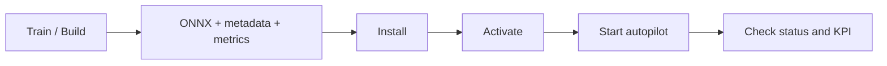

# Model Lifecycle

Эта страница описывает базовый путь работы с моделью управления в `uav-simulator`.

## Цепочка работы

1. Обучить или собрать модель во внешнем Python-контуре.
2. Получить артефакт:
   - `.onnx`
   - `metadata.json`
   - `metrics.json`
3. Установить модель через `rusim` или backend API.
4. Активировать нужную версию.
5. Запустить автопилот.
6. Проверить результат в `unity-sim`.
7. Подготовить перенос на `real-robot`.

## Формат артефакта

Минимальный набор:
- ONNX-модель;
- metadata c описанием наблюдений и действий;
- metrics c базовой сводкой по обучению или baseline.

## Установка через CLI

```bash
rusim model install python/training/artifacts/ab_corridor_policy_v1/ab_corridor_policy_v1.onnx --activate
rusim model list
rusim model active
```

CLI автоматически подхватывает соседние `metadata.json` и `metrics.json`, если они лежат рядом с `.onnx`.

## Backend API

Основные endpoint-ы:
- `POST /api/models/upload`
- `GET /api/models`
- `POST /api/models/activate`
- `GET /api/models/active`
- `POST /api/autopilot/start`
- `POST /api/autopilot/stop`
- `GET /api/autopilot/status`

## Что делает backend

- хранит registry моделей;
- валидирует ONNX-артефакт при загрузке;
- держит активную модель;
- запускает inference loop автопилота;
- возвращает статус и ошибки автопилота.

## Базовый сценарий



## Текущее состояние

Для `unity-sim` путь `train -> install -> activate -> run` уже собран на уровне интеграции.  
Отдельная задача следующего этапа — улучшение самой модели и перенос контура на реальную платформу.
