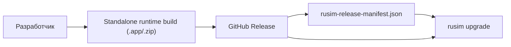

# Release / Distribution Model

## Назначение
Эта страница фиксирует каноническую модель поставки продукта наружу.

Цель:
- иметь понятный внешний source of truth для runtime release;
- отделить локальный dev-registry от публичной дистрибуции;
- использовать `rusim upgrade` как канонический клиент обновления.

## Базовый принцип
Наружу распространяется не git checkout, а **versioned standalone runtime release**.

Источник истины для distribution:
1. Git tag
2. GitHub Release
3. release manifest JSON, прикреплённый к тому же Release

Локальный `rusim` registry:
- `.rusim/runtime-builds.json`

не является внешним каналом поставки.  
Он описывает только уже установленные или локально собранные runtime build-ы.

## Каноническая схема


## Что публикуется в Release
Минимальный ожидаемый набор asset-ов:
- `uav-simulator-macos-vX.Y.Z.zip`
- `uav-simulator-macos-vX.Y.Z.zip.sha256`
- `rusim-release-manifest.json`

Позже можно расширить:
- `linux`
- `windows`
- release notes / changelog exports

## Почему выбран именно GitHub Releases
Плюсы:
- уже используется GitHub как source hosting;
- не нужен отдельный update server;
- легко хранить версионированные binary artifacts;
- manifest можно прикладывать как обычный release asset;
- будущий `rusim upgrade` сможет читать latest release через GitHub API.

Минусы:
- бинарные asset-ы завязаны на процесс публикации release;
- checksum нужно публиковать явно;
- пока есть ручной шаг локальной сборки runtime перед публикацией.

## Что считается release manifest
Канонический формат описан в:
- [Release Manifest v1](release-manifest-v1.md)

Практический смысл manifest:
- описывает latest release;
- перечисляет доступные runtime asset-ы;
- содержит download URL и checksum;
- становится машинно-читаемой точкой входа для upgrade/install flow.

## Текущий статус
На текущем этапе реализовано:
- schema и documentation для manifest;
- локальный генератор manifest (`scripts/generate_release_manifest.py`);
- GitHub Actions workflow `Release Manifest` (manual), который публикует `rusim-release-manifest.json` для уже созданного Release;
- команда `rusim upgrade`:
  - `--check-only` для проверки доступности обновления;
  - установка runtime из release manifest в локальный registry.

На текущем этапе ещё не реализовано:
- cloud-сборка runtime по тегу в GitHub Actions;
- мультиплатформенная cloud-сборка (`linux/windows`);
- отдельная команда `rusim release` для управления публикацией релизов из CLI.

## Практический workflow сейчас
1. Локально собрать runtime:

```bash
rusim runtime build --project-path src/UnityProject/uav-simulator
```

2. Упаковать `.app` в архив `uav-simulator-macos-vX.Y.Z.zip` и подготовить `.sha256`.

3. Создать GitHub Release `vX.Y.Z` и прикрепить runtime zip + checksum.

4. Запустить manual workflow `Release Manifest` с нужным `tag`.

```text
rusim-release-manifest.json
```

3. Пользователь обновляется через:

```bash
rusim upgrade --repo NMGorovenko/uav-simulator --tag latest
```

## Практические команды
Проверить наличие апдейта:

```bash
rusim upgrade --repo NMGorovenko/uav-simulator --tag latest --check-only
```

Установить релиз:

```bash
rusim upgrade --repo NMGorovenko/uav-simulator --tag latest
```
