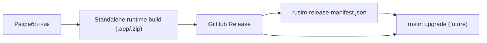

# Release / Distribution Model

## Назначение
Эта страница фиксирует каноническую модель поставки продукта наружу.

Цель:
- иметь понятный внешний source of truth для runtime release;
- отделить локальный dev-registry от публичной дистрибуции;
- подготовить основу для будущей команды `rusim upgrade`.

## Базовый принцип
Наружу распространяется не git checkout, а **versioned standalone runtime release**.

Источник истины для distribution:
1. Git tag
2. GitHub Release
3. release manifest JSON, прикреплённый к тому же Release

Локальный `rusim` registry:
- `.rusim/runtime-builds.json`

не является внешним каналом поставки.  
Он описывает только уже установленные или локально собранные runtime build-ы.

## Каноническая схема


## Что публикуется в Release
Минимальный ожидаемый набор asset-ов:
- `uav-simulator-macos-vX.Y.Z.zip`
- `uav-simulator-macos-vX.Y.Z.zip.sha256`
- `rusim-release-manifest.json`

Позже можно расширить:
- `linux`
- `windows`
- release notes / changelog exports

## Почему выбран именно GitHub Releases
Плюсы:
- уже используется GitHub как source hosting;
- не нужен отдельный update server;
- легко хранить версионированные binary artifacts;
- manifest можно прикладывать как обычный release asset;
- будущий `rusim upgrade` сможет читать latest release через GitHub API.

Минусы:
- бинарные asset-ы завязаны на процесс публикации release;
- checksum нужно публиковать явно;
- полноценная автоматическая сборка runtime зависит от доступности Unity build path.

## Что считается release manifest
Канонический формат описан в:
- [Release Manifest v1](release-manifest-v1.md)

Практический смысл manifest:
- описывает latest release;
- перечисляет доступные runtime asset-ы;
- содержит download URL и checksum;
- становится машинно-читаемой точкой входа для upgrade/install flow.

## Текущий статус
На текущем этапе реализовано:
- schema и documentation для manifest;
- локальный генератор manifest;
- GitHub Actions workflow, который генерирует `rusim-release-manifest.json` из GitHub Release assets и прикладывает его к release.

На текущем этапе ещё не реализовано:
- полноценная cloud-сборка macOS runtime в GitHub Actions;
- `rusim upgrade`;
- `rusim runtime install/download` из публичного release channel.

## Практический workflow сейчас
1. Собрать runtime локально:

```bash
rusim runtime build
```

2. Подготовить release asset-архив и checksum.

3. Опубликовать GitHub Release с runtime asset-ами.

4. Workflow `Release Manifest` сгенерирует и прикрепит:

```text
rusim-release-manifest.json
```

## Следующий шаг
После этого уже можно делать:
1. `rusim upgrade check`
2. `rusim upgrade`
3. `rusim runtime download/install`
