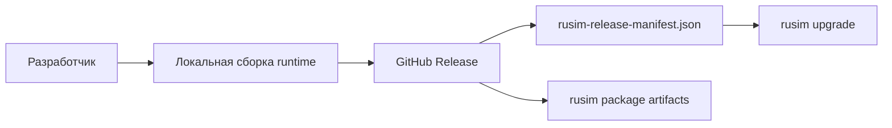

# Поставка и обновление


## Что публикуется сейчас
- standalone runtime archive, собранный локально;
- checksum для runtime archive;
- `rusim-release-manifest.json`;
- Python package artifacts (`.whl`, `.tar.gz`) для `rusim`.

## Как устроен поток


## Что важно
- runtime release собирается локально и прикладывается в GitHub Release вручную;
- manifest генерируется workflow `Release Manifest`;
- Python package публикуется workflow `Release Rusim Package`;
- `rusim upgrade` использует manifest как машинно-читаемую точку входа.

## Практический runtime flow
1. Локально собрать runtime:

```bash
rusim runtime build --project-path src/UnityProject/uav-simulator
```

2. Упаковать `.app` в архив и посчитать `sha256`.
3. Создать GitHub Release и загрузить runtime archive + checksum.
4. Запустить `Release Manifest` для генерации `rusim-release-manifest.json`.

## Практический update flow
Проверка доступности обновления:

```bash
rusim upgrade --repo NMGorovenko/uav-simulator --tag latest --check-only
```

Установка доступного runtime:

```bash
rusim upgrade --repo NMGorovenko/uav-simulator --tag latest
```

## Ограничения текущего контура
- cloud-build runtime отсутствует;
- runtime release пока ориентирован на локально собранный macOS bundle;
- release pipeline не является заменой обычной установки из репозитория во время активной разработки.

## Связанные страницы
- [Release Manifest](release-manifest.md)
- [CLI `rusim`](cli.md)
