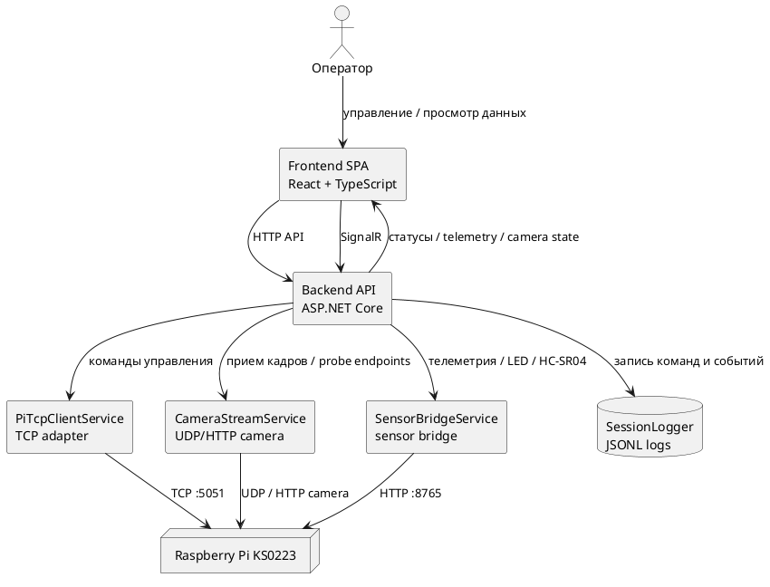
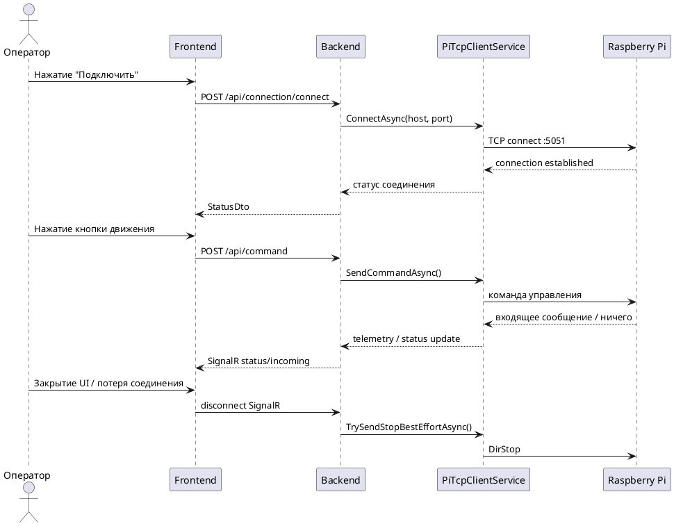

# Архитектура web-приложения управления KS0223

## Назначение
Приложение предназначено для управления роботизированной платформой Keyestudio KS0223 с macOS-компьютера без изменения штатной логики Raspberry Pi, а также для получения доступной телеметрии, видеопотока и журналирования работы системы.

## Общая схема
Архитектура построена по трёхзвенной модели:

1. `Frontend (React + TypeScript + MUI)` отвечает за интерфейс оператора.
2. `Backend (ASP.NET Core)` выступает адаптером протоколов и центром интеграции.
3. `Raspberry Pi / KS0223` предоставляет уже существующие TCP, UDP и HTTP каналы.

## Компоненты backend

### 1. PiTcpClientService
Основная служба управления TCP-соединением с роботом.

Функции:
- подключение к заданному IP и порту;
- повторные попытки соединения;
- отправка команд движения и управления камерой;
- приём входящих TCP-сообщений;
- аварийная остановка (`DirStop`) при потере UI или завершении приложения;
- публикация статуса для frontend.

### 2. CameraStreamService
Служба приёма видеоданных.

Функции:
- прослушивание UDP-потока кадров;
- проверка типовых HTTP camera endpoint на Pi;
- выдача snapshot и MJPEG-потока в web-интерфейс;
- хранение статуса камеры для healthcheck.

### 3. SensorBridgeService
Служба работы с расширенной телеметрией.

Функции:
- получение данных датчиков;
- управление HC-SR04 и его сервоприводом;
- управление LED-панелью;
- передача настроек скорости и конфигурации sensor bridge;
- публикация последних значений в UI.

### 4. SessionLogger
Компонент журналирования.

Функции:
- запись исходящих команд;
- запись входящих сообщений;
- запись сетевых ошибок и состояний;
- сохранение сессии в JSONL-формате.

## Компоненты frontend

### 1. ConnectionCard
Позволяет выбрать IP-адрес Raspberry Pi, подключиться или отключиться, увидеть статус TCP, число UI-клиентов, задержку и последнюю ошибку.

### 2. ControlPad
Отвечает за управление движением и камерой:
- клавиши `WASD`, стрелки, `Space`;
- экранные кнопки;
- удержание кнопок с повторной отправкой команд;
- отдельные настройки скорости и ultrasonic.

### 3. CameraPanel
Основной экран оператора:
- видеопоток;
- overlay с текстовыми данными;
- мини-control внутри кадра;
- полноэкранный режим;
- настройки отображения служебной информации.

### 4. Telemetry / Sensors / LED / Logs
Дополнительные вкладки для:
- просмотра телеметрии и диагностических статусов;
- инвентаризации сенсоров;
- работы с LED-панелью;
- управления журналированием.

## Последовательность работы

## Преимущества архитектуры

1. Изоляция протокола робота в backend.
2. Отказоустойчивая логика повторного подключения.
3. Fail-safe STOP при опасных сценариях.
4. Централизованное логирование сессии.
5. Удобное расширение через отдельные фоновые службы.
6. Возможность развивать UI без переписывания транспортного слоя.

## Ограничения и недостатки

1. Система зависит от нескольких независимых каналов Pi: TCP, UDP, HTTP.
2. Часть телеметрии недоступна по штатному TCP-протоколу робота.
3. Сетевое состояние Raspberry Pi после reboot влияет на стабильность всей системы.
4. Видеоканал и канал управления могут быть живы не одновременно, что усложняет диагностику.
5. Для полного охвата всех сенсоров требуется отдельный bridge-слой или доработка Pi-софта.

## Практический вывод
Выбранная архитектура рациональна для учебной и инженерной задачи, поскольку она минимально вмешивается в существующую систему KS0223, но при этом обеспечивает операторский web-интерфейс, диагностику, логирование и возможность дальнейшего расширения функциональности.
