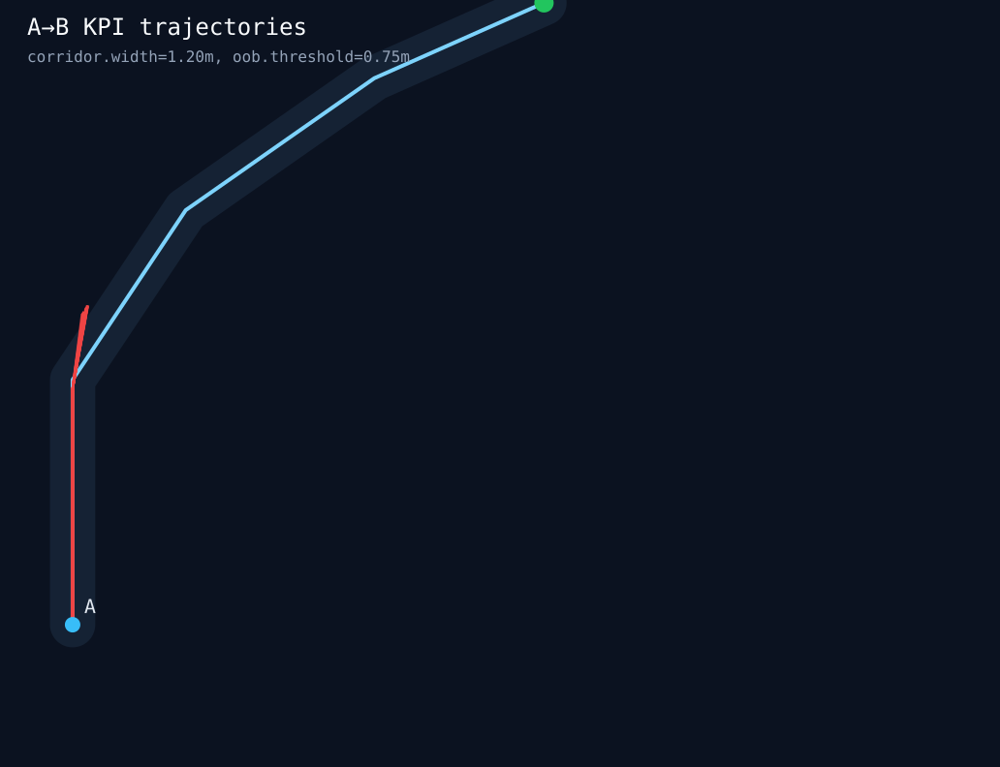

# KPI A->B (2026-03-29)

## Что измерялось
- Базовая модель: `python/training/artifacts/ab_corridor_policy_v1/ab_corridor_policy_v1.onnx`
- Сценарий: `configs/scenarios/ab-corridor-v1.yaml`
- Runtime: `unity-sim` через прямой HTTP API (`/reset` + `/step`)
- Серия: `20` эпизодов
- Лимит: `220` шагов на эпизод

## Результат
- `successRate = 0.0`
- `goal_reached = 0`
- `out_of_bounds = 20`
- `timeout = 0`
- Средняя длина эпизода до схода: `203.9` шага

## Наблюдение
- Политика стабильно проходит начальный прямой участок.
- Срыв происходит после достижения `routeIndex = 2`, то есть на переходе к повороту и дальнейшему выходу из коридора.
- Типичная финальная точка: `x ~= -5.6 .. -5.75`, `z ~= -0.03 .. -0.25`.

## Что это значит
- Контур `train -> install -> run` уже работает продуктово.
- Но baseline-политика пока не годится как целевая модель для Sprint 2 KPI.
- Следующий инженерный шаг должен быть не в UI, а в улучшении policy/eval loop:
  - дообучение или замена baseline;
  - более сильные признаки для поворота;
  - повторная серия эпизодов на той же карте.

## Ограничения
- `goal_reached` и `timeout` считаются строго по `StepResult.done` и лимиту шагов.
- `out_of_bounds` считается внешне по геометрии коридора: `corridor.width_m = 1.2`, порог `0.75 m` (`half-width + 0.15 m margin`).
- `collision` в текущую KPI-сводку не вошел: runtime-контракт пока не отдает отдельный collision-signal.

## Визуализация

## Артефакты
- `docs/report/prediploma-practice/evidence/ab-corridor-kpi-2026-03-29.json`
- `docs/report/prediploma-practice/evidence/ab-corridor-kpi-2026-03-29.svg`
