# Спринт 1 — Отчёт о выполненных работах

> **Период:** 21.03.2026 — 04.04.2026
> **Практика:** преддипломная (производственная), 09.04.04 «Программная инженерия»
> **Тема:** Разработка расширяемой программной платформы симуляции в Unity для проведения экспериментальных исследований в задачах обучения и sim-to-real для робототехнической платформы KS0223
> **Проект:** `uav-simulator`
> **Студент:** Горовенко Никита Максимович, группа КИ24-04-3М

> [!NOTE]
> Документ содержит Mermaid-диаграммы. Для корректного отображения рекомендуется открывать в **VS Code** с расширением [Markdown Preview Mermaid Support](https://marketplace.visualstudio.com/items?itemName=bierner.markdown-mermaid), либо в любом Markdown-редакторе с поддержкой Mermaid (Obsidian, Typora, GitHub).

---

## Оглавление

1. [Цель и задачи спринта](#1-цель-и-задачи-спринта)
2. [О проекте](#2-о-проекте)
3. [Архитектура платформы](#3-архитектура-платформы)
4. [Состав и назначение подсистем](#4-состав-и-назначение-подсистем) — Unity Simulator, Plugin Architecture, Operator Backend, Web UI, CLI `rusim`, Python Training, Docker/контейнеризация
5. [Продуктовый контур model lifecycle](#5-продуктовый-контур-model-lifecycle)
6. [Use-cases: как работать с платформой](#6-use-cases-как-работать-с-платформой)
7. [Выполненные задачи](#7-выполненные-задачи)
8. [Текущие ограничения](#8-текущие-ограничения)
9. [План на Спринт 2](#9-план-на-спринт-2)

---

## 1. Цель и задачи спринта

**Цель спринта** — подготовить рабочую инфраструктуру и инструментальный контур для проведения экспериментов по обучению моделей управления роботом в симуляторе и последующего переноса на реальную машинку (sim-to-real).

### Планируемые задачи

| # | Задача | Статус |
|---|--------|--------|
| 1 | Организационный старт: календарный план, индивидуальное задание, промежуточный отчёт №1 | Выполнено |
| 2 | Систематизация и подготовка документации проекта | Выполнено |
| 3 | Реализация продуктового контура `train → install → activate → run` | Выполнено |
| 4 | Backend API для управления моделями и автопилотом | Выполнено |
| 5 | Web UI — вкладка `Model Control` | Выполнено |
| 6 | CLI `rusim model install` — загрузка модели через командную строку | Выполнено |
| 7 | Baseline-артефакт модели для отладки pipeline | Выполнено |
| 8 | KPI-evaluator — автоматическая оценка модели в серии эпизодов | Выполнено |
| 9 | E2E smoke-верификация полного цикла | Выполнено |
| 10 | Первый KPI-срез и фиксация проблем baseline-модели | Выполнено |

---

## 2. О проекте

### Тема магистерского исследования

> Разработка расширяемой программной платформы симуляции в Unity для проведения экспериментальных исследований в задачах обучения и sim-to-real для робототехнической платформы `KS0223`.

### Что такое uav-simulator

`uav-simulator` — программная платформа, позволяющая:
- моделировать поведение наземного робота в виртуальной среде Unity;
- обучать модели управления в симуляции;
- устанавливать обученные модели через продуктовый контур;
- запускать автопилот как в симуляторе, так и на реальном роботе;
- проводить воспроизводимые эксперименты с фиксацией метрик.

### Четыре части продукта

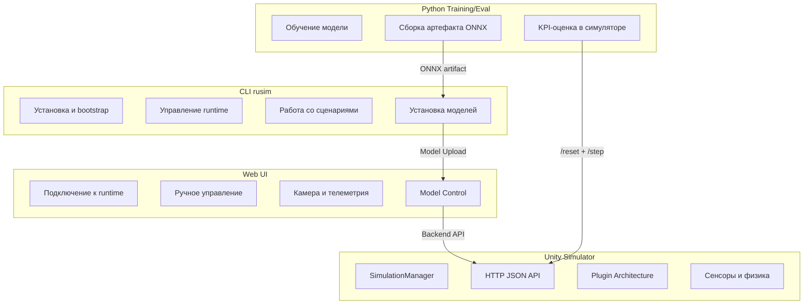

| Часть | Технология | Назначение |
|-------|-----------|-----------|
| **Web UI** | React + TypeScript | Операторский интерфейс: подключение, управление, камера, модели |
| **CLI `rusim`** | Python | Продуктовая точка входа: bootstrap, сборка, сценарии, модели |
| **Unity Simulator** | Unity 6 + C# | Физика, сцена, сенсоры, HTTP JSON API, плагины треков и машинок |
| **Python Training/Eval** | Python + ONNX | Обучение модели, экспорт артефакта, автоматическая KPI-оценка |

---

## 3. Архитектура платформы

### Общая схема взаимодействия

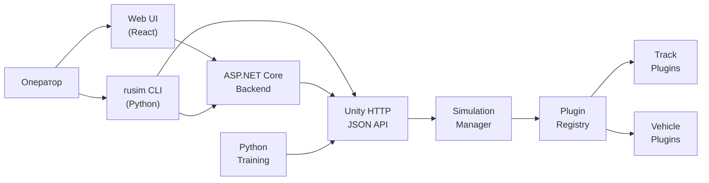

### Архитектурные границы

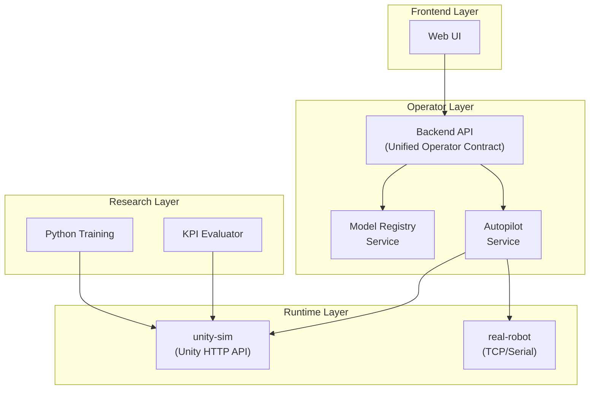

**Ключевой принцип**: frontend не знает transport-деталей конкретного runtime. Backend содержит провайдеры для `unity-sim` и `real-robot`, которые реализуют единый операторский контракт.

### Runtime flow — цикл управления

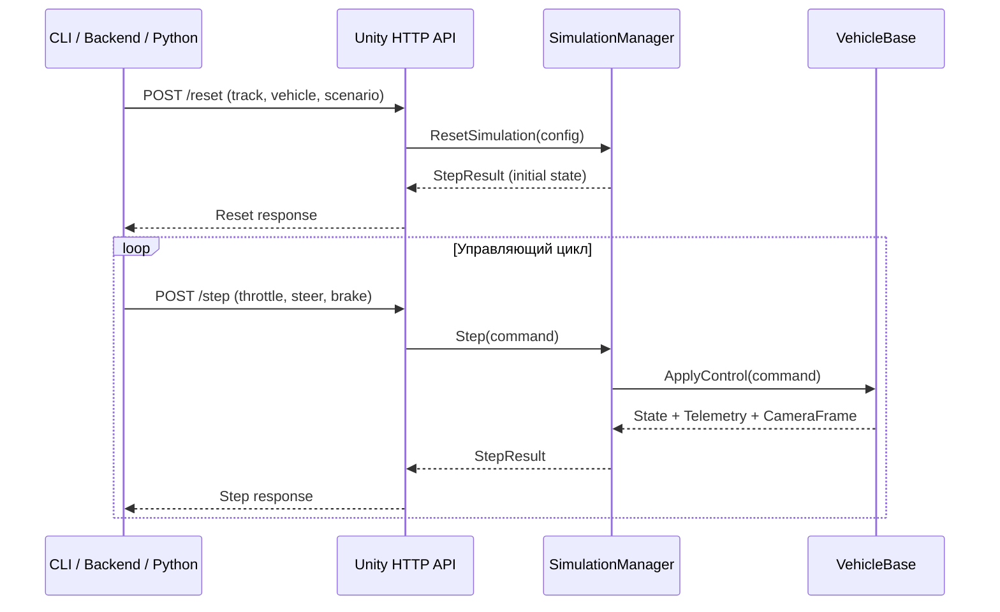

---

## 4. Состав и назначение подсистем

### 4.1 Unity Simulator

**Ключевые компоненты:**

| Компонент | Назначение |
|-----------|-----------|
| `RuntimeSceneBootstrap` | Инициализация сцены, поднятие HTTP-сервера |
| `SimulationManager` | Управление жизненным циклом симуляции: reset, step, agents |
| `PluginRegistry` | Каталог доступных треков и машинок (загрузка через Resources) |
| `HttpJsonApiHost` | HTTP-сервер внутри Unity runtime |
| `SimulatorApiFacade` | Фасад между HTTP API и SimulationManager |
| `VehicleBase` | Базовый класс машинки: физика, сенсоры, управление |

**API endpoint-ы Unity runtime:**

| Endpoint | Метод | Назначение |
|----------|-------|-----------|
| `/health` | GET | Статус runtime, активный трек и машинка |
| `/contract` | GET | Каталог треков, машинок, сенсоров и актуаторов |
| `/reset` | POST | Выбор трека/машинки, применение сценария, создание среды |
| `/step` | POST | Один шаг управления → новое состояние + телеметрия + кадр камеры |

#### Plugin architecture — подробное описание

Одна из ключевых архитектурных особенностей симулятора — **расширяемая плагинная система** для объектов симуляции (роботов, окружений, сенсоров). Она позволяет добавлять новые конфигурации без изменений во внешнем API, backend или CLI.

**Принцип работы:**
- Каждая машинка и каждый трек описываются **descriptor-ом** — ScriptableObject asset в Unity;
- Descriptor содержит метаданные (id, имя, версия, описание) и ссылку на prefab;
- Все descriptor-ы автоматически собираются в единый реестр `PluginRegistry` при старте runtime;
- Внешние клиенты (CLI, backend, Python) получают каталог через endpoint `GET /contract`.

**Иерархия классов:**

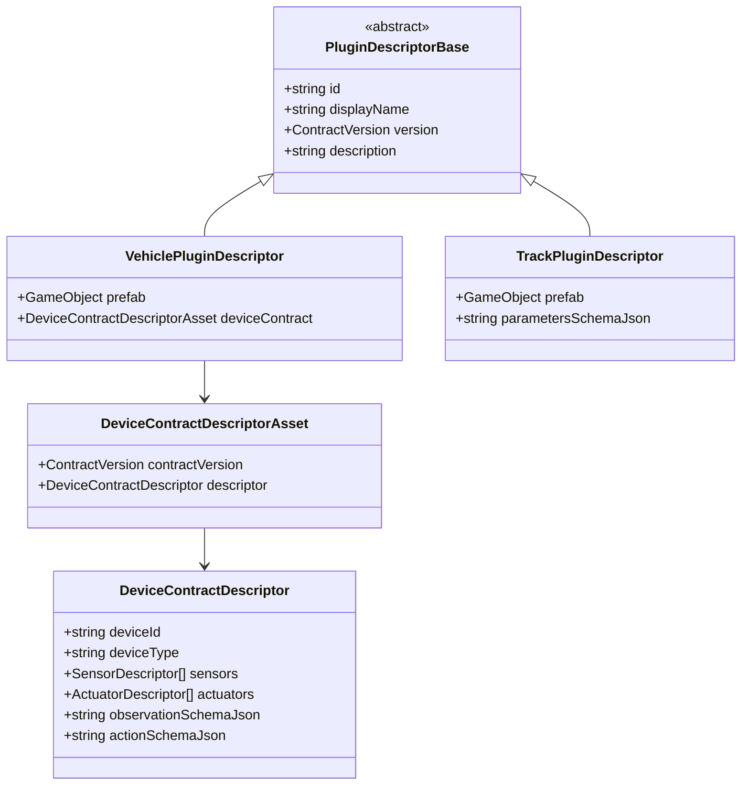

**Механизм загрузки реестра (каскад с fallback):**

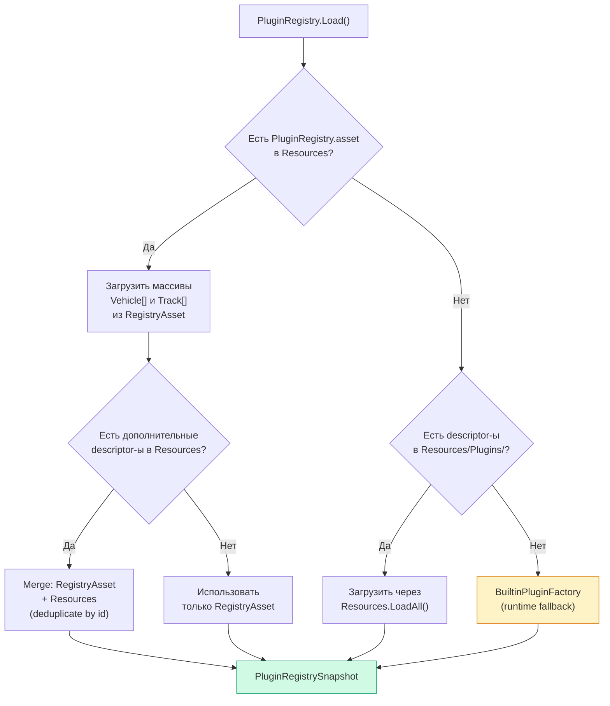

Трёхуровневая стратегия обеспечивает:
1. **RegistryAsset** — централизованный перечень (основной способ);
2. **Resources folder** — автоматическое обнаружение при отсутствии реестра;
3. **BuiltinPluginFactory** — hardcoded fallback, гарантирующий работу даже при отсутствии asset-ов.

**Реализация машинки (VehicleBase):**

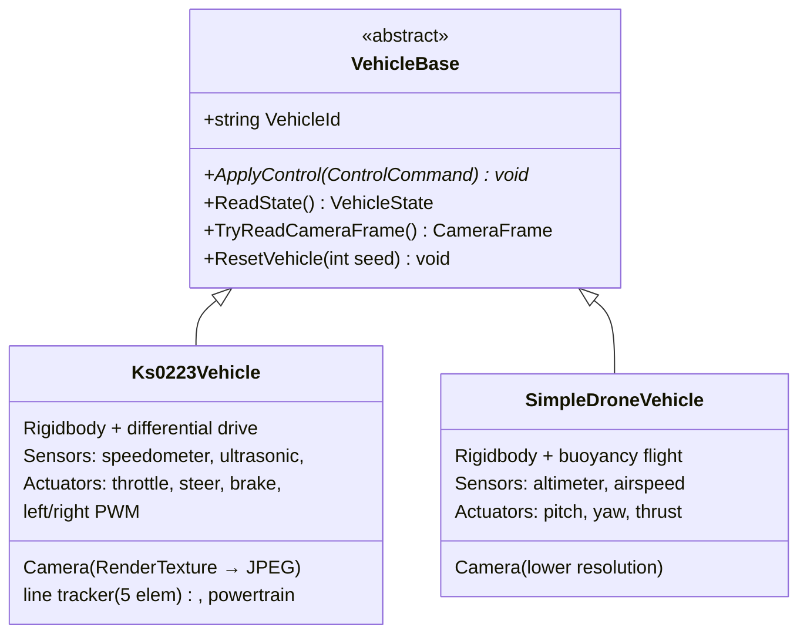

Каждая машинка реализует:
- `ApplyControl()` — приём управляющей команды (throttle, steer, brake + extension controls);
- `ReadState()` — возврат текущего состояния (позиция, скорость, телеметрия сенсоров);
- `TryReadCameraFrame()` — захват кадра камеры (JPEG + base64);
- `ResetVehicle(seed)` — сброс состояния с детерминированным seed-ом.

**Актуальный каталог:**

| Тип | ID | Описание |
|-----|-----|----------|
| Vehicle | `vehicle.prometeo.sport.v1` | Основная машинка для экспериментов |
| Vehicle | `vehicle.arcade.blue.v1` | Arcade Racing Car (синяя) |
| Vehicle | `vehicle.arcade.red.v1` | Arcade Racing Car (красная) |
| Vehicle | `vehicle.arcade.gray.v1` | Arcade Racing Car (серая) |
| Vehicle | `vehicle.arcade.purple.v1` | Arcade Racing Car (фиолетовая) |
| Vehicle | `vehicle.drone.simple.v1` | Простой квадрокоптер |
| Track | `track.basic_arena.v1` | Базовая арена |
| Track | `track.roadsystem_arena.v1` | Арена с дорожной системой |
| Track | `track.roadsystem_realistic.v2` | Реалистичная трасса |

**Контракт плагина:**

Каждый плагин реализует набор обязательных контрактов платформы:

| Контракт | Назначение | Обязательность |
|----------|------------|:--------------:|
| `PluginDescriptorBase` | Метаданные: id, displayName, version, description | Да |
| `DeviceContractDescriptor` | Описание сенсоров, актуаторов, observation/action schema | Да, для Vehicle |
| `Prefab` | Unity prefab объекта (машинка, окружение) | Да |
| `parametersSchemaJson` | JSON-схема параметров окружения (seed, time scale и др.) | Да, для Track |

**Соглашение по именованию ID:**
- Машинки: `vehicle.{brand}.{model}.v{major}` (например, `vehicle.prometeo.sport.v1`)
- Треки: `track.{name}.v{major}` (например, `track.roadsystem_realistic.v2`)

**SDK и инструментарий для разработки плагинов:**

Контракты платформы (`PluginDescriptorBase`, `VehiclePluginDescriptor`, `TrackPluginDescriptor`, `DeviceContractDescriptor` и др.) доступны через Unity Package Manager в виде пакета `com.uav-simulator.plugin-sdk`. Пакет подключается к Unity-проекту стандартным способом — через `manifest.json` или через UI: `Window > Package Manager > Add package from git URL`:

```text
https://github.com/NMGorovenko/uav-simulator.git?path=packages/com.uav-simulator.plugin-sdk
```

Пакет содержит:
- Базовые классы и интерфейсы контрактов (`PluginDescriptorBase`, `VehicleBase`, `DeviceContractDescriptor` и др.);
- ScriptableObject-шаблоны для создания descriptor-ов через меню Unity;
- Валидаторы: автоматическая проверка заполненности контракта при сборке;
- Editor-утилиту для упаковки плагина в `.rusim-plugin.zip`.

**Plugin Template:**

Для быстрого старта предусмотрен шаблонный проект `uav-simulator-plugin-template`, содержащий готовую структуру плагина с минимальной конфигурацией:

```bash
# Клонировать шаблон
git clone https://github.com/NMGorovenko/uav-simulator-plugin-template.git my-plugin

# Открыть в Unity 6 (версия должна совпадать с целевым runtime)
# → SDK-пакет уже подключён через manifest.json
# → Пример descriptor-а, prefab-а и device contract-а заполнен
```

Шаблон гарантирует совместимость с контрактами платформы и содержит пример `manifest.json`, готовый к упаковке.

**Разработка плагина (пошагово):**

1. Создать Unity-проект на основе template или подключить SDK-пакет к существующему проекту;
2. Убедиться, что версия Unity совпадает с целевым runtime (Unity 6);
3. Создать prefab объекта с нужными компонентами (физика, сенсоры, камера);
4. Создать descriptor asset через меню Unity: `Create > UavSimulator/Plugins/Vehicle Plugin` (или `Track Plugin`);
5. Заполнить контракт: id, displayName, version, description, привязать prefab;
6. Для Vehicle-плагина — создать `DeviceContractDescriptorAsset` с описанием сенсоров и актуаторов;
7. Запустить валидацию: `Tools > UavSimulator > Validate Plugins` — проверит полноту контракта;
8. Упаковать: `Tools > UavSimulator > Export Plugin (.zip)` — соберёт архив `.rusim-plugin.zip`;
9. Проверить: `rusim plugin install *.zip` → плагин появится в `rusim list` и Web UI.

**Упаковка и распространение:**

Готовый плагин упаковывается в стандартный формат `.rusim-plugin.zip` для распространения:

```text
my-vehicle-plugin.rusim-plugin.zip
├── manifest.json               # id, version, type, compatibleRuntime
├── descriptor.asset             # PluginDescriptor (ScriptableObject)
├── device-contract.asset        # DeviceContractDescriptorAsset (для Vehicle)
├── prefab/                      # Prefab и зависимые asset-ы
│   ├── my_vehicle.prefab
│   └── materials/
└── README.md                    # Опционально: описание плагина
```

Файл `manifest.json` фиксирует совместимость и метаданные:

```json
{
  "pluginId": "vehicle.custom.racer.v1",
  "type": "vehicle",
  "displayName": "Custom Racer",
  "version": "1.0.0",
  "compatibleRuntime": ">=0.2.0",
  "author": "developer@example.com"
}
```

**Установка плагина:**

Для конечного пользователя установка плагина сводится к одной команде через CLI:

```bash
# Установить плагин из локального архива
rusim plugin install ./my-vehicle-plugin.rusim-plugin.zip

# Установить и сразу проверить
rusim plugin install ./my-vehicle-plugin.rusim-plugin.zip
rusim list vehicles --base-url http://127.0.0.1:8000
# → vehicle.custom.racer.v1 появится в списке

# Посмотреть установленные плагины
rusim plugin list

# Удалить плагин
rusim plugin remove vehicle.custom.racer.v1
```

**Два режима работы с плагинами:**

| Сценарий | Разработчик (Unity Editor) | Оператор / исследователь (только runtime) |
|----------|:------:|:------:|
| Использовать встроенные плагины | Доступны сразу | Доступны сразу |
| Создать новый плагин с нуля | Да, через Unity Editor + SDK симулятора | Нет, без Unity Editor |
| Установить готовый плагин | `rusim plugin install *.zip` | `rusim plugin install *.zip` |
| Обновить runtime со встроенными плагинами | `rusim runtime build` | `rusim upgrade --tag <версия>` |

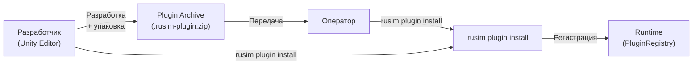

Плагины, входящие в состав runtime (6 машинок и 3 трека), доступны сразу после запуска — никакой дополнительной установки не требуется:

```bash
# Посмотреть доступные машинки
rusim list vehicles --base-url http://127.0.0.1:8000

# Переключить на другую конфигурацию
rusim reset --track-id track.basic_arena.v1 \
  --vehicle-id vehicle.drone.simple.v1 \
  --base-url http://127.0.0.1:8000
```

### 4.2 Operator Backend (ASP.NET Core)

Backend предоставляет единый операторский API для frontend и CLI:

**Операторские endpoint-ы:**

| Endpoint | Метод | Назначение |
|----------|-------|-----------|
| `/api/connection/connect` | POST | Подключение к выбранному runtime |
| `/api/connection/disconnect` | POST | Отключение от runtime |
| `/api/status` | GET | Состояние текущей сессии |
| `/api/health` | GET | Здоровье backend и подключённого runtime |
| `/api/command` | POST | Отправка управляющей команды |
| `/api/camera/*` | GET | Получение видеопотока камеры |
| `/api/sensors/*` | GET | Получение телеметрии |

**Model Registry API:**

| Endpoint | Метод | Назначение |
|----------|-------|-----------|
| `/api/models/upload` | POST | Загрузка ONNX-артефакта с метаданными |
| `/api/models` | GET | Список зарегистрированных моделей |
| `/api/models/activate` | POST | Выбор активной модели |
| `/api/models/active` | GET | Текущая активная модель |

**Autopilot API:**

| Endpoint | Метод | Назначение |
|----------|-------|-----------|
| `/api/autopilot/start` | POST | Запуск inference-цикла автопилота |
| `/api/autopilot/stop` | POST | Остановка автопилота, возврат в ручной режим |
| `/api/autopilot/status` | GET | Диагностика: шаги, команды, ошибки, текущий режим |

### 4.3 Web UI (React)

Интерфейс оператора включает:
- **Подключение** — выбор runtime (`unity-sim` / `real-robot`), подключение/отключение;
- **Управление** — клавиатурное управление машинкой в реальном времени;
- **Камера** — видеопоток с борта робота;
- **Телеметрия** — датчики линии, дистанция, скорость;
- **Model Control** — загрузка ONNX-модели, активация, запуск/остановка автопилота, диагностика последнего шага.

### 4.4 CLI `rusim` — подробное описание

#### Что такое `rusim` и зачем он нужен

`rusim` — каноническая командная строка платформы `uav-simulator`. Это **единая продуктовая точка входа** для всех операций с платформой: от первоначальной установки до обучения моделей и проведения экспериментов.

Платформа `uav-simulator` состоит из нескольких технически разнородных частей: Unity runtime (C#), operator backend (ASP.NET Core), Web UI (React), Python training pipeline. Без CLI пользователю пришлось бы взаимодействовать с каждой частью отдельно:

| Без `rusim` | С `rusim` |
|-------------|-----------|
| Открыть Unity Editor → File → Build → выбрать платформу → ждать сборку → найти .app | `rusim runtime build` |
| Найти .app файл → запустить с аргументами → ждать → проверить порт | `rusim server up --mode background --port 8000` |
| `curl -X POST http://...` с JSON-телом для каждого API-вызова | `rusim reset --track-id ... --vehicle-id ...` |
| Вручную скопировать .onnx на сервер, POST multipart form через curl | `rusim model install policy.onnx --activate` |
| Открыть yaml, вручную проверить поля, сформировать JSON | `rusim scenario validate ab-corridor-v1.yaml` |
| Проверить порт, curl /health, парсить JSON глазами | `rusim doctor` |

`rusim` написан на Python, работает на macOS и Windows, общается с Unity runtime через HTTP JSON API, а с backend — через его REST API.

#### Архитектура CLI и взаимодействие с компонентами

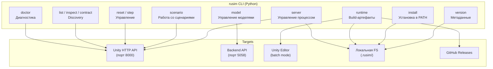

CLI разделён на **функциональные группы**, каждая из которых отвечает за конкретный аспект работы с платформой. Ниже — описание каждой группы.

---

#### Функция 1: Установка и настройка (`install`, `version`, `upgrade`)

**Проблема:** пользователю нужно установить CLI, обновлять runtime, проверять версии — и всё это без ручной возни с переменными окружения и скачиванием архивов.

**Как `rusim` это решает:**

```bash
# Установка CLI: создаёт symlink в PATH и дописывает ~/.zshrc
rusim install --write-shell-config
source ~/.zshrc

# Проверка версии: CLI, git sha, текущий build registry
rusim version
# → rusim 0.8.0 (abc1234)
# → latest build: uav-simulator-2026.03.28-120000.app
# → favorite: uav-simulator-2026.03.28-120000.app

# Обновление runtime из GitHub Release:
rusim upgrade --repo NMGorovenko/uav-simulator --tag latest
# → скачивает manifest, выбирает asset по платформе,
#   проверяет sha256, распаковывает, регистрирует build

# Только проверить наличие обновления (без скачивания):
rusim upgrade --repo NMGorovenko/uav-simulator --tag latest --check-only
```

`upgrade` автоматически работает с private-репозиторием при наличии `GITHUB_TOKEN`.

---

#### Функция 2: Сборка, поставка и управление runtime (`runtime`, `server`, `upgrade`)

**Проблема:** пользователю нужен готовый симулятор — чтобы его запустить, обновить, откатить на предыдущую версию. В мире Python для этого есть `pyenv`, в Node.js — `nvm`, в .NET — `dotnet sdk`, в Java — `sdkman`. В мире Unity такого инструмента нет — `rusim` решает эту задачу для платформы `uav-simulator`.

**`rusim` как менеджер версий runtime (аналог nvm/pyenv/sdkman):**

| Концепция | `nvm` (Node.js) | `pyenv` (Python) | `rusim` (uav-simulator) |
|-----------|-----------------|-------------------|------------------------|
| Установить версию | `nvm install 22` | `pyenv install 3.13` | `rusim upgrade --tag v0.2.0` |
| Список версий | `nvm ls` | `pyenv versions` | `rusim runtime list` |
| Выбрать активную | `nvm use 22` | `pyenv local 3.13` | `rusim runtime favorite set latest` |
| Запустить | `node app.js` | `python app.py` | `rusim server up --build favorite` |
| Удалить | `nvm uninstall 18` | `pyenv uninstall 3.12` | `rusim runtime remove <id>` |
| Проверить обновления | — | — | `rusim upgrade --check-only` |

**Два способа получить runtime:**

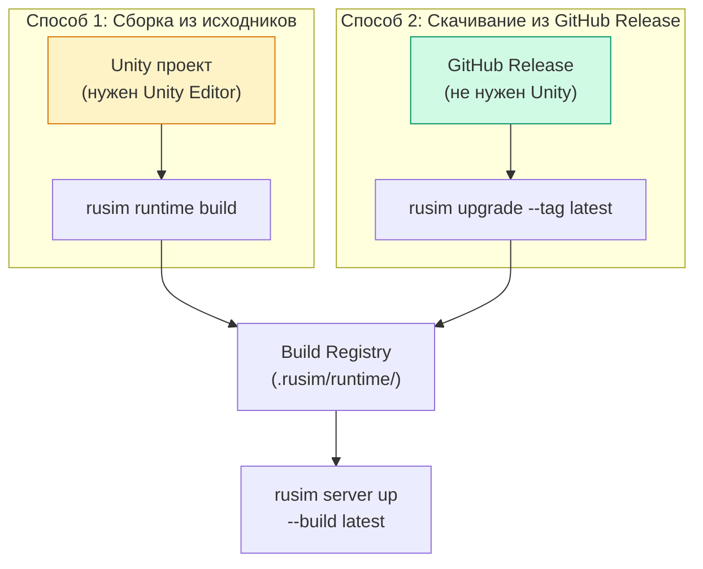

**Способ 1** — для разработчика, у которого есть Unity Editor. **Способ 2** — для любого пользователя: оператора, исследователя, CI-сервера — Unity Editor не нужен.

**Как работает `rusim upgrade` изнутри:**

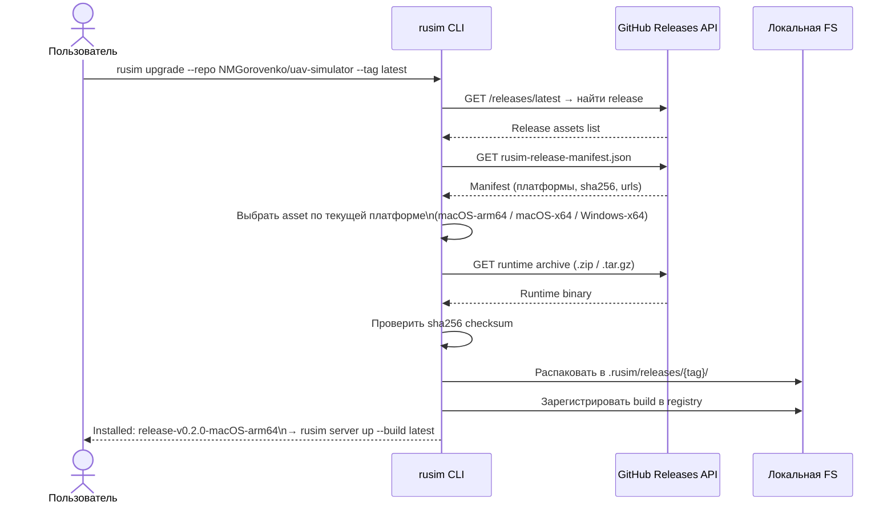

Каждый релиз содержит `rusim-release-manifest.json` — JSON-файл с описанием доступных платформ, URL для скачивания и контрольными суммами. Это позволяет `rusim upgrade` полностью автоматически определить нужный артефакт и безопасно его установить.

**Как `rusim` это решает:**

**Сборка standalone runtime** — вместо ручной сборки через Unity Editor:

```bash
# Сборка macOS standalone из Unity проекта (batch mode, без открытия Editor UI)
rusim runtime build --project-path src/UnityProject/uav-simulator

# Build автоматически получает versioned name:
# → uav-simulator-2026.03.28-153000+abc123.app

# Можно дать свой label:
rusim runtime build --label demo
```

**Build Registry** — управление коллекцией build-артефактов:

```bash
# Список всех build-ов
rusim runtime list
# → [1] uav-simulator-2026.03.28-153000.app (latest)
# → [2] uav-simulator-2026.03.25-120000.app

# Детали конкретного build-а
rusim runtime inspect latest

# Установить favorite build (используется по умолчанию)
rusim runtime favorite set latest
rusim runtime favorite show

# Удалить старый build
rusim runtime remove uav-simulator-2026.03.25-120000
```

**Запуск и остановка** — полный lifecycle управления процессом:

```bash
# Запуск runtime (3 режима — см. таблицу ниже)
rusim server up --build favorite --mode background --port 8000

# Запуск со сценарием (автоматический reset при старте)
rusim server up --mode background --port 8000 \
  --scenario configs/scenarios/ab-corridor-v1.yaml --wait-seconds 120

# Статус процесса
rusim server status --port 8000

# Остановка
rusim server down
```

**Три режима запуска:**

| Режим | Что делает | Камера | Когда использовать |
|-------|-----------|--------|-------------------|
| `windowed` | Обычное окно Unity с рендером | Работает | Ручная отладка, визуальная работа, демонстрация |
| `background` | Без окна, но с graphics device | Работает | Автоматизация, автопилот, CI когда нужна камера |
| `headless` | `-batchmode -nographics` | Недоступна | Серверный режим, training без видео, CI |

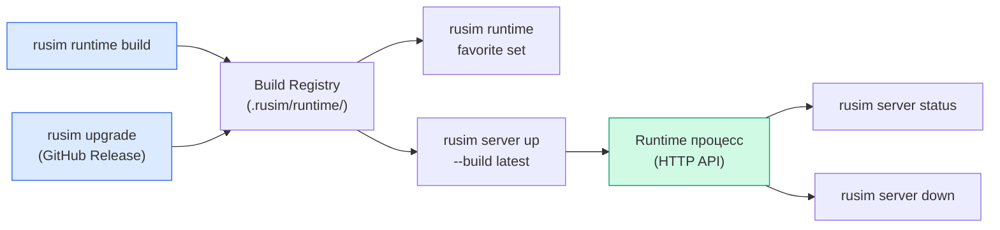

---

#### Функция 3: Диагностика и discovery (`doctor`, `contract`, `list`, `inspect`)

**Проблема:** после запуска runtime нужно понять — работает ли он, какие треки и машинки доступны, какие у машинки сенсоры, какие параметры принимает reset.

**Как `rusim` это решает:**

```bash
# Быстрая проверка: жив ли runtime, что активно
rusim doctor --base-url http://127.0.0.1:8000
# → status: ok
# → pluginRegistrySource: RegistryAsset
# → activeTrackId: track.basic_arena.v1
# → activeVehicleId: vehicle.prometeo.sport.v1
# → availableVehicles: 6, availableTracks: 3

# Полный контракт: все треки, все машинки, их возможности
rusim contract --base-url http://127.0.0.1:8000

# Список треков
rusim list tracks --base-url http://127.0.0.1:8000
# → track.basic_arena.v1          Базовая арена
# → track.roadsystem_arena.v1     Арена с дорожной системой
# → track.roadsystem_realistic.v2 Реалистичная трасса

# Список машинок
rusim list vehicles --base-url http://127.0.0.1:8000
# → vehicle.prometeo.sport.v1     PROMETEO Sport
# → vehicle.arcade.blue.v1        Arcade Racing Car (Blue)
# → vehicle.drone.simple.v1       Simple Quadcopter
# → ...

# Подробности о конкретной машинке
rusim inspect vehicle vehicle.prometeo.sport.v1 --base-url http://127.0.0.1:8000
# → id: vehicle.prometeo.sport.v1
# → type: ground_robot_differential
# → sensors: camera, speedometer, ultrasonic, line_tracker (5 elem), powertrain
# → actuators: throttle, steer, brake, left_pwm, right_pwm
# → observation schema: {...}
# → action schema: {...}
# → example reset command: rusim reset --track-id ... --vehicle-id ...
```

Discovery-команды позволяют любому пользователю за 30 секунд понять, что есть в runtime и как с этим работать, не читая документацию и не открывая Unity Editor.

---

#### Функция 4: Управление симуляцией (`reset`, `step`, `scenario`)

**Проблема:** для управления симуляцией нужно формировать JSON-запросы к HTTP API, знать формат payload-ов, следить за структурой ответов. Для сценариев — писать YAML вручную и надеяться, что формат правильный.

**Как `rusim` это решает:**

```bash
# Переключить трек и машинку одной командой
rusim reset --base-url http://127.0.0.1:8000 \
  --track-id track.basic_arena.v1 \
  --vehicle-id vehicle.prometeo.sport.v1 \
  --seed 42

# Один шаг управления (для отладки)
rusim step --base-url http://127.0.0.1:8000 \
  --throttle 0.5 --steer 0.1 --brake 0.0

# В multi-agent режиме — адресация конкретного агента
rusim step --base-url http://127.0.0.1:8000 \
  --agent-id npc-red --throttle 0.3 --steer 0.0
```

**Работа со сценариями** — YAML-файлы описывают полную конфигурацию эксперимента:

```bash
# Проверить YAML-сценарий (без отправки)
rusim scenario validate configs/scenarios/ab-corridor-v1.yaml
# → valid: true

# Посмотреть какой JSON будет отправлен при reset
rusim scenario print-reset configs/scenarios/ab-corridor-v1.yaml

# Применить сценарий к запущенному runtime
rusim scenario reset configs/scenarios/ab-corridor-v1.yaml \
  --base-url http://127.0.0.1:8000
```

Это позволяет описать эксперимент один раз в YAML и воспроизводимо применять его через CLI, не формируя JSON вручную.

---

#### Функция 5: Управление моделями (`model`)

**Проблема:** после обучения модели (ONNX-артефакт) нужно загрузить её в backend, вместе с метаданными и метриками, активировать — всё это через multipart HTTP upload с несколькими полями.

**Как `rusim` это решает:**

```bash
# Установка модели: CLI автоматически подхватывает metadata.json
# и metrics.json, если они лежат рядом с .onnx файлом
rusim model install \
  python/training/artifacts/ab_corridor_policy_v1/ab_corridor_policy_v1.onnx \
  --activate
# → Uploaded: model-20260329-143022-a1b2c3d4
# → Activated: model-20260329-143022-a1b2c3d4

# Посмотреть все зарегистрированные модели
rusim model list
# → [1] model-20260329-143022-a1b2c3d4  ab-corridor-policy-v1  v1.0.0  active
# → [2] model-20260328-091500-x9y8z7w6  old-baseline          v0.9.0

# Какая модель сейчас активна?
rusim model active
# → model-20260329-143022-a1b2c3d4 (ab-corridor-policy-v1, v1.0.0)

# Активировать другую модель
rusim model activate model-20260328-091500-x9y8z7w6
```

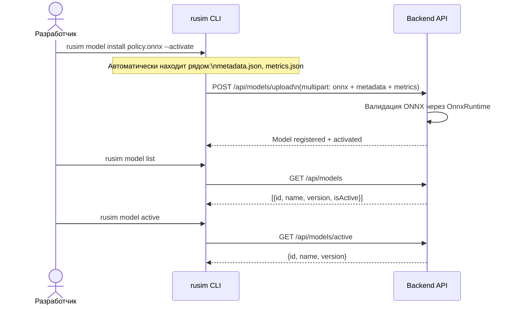

---

#### Функция 6: Управление плагинами (`plugin`)

**Проблема:** плагины (машинки, окружения) разрабатываются как отдельные модули в Unity Editor, но конечный пользователь не должен устанавливать Unity для подключения нового плагина к уже собранному runtime.

**Как `rusim` это решает:**

Готовый плагин упаковывается в стандартный архив `.rusim-plugin.zip` и устанавливается одной командой:

```bash
# Установить плагин из архива
rusim plugin install ./custom-racer.rusim-plugin.zip
# → Installed: vehicle.custom.racer.v1

# Посмотреть установленные плагины
rusim plugin list
# → [built-in] vehicle.prometeo.sport.v1  PROMETEO Sport
# → [built-in] vehicle.arcade.blue.v1     Arcade Racing Car (Blue)
# → [user]     vehicle.custom.racer.v1    Custom Racer

# Удалить плагин
rusim plugin remove vehicle.custom.racer.v1
```

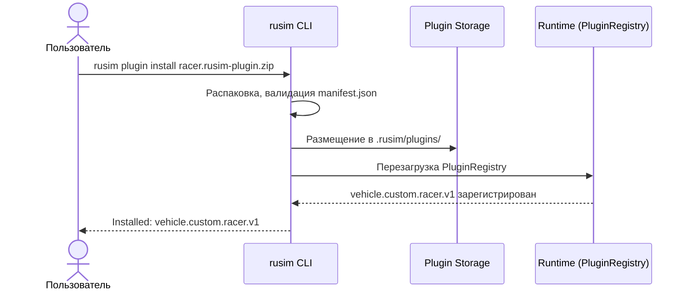

Это делает плагинную систему доступной не только для разработчиков с Unity, но и для операторов и исследователей, которые получают плагины в виде готовых архивов.

---

#### Полное дерево команд (справочник)

```text
rusim
├── install                          Установка CLI в PATH пользователя
│   └── --write-shell-config         Дописать PATH в ~/.zshrc
├── version                          Версия CLI, git sha, build registry
├── upgrade                          Обновление runtime из GitHub Release
│   ├── --repo                       GitHub репозиторий
│   ├── --tag                        Тег (latest / конкретный)
│   └── --check-only                 Только проверка
├── doctor                           Диагностика runtime
├── contract                         Полный контракт (каталог)
├── list tracks|scenes|vehicles      Списки ресурсов
├── inspect track|scene|vehicle <id> Детали ресурса
├── reset                            Выбор трека и машинки
│   ├── --track-id / --vehicle-id
│   └── --seed / --time-scale
├── step                             Один шаг управления
│   ├── --throttle / --steer / --brake
│   └── --agent-id
├── model                            Управление моделями
│   ├── install <.onnx>              Загрузка в backend registry
│   │   └── --activate / --name / --version
│   ├── list                         Список моделей
│   ├── active                       Текущая активная
│   └── activate <id>                Активация
├── plugin                           Управление плагинами
│   ├── install <.zip>               Установка из архива
│   ├── list                         Список установленных плагинов
│   └── remove <id>                  Удаление плагина
├── runtime                          Управление build-артефактами
│   ├── build                        Сборка standalone
│   ├── list / inspect / remove      Управление registry
│   ├── favorite show|set            Favorite build
│   └── upgrade                      Обновление из GitHub
├── server                           Управление runtime-процессом
│   ├── up                           Запуск
│   │   └── --mode / --port / --build / --scenario
│   ├── status                       Статус
│   └── down                         Остановка
└── scenario                         Работа со сценариями
    ├── validate <.yaml>             Проверка
    ├── print-reset <.yaml>          Показ payload
    └── reset <.yaml>                Применение к runtime
```

---

#### Типичный сквозной сценарий работы с `rusim`

Ниже — полный сценарий от первого запуска до оценки модели, демонстрирующий как CLI связывает все части платформы:

```bash
# === Шаг 1: Первичная настройка ===
rusim install --write-shell-config
source ~/.zshrc
rusim version

# === Шаг 2: Сборка runtime ===
rusim runtime build --project-path src/UnityProject/uav-simulator
rusim runtime list
rusim runtime favorite set latest

# === Шаг 3: Запуск runtime со сценарием ===
rusim server up --build favorite --mode background --port 8000 \
  --scenario configs/scenarios/ab-corridor-v1.yaml --wait-seconds 120

# === Шаг 4: Проверка что всё работает ===
rusim doctor --base-url http://127.0.0.1:8000
rusim list tracks --base-url http://127.0.0.1:8000
rusim list vehicles --base-url http://127.0.0.1:8000

# === Шаг 5: Установка обученной модели ===
rusim model install python/training/artifacts/ab_corridor_policy_v1/ab_corridor_policy_v1.onnx --activate
rusim model active

# === Шаг 6: Запуск автопилота через Web UI ===
# → открыть http://localhost:5058
# → вкладка Model Control → Start Autopilot

# === Шаг 7: Автоматическая KPI-оценка ===
python3 python/training/evaluate_ab_policy.py \
  --episodes 20 --max-steps 220 \
  --output-json evidence/kpi.json --output-svg evidence/kpi.svg

# === Шаг 8: Остановка ===
rusim server down
```

Этот workflow показывает, что `rusim` служит **связующим звеном** между всеми частями платформы: Unity runtime, backend, моделями и сценариями — и позволяет оператору управлять всем из одной командной строки, не переключаясь между инструментами.

### 4.5 Python Training/Eval

| Скрипт | Назначение |
|--------|-----------|
| `build_ab_policy_artifact.py` | Сборка baseline-артефакта (ONNX + metadata + metrics) |
| `evaluate_ab_policy.py` | Автоматическая оценка модели: серия эпизодов через Unity API |

**Артефакт модели** состоит из трёх файлов:

| Файл | Назначение |
|------|-----------|
| `*.onnx` | Исполняемая политика (inference на backend через OnnxRuntime) |
| `metadata.json` | Схема наблюдений/действий, версия, целевой сценарий |
| `metrics.json` | Контрольные показатели и служебные метки эксперимента |

### 4.6 CI/CD, Docker и контейнеризация

Одна из ключевых особенностей платформы — наличие полноценного CI/CD pipeline и контейнерной поставки. Это значит, что проект не просто «работает на машине разработчика», а имеет автоматизированную проверку, сборку, публикацию и развёртывание.

#### CI/CD Pipeline (GitHub Actions)

В репозитории настроены 4 автоматических workflow:

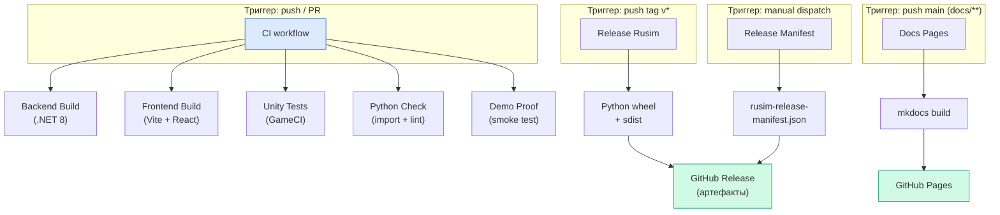

| Workflow | Триггер | Что делает |
|----------|---------|-----------|
| **CI** | Каждый push и PR | Собирает backend (.NET 8), frontend (Vite), запускает Unity тесты через GameCI, проверяет Python imports, прогоняет demo-proof smoke |
| **Release Rusim** | Push тега `v*` | Собирает Python wheel/sdist пакета `rusim`, публикует артефакты в GitHub Release |
| **Release Manifest** | Ручной dispatch | Генерирует `rusim-release-manifest.json` с описанием runtime-артефактов по платформам, публикует в GitHub Release |
| **Docs Pages** | Push в main/develop (docs/) | Собирает сайт документации через mkdocs, деплоит на GitHub Pages |

**Что это даёт:**
- Каждый push автоматически проверяет, что backend, frontend и Unity-часть компилируются;
- При выпуске новой версии (`git tag v0.2.0 && git push --tags`) автоматически собирается `rusim` пакет и публикуется manifest для `rusim upgrade`;
- Документация автоматически обновляется на GitHub Pages при изменениях в `docs/`.

#### Docker-образ Operator Backend (WebUI + Backend)

Operator stack (ASP.NET Core backend + React Web UI) упакован в единый Docker-образ с multi-stage сборкой. Это означает, что **весь WebUI и backend можно развернуть одной командой** на любой машине с Docker — без установки .NET, Node.js или чего-либо ещё.

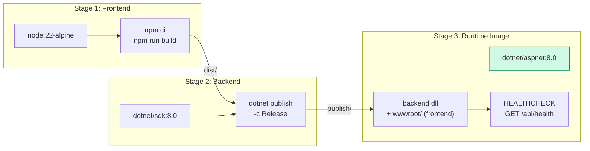

| Параметр | Значение |
|----------|----------|
| Образ | `ks0223-web-mac:latest` |
| HTTP-порт | `5058` (WebUI + API) |
| UDP-порт | `5051` (telemetry от реального робота) |
| Healthcheck | `GET /api/health` каждые 10 сек |
| Логи | `/app/logs` (монтируется как volume) |

**Быстрый запуск (одна команда):**

```bash
cd src/ks0223-web-mac
make docker-update
# → собирает образ, запускает контейнер, ждёт healthcheck
# → WebUI доступен на http://localhost:5058
```

**Полный набор команд:**

```bash
make docker-build     # Собрать образ
make docker-rebuild   # Пересобрать без кэша
make docker-update    # Build + run + wait (всё сразу)
make docker-logs      # Логи контейнера
make docker-health    # Проверка здоровья
make docker-stop      # Остановка
make docker-shell     # Интерактивная оболочка в контейнере
```

**Типичные сценарии использования Docker-образа:**

| Сценарий | Что запускается | Команда |
|----------|----------------|---------|
| Разработка на локальной машине | Backend + WebUI в контейнере | `make docker-update` |
| Стенд с реальным роботом | Контейнер на Raspberry Pi / мини-ПК | `docker run -d -p 5058:5058 -p 5051:5051/udp ks0223-web-mac` |
| CI/CD smoke test | Контейнер в GitHub Actions | `make demo-proof-ci` |
| Удалённый доступ к WebUI | Контейнер на сервере | `docker run -d -p 5058:5058 ks0223-web-mac` + браузер на `http://<server>:5058` |

#### ROS2 контейнер

Для ROS2-интеграции и демонстрации используется контейнерная среда с VNC-доступом:

```bash
# Полный ROS2-стек одной командой
make demo-up
# → ROS2 Humble desktop с VNC (http://127.0.0.1:6080)
# → ROS2 bridge: Python → ROS2 topics
# → Автоматический reset сценария
```

| Компонент | Образ | Порт |
|-----------|-------|------|
| ROS2 Desktop + VNC | `tiryoh/ros2-desktop-vnc:humble` | `6080` (HTTP), `5901` (VNC) |
| Operator Backend | `ks0223-web-mac:latest` | `5058` |

#### Общая схема развёртывания

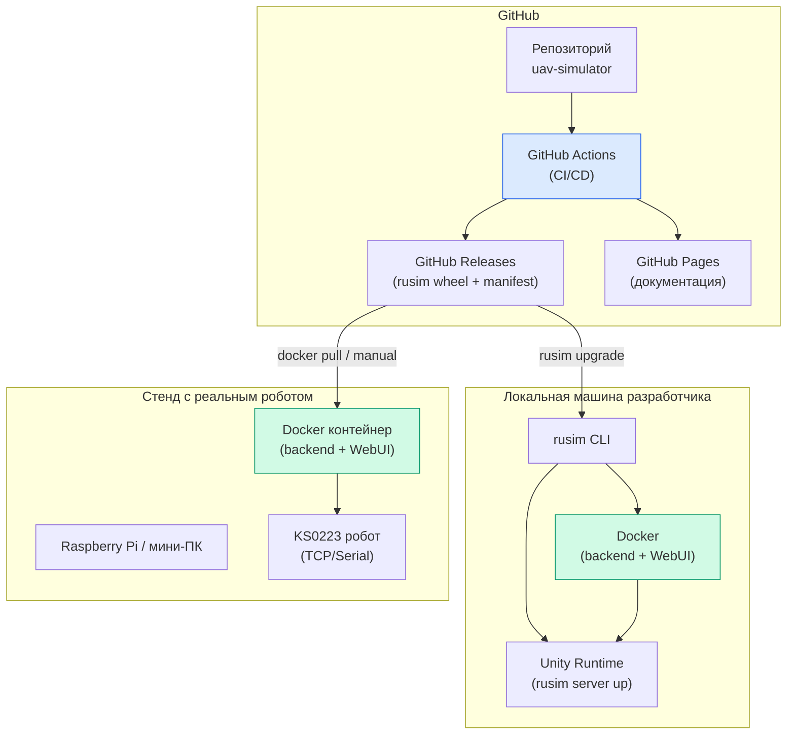

**Зачем всё это:**
- **Воспроизводимость** — одинаковое окружение на любой машине, от ноутбука до стенда;
- **Простота развёртывания** — `make docker-update` или `docker run` вместо ручной установки .NET 8, Node.js 20, ROS2;
- **Быстрый onboarding** — новый участник команды получает рабочий WebUI за 2 минуты;
- **Готовность к production** — Dockerfile с healthcheck, multi-stage build, volume для логов;
- **CI/CD** — каждый push проверяется автоматически, релизы публикуются в GitHub Releases.

### 4.7 Product Wiki (GitHub Pages)

Вся документация проекта собрана в единый сайт на базе **MkDocs** с темой **Material** и автоматически публикуется на **GitHub Pages** при каждом push в ветки `main` / `develop`.

**Адрес документации:** [nmgorovenko.github.io/uav-simulator](https://nmgorovenko.github.io/uav-simulator/)

**Структура сайта:**

```text
UAV Simulator Docs
├── Старт                          Обзор проекта и быстрый старт
├── О продукте                     Описание платформы и её назначения
├── Установка                      Инструкция по установке CLI и runtime
├── Использование                  Базовые сценарии работы
├── CLI                            Полная справка по rusim
├── Архитектура                    Общая схема системы
├── API                            HTTP JSON API reference
├── Плагины
│   ├── Обзор                      Plugin architecture
│   ├── Машинки                    Каталог vehicle plugins
│   └── Как добавить машинку       Step-by-step guide
├── Сборка и релизы
│   ├── Локальная сборка           Build из Unity проекта
│   ├── Поставка и обновление      Release distribution model
│   └── Release Manifest           Формат rusim-release-manifest.json
├── Контракты
│   ├── Обзор                      Все продуктовые контракты
│   ├── Product Definition         Определение продукта
│   ├── Unified Runtime Contract   Контракт frontend ↔ backend ↔ runtime
│   ├── Autopilot Contract         Контракт autopilot ↔ model ↔ telemetry
│   └── Scenario Config Contract   Формат YAML-сценариев
├── CI/CD                          Описание GitHub Actions pipeline
├── Статус проекта
│   ├── Roadmap
│   └── Definition of Done MVP
└── Дополнительно
    ├── Research и магистерская
    └── Инженерный журнал
```

**Технический стек Wiki:**

| Компонент | Технология |
|-----------|-----------|
| Генератор | MkDocs |
| Тема | Material for MkDocs (dark scheme) |
| Диаграммы | Mermaid (через pymdownx.superfences) |
| Подсветка кода | pymdownx.highlight |
| Хостинг | GitHub Pages |
| Деплой | Автоматический через GitHub Actions (workflow `pages.yml`) |
| Исходники | `docs/` в репозитории (Markdown) |

Документация написана в формате Markdown и хранится рядом с кодом в папке `docs/`. Это означает, что документация обновляется в тех же pull request-ах, что и код — и автоматически публикуется при слиянии.

---

## 5. Продуктовый контур model lifecycle

### Полный цикл: от обучения до запуска

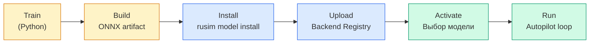

### Как это работает технически

**1. Обучение и сборка артефакта (Python):**
```bash
cd python/training
python3 build_ab_policy_artifact.py
```
Результат: `artifacts/ab_corridor_policy_v1/` — ONNX-модель + метаданные.

**2. Установка через CLI:**
```bash
rusim model install python/training/artifacts/ab_corridor_policy_v1/ab_corridor_policy_v1.onnx --activate
```
CLI автоматически подхватывает `metadata.json` и `metrics.json` из той же директории.

**3. Запуск автопилота (Web UI или API):**
- Web UI → вкладка `Model Control` → кнопка `Start Autopilot`
- Или через API: `POST /api/autopilot/start`

**4. Inference-цикл автопилота:**

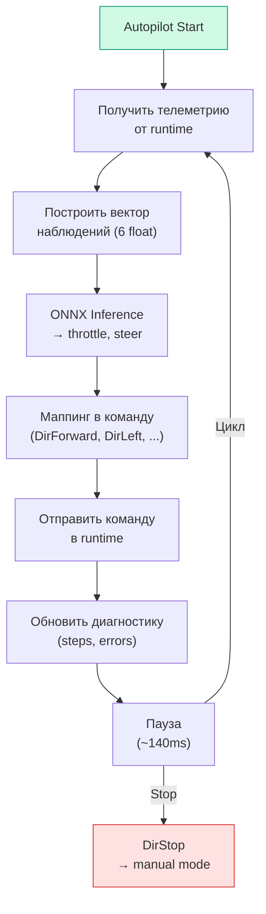

### Вектор наблюдений модели

| Индекс | Признак | Описание | Диапазон |
|--------|---------|----------|----------|
| 0 | `line.left_norm` | Датчик линии (левый) | [0, 1] |
| 1 | `line.center_norm` | Датчик линии (центральный) | [0, 1] |
| 2 | `line.right_norm` | Датчик линии (правый) | [0, 1] |
| 3 | `range.front_norm` | Дальномер (фронтальный) | [0, 1] |
| 4 | `speed.norm` | Скорость (нормализованная) | [0, 1] |
| 5 | `bias` | Константа (bias) | 1.0 |

### Вектор действий модели

| Индекс | Выход | Описание | Диапазон |
|--------|-------|----------|----------|
| 0 | `throttle` | Газ / торможение | [-1, 1] |
| 1 | `steer` | Руление | [-1, 1] |

### Safety-логика

- Любая ручная команда из UI автоматически прерывает autopilot (`manual override`);
- При остановке автопилота отправляется команда `DirStop`;
- При отсутствии активной модели запуск автопилота невозможен;
- При ошибке inference цикл прерывается и отправляется `DirStop`.

---

## 6. Use-cases: как работать с платформой

### Use-case 1: Запуск симулятора и ручное управление

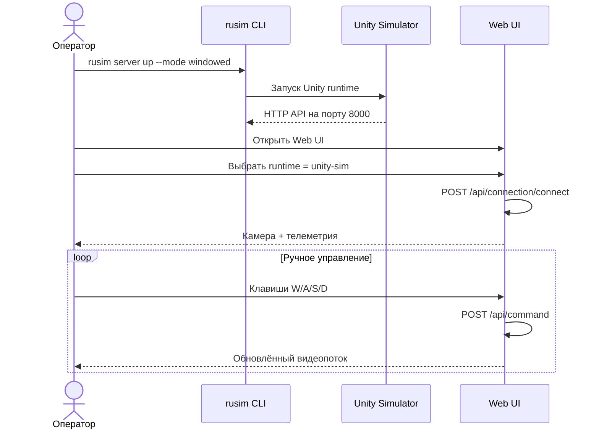

**Пошаговая инструкция:**

```bash
# 1. Запуск Unity runtime
rusim server up --mode windowed --port 8000

# 2. Проверка health
rusim doctor --base-url http://127.0.0.1:8000

# 3. Открыть Web UI в браузере
# http://localhost:5058

# 4. Подключиться к runtime через UI
# Выбрать unity-sim → Connect

# 5. Управлять клавишами W/A/S/D
```

### Use-case 2: Обучение модели и запуск автопилота

```mermaid
sequenceDiagram
    actor Dev as Разработчик
    participant Py as Python Training
    participant CLI as rusim CLI
    participant Backend as Backend
    participant Sim as Unity Simulator

    Dev->>Py: python3 build_ab_policy_artifact.py
    Py-->>Dev: ONNX + metadata + metrics

    Dev->>CLI: rusim model install *.onnx --activate
    CLI->>Backend: POST /api/models/upload
    Backend-->>CLI: Model registered + activated

    Dev->>Backend: POST /api/autopilot/start

    loop Inference-цикл
        Backend->>Backend: Получить телеметрию
        Backend->>Backend: ONNX inference → throttle, steer
        Backend->>Sim: Отправить команду
        Sim-->>Backend: Новое состояние
    end

    Dev->>Backend: POST /api/autopilot/stop
    Backend->>Sim: DirStop
```

**Пошаговая инструкция:**

```bash
# 1. Запуск Unity runtime со сценарием
rusim server up --mode background --port 8000 \
  --scenario configs/scenarios/ab-corridor-v1.yaml

# 2. Сборка артефакта модели
cd python/training
python3 build_ab_policy_artifact.py

# 3. Установка модели в backend
rusim model install \
  python/training/artifacts/ab_corridor_policy_v1/ab_corridor_policy_v1.onnx \
  --activate

# 4. Проверка
rusim model list
rusim model active

# 5. Запуск автопилота через Web UI или API
curl -X POST http://localhost:5058/api/autopilot/start \
  -H "Content-Type: application/json" \
  -d '{"clientId":"demo","runtimeMode":"unity-sim"}'

# 6. Проверка статуса
curl http://localhost:5058/api/autopilot/status

# 7. Остановка
curl -X POST http://localhost:5058/api/autopilot/stop \
  -H "Content-Type: application/json" \
  -d '{}'
```

### Use-case 3: Автоматическая KPI-оценка модели

```mermaid
sequenceDiagram
    actor Dev as Разработчик
    participant Eval as evaluate_ab_policy.py
    participant Sim as Unity Simulator

    Dev->>Eval: Запуск evaluator (20 эпизодов)

    loop Для каждого эпизода
        Eval->>Sim: POST /reset (seed = base + i)
        Sim-->>Eval: Initial state

        loop Шаги эпизода
            Eval->>Eval: ONNX inference (observation → action)
            Eval->>Sim: POST /step (throttle, steer)
            Sim-->>Eval: StepResult (state, telemetry, done)
        end

        Eval->>Eval: Фиксация: termination, steps, trajectory
    end

    Eval-->>Dev: JSON summary + SVG trajectories
```

**Пошаговая инструкция:**

```bash
# 1. Убедиться что Unity runtime запущен
rusim doctor --base-url http://127.0.0.1:8000

# 2. Запуск KPI-оценки
python3 python/training/evaluate_ab_policy.py \
  --episodes 20 \
  --max-steps 220 \
  --output-json evidence/kpi-results.json \
  --output-svg evidence/kpi-trajectories.svg
```

### Use-case 4: Работа со сценариями

```bash
# Валидация сценария
rusim scenario validate configs/scenarios/ab-corridor-v1.yaml

# Просмотр reset payload
rusim scenario print-reset configs/scenarios/ab-corridor-v1.yaml

# Применение сценария к запущенному runtime
rusim scenario reset configs/scenarios/ab-corridor-v1.yaml \
  --base-url http://127.0.0.1:8000
```

### Use-case 5: Сборка standalone runtime

```bash
# Сборка macOS standalone
rusim runtime build --project-path src/UnityProject/uav-simulator

# Просмотр доступных build-ов
rusim runtime list

# Установка favorite build
rusim runtime favorite set latest

# Запуск standalone runtime
rusim server up --build latest --mode background --port 8000
```

---

## 7. Выполненные задачи

### 7.1 Организационный блок (21.03 — 23.03)

- Выполнен организационный старт преддипломной практики;
- Подготовлен календарный план с трудоёмкостью и привязкой к контрольным точкам курса;
- Сформулировано индивидуальное задание на практику;
- Уточнена цель, постановка задачи и ожидаемые результаты магистерского исследования;
- Подготовлен и сдан промежуточный отчёт №1 в формате DOCX по шаблону СФУ.

### 7.2 Систематизация документации (24.03 — 25.03)

- Подготовлена продуктовая документация проекта (product wiki);
- Разработаны канонические документы: архитектура, API, плагины, CLI, релизная модель, контракты;
- Зафиксирован donor-first workflow для генерации академических DOCX-документов.

### 7.3 Model Lifecycle API v1 (25.03 — 28.03)

**Backend (ASP.NET Core, C#):**
- Реализован сервис `ModelRegistryService`:
  - загрузка ONNX-артефакта с метаданными (`POST /api/models/upload`);
  - валидация артефакта через `OnnxRuntime` при загрузке;
  - хранение моделей в серверном registry с персистентным состоянием;
  - список, активация, получение текущей активной модели.
- Реализован сервис `AutopilotService`:
  - загрузка ONNX-модели и запуск inference-цикла в реальном времени;
  - построение вектора наблюдений из unified telemetry;
  - маппинг непрерывных action-ов (`throttle`, `steer`) в дискретные команды runtime;
  - manual override: любая ручная команда автоматически останавливает autopilot;
  - emergency stop: `DirStop` при остановке или ошибке.

**Frontend (React, TypeScript):**
- Реализована вкладка `Model Control` в Web UI:
  - загрузка ONNX-файла через drag-and-drop или file picker;
  - активация модели;
  - start/stop автопилота;
  - real-time диагностика последнего шага: команда, throttle, steer, ошибка.

**CLI (Python):**
- Реализована команда `rusim model install`:
  - загрузка `.onnx` файла в backend model registry;
  - автоматический подхват `metadata.json` и `metrics.json` из той же директории;
  - поддержка `--activate` для немедленной активации;
  - поддержка `--backend-url`, `--name`, `--version`, `--source`.
- Реализована группа команд `rusim plugin`:
  - `rusim plugin install` — установка плагина из `.rusim-plugin.zip` архива;
  - `rusim plugin list` — просмотр установленных плагинов (built-in и пользовательских);
  - `rusim plugin remove` — удаление пользовательского плагина.

### 7.4 Training и Evaluation (25.03 — 29.03)

- Реализован `build_ab_policy_artifact.py`:
  - сборка baseline ONNX-артефакта в backend-совместимом формате;
  - генерация `metadata.json` (schema наблюдений/действий) и `metrics.json`;
  - артефакт представляет собой линейную политику для отладки pipeline.
- Реализован `evaluate_ab_policy.py`:
  - автоматическая серия эпизодов через Unity HTTP API;
  - подсчёт KPI: success rate, termination counts, средняя длина;
  - внешнее определение `out_of_bounds` по геометрии коридора;
  - экспорт JSON-сводки и SVG-визуализации траекторий;
  - поддержка параметров: `--episodes`, `--max-steps`, `--seed-offset`.
- Разработан сценарий `ab-corridor-v1.yaml` с геометрией маршрута, reward-функцией и KPI-порогами.

### 7.5 E2E верификация (29.03 — 04.04)

- Проведена полная E2E smoke-верификация контура:
  1. Сборка backend (`dotnet build`) выполнена.
  2. Сборка frontend (`npm run build`) выполнена.
  3. Валидация сценария (`rusim scenario validate`) выполнена.
  4. API smoke: `/api/models`, `/api/models/active`, `/api/autopilot/status` выполнен.
  5. Product E2E:
     - `rusim server up` → Unity runtime поднят, `/health = ok`;
     - `POST /api/connection/connect` → `tcpConnected = true`;
     - Runtime selection: трек + машинка выполнен;
     - `GET /api/sensors/latest` → unified telemetry поступает;
     - `rusim model install *.onnx --activate` → модель загружена и активирована;
     - `POST /api/autopilot/start` → autopilot запущен, 22 шага за ~3 сек;
     - `POST /api/autopilot/stop` → `mode = manual`, автопилот остановлен.
- Проведён первый KPI-срез: 20 эпизодов, `successRate = 0.0`:
  - все эпизоды завершились `out_of_bounds` на повороте;
  - проблема диагностирована: baseline линейная политика не способна проходить повороты;
  - результаты зафиксированы в JSON и SVG evidence.

---

## 8. Текущие ограничения

| Ограничение | Влияние | Статус |
|-------------|---------|--------|
| Baseline-модель — синтетическая линейная политика, не результат RL-обучения | `successRate = 0%` | Задача Спринта 2 |
| Collision signal не экспонируется runtime-контрактом | KPI не учитывает столкновения | Планируется доработка |
| Прогоны на реальном роботе не проводились | Sim-to-real gap не измерен | Задача Спринта 3 |
| KPI-таргет 70% требует уточнения после обучения | Может быть нереалистичным | Уточнение в Спринте 2 |

---

## 9. План на Спринт 2

**Период:** 05.04.2026 — 18.04.2026
**Фокус:** обучение модели управления и достижение ненулевого success rate

### Планируемые задачи

| # | Задача | Приоритет |
|---|--------|-----------|
| 1 | Реализовать RL training loop (PPO / SAC) для сценария A→B | Критический |
| 2 | Обучить модель до `successRate > 0%` в серии из 20 эпизодов | Критический |
| 3 | Провести сравнительную KPI-оценку: baseline vs trained | Высокий |
| 4 | Зафиксировать гиперпараметры, reward-shaping и архитектуру сети | Высокий |
| 5 | Доработать evaluator: batch comparison, seed reproducibility | Средний |
| 6 | Исследовать добавление collision signal в runtime-контракт | Средний |

### Ожидаемый результат

По итогам Спринта 2 требуется получить обученную модель с измеримым улучшением относительно baseline и зафиксировать экспериментальные данные для включения в промежуточный отчёт №2.

```mermaid
gantt
    title Спринт 2 — План работ
    dateFormat YYYY-MM-DD
    axisFormat %d.%m

    section Обучение
    RL training loop           :2026-04-05, 5d
    Обучение модели A→B        :2026-04-08, 7d

    section Оценка
    KPI-оценка trained модели  :2026-04-12, 3d
    Сравнение baseline vs trained :2026-04-14, 2d

    section Инфраструктура
    Доработка evaluator        :2026-04-10, 4d
    Collision signal research  :2026-04-15, 3d

    section Отчётность
    Sprint 2 changelog         :2026-04-16, 3d
```

---

> **Итог Спринта 1:** в `unity-sim` собран и проверен базовый контур для экспериментов. Цепочка `train → install → activate → run` проходит end-to-end на уровне интеграции. KPI-evaluator фиксирует результаты, но baseline-модель не решает задачу прохождения маршрута и требует замены на обучаемую политику в следующем спринте.
