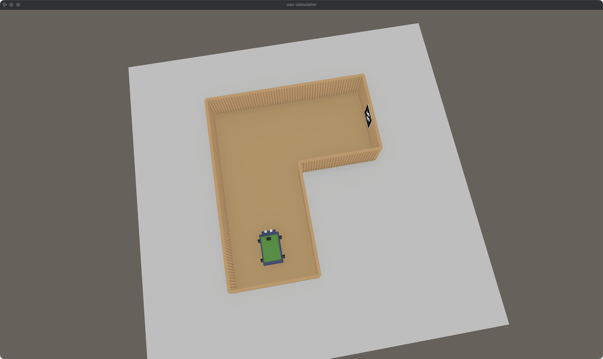

# Спринт 2 — Отчёт о выполненных работах

> **Период:** 05.04.2026 — 18.04.2026
> **Практика:** преддипломная (производственная), 09.04.04 «Программная инженерия»
> **Тема:** Разработка единой среды управления физическим робототехническим стендом и симулятором в Unity для sim-to-real исследований
> **Проект:** `uav-simulator`
> **Студент:** Горовенко Никита Максимович, группа КИ24-04-3М

---

## Оглавление

1. [Итоги спринта](#1-итоги-спринта)
2. [Трасса cardboard corridor](#2-трасса-cardboard-corridor)
3. [Физика и визуал робота KS0223](#3-физика-и-визуал-робота-ks0223)
4. [Обучение CNN-PPO на L-коридоре](#4-обучение-cnn-ppo-на-l-коридоре)
5. [Процедурный генератор трасс](#5-процедурный-генератор-трасс)
6. [Эксперименты с обучением на maze](#6-эксперименты-с-обучением-на-maze)
7. [WebUI и инфраструктура обучения](#7-webui-и-инфраструктура-обучения)
8. [Выполненные задачи](#8-выполненные-задачи)
9. [Что переносится в Спринт 3](#9-что-переносится-в-спринт-3)

---

## 1. Итоги спринта

Цели спринта — перейти от baseline MLP-политики к vision-обучению на sim-to-real треке, собрать рабочую связку `Unity → Python RL → ONNX → backend autopilot` и подтвердить работоспособность контура на формальной оценке — **выполнены**.

**Ключевой результат:** модель `cardboard-corridor-ppo-v6`, обученная CNN-PPO на картонной L-трассе 60×25см (масштаб 1:1 с реальной), проходит 20 эпизодов формального eval с **100% success rate**. Это первая рабочая sim-to-real модель на платформе.

Для расширения возможностей платформы дополнительно реализован **процедурный генератор картонных лабиринтов** (`track.cardboard_maze.v1`) — нужен чтобы модель училась проходить не одну фиксированную форму, а произвольные конфигурации картонных стен, которые могут встретиться в реальном эксперименте. Обучение CNN-PPO на длинных процедурных трассах в рамках этого спринта не сошлось и переносится в Спринт 3 с curriculum-learning подходом.

---

## 2. Трасса cardboard corridor

Для sim-to-real переноса нужна трасса, соответствующая реальной картонной конструкции, которую можно собрать в комнате. Реализован процедурный трек `track.cardboard_corridor.v1` — L-образный коридор 60см шириной и 25см высотой стен, один поворот 90° направо. Всё в масштабе **1:1** с физической реализацией.

**Вид трассы сверху в симуляторе:**



Робот (зелёный) стоит на старте в начале Segment A, впереди — прямой коридор до поворота, далее направо до финишной стены с ArUco-маркером (виден справа вверху трассы).

**Вид с камеры робота на старте:**


Именно эту картинку видит CNN на входе (после ресайза до 84×84). Видно стены из картона, пол в цвет ламината, впереди сегмент A до поворота.

**Геометрия трека:**

| Параметр | Значение |
|---|---|
| Ширина коридора | 0.60 м |
| Высота стен | 0.25 м |
| Толщина стен | 0.02 м |
| Сегмент A (до поворота) | 1.10 м |
| Сегмент B (после поворота) | 0.90 м |
| Поворот | 90° направо |
| ArUco маркер | 14×14 см на финишной стене |

Трек строится процедурно из примитивов Unity при каждом reset — 6 стен образуют замкнутую L-форму, пол только под коридором, серый окружающий пол имитирует комнату.

Стенам назначен `PhysicsMaterial` с высоким трением (dynamic 0.9, static 0.95) и минимальной упругостью (0.05). Это необходимо чтобы обученная модель не выработала стратегию «скольжения вдоль стены» — без трения робот использовал бы контакт со стеной как направляющую, что для реального робота на картоне означало бы поломку сенсоров.

---

## 3. Физика и визуал робота KS0223

Робот в симуляторе собран в масштабе 1:1 с физическим KS0223, чтобы обученная модель переносилась без гэпа по размерам и динамике.

- **Размеры.** Шасси 14×5×22см, с колёсами и мачтой камеры 15×7×25см. Коллайдер 15×12×25см. Визуал собран из примитивов Unity: корпус, PCB-плата, батарея, передний бампер, два ультразвуковых датчика на носу, 4 колеса-цилиндра, мачта с камерой-кубиком.
- **Velocity-based движение.** `FixedUpdate` устанавливает `Rigidbody.linearVelocity` напрямую — робот корректно взаимодействует с физическими коллайдерами стен и отталкивается при контакте.
- **Позиция камеры.** Y=9см (реальная высота мачты), направлена вперёд (+Z) — изображение в симуляторе и на реальном роботе имеет одинаковый ракурс.

**Differential drive mapping** (управление дифференциальным приводом):

```
Вход API:              throttle, steer ∈ [-1, 1]
                           ↓
Дифф. привод:          leftPWM  = throttle - steer
                       rightPWM = throttle + steer
                           ↓
Физика:                linearVelocity = forward * (throttle * maxSpeed)
                       yawRate        = steer * maxYawRate
```

**Параметры физики:**

| Параметр | Значение |
|---|---|
| Max speed | 2.2 м/с |
| Max yaw rate | 160°/с |
| Mass | 1.0 кг |
| Linear damping | 0.2 |
| Angular damping | 1.5 |
| BoxCollider | 0.15 × 0.12 × 0.25 |

---

## 4. Обучение CNN-PPO на L-коридоре

Это главный результат спринта по задаче «обучение политики для сценария A→B».

### 4.1. Среда

`ABCorridorVisionEnv` — Gymnasium env с Dict observation, совместимая с реальным роботом:

- `image`: `Box(0, 255, (84, 84, 3), uint8)` — RGB с камеры робота
- `ultrasonic`: `Box(0, 1, (1,), float32)` — расстояние до стены спереди (нормировано на 5 м)

Action: `Box(-1, 1, (2,), float32)` — `[throttle, steer]`.

Среда подключается к Unity runtime по HTTP, каждый `step()` → `POST /step`, `reset()` → `POST /reset`. При обучении `timeScale=3.0` для ускорения сбора данных.

### 4.2. Reward shaping

Функция вознаграждения спроектирована с защитой от стратегии «облизывания стены» — оптимального по времени racing line, при котором робот использует контакт со стеной как направляющую для быстрого добегания до финиша. Такой проход неприемлем для реального робота — постоянный скрип по картону ведёт к поломке сенсоров.

Защита реализована через **масштабирование goal bonus от качества вождения**:

- Ехал по центру весь эпизод → goal bonus 150
- Облизывал стены → goal bonus 30
- На каждом шаге `lateral_penalty = −3 × wall_proximity²`

**Финальная функция вознаграждения:**

| Компонент | Формула | Назначение |
|---|---|---|
| Progress | `Δprogress × 20.0` | Продвижение по маршруту |
| Waypoint bonus | `+10` за каждый новый waypoint | Прохождение ключевых точек |
| Lateral penalty | `−3.0 × wall_proximity²` | Жёсткий штраф у стены |
| Speed reward | `0.1 × speed × center_bonus` | Скорость только по центру |
| Steer jerk | `−0.05 × \|Δsteer\|` | Плавность руления |
| Time penalty | `−0.02` за шаг | Стимул двигаться |
| **Goal bonus** | `30 + 120 × center_quality` | Бонус за центровое вождение |
| **ArUco bonus** | `+20` при детекции маркера | Учить видеть маркер |
| OOB penalty | `−30` (терминал) | Выезд за коридор |
| Stall penalty | `−10` при 30 шагах застоя | Анти-залипание |

С такой функцией wall-riding экономически невыгоден:

- По стене: `−3 × 15 шагов = −45` + `goal 30` = **net −15**
- По центру: `~0` + `goal 150` = **net +150**

### 4.3. Результаты eval

Модель `cardboard-corridor-ppo-v6`, 250 000 шагов обучения на CPU (~7 часов). Формальный eval на 20 эпизодах с фиксированными seed:

| Метрика | Значение |
|---|---|
| **Success Rate** | **20/20 = 100%** |
| Avg Reward | 128.45 |
| Avg Progress | ~95% |
| Avg Lateral (mean) | 0.137 м |
| Avg Lateral (max) | 0.300 м |
| Steps to goal | 13–14 |

**Mean lateral 0.137 м** при половине коридора 0.30 м означает что **робот реально едет ближе к центру**, не к стенам. Max lateral 0.300 м достигается только в повороте — для 15см робота в 60см коридоре пройти 90° поворот без касания внутренней стены физически невозможно.

Артефакт результатов: `docs/report/prediploma-practice/evidence/eval_cnn_cardboard_v6_250k_20ep.json`

---

## 5. Процедурный генератор трасс

В реальном эксперименте sim-to-real картонная трасса, собранная в комнате, не обязательно будет простой L-формы. Чтобы обученная модель обобщалась на произвольные конфигурации стен, добавлен процедурный генератор лабиринтов как отдельный плагин `track.cardboard_maze.v1`.

### 5.1. Алгоритм

Grid-based drunk-walk с бюджетом поворотов (`MazeGenerator.cs`):

1. Сетка 40×40 клеток, размер клетки = ширина коридора
2. Старт в центре, направление +Z
3. На каждом шаге случайно: вперёд / налево / направо (если бюджет > 0)
4. Если клетка впереди занята — backtrack (освобождение бюджета того поворота, который сделали)
5. Стены ставятся там, где соседняя клетка **не** в пути

**Параметры** плагина описаны через JSON Schema в `parametersSchemaJson`, что позволяет WebUI автоматически собирать форму настроек:

- `maze.seed` (0–999999) — воспроизводимость
- `maze.length_cells` (3–20) — длина пути в клетках
- `maze.corridor_width_m` (0.40–1.00) — ширина коридора
- `maze.left_turns`, `maze.right_turns` (0–10) — бюджет поворотов
- `maze.wall_height_m` (0.15–0.40) — высота стен

### 5.2. Примеры сгенерированных трасс

**seed=42, 8 клеток, ширина 60см** — простая L-форма с одним поворотом:


**seed=7, 10 клеток, ширина 60см** — зигзаг с тремя поворотами, более сложный путь:


**seed=123, 12 клеток, ширина 80см, 3L/2R** — длинный зигзаг в широком коридоре:


Одинаковый seed всегда даёт одинаковый maze, что позволяет точно воспроизводить результаты экспериментов.

### 5.3. Синхронизация Python ↔ Unity

Python и C# используют разные генераторы псевдослучайных чисел (Mersenne Twister vs Knuth subtractive), и один seed даёт разные последовательности. Чтобы геометрия в Python-среде обучения и в Unity всегда совпадала, используется следующая схема: **Python генерирует путь, Unity строит геометрию по готовому пути**. Python кодирует путь как строку `"x0,z0;x1,z1;..."` и передаёт в `trackParams["maze.path_encoded"]`. Unity парсит строку и строит стены по этим координатам, не обращаясь к своему PRNG.

---

## 6. Эксперименты с обучением на maze

Для обучения политики на процедурных трассах проведены три серии экспериментов.

**v2 — рандомизация каждый эпизод:**

- 40k шагов, reward улучшился с −119 до −42
- До положительного reward не дотянул
- Unity нестабильно работал при регенерации геометрии каждые 1–2 секунды; `--maze-regen-every 5` (один maze живёт 5 эпизодов) помогло со стабильностью, но не с обучением

**v3 — фиксированный maze (seed=42):**

- 15k шагов, reward застрял на −290..−300
- Путь длиннее чем L-коридор (8 клеток ≈ 4 метра против 1.5 м), случайная политика никогда не доходит до финиша за отведённые 400 шагов
- Модель не может выйти из плато без curriculum

**v4-v5 — transfer learning от v6:**

- Попытка использовать v6 (100% SR на L-коридоре) как стартовую политику и дообучить на maze
- v4 с обычным lr=3e-4: catastrophic forgetting, reward скатился с −48 до −162
- v5 с lr=3e-5 и clip_range=0.1: деградация более плавная, но всё равно до −305

**Вывод.** Обучение CNN-PPO на длинных процедурных трассах с нуля или прямым transfer не сходится в рамках выделенного времени. Для завершения задачи требуется:

1. **Curriculum learning** — начинать с коротких 3–4-клеточных maze и поэтапно увеличивать длину, чтобы модель получала положительный сигнал и постепенно масштабировалась
2. **Доработка reward shaping** для длинных путей — при 400 шагах штрафы доминируют над любым прогрессом
3. Возможно, pre-training на промежуточных задачах перед переходом на полноразмерный maze

Эти задачи переносятся в Спринт 3. Для текущей демонстрации sim-to-real используется модель v6 на фиксированном L-коридоре.

---

## 7. WebUI и инфраструктура обучения

Параллельно с основной задачей обучения в WebUI и CLI добавлен функционал для более удобной работы с экспериментами.

### 7.1. AutopilotPanel на вкладке Control

Блок AutopilotPanel на главной вкладке Control объединяет выбор модели, bind, start/stop и статус работы автопилота в одном месте — запуск обученной модели не требует переключения между вкладками.


Слева — ConnectionCard (runtime, IP, port). В центре — Control Pad для ручного управления. Справа внизу — AutopilotPanel: модель, версия, loop interval и кнопки управления автопилотом.

### 7.2. Переключатели коллизий и видимости

В диалоге Unity-настроек два переключателя `agents.collisions_enabled` и `agents.see_each_other`. Нужны для мульти-агентных сценариев, где должна быть возможность запускать несколько «призраков» одной модели одновременно без физического взаимодействия.

### 7.3. Режим камеры top-down

Камера `top_down` в селекторе — автоматически рассчитывает bounds активной трассы и показывает её сверху с лёгким изометрическим наклоном. Используется для визуализации обучения и записи демонстрационных материалов.

### 7.4. Диалог настройки параметров трека

Плагины объявляют `parametersSchemaJson`. Когда пользователь выбирает трек с непустой схемой, в WebUI появляется кнопка «⚙ Settings» — попап со слайдерами и полями, автоматически собранный из схемы. Для maze — это seed, длина, количество поворотов, ширина. Нужно чтобы можно было быстро сгенерировать трассу с нужными параметрами без правки YAML.

### 7.5. Runtime discovery

Кнопка «Найти рантаймы» сканирует порты 8000–8007 и показывает живые Unity-инстансы. Нужно для удобной работы в multi-runtime режиме (`rusim server up --count N`), когда параллельно запущено несколько симуляторов для ускорения сбора данных.

### 7.6. Поддержка GPU и векторизованного обучения

В обучающем скрипте добавлены флаги:

- `--device cuda/mps/cpu/auto` — выбор устройства PyTorch для ускорения обучения на GPU
- `--num-envs N` — N параллельных Gymnasium-envs через `SubprocVecEnv`
- `rusim server up --count N` — запуск N Unity runtime на последовательных портах

Это даёт ~3.5–4× ускорение обучения на 4-ядерном CPU и возможность использовать GPU на стационарной машине (RTX 5080).

### 7.7. Детектор ArUco-маркера

Модуль `python/sim_client/aruco_detector.py` на OpenCV детектирует ArUco-маркеры в кадрах камеры. Используется одинаковый код как в симуляторе, так и на реальном роботе — на симуляторной стороне даёт сигнал параллельно с геометрическим goal-detection, на реальном роботе станет основным источником информации о прибытии в точку назначения (там нет координат в мировой системе).

---

## 8. Выполненные задачи

| # | Задача | Результат |
|---|---|---|
| 1 | Gymnasium-среда CNN vision (image + ultrasonic) | Реализована `ABCorridorVisionEnv` |
| 2 | Reward shaping с защитой от wall-riding | Center quality + жёсткий lateral penalty |
| 3 | Трек `track.cardboard_corridor.v1` (L, 60см, 1:1) | Процедурный, с физикой и ArUco |
| 4 | Робот KS0223 в правильных размерах (15×25см) | Collider + visual + velocity-based |
| 5 | Формальная KPI eval 20 эпизодов | **100% SR** (20/20) |
| 6 | Процедурный `track.cardboard_maze.v1` | Grid-based с JSON Schema параметров |
| 7 | Детектор ArUco (sim + real unified) | OpenCV-модуль с pinhole distance |
| 8 | Vision ONNX backend autopilot | Image + ultrasonic входы |
| 9 | Model catalog (name→versions, bindings) | CLI + WebUI |
| 10 | AutopilotPanel в Control tab | Модель/bind/start/stop на главной |
| 11 | Collision/visibility toggles в WebUI | Управление мульти-агентным сценарием |
| 12 | Top-down camera + TrackOverviewCamera | Авто-фреймирование любой трассы |
| 13 | Runtime discovery в WebUI | Сканирование портов 8000–8007 |
| 14 | TrackParamsDialog (schema-driven UI) | Авто-генерация формы из JSON Schema |
| 15 | GPU training (`--device cuda/mps/cpu`) | PyTorch device selection |
| 16 | Vectorized training (`--num-envs`, `--count`) | SubprocVecEnv + multi-runtime |
| 17 | Camera capture fix в standalone build | MSAA + targetTexture |
| 18 | `SetDirectDrive()` (continuous PWM control) | Гладкое управление автопилотом |
| 19 | `vehicle.ks0223.v1` в plugin catalog | Плагин робота с правильными параметрами |

---

## 9. Что переносится в Спринт 3

Задача обучения политики на процедурных maze-трассах требует дополнительного инженерного подхода (curriculum learning + доработка reward) и переносится. Sim-to-real развёртывание на физический робот также требует отдельного этапа — замеров калибровки, скрипта deploy и безопасного инференса.

**План Спринта 3:**

1. Curriculum learning для обучения на maze (короткий → средний → длинный)
2. Доработка reward shaping для длинных трасс
3. Калибровка физики sim ↔ real (замеры реального KS0223)
4. Перенос модели на реальный робот (ONNX inference + mapping continuous → discrete commands)
5. Domain randomization (случайные цвета стен, освещение, шум камеры)
6. Sim-to-real gap analysis
7. Safety wrapper (ограничение скорости, аварийный стоп по ультразвуку)
8. Тесты на реальном картонном треке в комнате
