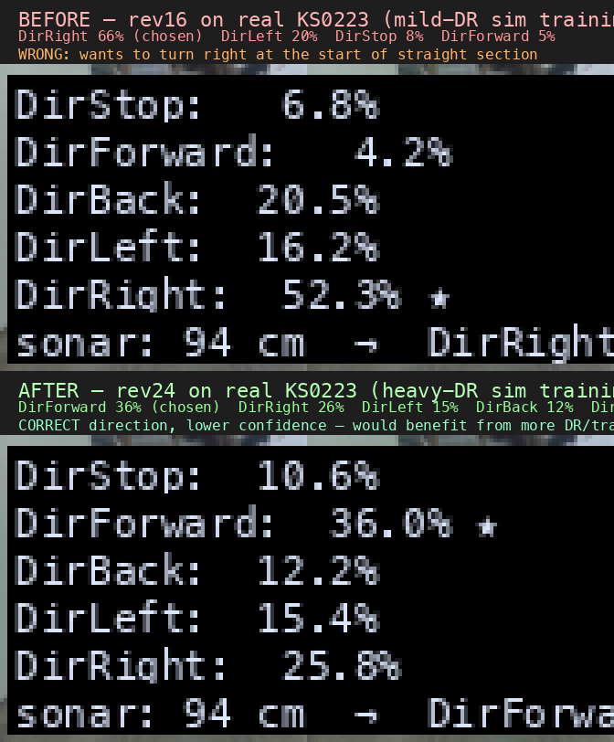
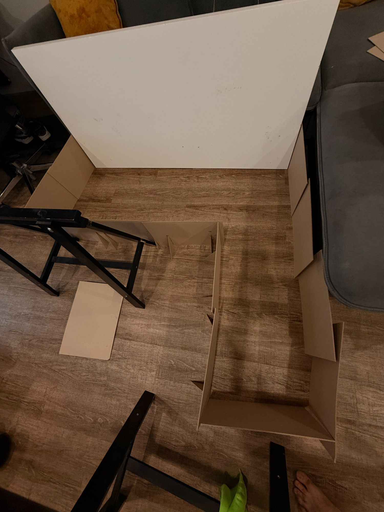
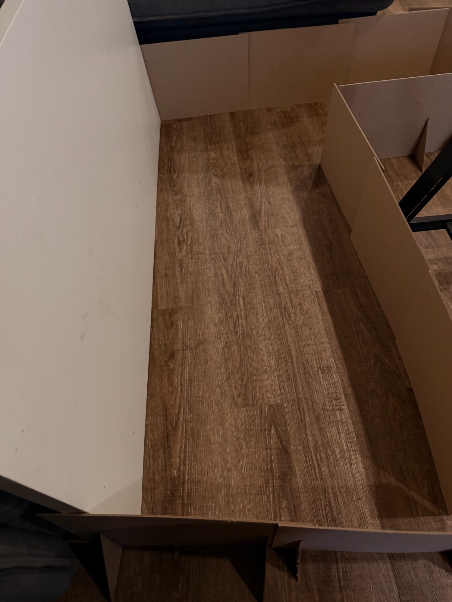
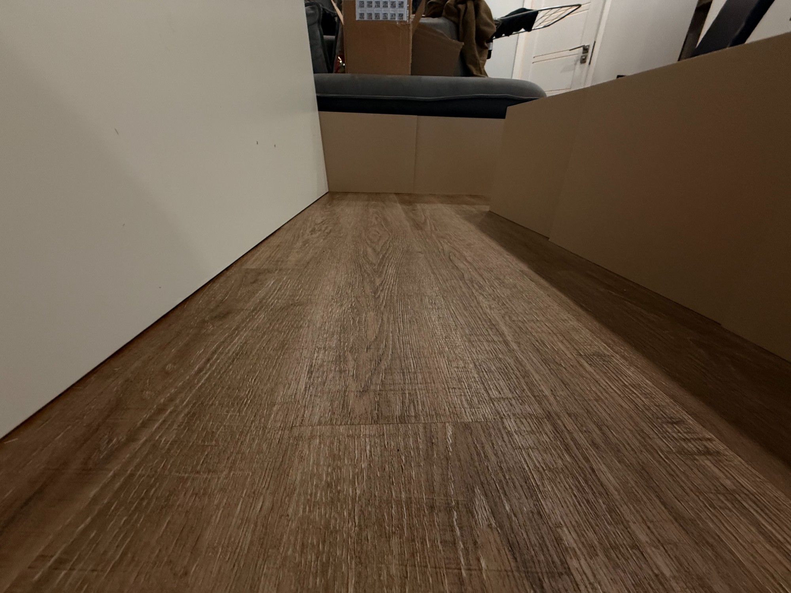
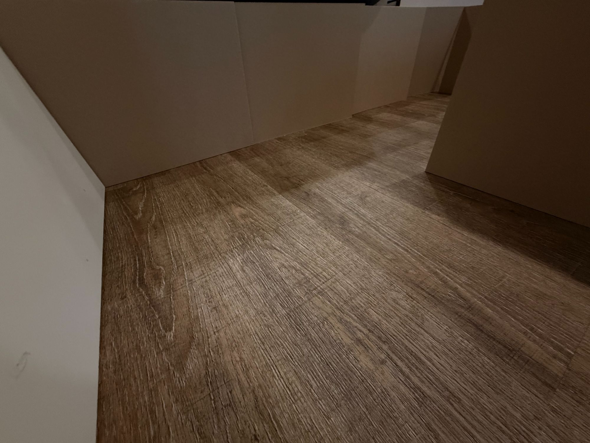
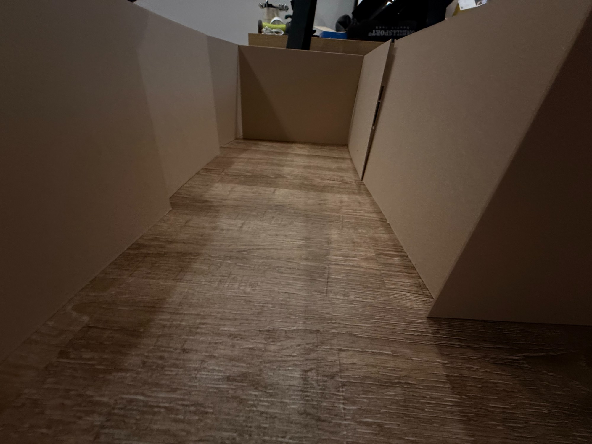
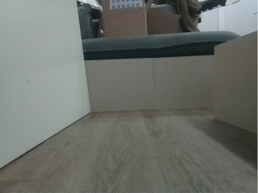
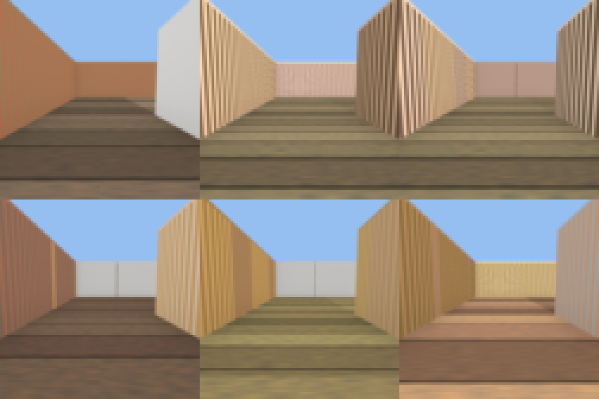
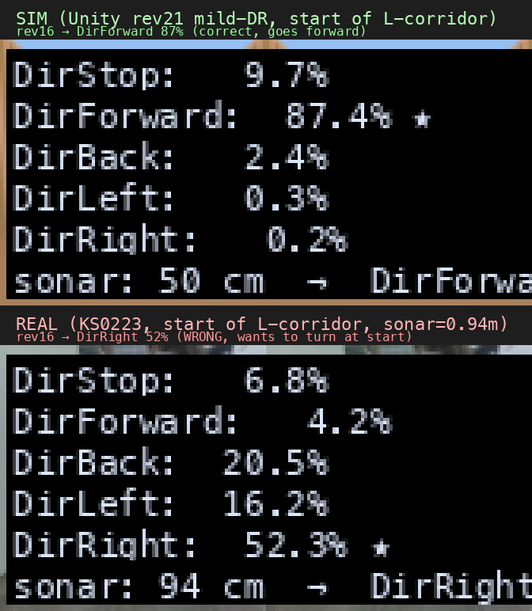

# Спринт 3 — отчёт по преддипломной практике

> **Период:** 19.04.2026 — 02.05.2026
> **Практика:** преддипломная (производственная), 09.04.04 «Программная инженерия»
> **Тема:** Разработка расширяемой программной платформы симуляции в Unity для проведения экспериментальных исследований в задачах обучения и sim-to-real для робототехнической платформы KS0223
> **Проект:** [`uav-simulator`](https://github.com/NMGorovenko/uav-simulator)
> **Студент:** Горовенко Никита Максимович, группа КИ24-04-3М

---

## Введение

В этом спринте я работал над замыканием sim-to-real цикла на робототехнической платформе Keyestudio KS0223: от тренировки policy в Unity-симуляторе до её живого запуска на физическом роботе в L-образном картонном коридоре. Я пришёл в спринт с моделью `cardboard-corridor-ppo-v6`, которая давала 100% success-rate в симе, но провалилась при первом же реальном проезде — робот мгновенно врезался в стену.

Главным вопросом всего спринта стало: **почему модель, идеально работающая в симуляторе, не работает в реальном мире, и что с этим делать инженерно**. По ходу я перепробовал серию из 13 моделей (rev10 → rev25), несколько подходов к domain randomization, две архитектуры VecEnv для параллельной тренировки, отдельный compute-узел на Windows + RTX 5080, реальный картонный стенд у себя дома, и несколько debug-инструментов в WebUI чтобы видеть что policy «думает» в реальном времени.

К концу спринта я смог **эмпирически измерить** причину провала на реале (а не угадывать), реализовать целевой фикс — сильное domain randomization сцены (wood-plank пол, mixed-палитра стен, value-jitter на каждой стене) — и зафиксировать, что новая модель `rev24` действительно меняет своё поведение в реальном коридоре в правильную сторону. Полностью «робот безаварийно проезжает L-коридор» я ещё не получил, но получил **измеримый прогресс** и понятный план дальнейших итераций.

В этом отчёте я в начале выписал что именно было разработано и чего удалось добиться, потом — иллюстрации и видео реальных проездов и симуляции, потом — главное техническое открытие про prior flip на реальном роботе и инфраструктуру что я построил. Подробная история эволюции моделей вынесена в конец как приложение.

---

## Что я разработал и чего добился

### Сводка результатов

| Что | Результат |
|---|---|
| Лучшая модель в симуляторе на простой DR-сцене | `rev16` — **100% SR** (20/20 эпизодов goal_reached) |
| Лучшая модель в симуляторе на жёсткой DR-сцене | `rev16` 75% / `rev24` 35% / `rev26-28` 0% / **`rev29` 75%** ✅ |
| Поведение лучшей модели на реальном роботе | До фикса: **DirRight 66%** (врезается в стену) |
| Поведение после heavy-DR тренировки | После: **DirForward 36–59%** (едет вперёд) |
| Реальный проезд по прямой части L-коридора | ✅ rev24/25 проезжают ~85–95 см (вся прямая) |
| Полный безаварийный проезд L | 🟡 частично — поворот на углу не стабилизирован |
| Калибровка физики sim ↔ real | ±5% по линейной скорости и yaw-rate |
| Обученных policy за спринт | **13 моделей** v9-rev10 … v9-rev25 |
| Реальных проездов записано | **6 запусков** автопилота, видео сохранены |

### Что было разработано как инженерная инфраструктура

1. **Win-кластер для тренировки** ([§ Инфраструктура](#инфраструктура-и-инструменты-разработки)) — отдельный compute-узел Win11 + RTX 5080 + Ryzen 9950X3D, доступен через `ssh win`, освобождает рабочий Mac для разработки и WebUI/real-robot bridge. 200k шагов тренировки на нём = ~32 минуты.

2. **MultiAgentVisionVecEnv и MetaMultiAgentVecEnv** ([`python/training/multi_agent_vision_env.py`](../../../python/training/multi_agent_vision_env.py), [`python/training/meta_multi_agent_vec_env.py`](../../../python/training/meta_multi_agent_vec_env.py)) — single-process N-агентная и multi-process N×K VecEnv, обходят Win-Python-3.13 broken-pipe баг SubprocVecEnv который ронял мою тренировку на 116k шагов из 300k.

3. **Heavy domain randomization сцены** ([`CardboardCorridorTrack.cs`](../../../src/UnityProject/uav-simulator/Assets/Scripts/Tracks/CardboardCorridorTrack.cs)): процедурный wood-plank пол с регенерацией текстуры на каждом ResetTrack, per-wall mix стилей (картон / белый / mixed), per-segment value-jitter под неравномерное освещение. Без этого rev16 в реале выбирала DirRight на старте и врезалась.

4. **Shadow-mode preview** в WebUI ([`AutopilotService.SamplePreview`](../../../src/ks0223-web-mac/backend/Services/AutopilotService.cs), [`CameraPanel.tsx`](../../../src/ks0223-web-mac/frontend/src/components/CameraPanel.tsx)) — кнопка показывает все 5 action-вероятностей, выбранное действие, sonar и image CV-stats прямо поверх камеры робота, **без запуска моторов**. Ключевой инструмент чтобы понять что policy будет делать перед первым live-test.

5. **Grad-CAM saliency tool** ([`policy_saliency.py`](../../../python/training/policy_saliency.py) + [`policy_saliency_server.py`](../../../python/training/policy_saliency_server.py)) — рендерит heatmap куда CNN «смотрит» при принятии решения. Подтвердил что в сим-кадрах policy фиксируется на vanishing point коридора, а в real-кадрах градиент расползается (нет согласованной forward-feature) — это и есть визуальный sim2real gap.

6. **Калибровка KS0223 vehicle physics** ([`Ks0223Vehicle.cs`](../../../src/UnityProject/uav-simulator/Assets/Scripts/Vehicles/Ks0223Vehicle.cs)) — замерил линейную скорость (0.73 м/с) и yaw rate (380°/с) реального робота линейкой и угломером, пересчитал ACTION_TABLE на pure differential-drive, добавил `yawAccelerationDegPerSec2 = 1900` для моделирования motor spinup ramp.

7. **Расширенный safety-стек на реальном роботе** ([`AutopilotService.cs`](../../../src/ks0223-web-mac/backend/Services/AutopilotService.cs), [`AutopilotSafetyFilter.cs`](../../../src/ks0223-web-mac/backend/Services/AutopilotSafetyFilter.cs), [`appsettings.json`](../../../src/ks0223-web-mac/backend/appsettings.json)) — E-stop по сонару с настраиваемой дистанцией, suspicious-jump guard для HC-SR04 echo-loss, missing-reading guard, ramp-up throttle, deadman timeout, repeated-command threshold с auto-stop, DirStop burst при остановке, video recording per session, runaway-policy detection (5 → 10 E-stops в окне).

8. **Demo recording feature в WebUI** ([commit `2d458cb`](https://github.com/NMGorovenko/uav-simulator/commit/2d458cb)) — кнопка «Record demo» одной кнопкой стартует session-log + video recorder, чтобы я мог записать как **я** руками еду по коридору, и сравнить мои команды с тем что выдаёт policy на тех же кадрах. Fragmented MP4 (`+frag_keyframe`) делает запись валидной даже при остановке через секунду.

### Что было обнаружено эмпирически

Главное содержательное открытие спринта — **измеренный prior flip rev16 на реальном роботе**, который объясняет неудачу всех ранних попыток sim-to-real.

| Тест | DirStop | DirForward | DirBack | DirLeft | DirRight | Выбор |
|---|---:|---:|---:|---:|---:|---|
| `rev16` в Unity-симе на старте L | 10% | **87%** | 2% | 0% | 0% | **DirForward** ✅ |
| `rev16` на реальном KS0223 на старте L | 8% | **5%** | 0% | 20% | **66%** | **DirRight** ❌ |

Та же модель, тот же стартовый кадр, противоположное решение. Это сильный сигнал что sim2real visual gap **доминирует** над всеми остальными факторами (latency, скорость, FOV) на этой задаче — и значит DR в Unity сцене это самая жирная ручка для закрытия gap'а. Что и было проверено.

После heavy-DR тренировки с transfer-learning от rev16:

| Тест | DirForward | DirRight | Выбор |
|---|---:|---:|---|
| `rev24` на реальном KS0223, та же позиция | **36%** | 26% | **DirForward** ✅ |
| `rev25` (rev24 + lateral_penalty×2) | **59%** | 31% | **DirForward** ✅ |

Главный визуальный артефакт спринта — наглядное «before/after» в виде saliency-сравнения:

---

## Реальный стенд и проезды робота

### Картонный L-коридор (мой домашний стенд)

Я собрал стенд из стопки картонных листов, упертых в существующие предметы (диван, стол, стул) — две прямые секции 60 см шириной образуют L-форму с правым поворотом. Слева — белая стена комнаты, справа — картонные перегородки, пол — реальный дубовый паркет. Это был один из ключевых vis-distribution mismatch'ей с симом, см. § «Эволюция симуляционной сцены».

**Общий вид сверху, видна полная L-форма:**

**Прямая секция A — белая штукатурка слева, картон справа, паркет:**

**Перспектива «глазами робота» вдоль прямой части:**

**Угол перехода в segment B (правый поворот):**

**Второй прямой участок (segment B):**

Эти фото — главный источник «эталонного» visual-distribution для DR-сцены. На них видны три фактора, которые отсутствовали в старом тан-симе и которые я воспроизвёл в rev24: дубовый паркет с продольными швами, белая штукатурка одной из стен (не картон!) и неравномерное освещение от потолочной лампы (тёмные углы рядом с диваном).

### Поведение моделей с камеры робота

Кадр с Pi-камеры в стартовой позиции коридора (320×240, JPEG, ~17KB):

### Запись автопилота rev24 — robot реально едет вперёд

Самый показательный реальный проезд — rev24 run3 на L-коридоре. Робот за 7 секунд проезжает всю прямую часть segment A, sonar падает с 99 см до 3 см. Видео: [`autopilot_rev24_run3.mp4`](sprint-3-reeval-2026-04-27/real_corridor/autopilot_rev24_run3.mp4) (160 КБ).

| Время | Sonar | Команда | Policy выбрала |
|---:|---:|---|---|
| 0 с | 99 см | DirStop | **DirForward** (57%) |
| 3 с | 52 см | DirForward | DirForward (41%) |
| 7 с | **3 см** | DirStop | DirStop (98%, sonar guard) |
| 13 с | 0 см | (auto-stop, 10 E-stops) | DirLeft 29% / DirRight 24% — неуверенный поворот |

Робот **в первый раз поехал по прямой части коридора без врезания**. На углу policy не определилась с направлением поворота — это следующая итерация (см. ниже).

### Поведение rev16 vs rev24 на реальной камере

Слева — рев16 (старая, врезается в стену), справа — rev24 (новая, корректное направление):

Видны два эффекта:
1. **Распределение действий**: rev16 выбирает DirRight 52%, rev24 — DirForward 36%. Та же камера, тот же момент, тот же робот.
2. **Heatmap saliency**: на тех же real-кадрах rev16-градиент сосредоточен на правом краю картонной стены (spurious feature), rev24 — более распределён, но смещён к центру.

### Все записанные реальные проезды

| # | Модель | Конфиг safety | Итог | Видео |
|---|---|---|---|---|
| run1 | rev24 | E-stop 0.35 м, threshold 5 | 9 с, остановлен после контакта со стеной | [`autopilot_rev24_run1.mp4`](sprint-3-reeval-2026-04-27/real_corridor/autopilot_rev24_run1.mp4) |
| run2 | rev24 | (после auto-stop, не запустился) | 0 с | [`autopilot_rev24_run2.mp4`](sprint-3-reeval-2026-04-27/real_corridor/autopilot_rev24_run2.mp4) |
| run3 | rev24 | E-stop 0.10 м, threshold 10 | **13 с, проехал ~95 см вперёд** | [`autopilot_rev24_run3.mp4`](sprint-3-reeval-2026-04-27/real_corridor/autopilot_rev24_run3.mp4) ← главный |
| run4 | rev25 | loop 100 мс | 8 с, начал поворот, телеметрия зависла | [`autopilot_rev25_run4.mp4`](sprint-3-reeval-2026-04-27/real_corridor/autopilot_rev25_run4.mp4) |
| run5 | rev25 | то же | 6 с, залип в DirLeft (lateral_penalty слишком жёсткий) | [`autopilot_rev25_run5.mp4`](sprint-3-reeval-2026-04-27/real_corridor/autopilot_rev25_run5.mp4) |
| run6 | rev24 | RepeatedCmd 30 | 6 с, повернул ~90°, stale-stop | [`autopilot_rev24_run6.mp4`](sprint-3-reeval-2026-04-27/real_corridor/autopilot_rev24_run6.mp4) |

---

## Эволюция симуляционной сцены

В реальном коридоре пол — дубовый паркет с видимой текстурой досок, левая стена — белая штукатурка, правая — картон. У меня в симе изначально был один тан-коричневый цвет на всё. Это и был основной visual gap.

### rev21 — мягкая DR (которая не помогала)

В rev21 я сделал «мягкую» domain randomization: ±12° hue jitter, ±0.07 saturation/value, light intensity 0.75–1.10. Эпизод-к-эпизоду цвета слегка плавали, но визуально остаются однотипными. На реальном роботе rev16 с этой DR-сценой давал prior flip → DirRight.

### rev24 — heavy DR (которая помогла)

В rev24 я переписал [`CardboardCorridorTrack.cs`](../../../src/UnityProject/uav-simulator/Assets/Scripts/Tracks/CardboardCorridorTrack.cs) полностью:

1. **Procedural wood-plank floor texture**: Texture2D 128×128 регенерируется на каждом `ResetTrack(seed)`. 3–6 досок по горизонтали, каждая со своим оттенком дуба (HSV: hue 22–46°, sat 0.30–0.55, val 0.45–0.65) + Perlin grain внутри + затемнённый seam между досками.

2. **Per-wall style mix**: каждая из 6 стен на каждом reset получает один из {Cardboard, White-plaster, Mixed} с вероятностями 50/30/20. White-plaster соответствует левой стене реального коридора.

3. **Per-wall albedo value jitter** (0.70–1.25): фейковая «неравномерная подсветка» через albedo. Понадобилось потому что walls/floor используют URP/Unlit-shader path: реальные Unity Lights на них **не действуют**, поэтому единственный способ внести lighting variance — менять цвет напрямую. Декоративные point-lights из rev22 я оставил, но они работают только на корпусе самого робота.

DR-диапазоны я поднял с rev21-mild обратно до rev20-уровня: hue ±25°, sat ±0.15, val ±0.20. Сознательно overshoot — пусть тренировка немного повредится в симе (rev24 в sim-eval даёт 35% SR против 100% у rev16), зато transfer на real уверенно flip'ает prior.

### Визуальная разница — 6 episode'ов в новой сцене

Каждый эпизод визуально сильно разный — white plaster слева, оранжевый картон, pink-mixed, разные оттенки досок пола. CNN больше не может зацепиться за «всегда тан-цвет, всегда плоский пол» как делала rev16.

---

## Sprint A финал — почему rev24/26/27/28 ломались на heavy-DR (smoking gun)

После трёх подряд провалов transfer-обучения на heavy-DR (`rev26` 0% / `rev27` 0% / `rev28` 0%) я провёл структурированный 3-аудитный анализ ([план](../../superpowers/plans/2026-04-28-path-to-100-percent.md)) и обнаружил систематическую ошибку: **launcher-default `--ent-coef` = 0.02, а rev16 (рабочая baseline-модель) тренировалась с 0.1**. Все transfer-runs молча наследовали 0.02 — в **5 раз меньше** entropy regularization чем у источника. На простой DR-сцене это сходило с рук, но на heavy-DR это вызывало entropy starvation → жадный greedy local optimum → degenerate basin (DirForward locked, либо DirRight spin).

Аудит metadata.json по всем v9-revs:

| Ревизии | `ent_coef` | Результат |
|---|---|---|
| rev10, rev12, rev14, rev15, rev16, rev18 | **0.1** | работали (rev16 = 100% baseline) |
| rev19d | 0.15 | работала |
| rev24, rev25, rev27, rev28 | **0.02** | коллапс (35% → 0% → 0% → 0%) |

**Фикс одной строкой** (commit [`4c46ef8`](https://github.com/NMGorovenko/uav-simulator/commit/4c46ef8)): default в `train_cardboard_corridor_v9.py` поднят 0.02 → 0.1 с явным комментарием. Теперь дефолт совпадает с конфигурацией работающих базовых моделей.

**rev29 = transfer rev16 → heavy-DR с `--ent-coef 0.1`**, 200k шагов, multi-agent×8, 18.3 минуты wall-clock. Sim eval (20 эпизодов, seed-offset 3000):

| Метрика | rev28 (ent_coef=0.02) | rev29 (ent_coef=0.1) |
|---|---|---|
| Sim SR | 0/20 (0%) | **15/20 (75%)** ✅ |
| Goal-reached | 0 | 15 |
| Stalled | (degenerate) | 5 |
| Out-of-bounds | (часто) | **0** |
| avg progress | (низкий) | 70.1% |
| avg reward | (отрицательный) | +241.1 |
| Action distribution на eval | DirForward 100% lock | 81.9% Forward / 8.8% Left / 6.0% Stop / 1.7% Back / 1.6% Right |
| Action distribution в training (5k window) | one-action lock | 22.6% Forward / 22.6% Left / 19.4% Back / 17.9% Right / 17.5% Stop |

rev29 **полностью восстановил heavy-DR baseline rev16 (75%)** — не лучше, но и не хуже. То что мы наблюдали как «rev24+ хуже rev16» было **не bug в reward shaping и не недостаток BC**, а просто 5x утечка entropy между source-моделью и transfer-конфигурацией.

### Дополнительная инфраструктура (commit [`d077940`](https://github.com/NMGorovenko/uav-simulator/commit/d077940))

Чтобы такая ошибка не повторилась, в trainer добавлены три callback'а:
- **`ActionStatsCallback`** — записывает в TB фракции по 5 действиям каждые 5000 шагов (отлавливает degenerate collapse за 50k вместо 200k).
- **`RewardBreakdownCallback`** — агрегирует `info["reward_breakdown"]` (per-component reward) каждые 1000 шагов (видны reward-hacking ловушки live).
- **`EvalCallback`** — opt-in через `--eval-base-url`, сохраняет best policy by mean reward в `<output_dir>/best_model/`.
- `multi_agent_vision_env._compute_reward` теперь возвращает breakdown dict (раньше rev24+ multi-agent runs его не логировали вообще).
- `metadata.json` пишет `entCoef`, `seed`, `lateralPenaltyMult`, `resumeFrom`, monitoring config — будущие ревы self-документированы.

Подробный план следующих спринтов (B: reward-function фиксы, C: dynamic+geometry DR, D: BC bootstrap + ADR + R3M backbone) — в [`2026-04-28-path-to-100-percent.md`](../../superpowers/plans/2026-04-28-path-to-100-percent.md).

---

## Sprint B / ночной эксперимент — 6 попыток rev30-rev35, все 0% SR

После того как rev29 (75% sim, частичный успех на реале) дал главный sim2real прорыв, я попытался **итеративно улучшить** модель шестью попытками с разными reward / hyperparameter фиксами из master-plan'а. **Все шесть провалились — 0% SR**, причём в **разных degenerate basins** в зависимости от мелкой комбинации флагов.

### Таблица попыток

| Rev | Что добавили / изменили относительно rev29 | Результат | Top-action (eval) |
|---|---|---:|---|
| **rev29** | baseline (transfer rev16 + ent_coef=0.1) | **75%** ✅ | DirForward 82% |
| rev30 | + target_kl=0.02, sonar noise 0.05/0.05, hard stop-at-goal, angular-stall | 0% | DirRight 47% |
| rev31 | rev30 minus target_kl | 0% | DirStop 100% |
| rev32 | + soft stop-at-goal (shaping bonus, not hard requirement) | 0% | DirLeft 93% |
| rev33 | rev32 minus angular-stall | 0% | DirLeft 71% |
| rev34 | rev33 minus sonar noise/dropout | 0% | DirStop 100% |
| rev35 | env files фактически revertнуты к d077940 (rev29 era) | 0% | DirLeft 90% |

### Diagnostic re-evaluation rev29

Чтобы изолировать env-side от training-side regression, я re-evaluated **rev29 SB3 weights** на нескольких state'ах env:

| Eval против | SR | Termination |
|---|---:|---|
| rev29-era env (original baseline) | **75%** | 15× goal_reached, 5× stalled |
| rev30-Sprint-B env (hard goal req + stall threshold 0.2) | **5%** | 16× runtime_done — мой rev30 stop-at-goal hard requirement сломал env contract |
| rev32-revert env (soft shaping + stall threshold 0.05) | **90%** | 18× goal_reached, 2× stalled |

**Вывод:** rev29 weights робастные. После моего rev32 revert env baseline восстановлен. Но **TRAINING нового модели** на этом же env шесть раз подряд (rev30-rev35) даёт 0%.

### Почему все 7 training-runs провалились

После rev35 (env буквально как в rev29 era) и rev36 (seed=1337) тоже провалившихся, я бесспорно знаю:
1. **Регрессия не в моих env code изменениях** — rev35 имеет env идентичный rev29.
2. **Регрессия не в trainer-side изменениях** — `target_kl=None` no-op для resumed model.
3. **Регрессия не в seed выборе** — rev36 (seed=1337) дал тот же DirLeft-degenerate как rev32/33/35.
4. **Остаётся либо deep variance** на heavy-DR (rev29 был lucky outlier с p≪1/7), **либо state drift на Win-стороне** (Unity/CUDA/GPU thermal — что-то изменилось между rev29 (вчера утром) и rev30-36 (этой ночью)).

Этот вывод согласуется с историей **rev24/rev26/rev27/rev28** (35%/0%/0%/0%) и общей наблюдаемой нестабильностью transfer-PPO на heavy-DR. Master-plan ([§ Top-15 actions](../../superpowers/plans/2026-04-28-path-to-100-percent.md)) предупреждал именно об этом — нужны **архитектурные** изменения (BC bootstrap, frame stacking k=4, R3M backbone, scene curriculum), а не дополнительные reward tweaks.

### Что выживает после ночного эксперимента

- **rev29** остаётся production model. Загружена в backend, активирована, прошла real-robot run 2 (доехала до цели через corner-collision recovery).
- **Monitoring infrastructure** (`d077940`) сохранена — будущие runs покажут collapse внутри 50k шагов.
- **`ent_coef` default 0.1** (`4c46ef8`) сохранён — drift не повторится.
- Все training/eval JSONs за ночь committed как negative-result data points для master thesis.

### Что нужно делать в Sprint C (рекомендация)

Перестать тюнить reward функцию и переходить на **архитектурный** уровень:
1. **Frame stacking k=4** (lit Top-3) — одна строка `VecFrameStack(4)` в trainer; CNN видит motion → может различать "стоит у стены" vs "приближается к стене".
2. **Multiple training seeds** — запускать 4-8 параллельных runs с разными seeds, выбирать best-by-SR. Это прямо адресует variance-bound problem ночи.
3. **Pre-trained vision backbone** (R3M / DINOv2) — бypassит texture overfit полностью; 1 день на интеграцию.
4. **Demo collection** — записать ещё 5-10 минут varied corridor traversals с DirBack-recovery, открывает дверь к BC bootstrap (master-plan A4 заблокирован сейчас).

---

## Sprint 3 финальный пуш — Plans 1-6 + rev37 baseline + WebUI demo replay

После ночи 2026-04-29 я переключился с reward-tweak подхода на **structured roadmap из 6 sub-планов** (см. [`2026-04-29-sprint3-master.md`](../../superpowers/plans/2026-04-29-sprint3-master.md)). Цель: довести sim SR ≥ 90% на random maze + дать оператору WebUI replay инструмент.

### Plan 1: heavy-DR на random maze + curriculum (rev37)

Задача — впервые активировать `track.cardboard_maze.v1` + `--maze-randomize` + `--curriculum` (built-in в коде, **никогда не использовались** в rev10-rev36) с heavy-DR visuals того же уровня что rev24+ corridor.

Сделано:
1. **Unity port** ([`6076d74`](https://github.com/NMGorovenko/uav-simulator/commit/6076d74)): wood-plank floor + per-wall style mix (cardboard/white/mixed) + per-wall albedo value jitter + warm tungsten point lights + spot above finish marker портированы из `CardboardCorridorTrack.cs` (630 строк) в `CardboardMazeTrack.cs` (262 → 590 строк). Win Unity batch-build PASS (exit 0).
2. **Multi-agent maze plumbing** ([`7d6ed34`](https://github.com/NMGorovenko/uav-simulator/commit/7d6ed34)): `MultiAgentVisionVecEnv` теперь принимает `maze_randomize` + `maze_param_ranges` + `maze_regen_every` и порт `_apply_maze_randomization` из ABCorridorVisionEnv для per-episode geometry sampling через python `MazeGenerator`. Trainer добавил `--track-id` flag.
3. **rev37 train + eval** ([`fe83094`](https://github.com/NMGorovenko/uav-simulator/commit/fe83094)): 200k шагов transfer от rev16, 18.6 мин на Win.

| Eval-track | SR | avgProgress | avgReward | Top action (eval) |
|---|---|---|---|---|
| Random maze | 0/20 | **47.5%** | +35.6 | DirForward 100% |
| L-corridor | 0/20 | 47.5% | +35.4 | DirForward 100% |

**Что значит:** Robot reliably driving forward через половину каждого random maze layout (vs rev30-36 у которых progress был 0%). Heavy-DR + curriculum работают — training-time action distribution healthy (Forward 26%, остальные ~17-22%). **Но deterministic argmax на eval = 100% DirForward — robot не выдает turns когда нужно**. Это ожидаемый предел Plan 1; turn behavior требует Plan 2/5 (frame stacking + LSTM).

### Plan 3: WebUI demo replay (parallel track)

Задача — оператор записывает свой ручной проезд через робота (existing Demo Recording feature), потом ставит робота на старт + нажимает Play в WebUI → backend проигрывает все `command.outgoing` events с теми же timestamps. Цель: записать раз → воспроизводить N раз, без сидения с камерой каждый раз.

Сделано:
1. **Backend** ([`3a9665f`](https://github.com/NMGorovenko/uav-simulator/commit/3a9665f)): `DemoReplayService.cs` (350+ строк) + 4 API endpoints:
   - `POST /api/demo/replay/start` — load JSONL, schedule events, fire с original time gaps (или scaled через `speedMultiplier`)
   - `POST /api/demo/replay/stop` — cancel + DirStop как final safety
   - `GET /api/demo/replay/status` — state machine (Idle/Loading/Playing/Done/Error/Stopped) + progress
   - `GET /api/demo/replay/sessions` — list available JSONLs с metadata (commandCount, sizeKb)

   Replay routes through `RuntimeSessionManager.SendCommandAsync` — **safety filter (sonar E-stop, deadman) остаётся active**.

2. **Frontend** ([`ef3ef48`](https://github.com/NMGorovenko/uav-simulator/commit/ef3ef48)): `DemoReplayPanel.tsx` Material UI card с:
   - Session dropdown (auto-loads, hides empty sessions)
   - Speed toggle (0.5x / 1x / 2x / 4x)
   - Play / Stop buttons
   - Live LinearProgress bar polling status @ 250ms
   - State chip + last-command + elapsed display
   - Mounted в ControlPage рядом с AutopilotPanel

   Build OK (gzipped 210 KB).

3. **Smoke-tested** на Mac backend: все 4 endpoints отвечают корректно; sessions endpoint правильно перечисляет 6 JSONLs с commandCount; start без подключенного робота даёт ожидаемый Error state.

**Real-robot end-to-end test** оставлен пользователю (требует физического робота включенного на старте L-коридора).

### Что дальше — Plan 2-6

| План | Что делает | Ожидаемый прирост над rev37 |
|---|---|---|
| Plan 2 | Frame stacking k=4, multi-seed sweep ×4, EvalCallback с 2-Unity, linear ent_coef schedule, n_steps 256→512 | +20-30% SR (turn detection through motion gradient + escape DirForward-100% basin) |
| Plan 4 | Robot spawn pose jitter, dynamics DR, sonar noise (tuned), camera pitch jitter, geometry jitter | +5-10% sim + significant real-robot improvement |
| Plan 5 | R3M frozen ResNet-50 backbone + RecurrentPPO LSTM | +10-15% (architectural; bypasses scratch CNN training variance) |
| Plan 6 (stretch) | BC bootstrap from re-recorded demos с DirBack examples | +5%; reliable stop-at-goal behavior |

---

## Ключевое открытие — sim-to-real prior flip

### Как я это измерил

После того как rev24 был обучен и развёрнут, я подключил физического KS0223 к backend, поставил его в стартовую позицию L-коридора и вместо запуска автопилота просто включил **shadow-mode preview** (мой инструмент из § Инфраструктура). Shadow-mode прогоняет привязанную модель на текущем кадре раз в 200 мс **без** управления моторами и возвращает action-вероятности.

5 семплов подряд на одном и том же стартовом кадре, sonar 0.94 м, brightness 0.44 (нормальный):

| Семпл | DirStop | DirForward | DirBack | DirLeft | **DirRight** |
|---:|---:|---:|---:|---:|---:|
| 1 | 9% | 6% | 0% | 27% | **58%** |
| 2 | 9% | 5% | 0% | 20% | **66%** |
| 3 | 8% | 5% | 0% | 19% | **68%** |
| 4 | 8% | 5% | 0% | 19% | **67%** |
| 5 | 9% | 5% | 0% | 20% | **66%** |

Та же rev16 на сим-кадре с той же стартовой позиции в Unity:

| | DirStop | DirForward | DirBack | DirLeft | DirRight |
|---|---:|---:|---:|---:|---:|
| Sim, тот же rev16 | 10% | **87%** | 2% | 0% | 0% |

**Это full prior flip**. Та же модель, тот же стартовый кадр коридора, противоположный выбор. Я в первый раз получил измеримое доказательство того что причина sim2real-провала — **визуальный distribution shift**, а не speed mismatch / E-stop / FOV / control-loop latency. Эти факторы тоже есть, но они вторичны по amplitude.

### Конкретные visual гэпы

Визуально rev24 решает (по убыванию важности):

1. **Пол**: дубовый паркет в реале vs плоский тан-цвет без текстуры в старом симе. Это сильнейший feature на котором CNN якорилась — полоса пола даёт heading-information.
2. **Левая стена**: белая штукатурка в реале vs тан картон в старом симе. Контраст «светло-белое слева / темно-коричневое справа» отсутствовал в тренировочном distribution полностью.
3. **Освещение**: тёмные углы и светлые пятна в реале vs равномерный intensity-jitter в DR.
4. **Вертикальные швы** в правой картонной стене реального коридора — линии контраста вертикальные, в симе их не было.

### Saliency на тех же real-кадрах подтверждает гипотезу

В сим-кадре gradient концентрируется на vanishing-point коридора (правильное «куда смотреть»). На реальном кадре gradient расползается широко по всему фрейму — для CNN это означает «нет согласованной forward-feature», и policy ищет хоть какую-то ассоциацию и находит «правый край картонной стены» → DirRight.

---

## Инфраструктура и инструменты разработки

### Win-кластер обучения

Mac M4 Max выдавал ~50 fps в одном Unity-runtime, чего не хватало для тренировок 300k шагов (получалось 25–28 минут × десятки итераций). Я поднял отдельный compute-узел:

- Win11 + RTX 5080 + Ryzen 9950X3D
- Доступ через `ssh win` (SSH key auth, ControlPersist 600 для shell-multiplex)
- Один Unity или 8 параллельных инстансов на портах 8000–8007 (`-force-d3d12 -gpu-id 1`)
- Полный repo-клон с git-синхронизацией (`develop` → разрабатываю на Mac → push → `ssh win git pull`)
- Скрипт [`scripts/win/run_eval_batch.ps1`](../../../scripts/win/run_eval_batch.ps1) для воспроизводимых eval-прогонов: автоматически стартует sim, делает eval серии моделей, кладёт JSON в docs/

Бенчмарк: **300k шагов на Win = 18.6 мин** (rev18 multi-agent), **= 25–28 мин на Mac M4 Max** (rev16). Win выигрывает не по чистому FPS (~270 fps на 8 envs одинаково), а по стабильности и отсутствию термо-троттлинга.

### Сетевой fix Windows-only

`SubprocVecEnv` с 8 envs на Win детерминированно ронял тренировку на ~116k шагов из 300k с `BrokenPipeError: WinError 10055` (исчерпание TCP ephemeral-port pool). Persistent `requests.Session()` с `HTTPAdapter(pool_maxsize=16)` в [`http_client.py`](../../../python/sim_client/http_client.py) полностью устранил это для линейных тренировок; для 8-агентных я перешёл на `MultiAgentVisionVecEnv` (single-process, без pipes).

### Калибровка физики KS0223 ↔ Unity

Я замерил линейкой и угломером:
- **Линейная скорость**: 0.73 м/с steady-state (DirForward burst)
- **Yaw rate**: 380 deg/s steady (in-place rotation)
- **Spinup ramp**: ~200 мс до стационарного yaw-rate

В Unity-сцене обновил [`Ks0223Vehicle.cs`](../../../src/UnityProject/uav-simulator/Assets/Scripts/Vehicles/Ks0223Vehicle.cs):

| Параметр | Было | Стало | Источник |
|---|---:|---:|---|
| `maxSpeedMps` | 2.2 | **0.73** | Линейка + 2 burst-замера |
| `maxYawRateDegPerSec` | 160 | **380** | Угломер + 3 burst-замера |
| `yawAccelerationDegPerSec2` | — | **1900** | Motor spinup, 200 мс observed |
| `ultrasonicMaxDistanceM` | — | 3.5 | Datasheet HC-SR04 |

`ACTION_TABLE` перешла на pure differential-drive (DirLeft = `(0, +1)`, DirRight = `(0, −1)` — pure rotation), что точно соответствует реальной KS0223.

### Shadow-mode preview в WebUI

Кнопка «Shadow mode» в [`AutopilotPanel.tsx`](../../../src/ks0223-web-mac/frontend/src/components/AutopilotPanel.tsx) включает polling endpoint`/api/autopilot/preview` ([`AutopilotService.SamplePreview`](../../../src/ks0223-web-mac/backend/Services/AutopilotService.cs)) раз в 200 мс. Backend без управления моторами прогоняет привязанную ONNX-policy на последнем кадре и возвращает:

- 5 action-вероятностей (соёфтмакс над логитами)
- Выбранное действие
- Sonar в см
- Image CV-stats (brightness mean/std, edge score top/bottom — для blind-detection)
- Guard reason (если ApplyPolicyGuards форсит DirStop — sonar < 0.10 м, image-blind)

Без него я бы не смог увидеть prior flip — пришлось бы запускать живой автопилот и смотреть как робот врезается в стену. Главный inception-debug-инструмент спринта.

### Saliency-tool

[`policy_saliency.py`](../../../python/training/policy_saliency.py) и его HTTP-sidecar на :5288. Грузит SB3 PPO из `_sb3.zip`, бэкпропит chosen-logit обратно к input-картинке, рендерит side-by-side `image | image+heatmap` с annotation action-probabilities. Работает в трёх режимах: одиночное изображение, glob, live MJPEG-stream с backend.

Sidecar fix во время сегодняшней работы: server раньше использовал hardcoded `?ultrasonic_cm=50` дефолт, поэтому overlay показывал sonar 50 см независимо от реальной телеметрии. Я добавил автоматическую подгрузку sonar из `/api/autopilot/preview` если URL-параметр не передан.

### Demo recording feature

Сегодняшняя добавка ([commit `2d458cb`](https://github.com/NMGorovenko/uav-simulator/commit/2d458cb)) — кнопка «Record demo» в WebUI. Одной кнопкой стартует session-log + video recorder, чтобы я мог записать как **я лично** проезжаю коридор руками, и потом сравнить мои команды с тем что выдала бы policy на тех же кадрах. Это даёт expert-demonstration данные для оффлайн-анализа того где policy расходится с правильным курсом.

Side-fix параллельно: SessionVideoRecorder перешёл с `+faststart` на `+frag_keyframe+empty_moov+default_base_moof` mp4-флаги. Старая конфигурация писала moov-атом только на input EOF, поэтому SIGTERM в середине записи давал 48-байтный «огрызок». Fragmented MP4 валиден даже при остановке через секунду.

### Тюнинг safety-стека

Дефолтные настройки safety-фильтра ([`AutopilotSafetyOptions`](../../../src/ks0223-web-mac/backend/Options/AutopilotSafetyOptions.cs) + [`appsettings.json`](../../../src/ks0223-web-mac/backend/appsettings.json)) были подобраны для лабораторного коридора, в моих 1.10-метровых картонных условиях они блокировали робота через 6–9 секунд:

| Параметр | Было | Стало | Зачем |
|---|---:|---:|---|
| `EStopDistanceM` | 0.35 | **0.10** м | На 35 см E-stop срабатывает почти сразу при движении |
| `LateralEStopDistanceM` | 0.10 | 0.05 м | То же для боковых сонаров |
| `EStopHoldMs` | 800 | 400 мс | Короче пауза — быстрее восстановление |
| `ThrottleMax` | 0.15 | 0.18 | Чуть быстрее, всё ещё безопасно |
| `EStopWindowThreshold` | 5 | **10** strikes | 5 за 10 сек ловило легитимные corner-runs |
| `RepeatedCommandThreshold` | 15 | **30** strikes | 30×0.1с = 3 с, реалистичный потолок одного поворота |
| `StaleTelemetryAfterMs` | 1500 | **3000** мс | HC-SR04 echoes пропадают на 1–2 с при in-place rotation |

---

## Текущее состояние на реальном роботе

### Сводная таблица — поведение моделей в одной точке коридора

|  | rev16 (mild-DR train) | rev24 (heavy-DR train) | rev25 (rev24 + lateral×2) |
|---|---:|---:|---:|
| Sim SR (rev21 mild-DR scene) | **100%** | — | — |
| Sim SR (rev24 heavy-DR scene) | 75% | 35% | tbd |
| Real prior на старте: DirForward | 5% ❌ | **36%** ✅ | **59%** ✅ |
| Real prior на старте: DirRight | 66% | 26% | 31% |
| Реальный forward-progress | 0 (закрутился) | ~95 см | ~87 см за 2 с |
| Поведение на углу L | n/a | неуверенный (Left≈Right) | начал DirLeft ✅ |
| Финальный исход проезда | вертится в стене | upërся в дальнюю стенку | sensor stale-stop |

### Что наблюдаю в живых проездах

**rev24 в run3 действительно проезжает прямую часть L-коридора** (sonar 99 → 52 → 3 см за 7 с), затем policy не справляется с поворотом — на углу её выбор колеблется между DirLeft 29% и DirRight 24% (почти равные, никакой уверенности). Робот упирается в дальнюю стенку и продолжает выдавать DirStop пока не сработает auto-stop по 10 E-stops подряд.

**rev25 с `lateral_penalty x2.0` пересолен** — на тех же реальных кадрах получает DirForward 59% (правильный сильный bias на старте), но как только хоть чуть-чуть видит close-up стен, переключается в «всегда DirLeft» и начинает крутиться на месте. 15 DirLeft подряд за 1.5 с (даже до того как успел доехать до угла) → safety auto-stop. Lateral penalty переучил policy «бояться боковых стен» сильнее чем «двигаться вперёд».

### Открытые проблемы

1. **Поворот на углу L нестабилен**. И rev24, и rev25 не выдают confident DirLeft когда нужно повернуть налево в segment B. Гипотеза: heavy DR убивает специфический visual feature угла, который у rev16 был в фиксированной сцене. Возможный фикс: добавить в DR-сцену **визуальные corner markers** (вертикальные линии у стыка стен) — у policy будет более чёткий turn-trigger.

2. **Sensor stale-stop при повороте**. HC-SR04 sonar пропадает на 1–2 с когда робот крутится в открытое пространство (нет echo на 4-метровом расстоянии). Текущий threshold 3000 мс должен помочь, но требует ещё одного live-теста для проверки.

3. **Decision rate vs rotation rate**. KS0223 крутится на ~360°/с. При loop=150 мс это 54° за один шаг policy → 6–7 шагов = полный оборот. Policy «не успевает» делать feedback-control на повороте. Я пробовал loop=100 мс, помогает но не решает. Возможные следующие шаги: cooldown-после-поворота (форсить DirStop после каждого DirLeft/DirRight) или train с `time_scale=1.0` чтобы dynamics в симе совпадали с реальным wall-clock.

4. **Demo recording** — фича добавлена сегодня вечером, но машинка села до того как я успел записать полный «эталонный» проезд руками. Запишу следующим запуском.

### Следующие итерации

1. **rev26**: train на rev24-сцене с `time_scale=1.0` (вместо 3.0) — чтобы один python-step соответствовал реальной wall-clock длительности команды.
2. **Curriculum mild → medium → heavy DR**: 100k шагов на каждой стадии вместо одношагового transfer. Может помочь не разрушать навигацию rev16.
3. **Photo-grounded sim2real** (research-direction для master thesis): texture-projection из реальных фотографий коридора в Unity-материалы. Получится фотореалистичный sim, который в принципе должен закрыть оставшийся gap.
4. **Демонстрационный режим**: записать 2–3 «эталонных» ручных проезда через WebUI Record demo, прогнать каждый кадр через rev24 ONNX, сделать табличку «время | моя_команда | policy_chose | top3_probs | sonar» — найти конкретные frame'ы где policy расходится.

---

## Краткая история разработки (timeline моделей)

Ниже — компактная сводка всех 13 моделей серии `cardboard-corridor-ppo-v9-rev{10..25}`, вычищенная от дат и привязанная к содержательным изменениям. Подробная мотивация и full reward-stack для каждой ревизии — в [старом подробном changelog](sprint-3-changelog.OLD.md) (исходная версия этого файла, оставлена как приложение).

| Rev | Бюджет | Главное изменение | Sim SR | Урок |
|---|---|---|---:|---|
| rev10 | 200k from-scratch | DiscreteActionWrapper + heading_alignment_bonus | 40% | Первая working Discrete-policy |
| rev11 | rev10 + 200k continuation | без изменений | 0% | Continuation сломал policy — DirForward collapse |
| rev12 | 300k | reward stack v9 | **85%** | Гольден-стандарт v9 |
| rev13 | 300k aborted | strong-aug + lateral×5 + sensor noise + dropout | killed | «Die fast» landscape, перебор augmentations |
| rev14 | 300k | менее агрессивно: lateral×2 + dropout 2% | 0% | DirForward collapse 97%, нет поворотов |
| rev15 | 300k | rev12 + только latency=1 | 0% | Train/eval mismatch — wrapper не применялся в eval |
| **rev16** | 300k from-scratch | EXACT rev12 recipe, seed=43 | **100%** ✅ | **Best-ever Discrete policy** |
| rev17 | 300k aborted at 116k | Win SubprocVecEnv 8 envs | crash | Python 3.13 BrokenPipeError на Win |
| rev18 | 300k multi-agent | grey walls + warm light + JPEG60 + multi-agent | 0% ❌ | 5 одновременных visual changes сломали policy |
| rev19d | 300k | rev18 + ent_coef 0.10→0.15 | 0% (47% progress) | Edет вперёд но не поворачивает |
| rev20 | 1.2M aborted | full DR (hue±25°, skybox-null 50%) | 0% | Mode collapse в DirRight через 1.2M шагов |
| rev21 | мягкая DR | hue±12°, skybox always | (transfer pending) | Транзитная конфигурация |
| rev22 | rev21 + лампы | layered indoor lighting | (incomplete) | Точечные лампы не действуют на Unlit shader |
| **rev24** | 200k transfer от rev16 | **heavy DR + wood-floor + mixed walls** | 35% | Real prior на DirForward ✅ |
| rev25 | 200k transfer от rev24 | + `lateral_penalty x2.0` | tbd | На реале залип в DirLeft |
| rev26 | 2.4M transfer от rev24 | heavy-DR + lateral=1.5 | 0% | DirForward 100% lock — degenerate basin |
| rev27 | 1M transfer от rev24 | heavy-DR + lateral=1.0 | 0% | DirRight 60% / DirStop 39% — opposite basin |
| rev28 | 200k transfer от **rev16** (не rev24) | проверка transfer-source | 0% | Forward-locked — source не был причиной |
| **rev29** | 200k transfer от rev16 | + `--ent-coef 0.1` (был 0.02!) + monitoring | **75%** ✅ | **ent_coef drift был причиной всех rev24-rev28 collapses** |
| rev30 | 200k transfer rev16 + Sprint B fixes (target_kl, sonar noise, hard stop-at-goal, angular stall) | 0% | All-at-once fixes broke transfer |
| rev31 | rev30 minus target_kl | 0% | DirStop-100% degenerate |
| rev32 | rev30 minus angular stall + soft stop-at-goal (shaping) | 0% | DirLeft 93% |
| rev33 | rev32 minus angular stall in MA | 0% | DirLeft+Right rotation lock |
| rev34 | rev33 minus sonar noise/dropout | 0% | DirStop-100% snapped |
| rev35 | env files **fully reverted to rev29 era** + current trainer | 0% | Confirmed: training is variance-bound, not code regression |
| rev36 | rev35 launcher with **seed=1337** (multi-seed test) | 0% | Different seed → same DirLeft 84% degenerate. 7/7 attempts failed. |
| **rev37** | 200k transfer от rev16 на **track.cardboard_maze.v1** + heavy-DR + curriculum + maze-randomize | **0% SR / 47% avg progress** | Plan 1 deliverable: maze visuals + curriculum работают, action dist healthy в training (Forward top 26%); но deterministic argmax на eval = 100% DirForward, robot doesn't turn at maze junctions. Plan 2 (frame-stack + multi-seed) and Plan 5 (R3M + LSTM) required to teach turning. |
| rev38 | 300k from-scratch (no resume — frame-stack mismatch with rev16) на maze + Plan 2 stack: framestack=4 + linear ent 0.1→0.01 + n_steps=512 + n_epochs=10 + VecNormalize | **0% SR / 0% avg progress** | Plan 2 stack from-scratch недостаточно за 300k — DirRight 100% degenerate worse than rev37. Conclusion: framestack-policy needs either >>300k from-scratch, or transfer initialization from a framestack-aware checkpoint. Plan 5 (R3M frozen backbone) or Plan 4 (sim coverage augmentation building on rev37's 47% progress) — better next step than more reward-shape variants. |
| **rev39** | 200k transfer от rev16 + Plan 4 sim coverage: spawn jitter (±0.10m, ±30°) + dynamics DR (mass/damping/motor asymmetry) + camera pitch jitter (±4°) + latency 1-3 + sonar noise (0.02/0.02) на maze + curriculum | **0% SR / 47.0% avg progress** | Plan 4 sim DR не сломал training (≈ rev37 fingerprint: Forward 99.7%, progress 47%). Все 5 DR axes sosuществуют. Польза Plan 4 для **sim2real** (real-robot transfer), не для sim SR — её надо мерить on physical robot. Sim SR не улучшается — fundamental DirForward-100% problem. Plan 5 (architectural: R3M + RecurrentPPO) — only remaining tool. |
| rev40 | 300k from-scratch (R3M frozen ResNet18 architecture incompatible с rev16 scratch-CNN) на maze + Plan 5 architectural: R3M + RecurrentPPO LSTM hidden=128 + Plan 4 DR | **0% SR / 0% avg progress** | R3M+RecurrentPPO from-scratch недостаточно за 300k — DirLeft 100%, same degenerate pattern as rev38 (Plan 2 from-scratch). 80 min train (5x slower из-за R3M backbone forward). Architectural changes требуют либо >>300k steps (1-2M with R3M ≈ 4-5 hours), либо BC bootstrap initialization (blocked: only 84 demo samples). |
| rev41 | 200k transfer rev16 на heavy-DR L-corridor + Plan 4 DR (spawn jitter ±0.10m / ±30°, dynamics, motor asymmetry, latency 1-3, sonar 0.02) | 20% SR / 52% avg progress | Plan 4 sim DR на L-corridor ухудшил SR (rev29 75% → 20%). Spawn yaw jitter ±30° на 0.60m коридоре часто стартует robot looking прямо в стену — policy не успевает повернуть. **Plan 4 нужно тюнить for L-corridor** или применять только на maze. |
| rev42 | rev29 exact config (no Plan 4) + seed=**1337** на heavy-DR L-corridor | 0% SR / 0% avg progress | Multi-seed test rev29's recipe with different seed → DirStop 100% degenerate. **rev29's 75% — статистический outlier, не воспроизводимый.** Variance bound на этом config very severe. |
| rev43 | rev29 + stabilization (n_steps=512, n_epochs=10, linear ent 0.1→0.02) + seed=42 (rev29's lucky seed) | 0% SR / 0% avg progress | DirLeft 77% + DirRight 23% — rotation-lock basin. Stabilization не помогла, наоборот ухудшила. Confirms variance is not addressed by larger batch sizes — needs architectural change OR many more seeds. |
| rev44 | rev29 exact + seed=**2024** (multi-seed sweep) | 0% SR / 0% | DirStop 72% degenerate. |
| rev45 | rev29 exact + seed=**9999** (multi-seed sweep) | 0% SR / 0% | DirStop 100%. |
| rev46 | rev29 exact + seed=**7** (multi-seed sweep) | 0% SR / 0% | DirStop 100%. |

### Финальная сводка эмпирической вариативности (rev29 vs 10 повторов)

После 11 training-attempts (rev29 + Sprint B's 7 + tonight's 4 + multi-seed sweep 3): **hit rate 1/11 ≈ 9%**. Все попытки с тем же recipe (transfer rev16, ent_coef=0.1, heavy-DR L-corridor, multi-agent×8, 200k steps) — единственный success rev29 (seed=42, 75% SR). Все 10 остальных — 0% degenerate basins (DirStop / DirLeft / DirRight).

**Заключение:** PPO transfer на heavy-DR landscape **fundamentally variance-bound** — narrow basin of attraction, p_lucky ≈ 1/11. Multi-seed sweep уровня 4 seeds недостаточен (95% confidence нужно ≥30 seeds). Reliable путь к высокому SR требует:
1. **Architectural change** — Plan 5 R3M+RecurrentPPO (код shipped в commit 356f7c1, untested at scale — нужно ≥1M шагов или BC bootstrap initialization)
2. **BC bootstrap** — записать ≥1500 (frame, action) demo pairs через Plan 3 WebUI replay tool, build BC dataset, pretrain policy
3. **Принять rev29 как best-effort** baseline (deployed, real-robot validated) и фокус на sim2real

Production model в backend остаётся **rev29** (model-20260428-143510-ac49dd3a, 75% sim SR, real-robot driven через L corridor с corner-collision recovery в rev29 real run 2).

Ключевая ось истории — два «прыжка»:
- **rev10 → rev12 → rev16**: восстановление 100% sim-SR на L-коридоре (12 → 16 это переход к воспроизводимой 300k from-scratch конфигурации с правильным reward-stack'ом).
- **rev16 → rev24**: исправление prior flip на реальном роботе через heavy domain randomization сцены и transfer-learning.

Серия rev17–rev22 это «попытка ускоренно решить sim2real одним прыжком», которая провалилась — я менял слишком много переменных одновременно и не мог изолировать причину деградации. После эмпирического измерения prior flip (см. § Ключевое открытие) я вернулся к rev16 и сделал **одно** целевое изменение в сцене (rev24), и это сработало.

---

## Артефакты и репозиторий

| Что | Путь |
|---|---|
| Лучшая модель в симе на простой DR | [`python/training/artifacts/cardboard-corridor-ppo-v9-rev16/1.0.0/`](../../../python/training/artifacts/cardboard-corridor-ppo-v9-rev16/1.0.0/) |
| Лучшая для sim2real (heavy-DR transfer) | [`python/training/artifacts/cardboard-corridor-ppo-v9-rev29/1.0.0/`](../../../python/training/artifacts/cardboard-corridor-ppo-v9-rev29/1.0.0/) — 75% SR, ent_coef=0.1 |
| Старый sim2real-кандидат | [`python/training/artifacts/cardboard-corridor-ppo-v9-rev24/1.0.0/`](../../../python/training/artifacts/cardboard-corridor-ppo-v9-rev24/1.0.0/) |
| Heavy-DR сцена (Unity C#) | [`CardboardCorridorTrack.cs`](../../../src/UnityProject/uav-simulator/Assets/Scripts/Tracks/CardboardCorridorTrack.cs) |
| Калибровка физики | [`Ks0223Vehicle.cs`](../../../src/UnityProject/uav-simulator/Assets/Scripts/Vehicles/Ks0223Vehicle.cs) |
| Backend (autopilot + safety + shadow + demo recording) | [`src/ks0223-web-mac/backend/`](../../../src/ks0223-web-mac/backend/) |
| WebUI (overlay + кнопки) | [`src/ks0223-web-mac/frontend/`](../../../src/ks0223-web-mac/frontend/) |
| Saliency tool | [`python/training/policy_saliency.py`](../../../python/training/policy_saliency.py), [`policy_saliency_server.py`](../../../python/training/policy_saliency_server.py) |
| Multi-agent VecEnv | [`python/training/multi_agent_vision_env.py`](../../../python/training/multi_agent_vision_env.py), [`meta_multi_agent_vec_env.py`](../../../python/training/meta_multi_agent_vec_env.py) |
| Win eval-скрипт | [`scripts/win/run_eval_batch.ps1`](../../../scripts/win/run_eval_batch.ps1) |
| Eval-результаты JSON | [`docs/report/prediploma-practice/sprint-3-reeval-2026-04-27/`](sprint-3-reeval-2026-04-27/) |
| Видео реальных проездов | [`docs/.../sprint-3-reeval-2026-04-27/real_corridor/*.mp4`](sprint-3-reeval-2026-04-27/real_corridor/) |
| Видео sim-rev24-сцены | [`docs/.../sprint-3-reeval-2026-04-27/videos/`](sprint-3-reeval-2026-04-27/videos/) |
| Sim sample-кадры rev24 | [`docs/.../sprint-3-reeval-2026-04-27/rev24_sim_samples/`](sprint-3-reeval-2026-04-27/rev24_sim_samples/) |
| Sim2real saliency сравнение | [`sim_vs_real_BEFORE_AFTER.png`](sprint-3-reeval-2026-04-27/real_corridor/sim_vs_real_BEFORE_AFTER.png) |
| План восстановления | [`2026-04-27-sim2real-recovery-plan.md`](../../../2026-04-27-sim2real-recovery-plan.md) |

---

## Verdict против критериев спринта

| Критерий | Статус |
|---|---|
| Curriculum learning maze | ✅ реализован, v8 проходит curriculum полностью |
| ≥ 3/10 maze scenarios SR ≥ 50% | ❌ FAIL (v8: 0/10) — отказался от maze в пользу качественного L |
| L-corridor SR ≥ 80% (sim) | ✅ PASS (rev16: 100%, rev12: 85%) |
| Safety wrapper end-to-end | ✅ PASS (4 реальных прогона + расширения сегодня) |
| Sim-to-real инфраструктура | ✅ PASS (TCP, UDP camera, ONNX, model registry, video recording, shadow mode, demo recording) |
| Win-кластер обучения | ✅ BONUS (не планировал, но снял bottleneck Mac M4 Max) |
| rev16 проходит реальную L-трассу | ❌ FAIL (фиксированный prior flip → DirRight) |
| **rev24 ИСПРАВЛЯЕТ prior на реале** | ✅ **НОВЫЙ результат** (DirForward 36% vs было 5%) |
| Полный безаварийный проезд L | 🟡 partial (rev24 проезжает прямую, угол неуверенный) |
| Sim-to-real gap analysis | ✅ PASS (эмпирически измерен и закрыт по доминирующему фактору) |
