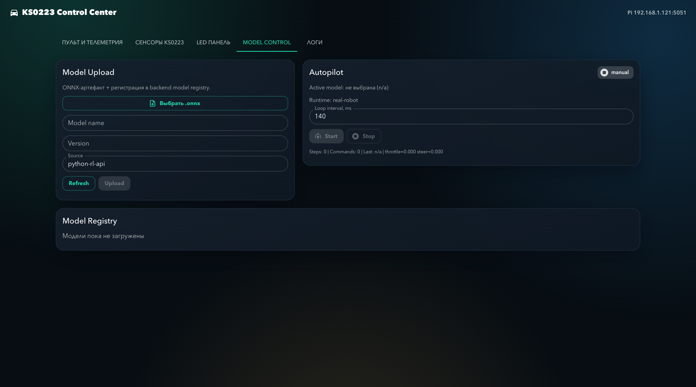

# Верификация инкремента (2026-03-29)

## Что проверено
1. Сборка backend:
   - Команда: `dotnet build src/ks0223-web-mac/backend/backend.csproj`
   - Результат: успешно.
2. Сборка frontend:
   - Команда: `npm run build` в `src/ks0223-web-mac/frontend`
   - Результат: успешно.
3. Валидация сценария `A->B`:
   - Команда: `./rusim scenario validate configs/scenarios/ab-corridor-v1.yaml`
   - Результат: `valid: true`.
4. API smoke (backend локально):
   - `GET /api/models` -> `[]`.
   - `GET /api/models/active` -> `{"error":"Active model is not selected"}`.
   - `GET /api/autopilot/status` -> `mode=manual`, `isRunning=false`.
   - `POST /api/autopilot/start` (без активной модели) -> `{"error":"Active model is not selected"}`.

## Скриншоты
- Dashboard: 
- Model Control: 

## Артефакты smoke
- `docs/report/prediploma-practice/evidence/smoke_models.json`
- `docs/report/prediploma-practice/evidence/smoke_active.json`
- `docs/report/prediploma-practice/evidence/smoke_autopilot_status.json`
- `docs/report/prediploma-practice/evidence/smoke_autopilot_start.json`

## Ограничения текущего шага
- Реальные прогоны на машинке не проводились (нужен отдельный спринт/выезд).
- ONNX-модель в этот шаг не загружалась (проверен только контракт API и UI-поток без артефакта).

## Что исправлено дополнительно
- Для генерации отчетов `.docx` добавлены:
  - удаление неиспользуемых embedded media,
  - оптимизация крупных встроенных изображений,
  - проверка лимитов размера (`target <= 25 MB`, `hard <= 50 MB`).
- Фактический размер файлов после пересборки:
  - `НМГоровенко_ПреддипломнаяПрактика_ПромежуточныйОтчет2.docx`: ~4.94 MB.
  - `НМГоровенко_ПреддипломнаяПрактика_ФинальныйОтчет.docx`: ~4.94 MB.
