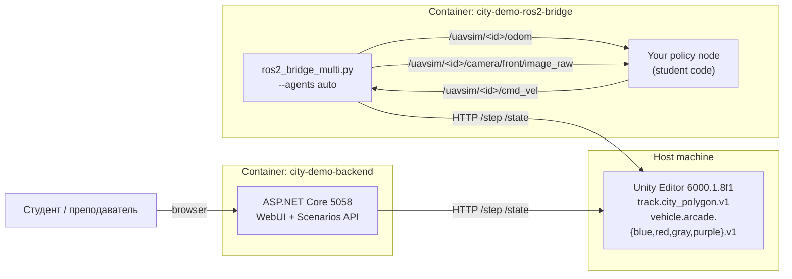

# Учебный стенд «Autonomous Driving в City Sample»

> Учебно-технический гайд для преподавателей и студентов курсов по
> робототехнике и автономному управлению. Описывает готовый учебный стенд,
> как поднять его одной командой, и три прогрессивных урока — от простого
> Twist publish до собственной CNN+PPO-модели и классификатора светофоров.

<!-- TODO: insert screenshot — общий вид стенда (Unity Editor + WebUI + RViz) -->

## 1. Что это такое и для кого

City Sample — это учебный стенд для autonomous driving, построенный на
платформе **uav-simulator**. Он предоставляет визуально полноценный город
из POLYGON City Pack, реализованный как track-плагин
`track.city_polygon.v1`, по которому ездят несколько разноцветных
arcade-машин (`vehicle.arcade.blue.v1`, `vehicle.arcade.red.v1`,
`vehicle.arcade.gray.v1`, `vehicle.arcade.purple.v1`). На центральном
перекрёстке стоят четыре светофора с FSM-циклом Red → Green → Yellow.
NPC-машины следуют по графу путевых точек и тормозят на красный свет.

Стенд решает несколько проблем университетского курса по автономному
вождению:

- **Низкий порог входа.** Студент не разбирается с Unity, ассетами и
  build pipeline'ом — он получает готовую сцену через `make city-demo-up`
  и сразу пишет свой controller.
- **Тот же стек, что в индустрии.** ROS2 Humble, топики `cmd_vel`,
  `odom`, `camera/front/image_raw`, namespace per agent — всё, что есть
  в реальной разработке self-driving стека.
- **Прогрессивная сложность.** От «опубликуй Twist» (Урок 1) до
  «обучи свою CNN+PPO-policy» (Урок 2) и «классифицируй светофоры»
  (Урок 3) — три уровня без необходимости менять стенд.
- **Без железа.** Курс идёт целиком в симуляции, поэтому масштабируется
  на любую группу. Sim-to-real остаётся опционален: тот же policy,
  обученный в симе, можно потом задеплоить на физический KS0223 без
  изменения интерфейса.

**Аудитория:**

- *Преподаватели* — получают runbook и три готовых урока с критериями
  оценки. Не нужно собирать стенд с нуля.
- *Студенты бакалавриата (3–4 курс)* — Урок 1 как лаб-работа на пару.
- *Студенты магистратуры* — Уроки 2 и 3 как часть исследовательского
  проекта или диплома.

Эта глава — учебный runbook. За архитектурой плагин-системы и Python
training pipeline отсылаем к диссертации:
[глава 5 «Реализация платформы»](master-thesis/05-implementation.md)
описывает PluginRegistry и SimulationManager, а
[глава 6 «Python training & sim2real»](master-thesis/06-python-training.md)
— sim_client, SubprocVecEnv и rollout-сбор для PPO.

### 1.1. Чем стенд отличается от готовых решений

В сообществе уже есть несколько похожих учебных стендов: CARLA, AirSim,
Duckietown, Webots-based курсы. У каждого свои сильные стороны, и наш
стенд не пытается их заменить — он закрывает специфический случай.

- **CARLA.** Очень богатый симулятор, но требует мощной видеокарты
  и долгого onboarding'а. Для пары лаб-работ — тяжеловат. Наш стенд
  проще ставить и дешевле в эксплуатации.
- **AirSim.** Сфокусирован на дронах (хотя есть Car). Платформа
  Microsoft заморожена и переходит в Project AirSim — нестабильность.
- **Duckietown.** Отличная история про физическое железо, но Sim в
  Duckietown — отдельная вселенная, которую сложно расширять
  собственными плагинами.
- **uav-simulator (наш).** Намеренно компромиссный: визуально
  достойный, но без масштаба CARLA; переиспользует ROS2-стек, который
  студенты увидят в любой компании; запускается одной командой и
  расширяется через plugin-систему. Цель — научить, а не впечатлить.

## 2. Quick start (one-command launch)

Стенд запускается одной командой через `make city-demo-up`. Поднимаются
два контейнера (backend Web UI + ROS2-bridge), Unity Editor живёт на
хосте.

### 2.1. Предусловия

- macOS / Linux с Docker (или Docker Desktop) и `docker compose`.
- Установленный Unity Hub + Unity Editor `6000.1.8f1` (см. версию в
  `Makefile` → `UNITY_VERSION`).
- POLYGON City Pack из Asset Store, импортированный в
  `src/UnityProject/uav-simulator` (он уже подключён через
  `track.city_polygon.v1`).
- Свободные порты на хосте: `5058` (Web UI), `8000` (rusim sim API),
  `7400+` (DDS ROS2).

### 2.2. Шаги запуска

```bash
# 1. Открыть Unity Editor с публичным API
make sim-public

# 2. В Unity нажать Play, дождаться загрузки сцены city_polygon

# 3. Загрузить сценарий с несколькими агентами (отдельный терминал)
rusim scenario load configs/scenarios/demo-city-polygon.yaml \
  --base-url http://127.0.0.1:8000

# 4. Поднять Docker-стек (backend + ROS2-bridge)
make city-demo-up

# 5. Проверить статус
make city-demo-status

# 6. Открыть Web UI
open http://localhost:5058
```

После этого:

- В Web UI вы видите телеметрию всех агентов и видеопоток с их камер.
- В контейнере `city-demo-ros2-bridge` поднят multi-agent bridge,
  публикующий ROS2 топики в namespace `/uavsim/<agent_id>`.

<!-- TODO: insert screenshot — Web UI с 4 агентами + видеопоток -->

### 2.3. Полезные команды

```bash
make city-demo-logs    # tail логов backend + bridge
make city-demo-status  # docker compose ps
make city-demo-down    # стоп и убрать контейнеры
```

Убрать стенд полностью — `make city-demo-down`, остановить Unity Editor
и закрыть Hub. Ничего на хосте не остаётся, кроме папки
`.rusim/runtime/logs` с логами backend.

## 3. Архитектура стенда

Стенд разделён на три зоны: симуляция (Unity Editor на хосте), бэкенд
(контейнер с Web UI и ASP.NET Core API) и ROS2-зона (контейнер с
bridge'ом и пользовательскими policy nodes).



### 3.1. Компоненты

| Компонент | Где живёт | Роль |
|---|---|---|
| Unity Editor | хост | физическая симуляция, рендер камер, FSM светофоров, NPC-трафик |
| `track.city_polygon.v1` | Unity (плагин) | загружает POLYGON City Pack аддитивно, ставит светофоры и waypoint-граф |
| `vehicle.arcade.{color}.v1` | Unity (плагин) | четыре arcade-машины, отличаются цветом и spawn-точкой |
| `city-demo-backend` | Docker | ASP.NET Core, Web UI (`localhost:5058`), `/api/scenarios/*`, `/api/health` |
| `city-demo-ros2-bridge` | Docker | `ros2_bridge_multi.py`, ROS2 Humble, namespace per agent |
| Policy node (вы пишете) | Docker / хост | подписывается на ROS2 топики, публикует `cmd_vel` |

### 3.2. ROS2 топики

Каждый агент получает свой namespace `/uavsim/<agent_id>`. Bridge
автоматически создаёт каналы для всех агентов, найденных в Unity (`--agents auto`).

| Topic (пример для `agent.blue`) | Тип | Direction | Что внутри |
|---|---|---|---|
| `/uavsim/agent.blue/odom` | `nav_msgs/Odometry` | bridge → policy | поза + линейная/угловая скорость |
| `/uavsim/agent.blue/speedometer/mps` | `std_msgs/Float32` | bridge → policy | скаляр скорости в м/с |
| `/uavsim/agent.blue/battery_state` | `sensor_msgs/BatteryState` | bridge → policy | заряд (для realism) |
| `/uavsim/agent.blue/ultrasonic/front` | `sensor_msgs/Range` | bridge → policy | передний УЗ-датчик |
| `/uavsim/agent.blue/camera/front/image_raw` | `sensor_msgs/Image` | bridge → policy | RGB-кадр с камеры (raw) |
| `/uavsim/agent.blue/camera/front/image_raw/compressed` | `sensor_msgs/CompressedImage` | bridge → policy | JPEG-сжатый поток |
| `/uavsim/agent.blue/state_json` | `std_msgs/String` | bridge → policy | сырой JSON `/state` для отладки |
| `/uavsim/agent.blue/telemetry_json` | `std_msgs/String` | bridge → policy | парсенная KS0223-телеметрия |
| `/uavsim/agent.blue/cmd_vel` | `geometry_msgs/Twist` | policy → bridge | ваша команда: `linear.x`, `angular.z` |
| `/uavsim/agent.blue/cmd_drive_json` | `std_msgs/String` | policy → bridge | низкоуровневый формат «throttle/steer» |

Bridge перекладывает `cmd_vel` в KS0223-команды на лету. `linear.x`
ограничен примерно `[-1.5, 1.5]` м/с, `angular.z` — `[-2.5, 2.5]`
рад/с (точные пределы — в `sim_client/ks0223.py`). За пределами
диапазона значения клиппятся, не выбрасываются.

### 3.3. Шаг симуляции и тики bridge

Bridge работает в режиме *step-and-publish*. Каждые `1 / rate-hz`
секунд он:

1. Перебирает всех зарегистрированных агентов (по дефолту — `--agents auto`,
   список читается из `/state` Unity).
2. Для каждого агента берёт последнее значение `cmd_vel` из in-memory
   кеша, конвертирует в KS0223-команду и шлёт `POST /step` с
   `targetAgentId`.
3. Получает обратно состояние агента (поза, скорость, sensors,
   опционально кадр камеры) и публикует ROS2 топики в namespace.

Это означает: если ваш policy node публикует `cmd_vel` чаще, чем
`rate-hz`, лишние сообщения теряются — bridge берёт только последнее.
Если публикует реже — последняя команда «залипает» до следующей.
Дефолтная частота — 30 Гц для city-demo (`docker-compose.city-demo.yml`),
её можно понизить до 10–15 Гц на слабых машинах.

### 3.4. Где живут конфиги и логи

| Путь на хосте | Что там |
|---|---|
| `configs/scenarios/demo-city-polygon.yaml` | сценарий с 4 агентами и city track |
| `python/bridges/ros2_bridge_multi.py` | исходник bridge |
| `python/sim_client/` | Python SDK для rusim API (используется и backend'ом, и bridge'ом) |
| `.rusim/runtime/logs/` | логи backend (mounted в контейнер) |
| `docker-compose.city-demo.yml` | определение стека |

## 4. Урок 1 — Подключить policy через ROS2 cmd_vel

**Цель.** За пару написать policy-node, который ездит по кругу,
останавливается на красный свет и разворачивается, увидев препятствие
ближе 0.7 м.

**Что отрабатывается.** ROS2 Python (`rclpy`), publisher/subscriber,
работа с `geometry_msgs/Twist`, `nav_msgs/Odometry`, `sensor_msgs/Range`.
ML здесь не нужен — это разогрев.

### 4.1. Скелет node

Создайте файл `python/student/lesson1_round_robin.py`:

```python
import rclpy
from rclpy.node import Node
from geometry_msgs.msg import Twist
from sensor_msgs.msg import Range


class RoundRobinDriver(Node):
    def __init__(self, agent_id: str = "agent.blue") -> None:
        super().__init__("round_robin_driver")
        ns = f"/uavsim/{agent_id}"
        self.cmd_pub = self.create_publisher(Twist, f"{ns}/cmd_vel", 10)
        self.create_subscription(
            Range, f"{ns}/ultrasonic/front", self._on_range, 10
        )
        self.create_timer(0.05, self._tick)
        self._obstacle = False

    def _on_range(self, msg: Range) -> None:
        self._obstacle = msg.range < 0.7

    def _tick(self) -> None:
        cmd = Twist()
        if self._obstacle:
            cmd.linear.x = 0.0
            cmd.angular.z = 1.5
        else:
            cmd.linear.x = 0.6
            cmd.angular.z = 0.4  # лёгкий поворот → круг
        self.cmd_pub.publish(cmd)


def main() -> None:
    rclpy.init()
    rclpy.spin(RoundRobinDriver())
    rclpy.shutdown()


if __name__ == "__main__":
    main()
```

### 4.2. Запуск

```bash
# Внутри ros2-bridge контейнера (стек должен быть up)
docker exec -it city-demo-ros2-bridge bash -lc \
  "source /opt/ros/humble/setup.bash &&
   python3 /workspace/python/student/lesson1_round_robin.py"
```

Файл прокидывается в контейнер через volume `./python:/workspace/python:ro`,
поэтому редактируется на хосте, не пересобирая образ.

### 4.3. Критерии приёмки

- [ ] Машина едет по часовой стрелке без столкновений ≥ 60 секунд.
- [ ] При появлении препятствия в 0.7 м перед ней `linear.x` падает в 0.
- [ ] В RViz видно `/uavsim/agent.blue/odom` с обновлением ≥ 10 Гц.

<!-- TODO: insert screenshot — RViz с TF и одометрией одного агента -->

### 4.4. Дополнительные задания (бонус)

- Подключиться к двум агентам одновременно — каждый со своим
  controller'ом.
- Добавить подписку на `state_json` и логировать координаты центра масс.
- Считать, сколько раз агент проехал перекрёсток (по координатам).

### 4.5. Что важно объяснить студенту

Урок выглядит игрушечным, но отрабатывает идеи, которые потом
повторяются в любом RL-курсе. Преподавателю стоит проговорить:

- **Async vs sync control.** Bridge работает на фиксированной частоте.
  Студент пишет publisher на 20 Гц, а bridge пушит в Unity на 30 Гц —
  значения «резиновые», но это нормально для policy-кода.
- **Что такое observation, на самом деле.** В Уроке 1 obs — это
  скаляр `range`. Уже здесь видно, что разные топики публикуются с
  разной частотой и не синхронизированы — на этом месте многие
  «начинающие» спотыкаются, когда переходят к Уроку 2.
- **Coordinate frames.** `odom` приходит в frame `odom`, ребёнок
  `base_link_<agent_id>`. Без TF никаких лазеров и SLAM. На этом
  можно сделать отдельный мини-урок про `tf2_ros`.

## 5. Урок 2 — Заменить waypoint follower на свой ML-controller (CNN + PPO)

**Цель.** Обучить PPO-policy, которая держит машину в полосе, используя
только RGB-кадр с фронт-камеры. Архитектура — небольшая CNN
(SmallVisualBackbone) + MLP head, такая же, как в основном sim2real
training pipeline.

**Что отрабатывается.** Reinforcement learning, sim_client API
(`reset`/`step`), reward design, sb3 PPO, eval-протокол.

### 5.1. Postановка задачи

- *Observation:* RGB-кадр 84×84 + текущая скорость (м/с).
- *Action:* `(throttle, steer)` нормализованные в `[-1, 1]`. Bridge
  переводит их в KS0223-команды.
- *Reward:* `+v_forward * dt` за движение вперёд, `-1.0` за столкновение,
  `-0.1 * |steer_change|` за дёрганый руль.

Эпизод заканчивается через 60 секунд или при выезде за полосу.

### 5.2. Использовать готовый pipeline

В репозитории уже есть `python/training/ppo_train.py` (PPO + sb3) и
`python/sim_client/uav_env.py` — Gym-обёртка над rusim API. Магистрант
запускает следующий командой:

```bash
python -m training.ppo_train \
  --scenario configs/scenarios/demo-city-polygon.yaml \
  --vehicle vehicle.arcade.blue.v1 \
  --total-timesteps 1_000_000 \
  --rev city-lesson2-rev01
```

Тренинг сохраняет чекпоинты в `.rusim/runs/city-lesson2-rev01/`. Если у
студента нет GPU, запустить можно на CPU — на city-сцене с 4-мя агентами
один rollout идёт ~20 минут до первой осмысленной policy.

### 5.3. Подключить обученную policy к ROS2

После обучения policy выгружается в `*.zip` (формат sb3) и
запускается из bridge-контейнера:

```python
import rclpy
from rclpy.node import Node
from geometry_msgs.msg import Twist
from sensor_msgs.msg import Image
from stable_baselines3 import PPO
import cv2
import numpy as np


class CnnPolicyDriver(Node):
    def __init__(self, model_path: str, agent_id: str = "agent.blue"):
        super().__init__("cnn_policy_driver")
        self.model = PPO.load(model_path)
        ns = f"/uavsim/{agent_id}"
        self.cmd_pub = self.create_publisher(Twist, f"{ns}/cmd_vel", 10)
        self.create_subscription(
            Image, f"{ns}/camera/front/image_raw", self._on_image, 10
        )

    def _on_image(self, msg: Image) -> None:
        img = np.frombuffer(msg.data, dtype=np.uint8).reshape(
            msg.height, msg.width, 3
        )
        obs = cv2.resize(img, (84, 84))
        action, _ = self.model.predict(obs, deterministic=True)
        cmd = Twist()
        cmd.linear.x = float(action[0]) * 1.2
        cmd.angular.z = float(action[1]) * 2.0
        self.cmd_pub.publish(cmd)
```

### 5.4. Критерии приёмки

- [ ] Среднее по 5 эпизодам — машина проезжает ≥ 200 метров без
  столкновений.
- [ ] TensorBoard показывает рост `rollout/ep_rew_mean` от старта к
  концу обучения.
- [ ] Policy перенесена в bridge-контейнер и подписана на ROS2 топик —
  не падает при отсутствии кадра (graceful degradation).

<!-- TODO: insert screenshot — TensorBoard с reward curve -->

### 5.5. Расширения

- Заменить SmallVisualBackbone на R3M (предобученный visual encoder из
  работы Meta). По нашим экспериментам R3M снижает variance между
  сидами — особенно ценно при heavy domain randomization.
- Добавить frame-stacking (4 последних кадра) — сделать temporal
  reasoning явным. Полезно, когда нужно отличить «стою и пытаюсь
  поехать» от «еду и тормозит инерция».
- Domain randomization — менять освещение и текстуры между эпизодами,
  готовить sim2real. У platform'ы есть готовый scenario hook
  (см. главу 6 диссертации), студент только подбирает диапазон.
- Curriculum learning — начать с пустого city без NPC, постепенно
  добавлять траффик и пешеходов. На пустом сценарии PPO сходится за
  300k шагов, на полном — может потребоваться 2–3 М.

### 5.6. Типичные грабли

Перечень частых ошибок, которые мы видим у магистрантов:

- **Reward hacking.** Если в reward сильно весит «среднее ускорение»,
  policy учится дёргано газовать-тормозить — формальный reward растёт,
  визуально это сломано. Решение — добавить штраф на `Δ a / dt`.
- **Off-policy data в on-policy алгоритме.** PPO — on-policy,
  собранные старой policy данные нельзя переиспользовать. Это
  затрудняет offline-debugging — добавьте eval rollouts в TensorBoard.
- **Camera latency.** В реальном KS0223 картинка приходит с задержкой
  ~150 мс. В симе задержки нет, и policy переучивается «реагировать
  мгновенно». При sim2real падает в первый же поворот. Лечится тем,
  что в Уроке 5 студент сам введёт искусственную задержку (одна строка
  в bridge'е).

## 6. Урок 3 (advanced) — CNN-классификатор светофоров

**Цель.** Собрать датасет кадров со светофорами, обучить
ResNet18-классификатор `{red, yellow, green, none}`, интегрировать
выход в policy-логику (на красный — тормозить независимо от RL).

Урок более исследовательский — у студента уже есть навыки из Урока 2,
теперь он работает с supervised learning + интеграцией нескольких
моделей.

### 6.1. Сбор датасета

Платформа умеет писать кадры в файлы через scenario recorder. Запустите
сценарий с recorder'ом:

```yaml
# configs/scenarios/city-tld-collect.yaml
scenarioId: city.tld.collect.v1
trackId: track.city_polygon.v1
agents:
  - id: agent.blue
    vehicleId: vehicle.arcade.blue.v1
recorder:
  enabled: true
  output: .rusim/runtime/datasets/tld
  fps: 5
```

Дайте машине покататься 10–15 минут под человеческим управлением (через
WebUI joystick) или под Урок-1-policy. Получите ~3000–5000 кадров.

Разметка — вручную в *Label Studio* или *CVAT*. Для дипломной работы
этого достаточно; для production ML использовали бы semi-automatic
labelling.

### 6.2. Обучение классификатора

`python/training/tld_classifier.py` (студент пишет сам, ~50 строк):

```python
import torch
import torch.nn as nn
from torchvision import models, transforms

class TLDClassifier(nn.Module):
    def __init__(self, num_classes: int = 4) -> None:
        super().__init__()
        self.backbone = models.resnet18(weights="DEFAULT")
        self.backbone.fc = nn.Linear(512, num_classes)

    def forward(self, x: torch.Tensor) -> torch.Tensor:
        return self.backbone(x)
```

Стандартный обучающий цикл: cross-entropy, Adam, 10 эпох на 80/20 split.
Должна получиться точность ≥ 92% на test set, иначе разметка плохая.

### 6.3. Интеграция в policy

В Уроке 2 policy node добавляется второй проход:

```python
state = self.tld_model(preprocess(img)).argmax().item()  # 0=red, 1=yellow, 2=green, 3=none
if state == 0:  # red
    cmd.linear.x = 0.0
else:
    # обычная RL-policy
    action, _ = self.rl_model.predict(obs)
    cmd.linear.x = float(action[0]) * 1.2
    cmd.angular.z = float(action[1]) * 2.0
```

### 6.4. Критерии приёмки

- [ ] Test accuracy ≥ 92%.
- [ ] Машина останавливается перед красным светофором в ≥ 9 из 10
  попыток.
- [ ] Confusion matrix приведена в отчёте, проанализирована — какие
  классы путаются и почему.

<!-- TODO: insert screenshot — confusion matrix + примеры FN/FP -->

## 7. Расширения и направления развития

City Sample спроектирован как платформа, не как «закрытый» лаб-сетап.
Вот несколько направлений, которые отлично подходят для курсовых,
дипломов и магистерских:

- **Multi-agent cooperation.** В стенде уже работают четыре агента —
  поставить задачу: не только не столкнуться, но и пропускать друг
  друга на перекрёстке. Multi-agent PPO (MAPPO) или CTDE-схемы
  становятся естественным расширением.
- **Sim-to-real transfer на KS0223.** Тот же интерфейс ROS2 топиков
  работает на физическом KS0223 (см. `reference_robot_ssh.md`). Policy,
  обученный в city-симе, можно задеплоить на робота без изменения
  кода — сменится только источник `/odom` и `/camera`.
- **Замена world-модели.** `track.city_polygon.v1` — один из вариантов;
  можно подключить *Russian Roads*, *Windridge City* или собственный
  city-asset через PluginRegistry. См. главу 7 диссертации
  («Plugin Development») — описан полный workflow создания нового
  track-плагина.
- **End-to-end CNN на компрессированном видео.** Использовать
  `image_raw/compressed` (JPEG) вместо raw — экономия пропускной
  способности, более реалистичный сценарий для встраиваемых платформ.
- **Imitation learning из человеческих демонстраций.** Recorder уже
  собирает не только кадры, но и `cmd_vel` — можно учить behavior
  cloning или DAgger.
- **OOD-детекция.** Учить второй head, предсказывающий «уверенность» —
  падает на новых сценах. Тема для исследовательской работы.

## 8. Troubleshooting

Список самых частых проблем при первом запуске. Если ваша проблема
не здесь — `make city-demo-logs` обычно сразу показывает причину.

### 8.1. `make city-demo-up` запускается, но bridge не видит агентов

```
[ros2-bridge] No agents discovered after 30 seconds, exiting.
```

**Причина.** Unity Editor не в PlayMode или не загружен сценарий.
**Решение.** Откройте Unity, нажмите Play, выполните `rusim scenario load
configs/scenarios/demo-city-polygon.yaml`. Только после этого
`docker compose restart ros2-bridge`.

### 8.2. Web UI открывается, но не видит rusim API

```
{"error":"connection refused: host.docker.internal:8000"}
```

**Причина.** Unity Editor запущен с `127.0.0.1`-only API
(`make sim` вместо `make sim-public`).
**Решение.** Закрыть Unity, запустить через `make sim-public` —
этот target ставит `RUSIM_API_HOST=0.0.0.0`.

### 8.3. ROS2-bridge падает с `ImportError: rclpy`

**Причина.** Контейнер `osrf/ros:humble-desktop` обычно содержит
`rclpy`, но в редких случаях кеш слетает.
**Решение.**

```bash
docker compose -f docker-compose.city-demo.yml down
docker pull osrf/ros:humble-desktop
make city-demo-up
```

### 8.4. Машина в Unity «дёргается» при policy node активном

**Причина.** Слишком высокий `--rate-hz` bridge'а на слабом ноутбуке —
команды копятся в очереди, физика отстаёт.
**Решение.** В `docker-compose.city-demo.yml` поменять `--rate-hz 30`
на `--rate-hz 15` и перезапустить bridge.

### 8.5. Не работает port 5058 (already in use)

```
Bind for 0.0.0.0:5058 failed: port is already allocated
```

**Решение.** Скорее всего, остался прошлый запуск backend'а.
`docker ps | grep 5058` → `docker rm -f <container>`. Либо в
`docker-compose.city-demo.yml` поменять `5058:5058` на `15058:5058`.

### 8.6. Camera-топик не публикуется (Image)

В bridge'е публикация `/camera/front/image_raw` зависит от установленного
PIL. Если в логах `PIL not installed`:

```bash
docker exec city-demo-ros2-bridge \
  pip3 install --break-system-packages pillow
```

После чего `docker compose restart ros2-bridge`.

### 8.7. Светофоры в city не переключаются

**Причина.** `track.city_polygon.v1` загружает POLYGON DemoScene
аддитивно через `EditorSceneManager.OpenScene` — это работает только в
**Editor**, не в Play Build. Если запускаете standalone-build, светофоры
будут «спрятаны» (см. `docs/master-thesis/10-testing-build-release.md`,
секция «Editor-only механизм DemoScene»).
**Решение для учебного стенда.** Использовать Unity Editor, как описано
в Quick Start — это намеренный режим работы стенда.

---

**См. также:**

- [Глава 5 диссертации — Реализация платформы](master-thesis/05-implementation.md)
  (PluginRegistry, SimulationManager, как track.city_polygon.v1
  включает сцену).
- [Глава 6 диссертации — Python training & sim2real](master-thesis/06-python-training.md)
  (PPO, sim_client, vec env).
- [README основного репозитория](../README.md) — список плагинов,
  быстрый старт, релизы.
- `python/bridges/ros2_bridge_multi.py` — исходник bridge,
  читаемый для студентов.
