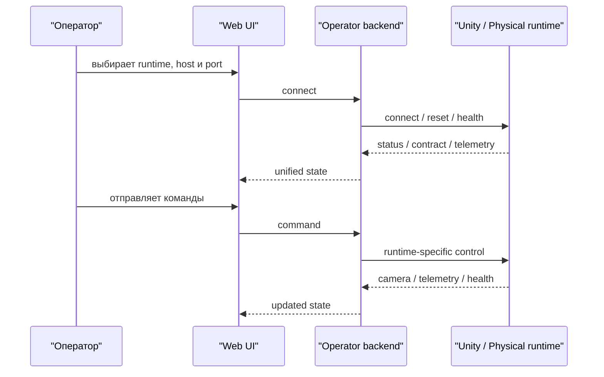

# Использование


## Основные режимы работы
- `unity-sim`
- `real-robot`

Для оператора оба режима проходят через один backend и один Web UI.

## Базовый операторский поток


## Unity runtime через `rusim`

### Поднять runtime
```bash
rusim server up --mode background --port 8000 --scenario configs/scenarios/demo.yaml
rusim doctor --base-url http://127.0.0.1:8000
```

### Проверить доступные сущности
```bash
rusim list tracks --base-url http://127.0.0.1:8000
rusim list vehicles --base-url http://127.0.0.1:8000
rusim inspect vehicle vehicle.arcade.blue.v1 --base-url http://127.0.0.1:8000
```

### Сбросить сценарий или выбрать сущности вручную
```bash
rusim scenario validate configs/scenarios/demo.yaml
rusim scenario reset configs/scenarios/demo.yaml --base-url http://127.0.0.1:8000
rusim reset --base-url http://127.0.0.1:8000 --track-id track.roadsystem_realistic.v2 --vehicle-id vehicle.arcade.blue.v1
```

### Отправить шаг управления
```bash
rusim step --base-url http://127.0.0.1:8000 --throttle 0.2 --steer 0.1 --brake 0.0
```

## Multi-agent сценарий
Референсный multi-agent конфиг:

```text
configs/scenarios/demo-multi-agent.yaml
```

Запуск:

```bash
rusim server up --mode background --port 8000 --scenario configs/scenarios/demo-multi-agent.yaml
rusim step --base-url http://127.0.0.1:8000 --agent-id npc-red --throttle 0.3 --steer 0.0 --brake 0.0
```

Сценарий поднимает:
- `ego` на `vehicle.arcade.blue.v1`
- `npc-red` на `vehicle.arcade.red.v1`
- трек `track.roadsystem_realistic.v2`

## Web UI
Текущий Web UI используется как единый операторский интерфейс:
- подключение и отключение;
- отображение статуса;
- ручное управление;
- просмотр камеры;
- телеметрия и сенсоры;
- логирование.

Для Unity runtime UI поддерживает:
- выбор `track`;
- выбор основной машинки;
- список дополнительных `agents[]`;
- `control agent`;
- `camera agent`;
- `camera mode`.

## Standalone runtime
Для работы без Unity Editor можно использовать локально собранный runtime build:

```bash
rusim runtime build --project-path src/UnityProject/uav-simulator
rusim runtime list
rusim server up --build latest --mode background --port 8011
rusim server down
```

`background` остаётся практическим режимом по умолчанию, если нужна камера и рендер.

## Реальный стенд
Физический runtime подключается через тот же backend и тот же Web UI.

Отличается только target подключения:
- `runtimeMode=real-robot`
- собственные `host` и `port`

Product-layer не требует отдельного frontend для физического стенда.

## Что относится к research-layer
- Python SDK и notebooks;
- ROS2 bridge;
- внешние автопилотные модули.

Эти контуры используют продуктовые интерфейсы, но не определяют основной пользовательский путь.

## Связанные страницы
- [Установка](installation.md)
- [CLI `rusim`](cli.md)
- [API](api.md)
- [Simulator Scenario Config Contract](simulator-scenario-config-contract.md)
