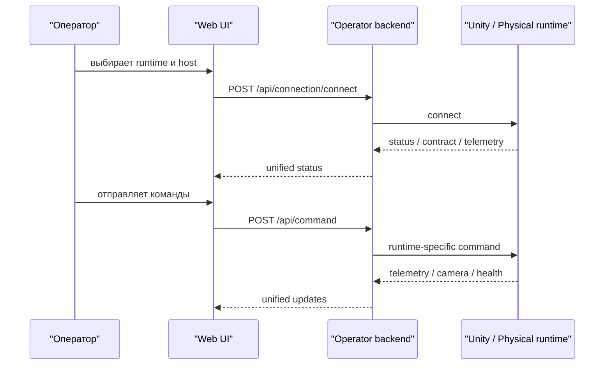

# Использование

## Основные режимы работы
Платформа должна поддерживать два основных режима:

1. `unity-sim`
2. `real-robot`

Для оператора оба режима должны выглядеть одинаково.

## Базовый operator flow


## Web UI
Текущий Web UI используется как единый операторский интерфейс:

- подключение и отключение;
- отображение статуса;
- ручное управление;
- просмотр камеры;
- телеметрия и сенсоры;
- логирование.

## HTTP API
Канонический операторский API описан в:

- [Unified Runtime Contract v1](unified-runtime-contract-v1.md)
- [API](api.md)

Ключевые точки:

- `POST /api/connection/connect`
- `POST /api/connection/disconnect`
- `GET /api/status`
- `GET /api/health`
- `POST /api/command`
- `GET /api/camera/*`
- `GET /api/sensors/*`

## CLI
Минимальный продуктовый CLI-слой уже добавлен.

Если `rusim` не найден в `zsh`, сначала выполнить:

```bash
make sim-install-cli
```

или запускать из корня репозитория:

```bash
./rusim --help
```

Поддерживаемые команды:

- `doctor`
- `contract`
- `scenario validate`
- `scenario print-reset`
- `scenario reset`
- `step`

Примеры:

```bash
rusim doctor --base-url http://127.0.0.1:8000
rusim contract --base-url http://127.0.0.1:8000
rusim scenario validate configs/scenarios/ks0223-demo.yaml
rusim scenario reset configs/scenarios/ks0223-demo.yaml --base-url http://127.0.0.1:8000
rusim step --base-url http://127.0.0.1:8000 --throttle 0.2 --steer 0.1
```

Ограничение текущего среза:
- CLI пока управляет уже поднятым runtime;
- полноценный lifecycle запуска Unity в server/headless режиме остаётся следующим продуктовым шагом.

Частично это уже закрыто:
- добавлен `rusim server start/status/stop` для запуска отдельного Unity runtime instance;
- но launcher всё ещё ограничен стандартным Unity project lock.

Примеры:

```bash
rusim server start --mode windowed
rusim server start --mode headless --port 8011
rusim server status --port 8011
rusim server stop
```

Практическое ограничение:
- если проект уже открыт в другом Unity Editor instance, headless/windowed launcher второго instance не сможет занять тот же project path.

## Standalone runtime
Для продуктового сценария без Unity Editor используется standalone runtime build:

```bash
rusim runtime build --project-path src/UnityProject/uav-simulator --output build/runtime/macos/uav-simulator.app
rusim server start --runtime-app build/runtime/macos/uav-simulator.app --mode windowed --port 8011
rusim server start --runtime-app build/runtime/macos/uav-simulator.app --mode headless --port 8011
make sim-server-start-runtime MODE=headless UAVSIM_API_PORT=8011
```

Именно этот путь должен стать основным для конечного пользователя.

## Python SDK и notebooks
Python tooling используется для:

- smoke-проверок;
- интеграционных тестов;
- Jupyter-экспериментов;
- будущего training flow.

Это research-layer, но он должен опираться на стабильные product-core интерфейсы.

## ROS2
ROS2 используется как отдельный interoperability-слой.

Он нужен для:

- публикации typed topics;
- интеграции со стандартными robotics-инструментами;
- внешних экспериментальных сценариев.

ROS2 не должен быть обязательной зависимостью базового operator flow.

## Автопилот
Автопилот рассматривается как внешний модуль, который подключается к платформе через отдельный интеграционный контракт.

Канонический документ:
- [Autopilot Integration Contract v1](autopilot-integration-contract-v1.md)

## Сценарии симуляции
Симуляция должна подниматься не через ручную возню по сцене, а через сценарный/config entrypoint.

Канонический документ:
- [Simulator Scenario Config Contract v1](simulator-scenario-config-contract-v1.md)
